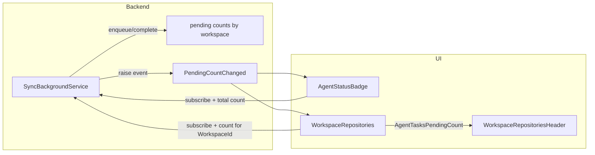

# Agent queue per workspace – UI and state exposure

## Context

- **Queue**: The app’s sync queue is in [SyncBackgroundService.cs](src/GrayMoon.App/Services/SyncBackgroundService.cs). It enqueues `SyncRequestItem(RepositoryId, WorkspaceId, Trigger)` and processes them with multiple workers. It already exposes `GetQueueDepth()` (total queued) and is used by `GET /api/sync/queue`. It does **not** currently track per-workspace counts or “in progress” items.
- **Agent badge**: [AgentStatusBadge.razor](src/GrayMoon.App/Components/Shared/AgentStatusBadge.razor) shows "online" / "update" / "offline" from `AgentConnectionTracker`. It is used in [MainLayout.razor](src/GrayMoon.App/Components/Layout/MainLayout.razor).
- **Workspace header**: [WorkspaceRepositoriesHeader.razor](src/GrayMoon.App/Components/Shared/WorkspaceRepositoriesHeader.razor) has the row with "workspace | X repositories" in `.workspace-repos-title-row` (flex, wrap). Styles live in [WorkspaceRepositories.razor.css](src/GrayMoon.App/Components/Pages/WorkspaceRepositories.razor.css) and [app.css](src/GrayMoon.App/wwwroot/app.css).

## Architecture

- **Pending** = queued + in progress. Track by incrementing when enqueueing and decrementing when processing finishes (in `finally`).
- Components subscribe to a **count-changed** notification and call `InvokeAsync(StateHasChanged)` so the UI updates without polling.

## Implementation

### 1. SyncBackgroundService – per-workspace pending counts and notification

**File:** [SyncBackgroundService.cs](src/GrayMoon.App/Services/SyncBackgroundService.cs)

- Add a `ConcurrentDictionary<int, int> _pendingCountByWorkspace` (key = workspace ID). Increment in `EnqueueSync` when `TryWrite` succeeds; decrement in the `finally` block of `ProcessQueueAsync` for `request.WorkspaceId`.
- Add `public event EventHandler? PendingCountChanged`. Raise it after the increment in `EnqueueSync` and in the `finally` block after decrement (invoke on a task so the background thread doesn’t block).
- Add:
  - `public int GetTotalPendingCount()` → sum of `_pendingCountByWorkspace.Values`.
  - `public int GetPendingCountForWorkspace(int workspaceId)` → `_pendingCountByWorkspace.GetValueOrDefault(workspaceId)`.
- Keep `GetQueueDepth()` unchanged (channel count only) for existing API if needed; UI will use the new “pending” (queued + in progress) counts.

### 2. AgentStatusBadge – show "running" when any tasks pending

**File:** [AgentStatusBadge.razor](src/GrayMoon.App/Components/Shared/AgentStatusBadge.razor)

- Inject `SyncBackgroundService`.
- In `OnInitialized`, subscribe to `SyncBackgroundService.PendingCountChanged` with a handler that calls `InvokeAsync(StateHasChanged)` (same pattern as `AgentConnectionTracker.OnStateChanged`).
- **StateLabel**: If `State == AgentConnectionState.Online` and `SyncBackgroundService.GetTotalPendingCount() > 0` → `"running"`; otherwise keep current logic ("online", "update", "offline", etc.).
- **TitleText**: When showing "running", set title to something like "Agent is running tasks" (and keep existing titles for other states).

### 3. WorkspaceRepositoriesHeader – "Completing x agent tasks..." on the right

**File:** [WorkspaceRepositoriesHeader.razor](src/GrayMoon.App/Components/Shared/WorkspaceRepositoriesHeader.razor)

- Add parameter: `[Parameter] public int AgentTasksPendingCount { get; set; }`.
- Inside `.workspace-repos-title-row`, after the `
` block:
  - Add a spacer: `` (or equivalent class).
  - When `AgentTasksPendingCount > 0`, add: `Completing @AgentTasksPendingCount agent task@(AgentTasksPendingCount == 1 ? "" : "s")...`.
- **Layout**: The title row already uses `display: flex; flex-wrap: wrap`. Use `margin-left: auto` on the agent-tasks span (or rely on the spacer) so it aligns to the right; when the row wraps on narrow viewports, the agent-tasks text will move to the next line so it does not overlap the title/subtitle. Add a small class in [WorkspaceRepositories.razor.css](src/GrayMoon.App/Components/Pages/WorkspaceRepositories.razor.css) (or [app.css](src/GrayMoon.App/wwwroot/app.css)) for the spacer and agent-tasks span if needed (e.g. `flex-shrink: 0` so the text doesn’t get squashed).

### 4. WorkspaceRepositories page – feed count and subscribe

**File:** [WorkspaceRepositories.razor](src/GrayMoon.App/Components/Pages/WorkspaceRepositories.razor) and code-behind (or `@code`)

- Inject `SyncBackgroundService`.
- In `OnInitialized`, subscribe to `SyncBackgroundService.PendingCountChanged` and call `InvokeAsync(StateHasChanged)`.
- Compute `agentTasksPendingCount = SyncBackgroundService.GetPendingCountForWorkspace(WorkspaceId)` (use the page’s `WorkspaceId`).
- Pass `AgentTasksPendingCount="@agentTasksPendingCount"` to `<WorkspaceRepositoriesHeader ... />`.

### 5. Optional for later – HasWorkspaceJobsPending

- Add to **SyncBackgroundService** (or a small facade if you prefer):  
`public bool HasWorkspaceJobsPending(int workspaceId) => GetPendingCountForWorkspace(workspaceId) > 0;`
- No UI changes required now; you can use this later to disable actions or drive an overlay that waits for all jobs to complete.

## API (optional)

- Existing `GET /api/sync/queue` can stay as-is (total queue depth). If you want the SPA or other clients to see per-workspace counts without using the server-side component subscription, add a new endpoint (e.g. `GET /api/sync/queue/status`) returning `{ totalPending, byWorkspace: { "workspaceId": count } }` using `GetTotalPendingCount()` and a loop over `_pendingCountByWorkspace`. This is optional for the described UI.

## Files to touch

| File                                                                                                                                                | Change                                                                                                    |
| --------------------------------------------------------------------------------------------------------------------------------------------------- | --------------------------------------------------------------------------------------------------------- |
| [SyncBackgroundService.cs](src/GrayMoon.App/Services/SyncBackgroundService.cs)                                                                      | Per-workspace counters, event, GetTotalPendingCount, GetPendingCountForWorkspace, HasWorkspaceJobsPending |
| [AgentStatusBadge.razor](src/GrayMoon.App/Components/Shared/AgentStatusBadge.razor)                                                                 | Inject SyncBackgroundService, subscribe, "running" label + title when total pending > 0                   |
| [WorkspaceRepositoriesHeader.razor](src/GrayMoon.App/Components/Shared/WorkspaceRepositoriesHeader.razor)                                           | Parameter AgentTasksPendingCount, spacer + "Completing x agent tasks..." right-aligned                    |
| [WorkspaceRepositories.razor](src/GrayMoon.App/Components/Pages/WorkspaceRepositories.razor)                                                        | Inject SyncBackgroundService, subscribe, pass count to header                                             |
| [WorkspaceRepositories.razor.css](src/GrayMoon.App/Components/Pages/WorkspaceRepositories.razor.css) or [app.css](src/GrayMoon.App/wwwroot/app.css) | Styles for title-row spacer and agent-tasks span so they don’t overlap when narrow                        |

## Threading note

`PendingCountChanged` will be raised from the background worker thread. Subscribers (Blazor components) must use `InvokeAsync(StateHasChanged)` (or equivalent) inside the handler so UI updates run on the sync context; same pattern as `AgentConnectionTracker.OnStateChanged` in MainLayout.