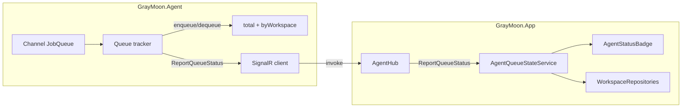

# Agent queue per workspace – UI (using agent’s job queue)

## Clarification

- **Queue source**: The queue that drives the badge and workspace message must be the **agent’s** job queue (GrayMoon.Agent’s `IJobQueue` / `JobQueue`), not the app’s sync queue (`SyncBackgroundService`).
- The app and agent are separate processes; the agent connects to the app via SignalR. So the agent must **report** its queue state to the app; the app cannot read the agent’s in-memory queue directly.

## Context

- **Agent queue**: [IJobQueue](src/GrayMoon.Agent/Abstractions/IJobQueue.cs) / [JobQueue](src/GrayMoon.Agent/Queue/JobQueue.cs) – a `Channel<JobEnvelope>`. Jobs are either `Command` (from app’s RequestCommand) or `Notify` (from hooks). No count or per-workspace API today.
- **Workspace on jobs**: `NotifyJob` has `WorkspaceId` ([INotifyJob](src/GrayMoon.Agent/Abstractions/INotifyJob.cs)). Command requests often have `WorkspaceId` (e.g. [SyncRepositoryRequest](src/GrayMoon.Agent/Jobs/Requests/SyncRepositoryRequest.cs), [CommitSyncRepositoryRequest](src/GrayMoon.Agent/Jobs/Requests/CommitSyncRepositoryRequest.cs)); some (e.g. GetHostInfo) do not.
- **App–agent comms**: Agent connects to app’s [AgentHub](src/GrayMoon.App/Hubs/AgentHub.cs). Agent calls hub methods (e.g. [ReportSemVer](src/GrayMoon.Abstractions/Agent/AgentHubMethods.cs)); app handles them in `AgentHub`. App does not reference GrayMoon.Agent, only GrayMoon.Abstractions.

## Architecture

- **Agent**: Wraps the queue so that every enqueue and dequeue updates in-memory counts (total + per-workspace). When counts change, agent invokes a new hub method `ReportQueueStatus(total, byWorkspace)` on the app.
- **App**: New singleton (e.g. `AgentQueueStateService`) holds the latest `(total, byWorkspace)` reported by the agent. When the agent disconnects, clear counts. Expose `GetTotalPendingCount()`, `GetPendingCountForWorkspace(workspaceId)`, `HasWorkspaceJobsPending(workspaceId)`, and an event so the badge and workspace page can re-render.
- **UI**: Same as before: badge shows “running” when agent is online and total > 0; workspace header shows “Completing x agent tasks…” when that workspace’s count > 0; layout/CSS unchanged.

## Implementation

### 1. Abstractions – new hub method name

**File:** [AgentHubMethods.cs](src/GrayMoon.Abstractions/Agent/AgentHubMethods.cs)

- Add: `public const string ReportQueueStatus = "ReportQueueStatus";`
- Optional: define a small DTO for the payload (e.g. `AgentQueueStatusDto { int Total; Dictionary<int,int> ByWorkspace; }`) in Abstractions if you want a shared contract; otherwise app and agent can agree on (int total, Dictionary<int,int>? byWorkspace) or (int total, IEnumerable<(int workspaceId, int count)>).

### 2. Agent – extract workspace ID from JobEnvelope

**File:** New helper in GrayMoon.Agent (e.g. `JobEnvelopeExtensions.cs` or inside the tracker)

- Implement `int? TryGetWorkspaceId(JobEnvelope envelope)`:
  - If `Kind == Notify` and `NotifyJob != null` → return `NotifyJob.WorkspaceId`.
  - If `Kind == Command` and `CommandJob?.Request` has a property `WorkspaceId` (reflection or type checks for known request types) → return its value.
  - Otherwise return `null` (e.g. GetHostInfo). Jobs without a workspace can be counted only in “total”, not in any workspace.

### 3. Agent – queue tracker and reporting

**Option A – Wrapper around the channel (recommended)**

- New type `TrackedJobQueue : IJobQueue` in the Agent project. It holds the real `Channel<JobEnvelope>` (or the existing `JobQueue` as a dependency if you refactor it to expose the channel).
- **EnqueueAsync**: Resolve workspace ID with `TryGetWorkspaceId(envelope)`. Increment total and, if workspace is not null, increment per-workspace count. Write to the inner channel. Then notify the app (see below).
- **ReadAllAsync**: Return an `IAsyncEnumerable<JobEnvelope>` that reads from the inner channel. For each envelope read: resolve workspace ID, decrement total and per-workspace (if any), then notify the app, then yield the envelope. So “pending” = already enqueued but not yet taken by a worker; once a worker takes it we decrement.
- **Notify app**: When counts change, get `IHubConnectionProvider` (or the connection from the hosted service), and if connected, call `InvokeAsync(AgentHubMethods.ReportQueueStatus, total, byWorkspace)`. Pass a serializable representation of byWorkspace (e.g. `Dictionary<int,int>` or list of key-value pairs). Fire-and-forget (e.g. `_ = NotifyAppAsync()`) so the worker thread doesn’t block.
- Register `TrackedJobQueue` as `IJobQueue` in the agent’s DI; remove or replace the previous `JobQueue` registration so the rest of the agent (SignalRConnectionHostedService, JobBackgroundService, HookListenerHostedService) uses the tracked queue.

**Option B – Instrument existing JobQueue**

- If the agent’s `JobQueue` is a simple wrapper around a channel, add counting and reporting inside it (increment on write, decrement when the reader advances). Same idea as above, but without a separate “TrackedJobQueue” type.

### 4. App – receive and store agent queue state

- **New singleton**: `AgentQueueStateService` (or extend `AgentConnectionTracker`). It holds:
  - `int _totalPending`
  - `Dictionary<int, int> _byWorkspace` (or `ConcurrentDictionary`)
  - `event EventHandler? QueueStateChanged`
- **AgentHub**: Add a method that the agent will call, e.g. `ReportQueueStatus(int total, IReadOnlyDictionary<int,int>? byWorkspace)` (or equivalent). In that method, update the singleton’s state and raise `QueueStateChanged`. Use a lock or concurrent structures so reads from the UI are safe.
- **On agent disconnect**: In `AgentHub.OnDisconnectedAsync`, when the disconnecting client is the agent, clear queue state (total = 0, byWorkspace empty) and raise the event so the badge and page update.
- **Expose**: `GetTotalPendingCount()`, `GetPendingCountForWorkspace(int workspaceId)`, `HasWorkspaceJobsPending(int workspaceId)`, and a way for components to subscribe (e.g. `OnQueueStateChanged(Action callback)` that invokes the callback when `QueueStateChanged` fires).

### 5. App – UI (badge and workspace page)

- **AgentStatusBadge**: Inject `AgentQueueStateService` (or the service that holds queue state). Subscribe to queue state changes and call `InvokeAsync(StateHasChanged)`. **StateLabel**: If `State == AgentConnectionState.Online` and `GetTotalPendingCount() > 0` → `"running"`; otherwise keep current labels. **TitleText**: When showing “running”, use e.g. “Agent is running tasks”. Unsubscribe on `Dispose`.
- **WorkspaceRepositoriesHeader**: Keep parameter `AgentTasksPendingCount` and the “Completing x agent tasks…” block (right-aligned, same row, no overlap when narrow). No change to layout/CSS.
- **WorkspaceRepositories page**: Inject `AgentQueueStateService`. Subscribe to queue state changes; compute `AgentTasksPendingCount = GetPendingCountForWorkspace(WorkspaceId)`; pass it to the header. Unsubscribe on dispose.

### 6. Revert app’s sync-queue-based queue UI

- **SyncBackgroundService**: Remove the per-workspace tracking, `PendingCountChanged` event, `GetTotalPendingCount`, `GetPendingCountForWorkspace`, and `HasWorkspaceJobsPending` that were added for the “app queue” UI. Keep `GetQueueDepth()` and the rest of the sync queue behavior unchanged.
- **AgentStatusBadge**: Remove dependency on `SyncBackgroundService`; use only `AgentQueueStateService` (and connection state) for the badge text.
- **WorkspaceRepositories**: Remove subscription and usage of `SyncBackgroundService` for `AgentTasksPendingCount`; use only `AgentQueueStateService`.

### 7. Optional for later

- **HasWorkspaceJobsPending**: Already provided by `AgentQueueStateService.HasWorkspaceJobsPending(workspaceId)` for disabling actions or overlays that require all agent jobs to complete.

## Files to touch (summary)

| Area | File | Change |
|------|------|--------|
| Abstractions | [AgentHubMethods.cs](src/GrayMoon.Abstractions/Agent/AgentHubMethods.cs) | Add `ReportQueueStatus` constant |
| Agent | New: queue tracker / tracked queue | Implement counting (total + by workspace), call `ReportQueueStatus` on change |
| Agent | Agent DI (e.g. [RunCommandHandler.cs](src/GrayMoon.Agent/Cli/RunCommandHandler.cs)) | Register tracked queue as `IJobQueue` |
| Agent | [SignalRConnectionHostedService](src/GrayMoon.Agent/Hosted/SignalRConnectionHostedService.cs) or tracker | Ensure tracker can get hub connection to invoke `ReportQueueStatus` |
| App | New: `AgentQueueStateService` | Hold total + byWorkspace, event, getters; clear on agent disconnect |
| App | [AgentHub.cs](src/GrayMoon.App/Hubs/AgentHub.cs) | Add `ReportQueueStatus` handler; on disconnect clear queue state |
| App | [AgentStatusBadge.razor](src/GrayMoon.App/Components/Shared/AgentStatusBadge.razor) | Use AgentQueueStateService for “running” |
| App | [WorkspaceRepositories.razor](src/GrayMoon.App/Components/Pages/WorkspaceRepositories.razor) + .cs | Use AgentQueueStateService for count and subscription |
| App | [SyncBackgroundService.cs](src/GrayMoon.App/Services/SyncBackgroundService.cs) | Revert queue-state UI additions (per-workspace, event, getters) |

## Threading

- Agent raises `ReportQueueStatus` from worker or connection threads. App’s hub method runs on the server; update the singleton and raise the event there. UI components that subscribe should call `InvokeAsync(StateHasChanged)` in the handler so rendering runs on the sync context.
