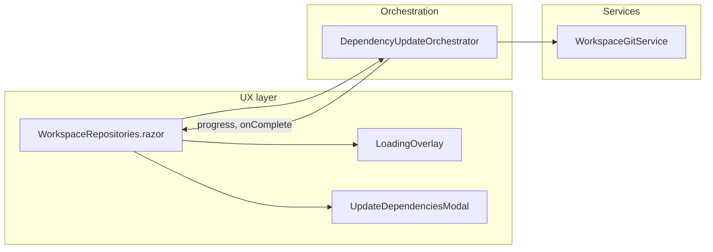

# Decouple dependency update logic from UX (simplified)

## Simplifications

- **"Update only" removed**: There is no option to update without committing. The workflow always updates .csproj files and commits them.
- **Commits required per level**: In multi-level flow, each level is fully committed before moving to the next level (unchanged behavior; now the only behavior).
- **Modal**: Can be reduced to a single confirmation ("Update dependencies?" Proceed / Cancel) with optional multi-level explanation text. No "Update only" button.

## Current state

- **Update flow** is driven from [WorkspaceRepositories.razor.cs](src/GrayMoon.App/Components/Pages/WorkspaceRepositories.razor.cs) and implemented in [WorkspaceGitService.RunUpdateAsync](src/GrayMoon.App/Services/WorkspaceGitService.cs) (lines 504–679), which mixes refresh, plan, multi/single-level branching, sync, commit, and refresh version in one long method.
- **Progress** is reported via `Action<string> setProgress`; the page shows it in [LoadingOverlay](src/GrayMoon.App/Components/Shared/LoadingOverlay.razor) with "Running x tasks…" when awaiting agent tasks.
- **Csproj commits**: Paths in [CommitDependencyUpdatesAsync](src/GrayMoon.App/Services/WorkspaceGitService.cs) should be normalized (repo-relative, forward slashes) to avoid commit bugs.

## Target architecture

- **UX**: Overlay and progress unchanged. Modal only offers Proceed / Cancel (no "Update only").
- **Orchestrator**: Single workflow: refresh → plan → (if multi-level) per level: sync → commit → refresh version; (if single-level) sync → commit → refresh version → broadcast. No `withCommits`; no return payload for "commit later".

## Implementation plan

### 1. Add DependencyUpdateOrchestrator

- **Location**: New file `src/GrayMoon.App/Services/DependencyUpdateOrchestrator.cs`.
- **Signature**: `RunAsync(workspaceId, cancellationToken, setProgress, onRepoError, onAppSideComplete, repoIdsToUpdate?)` returning `Task` (no payload return).
- **Steps** (clear, commented):
  1. **Refresh projects** — `RefreshWorkspaceProjectsAsync`; stop on error.
  2. **Get update plan** — `GetUpdatePlanAsync`. If empty, `RecomputeAndBroadcastWorkspaceSyncedAsync`, invoke `onAppSideComplete`, return.
  3. **Multi-level**: For each level (ascending): sync deps for that level → commit for that level (required before next level) → refresh version for that level; invoke `onAppSideComplete` where appropriate; stop on error.
  4. **Single-level**: Sync all → commit all → refresh version for all; then `onAppSideComplete` and `RecomputeAndBroadcastWorkspaceSyncedAsync`.
  5. **Finalize** — `RecomputeAndBroadcastWorkspaceSyncedAsync`; invoke `onAppSideComplete`.

### 2. Fix csproj commit path handling

- In [WorkspaceGitService.CommitDependencyUpdatesAsync](src/GrayMoon.App/Services/WorkspaceGitService.cs): normalize each `ProjectPath` to repo-relative, forward slashes before building `pathsToStage`. Add a short comment.

### 3. Move workflow from WorkspaceGitService to orchestrator

- `WorkspaceGitService.RunUpdateAsync` becomes a thin wrapper that calls the orchestrator (or is removed and callers use the orchestrator directly).
- **WorkspaceUpdateHandler**: Call orchestrator; remove any handling of "update only" or return payload.

### 4. Remove "Update only" from UX

- **UpdateDependenciesModal**: Remove "Update only" button and `OnUpdateOnly` callback. Keep Proceed and Cancel; keep multi-level explanation text when applicable.
- **WorkspaceRepositories.razor.cs**: Remove `OnUpdateOnlyAsync`, `RunUpdateCoreAsync(withCommits: false)` path, and all "commit later" / `CommitPayloadAfterUpdateOnlyAsync` / `updatePlanPayloadForUpdateOnly` logic. Single entry: user confirms → close modal → call orchestrator (always full update with commits). After orchestrator completes, run file-version update and refresh; if there are updated version files, show version-files commit modal as today.
- **Single-repo update**: Same orchestrator with `repoIdsToUpdate: { repositoryId }`; no "update only" option there either (single-repo modal can stay "Proceed" / "Cancel" with optional "also commit" implied).

### 5. Register orchestrator in DI

- Register `DependencyUpdateOrchestrator`; page resolves it (e.g. via scope) and calls `RunAsync`.

## Files to add

- `src/GrayMoon.App/Services/DependencyUpdateOrchestrator.cs`

## Files to change

- [WorkspaceGitService.cs](src/GrayMoon.App/Services/WorkspaceGitService.cs) — Path normalization in `CommitDependencyUpdatesAsync`; delegate `RunUpdateAsync` to orchestrator or remove.
- [WorkspaceUpdateHandler.cs](src/GrayMoon.App/Services/WorkspaceUpdateHandler.cs) — Call orchestrator; remove payload return and "update only" handling.
- [WorkspaceRepositories.razor.cs](src/GrayMoon.App/Components/Pages/WorkspaceRepositories.razor.cs) — Use orchestrator only; remove "Update only" and "commit later" flows.
- [UpdateDependenciesModal.razor](src/GrayMoon.App/Components/Modals/UpdateDependenciesModal.razor) — Remove "Update only" button and related parameters.
- DI registration — Register `DependencyUpdateOrchestrator`.

## Result

- One clear workflow: refresh → plan → per level (sync → commit → refresh version). Commits required to advance to the next level; no "update only" path.
- UX: Same overlay and progress; simpler modal (Proceed / Cancel).
- Csproj paths normalized for reliable commits.
- Logic in one well-commented orchestrator.
