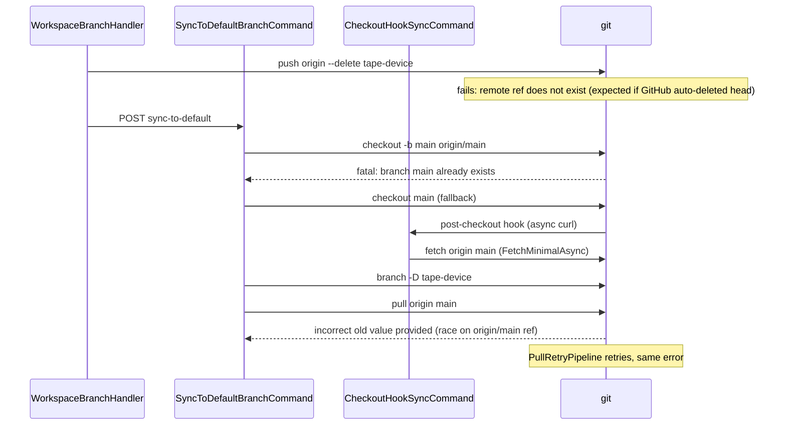

# Fix sync-to-default branch race and checkout logic

## What your log shows (mapped to code)



| Log line | Source | Severity |
|----------|--------|----------|
| `unable to delete 'tape-device': remote ref does not exist` | [`WorkspaceBranchHandler.SyncToDefaultSingleAsync`](src/GrayMoon.App/Services/WorkspaceBranchHandler.cs) calls delete API when `hasUpstream`; agent runs `git push origin --delete` in [`DeleteBranchAsync`](src/GrayMoon.Agent/Services/GitService.cs) | Expected/noisy — App already ignores "not exist"/"not found" in the delete response, but agent still logs errors |
| `checkout -b main origin/main` then `fatal: branch named 'main' already exists` | [`CheckoutBranchAsync`](src/GrayMoon.Agent/Services/GitService.cs) lines 728-737: if `origin/main` exists, always tries `-b` first, then falls back to `checkout main` | Harmless noise — fallback succeeds (`Switched to branch 'main'`) |
| `pull origin main` → `incorrect old value provided` | [`SyncToDefaultBranchCommand`](src/GrayMoon.Agent/Commands/SyncToDefaultBranchCommand.cs) line 57 calls `PullAsync` immediately after checkout; **post-checkout hook** ([`CheckoutHookSyncCommand`](src/GrayMoon.Agent/Commands/CheckoutHookSyncCommand.cs) line 39) concurrently runs `FetchMinimalAsync` on `main` | **Real bug** — two git processes race to atomically update `refs/remotes/origin/main` |
| Duplicate error lines | [`CreatePullPipeline`](src/GrayMoon.Agent/Services/GitResiliencePipelines.cs) retries up to 3 times on any non-zero exit; checkout fatals may also appear twice via git stderr mirroring in the terminal overlay | Symptom, not root cause |

## Why `checkout -b main origin/main` is used

[`CheckoutBranchAsync`](src/GrayMoon.Agent/Services/GitService.cs) was written for the "local branch doesn't exist yet, but remote does" case (e.g. first checkout of a remote branch). Sync-to-default almost always has a local `main` already, so the `-b` path is wrong-first.

Your instinct is correct: **prefer `git checkout main` when `refs/heads/main` exists**, and only use `-b`/tracking when the local branch is missing.

## Why pull fails (not the remote delete)

The delete-remote step completes (with expected failure) before checkout. Checkout succeeds. The failure happens because:

1. `git checkout main` triggers the GrayMoon **post-checkout hook** ([`WriteSyncHooks`](src/GrayMoon.Agent/Services/GitService.cs) — fire-and-forget `curl` to `/hook/checkout`).
2. That enqueues [`CheckoutHookSyncCommand`](src/GrayMoon.Agent/Commands/CheckoutHookSyncCommand.cs), which fetches `main`.
3. In parallel, `SyncToDefaultBranchCommand` runs `git pull origin main` (fetch + merge).
4. Both try to update `refs/remotes/origin/main` using Git's atomic ref update; one loses with **"incorrect old value provided"**.

There is **no per-repo git lock** today — command jobs and notify (hook) jobs share the worker pool ([`GrayMoon.Agent-Parallel-Jobs.md`](docs/GrayMoon.Agent-Parallel-Jobs.md)).

## Proposed fixes (minimal, targeted)

### 1. Fix checkout order in `CheckoutBranchAsync` (reduce noise, safer default)

In [`GitService.CheckoutBranchAsync`](src/GrayMoon.Agent/Services/GitService.cs):

```
if refs/heads/{branchName} exists  →  git checkout {branchName}
else if origin/{branchName} exists →  git checkout -b {branchName} origin/{branchName}  (or --track)
else                               →  git checkout {branchName}  (local-only fallback)
```

This matches what you suggested and eliminates the double-fatal on every sync-to-default where local default already exists.

### 2. Treat missing remote branch as success on delete (expected GitHub behavior)

In [`DeleteBranchAsync`](src/GrayMoon.Agent/Services/GitService.cs) when `isRemote == true`, if stderr contains phrases like `remote ref does not exist` or `does not exist`, return `(true, null)` instead of failure. Makes delete idempotent when GitHub "Delete head branches" already removed the branch.

No change needed in [`WorkspaceBranchHandler`](src/GrayMoon.App/Services/WorkspaceBranchHandler.cs) — it already swallows those API errors, but this cleans agent logs and returns consistent success.

### 3. Fix the pull race (primary bug)

**Recommended: per-repo git lock in `GitService`**

Add a `ConcurrentDictionary<string, SemaphoreSlim>` keyed by normalized repo path. Acquire the semaphore at the start of `RunProcessAsync` when `workingDirectory` is set (all git commands for that repo serialize).

- Fixes sync-to-default pull vs hook fetch race
- Fixes similar races elsewhere (e.g. hook fetch during manual pull/push)
- Small, localized change in one service

**Additionally for sync-to-default checkout:** pass `-c core.hooksPath=<empty>` on the checkout git invocation used by `SyncToDefaultBranchCommand` only (new optional `skipHooks` parameter on `CheckoutBranchAsync`, or a dedicated internal checkout helper). This prevents the hook from firing during an orchestrated multi-step operation, so sync-to-default does not depend on hook timing even under load.

Use an empty hooks directory (cross-platform) rather than `/dev/null`.

### 4. Optional hardening of the update step in `SyncToDefaultBranchCommand`

After fetch succeeds, prefer **`git merge --ff-only origin/{defaultBranch}`** (or `reset --hard` when PR was merged and local default should exactly match remote) instead of a full `pull`. This separates fetch from merge and avoids a second implicit fetch inside `pull`. Only valuable once the race is fixed; not sufficient alone.

## Files to change

| File | Change |
|------|--------|
| [`src/GrayMoon.Agent/Services/GitService.cs`](src/GrayMoon.Agent/Services/GitService.cs) | Repo lock in `RunProcessAsync`; fix `CheckoutBranchAsync` order; idempotent remote delete |
| [`src/GrayMoon.Agent/Commands/SyncToDefaultBranchCommand.cs`](src/GrayMoon.Agent/Commands/SyncToDefaultBranchCommand.cs) | Checkout with hooks disabled; optionally replace `PullAsync` with fetch + ff-merge |
| [`src/GrayMoon.Agent/Abstractions/IGitService.cs`](src/GrayMoon.Agent/Abstractions/IGitService.cs) | Add `skipHooks` (or similar) to checkout signature if needed |

## Verification

Manual repro on a repo like MezzoRecovery.TapeTools:

1. Be on feature branch with upstream; merge PR on GitHub (head branch auto-deleted).
2. Run sync-to-default from GrayMoon UI.
3. Confirm:
   - No `checkout -b` fatal when local `main` exists
   - Remote delete either succeeds or is silently treated as already-deleted (no error surfaced to user)
   - `pull`/update completes; local `main` at latest `origin/main`
   - No `incorrect old value provided` in agent/terminal log

Optional: run two concurrent git operations on same repo (checkout hook + pull) to confirm lock prevents the race.

## Out of scope

- Skipping remote delete when PR is merged (nice optimization, but idempotent delete is sufficient)
- Changing GitHub "delete head branches" setting
- Adding automated tests (none exist for this path today; manual verification is the practical first step)
