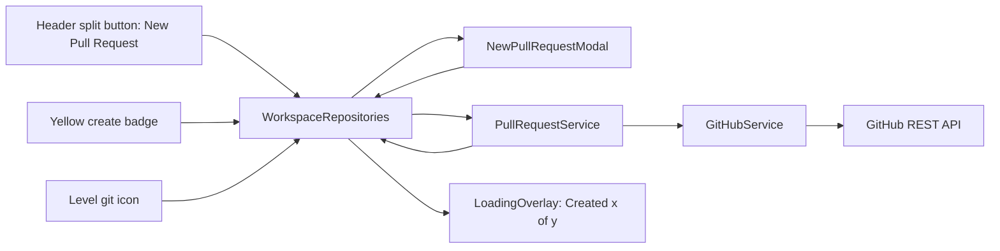

# GitHub PR Creation Dialog in GrayMoon

## Scope and constraints

- .NET 8 Blazor Server, Bootstrap 5.1, custom modal pattern (`*Modal.razor` with `IsVisible` + `EventCallback`s, not a modal service).
- GitHub client is the custom [src/GrayMoon.App/Services/GitHubService.cs](src/GrayMoon.App/Services/GitHubService.cs) on `HttpClient`. Reuse it; do not introduce Octokit.
- Auth is per-repo via `Repository.Connector.UserToken` (encrypted). Use the same `EnsureConnectorConfigured` pattern as existing PR fetch methods.
- Row model is [WorkspaceRepositoryLink](src/GrayMoon.App/Models/WorkspaceRepositoryLink.cs) (no `WorkspaceRepositoryViewModel`); plan uses this directly.
- Windows CRLF, ASCII hyphens only, primary constructors where the body is trivial.

## 1. GitHub API layer - extend `GitHubService`

In [src/GrayMoon.App/Services/GitHubService.cs](src/GrayMoon.App/Services/GitHubService.cs), add three POST methods alongside `GetPullRequestForBranchAsync`. Use a small private `PostAsJsonAsync<TReq,TRes>` helper that mirrors the existing `CreateGetRequest` (Bearer token, `application/vnd.github+json`, UA, `X-GitHub-Api-Version`) and runs through the same Polly pipeline.

- `CreatePullRequestAsync(Connector, owner, repo, CreatePullRequestApiBody, ct)` -> `POST /repos/{owner}/{repo}/pulls` -> `GitHubPullRequestDto`.
- `RequestReviewersAsync(Connector, owner, repo, pull_number, reviewers[], teamReviewers[], ct)` -> `POST /repos/{owner}/{repo}/pulls/{n}/requested_reviewers` (best-effort).
- `GetCollaboratorsAsync(Connector, owner, repo, ct)` -> `GET /repos/{owner}/{repo}/collaborators?affiliation=all&per_page=100` -> `List<GitHubCollaboratorDto>` (best-effort; returns empty on 403/404).

In [src/GrayMoon.App/Models/GitHubDtos.cs](src/GrayMoon.App/Models/GitHubDtos.cs), add:

- `GitHubCreatePullRequestRequestDto { title, head, base, body?, draft }` (lowercase `JsonPropertyName`s; null `body`/`draft` omitted via `JsonIgnoreCondition.WhenWritingNull`).
- `GitHubRequestReviewersRequestDto { reviewers, team_reviewers }`.
- `GitHubCollaboratorDto { login, type }`.
- Extend `GitHubPullRequestDto` with `[JsonPropertyName("body")] public string? Body` (used elsewhere later; harmless).

Friendly error mapping: reuse existing `GitHubApiErrorHelper.FormatFriendlyGitHubHttpError` for 422 (validation - e.g. "A pull request already exists"), 401/403, 404, 422 with `errors[].message`.

## 2. New `PullRequestService`

New file: `src/GrayMoon.App/Services/PullRequestService.cs`.

```csharp
public interface IPullRequestService
{
    Task<CreatePullRequestResult> CreatePullRequestAsync(CreatePullRequestRequest request, CancellationToken ct);
    Task<IReadOnlyList<CreatePullRequestResult>> CreatePullRequestsAsync(
        IReadOnlyList<CreatePullRequestRequest> requests,
        IProgress<CreatePullRequestProgress>? progress,
        CancellationToken ct);
    Task<IReadOnlyList<string>> GetCollaboratorLoginsAsync(int repositoryId, CancellationToken ct);
}
```

- Sequential execution in `CreatePullRequestsAsync` (PR creation order can matter for cross-repo workflows; matches existing `DependencyUpdateOrchestrator` style). Continue on per-repo failures; abort only on global auth failures.
- Resolves `Connector` per repo via `IServiceScopeFactory` + existing `WorkspaceRepository` / `RepositoryRepository` (mirror how `WorkspacePullRequestService` does it).
- After successful PR create, if `request.Reviewers` is non-empty, call `RequestReviewersAsync`; treat reviewer failure as non-fatal (sets `ReviewerWarning` but leaves `Success=true`).
- Validation up front: non-empty title, head, base, owner, repo; otherwise return failed `CreatePullRequestResult` without calling the API.

Models in the same file (or `Models/PullRequestModels.cs`):

```csharp
public sealed class CreatePullRequestRequest
{
    public required int RepositoryId { get; init; }
    public required string Owner { get; init; }
    public required string RepositoryName { get; init; }
    public required string HeadBranch { get; init; }
    public required string BaseBranch { get; init; }
    public required string Title { get; init; }
    public string? Body { get; init; }
    public bool IsDraft { get; init; }
    public IReadOnlyList<string> Reviewers { get; init; } = [];
}

public sealed class CreatePullRequestResult
{
    public required int RepositoryId { get; init; }
    public required string RepositoryName { get; init; }
    public bool Success { get; init; }
    public int? PullRequestNumber { get; init; }
    public string? PullRequestUrl { get; init; }
    public string? ErrorMessage { get; init; }
    public string? ReviewerWarning { get; init; }
}

public sealed class CreatePullRequestProgress
{
    public int Created { get; init; }
    public int Failed { get; init; }
    public int Total { get; init; }
    public string? CurrentRepositoryName { get; init; }
}
```

Register in [src/GrayMoon.App/Program.cs](src/GrayMoon.App/Program.cs) next to other GitHub services:

```csharp
builder.Services.AddScoped<IPullRequestService, PullRequestService>();
```

## 3. Title generator helper

New file: `src/GrayMoon.App/Services/PullRequestTitleHelper.cs`.

- `BuildDefaultTitle(string branchName)`:
  - Replace `-`, `_`, `.`, `/` with space, **except** retain `-` when it follows an uppercase letter (Regex `(?<![A-Z])-` -> space).
  - Collapse multiple spaces and trim.
  - Preserve original casing.
- Example test: `feature/ABC-123-update-dependencies.v2` -> `feature ABC-123 update dependencies v2`. Spec example shows `ABC-123 feature ...`; we will match the spec by **moving the first all-uppercase token (ticket id) to the front** only when it contains a digit (matches `[A-Z]+-\d+`).
- Keep helper static, no DI. No external library.

## 4. New `NewPullRequestModal.razor`

New file: `src/GrayMoon.App/Components/Modals/NewPullRequestModal.razor`.

Follows the existing modal pattern (`IsVisible` + `EventCallback`s, Bootstrap 5.1, Escape closes, no separate `.razor.cs`). Body fields:

- Title `input.form-control` (required, prefilled from helper).
- Description `textarea.form-control` rows="6" with `<div class="form-text text-muted">If left empty, the repository pull request template will be used if available.</div>`.
- `<div class="form-check">` for `Draft pull request`.
- Reviewers section:
  - When a single repository: show a chip/checkbox list of collaborator logins fetched via `IPullRequestService.GetCollaboratorLoginsAsync` on open (loading spinner while fetching, hidden on error).
  - When multiple repositories: show a comma-separated free-text input only.
  - Field is optional in both cases.

Footer (Bootstrap modal-footer with `justify-content-between` so the gray button is left-aligned):

```html
<button class="btn btn-secondary" @onclick="OnOpenInGitHubClick">Open in GitHub</button>
<div class="d-flex gap-2">
  <button class="btn btn-outline-secondary" @onclick="OnCancel">Cancel</button>
  <button class="btn btn-primary" @onclick="OnCreateClick" disabled="@(IsBusy || !IsValid)">Create</button>
</div>
```

Parameters:

```csharp
[Parameter] public bool IsVisible { get; set; }
[Parameter] public bool IsBusy { get; set; }
[Parameter] public IReadOnlyList<NewPrTargetRepo> Targets { get; set; } = [];
[Parameter] public EventCallback<NewPrFormResult> OnCreate { get; set; }
[Parameter] public EventCallback OnCancel { get; set; }
[Parameter] public EventCallback OnOpenInGitHub { get; set; }
```

Where `NewPrTargetRepo` is a lightweight record `(int RepositoryId, string Owner, string RepositoryName, string HeadBranch, string BaseBranch, string? CloneUrl)` built by the page from `WorkspaceRepositoryLink`. The modal does not depend on EF types.

Default title generation runs in `OnParametersSet` when the modal opens (`IsVisible` transitions to true) using the unified head branch when all `Targets` share one; otherwise leave empty and show "Multiple branches" helper text. Validation requires non-empty title.

## 5. Wire `WorkspaceRepositories.razor` + code-behind

In [src/GrayMoon.App/Components/Pages/WorkspaceRepositories.razor.cs](src/GrayMoon.App/Components/Pages/WorkspaceRepositories.razor.cs), add:

```csharp
private NewPullRequestModalState _newPrModal = new();
private bool isCreatingPullRequests;
private string createPrProgressMessage = "Creating Pull Requests...";

private sealed record NewPullRequestModalState
{
    public bool IsVisible { get; init; }
    public IReadOnlyList<NewPrTargetRepo> Targets { get; init; } = [];
}

private Task OpenPullRequestDialogForAllRepositoriesAsync()
    => OpenPullRequestDialogCoreAsync(workspaceRepositories);

private Task OpenPullRequestDialogForRepositoryAsync(WorkspaceRepositoryLink link)
    => OpenPullRequestDialogCoreAsync(new[] { link });

private Task OpenPullRequestDialogForRepositoriesAsync(IReadOnlyList<WorkspaceRepositoryLink> links)
    => OpenPullRequestDialogCoreAsync(links);
```

`OpenPullRequestDialogCoreAsync` filters to GitHub repos with a non-default head branch and ahead commits (mirrors `ShowConfirmOpenPr` filter), maps to `NewPrTargetRepo`, shows a toast if empty, otherwise sets `_newPrModal = new { IsVisible = true, Targets = ... }`.

Create handler runs the standard load overlay:

```csharp
isCreatingPullRequests = true;
createPrProgressMessage = "Creating Pull Requests...";
var progress = new Progress<CreatePullRequestProgress>(p =>
{
    createPrProgressMessage = $"Created {p.Created} of {p.Total} pull requests";
    _ = InvokeAsync(StateHasChanged);
});
var results = await PullRequestService.CreatePullRequestsAsync(requests, progress, ct);
isCreatingPullRequests = false;
// toast summary; refresh PR cache via WorkspacePullRequestService
```

Open-in-GitHub handler: build compare URLs from each target (`{repoUrl}/compare/{base}...{head}`); if `Targets.Count > 5`, call existing `ShowConfirm("Open X repositories in separate tabs?", ...)` then `JSRuntime.InvokeVoidAsync("graymoonOpenUrls", urls)`; else open directly (reuses existing `graymoonOpenUrls` JS in `App.razor`).

Add overlay markup next to existing one in [WorkspaceRepositories.razor](src/GrayMoon.App/Components/Pages/WorkspaceRepositories.razor):

```razor
<LoadingOverlay IsVisible="@isCreatingPullRequests" Message="@createPrProgressMessage" />
<NewPullRequestModal IsVisible="@_newPrModal.IsVisible"
                     Targets="@_newPrModal.Targets"
                     IsBusy="@isCreatingPullRequests"
                     OnCreate="HandleCreatePullRequestsAsync"
                     OnCancel="CloseNewPullRequestModal"
                     OnOpenInGitHub="HandleNewPrOpenInGitHubAsync" />
```

Inject `IPullRequestService` into the page.

## 6. Replace `Update` button with Bootstrap split-button dropdown

Modify [src/GrayMoon.App/Components/Shared/WorkspaceRepositoriesHeader.razor](src/GrayMoon.App/Components/Shared/WorkspaceRepositoriesHeader.razor). Since the project already has Bootstrap 5.1 but no `dropdown-toggle-split` examples, we use the Blazor-controlled toggle pattern (matches `ConnectorModal.razor` / `WorkspaceDependencies.razor`):

```razor
<div class="btn-group">
    <button class="btn @(HasUnmatchedDependencies ? "btn-danger" : "btn-outline-secondary")"
            @onclick="@(() => OnUpdate.InvokeAsync())"
            disabled="@(...)">Update</button>
    <button type="button"
            class="btn @(HasUnmatchedDependencies ? "btn-danger" : "btn-outline-secondary") dropdown-toggle dropdown-toggle-split"
            @onclick="ToggleUpdateMenu"
            disabled="@(...)">
        <span class="visually-hidden">Toggle Dropdown</span>
    </button>
    @if (_updateMenuOpen)
    {
        <ul class="dropdown-menu show" style="...">
            <li><button class="dropdown-item" @onclick="OnNewBranchClick">New Branch</button></li>
            <li><button class="dropdown-item" @onclick="OnSwitchBranchClick">Switch Branch</button></li>
            <li><hr class="dropdown-divider" /></li>
            <li><button class="dropdown-item" @onclick="OnNewPullRequestClick">New Pull Request</button></li>
        </ul>
    }
</div>
```

Add three new `EventCallback`s and a private `_updateMenuOpen` bool. Click-outside dismissal can reuse existing JS pattern from `ConnectorModal` (window click listener) or simply close on item click + on `OnUpdate` click, which is sufficient for v1.

Remove the standalone existing `Branch` button (lines 59-63) since `New Branch` / `Switch Branch` move into the dropdown. Wire the page's existing `OnShowBranch` to `OnNewBranchClick`, plus a new `OnShowSwitchBranch` callback for the switch tab.

## 7. Add initial-tab parameter to `BranchModal`

In [src/GrayMoon.App/Components/Modals/BranchModal.razor](src/GrayMoon.App/Components/Modals/BranchModal.razor):

- Add `[Parameter] public string? InitialTab { get; set; }`.
- In `OnParametersSet`, change `activeTab = "newbranch";` to `activeTab = (InitialTab == "switchbranch") ? "switchbranch" : "newbranch";`.

In `WorkspaceRepositories.razor.cs` `BranchModalState` record, add `public string InitialTab { get; init; } = "newbranch";` and pass through to `<BranchModal InitialTab="@_branchModal.InitialTab" .../>`. `ShowBranchModalAsync(string tab = "newbranch")` sets it.

## 8. Yellow `create` badge -> single repo PR dialog

In [src/GrayMoon.App/Components/Shared/PRBadge.razor](src/GrayMoon.App/Components/Shared/PRBadge.razor), replace the `<a target="_blank">` with a Blazor `@onclick` button-styled span and add a new `[Parameter] public EventCallback OnCreateClick { get; set; }`. Drop the `CreatePrUrl` parameter usage for navigation, keep visual styling (`badge pr-badge pr-badge-create`).

In [WorkspaceRepositoriesRow.razor](src/GrayMoon.App/Components/Pages/WorkspaceRepositoriesRow.razor), pass `OnCreateClick="() => OnCreatePr.InvokeAsync(Link)"`; add `[Parameter] public EventCallback<WorkspaceRepositoryLink> OnCreatePr { get; set; }`. In `WorkspaceRepositories.razor`, wire `OnCreatePr="OpenPullRequestDialogForRepositoryAsync"`.

## 9. Dependency-level git icon -> multi-repo PR dialog

In [src/GrayMoon.App/Components/Pages/WorkspaceRepositories.razor.cs](src/GrayMoon.App/Components/Pages/WorkspaceRepositories.razor.cs), change the `OnOpenPr` wiring (currently `() => ShowConfirmOpenPr(group)`) to `() => OpenPullRequestDialogForRepositoriesAsync(group.ToList())`. Keep `ShowConfirmOpenPr` only if still used elsewhere (it isn't).

## 10. Validation, errors, telemetry

- `PullRequestService` returns a per-repo `CreatePullRequestResult`; the page renders a summary toast: `"Created N of M pull requests"`. On any failure, show a second `ToastService.ShowError` with the first failure reason. Optionally render a small results list in the existing overlay area (out of scope for v1; keep toast only).
- Map common errors via `GitHubApiErrorHelper`:
  - 401 -> "GitHub token missing or invalid."
  - 403 -> "Insufficient permissions on {owner}/{repo}."
  - 404 -> "Repository or base branch not found."
  - 422 `A pull request already exists` -> "A pull request for {head} already exists."
  - 422 `No commits between` -> "No commits between {base} and {head}."
  - Rate limit (403 + `x-ratelimit-remaining: 0`) -> "GitHub rate limit hit."
- Log via `ILogger<PullRequestService>` at `LogInformation` on success, `LogWarning` on per-repo failure.

## 11. Open-in-GitHub button behavior (per user choice)

- Single target: open one compare URL via `graymoonOpenUrls`.
- 2-5 targets: open all directly.
- >5 targets: reuse `ShowConfirm($"Do you want to open {N} repositories in separate tabs?", openAll)` from the existing confirm modal pattern.

## 12. Files touched (summary)

- New: `src/GrayMoon.App/Services/PullRequestService.cs`, `src/GrayMoon.App/Services/PullRequestTitleHelper.cs`, `src/GrayMoon.App/Components/Modals/NewPullRequestModal.razor`.
- Modified: `GitHubService.cs`, `GitHubDtos.cs`, `Program.cs`, `WorkspaceRepositoriesHeader.razor`, `BranchModal.razor`, `PRBadge.razor`, `WorkspaceRepositoriesRow.razor`, `WorkspaceRepositories.razor`, `WorkspaceRepositories.razor.cs`.

## 13. Non-goals

- No labels, milestones, `maintainer_can_modify`.
- No template auto-expansion; helper text only.
- No persisted PR state in SQLite (existing refresh path picks it up).
- No new toast/notification component; reuse `IToastService`.
- No new bootstrap CSS; reuse 5.1 classes.

## Architecture sketch


