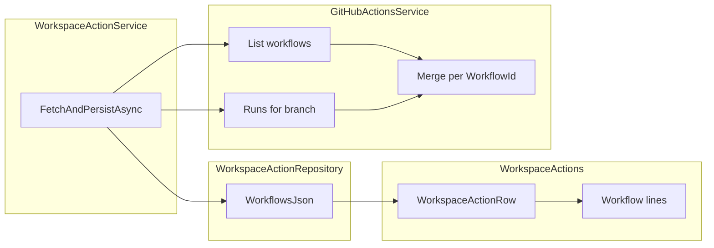

# Multi-workflow workspace actions grid

## Current behavior (problem)

- [`GitHubActionsService.GetAggregateActionStatusForBranchAsync`](src/GrayMoon.App/Services/GitHubActionsService.cs) loads all runs for the branch, groups by `WorkflowId`, then **picks one “primary” run** and returns a single [`ActionStatusInfo`](src/GrayMoon.App/Models/ActionStatusInfo.cs). The UI in [`WorkspaceActions.razor`](src/GrayMoon.App/Components/Pages/WorkspaceActions.razor) / [`WorkspaceActions.razor.cs`](src/GrayMoon.App/Components/Pages/WorkspaceActions.razor.cs) binds one status and one Run/Re-run button to that aggregate.
- Persistence in [`WorkspaceActionRepository`](src/GrayMoon.App/Repositories/WorkspaceActionRepository.cs) / [`WorkspaceRepositoryAction`](src/GrayMoon.App/Models/WorkspaceRepositoryAction.cs) is **one row per workspace-repository link**, storing only one workflow’s fields.

## Target behavior

- **Workflow column**: show each workflow’s display name (from GitHub’s workflow list, consistent with run names).
- **Remove “Last checked”** column entirely (colspan and table header).
- **Per-workflow status and actions**: each workflow line uses that workflow’s latest run on the branch for status/link; **Run** uses that workflow’s `WorkflowId`; **Re-run** uses that run’s `RunId` when failed.
- **Repository / branch**: show only on the **first** `<tr>` for a repo; subsequent workflow lines use **empty** `<td>` for those columns (same table grid, no `rowspan` unless you prefer it later).
- **Striping**: remove `table-striped` and apply **one background per repository group** (first + continuation rows share the same class), matching your option “sub-rows same bg as the first” / “colors only change when new repository.” Implement via CSS classes (e.g. `actions-group-0` / `actions-group-1`) in [`WorkspaceActions.razor.css`](src/GrayMoon.App/Components/Pages/WorkspaceActions.razor.css), with colors that work on the existing table body (avoid hard-coded light-only grays if the app supports dark tables; prefer `rgba` overlays or Bootstrap CSS variables where possible).
- **Header counts** (`FailedCount`, `RunningCount`, etc.): count **workflow lines**, not repos, so badges stay meaningful.
- **Sorting**: sort **repository groups** by worst status across their workflows (failed &lt; running &lt; success &lt; none), same priority as today’s `GetStatusSortOrder`; stable secondary sort by repo name.
- **Errors** (GitHub fetch failure): treat as **repo-level**; show [`ActionBadge`](src/GrayMoon.App/Components/Shared/ActionBadge.razor) with `ErrorMessage` only on the **first** line of the group; other lines get no duplicate error badge (empty status or “-” as you prefer).

## Backend / GitHub API

1. **List workflows with the same auth as other workspace actions**  
   [`GitHubService.GetWorkflowsAsync(string owner, string repo)`](src/GrayMoon.App/Services/GitHubService.cs) uses the global PAT (`EnsureConfigured`) and is **unused** today. Add **`GetWorkflowsAsync(Connector connector, string owner, string repo)`** mirroring `GetWorkflowRunsForBranchAsync` (connector-scoped `GetAsync`), and use it from the actions path so multi-connector setups stay correct.

2. **New service method** (name TBD, e.g. `GetWorkflowStatusesForBranchAsync`) in [`GitHubActionsService`](src/GrayMoon.App/Services/GitHubActionsService.cs):
   - Load **active** workflows for the repo (filter `State == "active"` when present).
   - Load branch runs via existing `GetWorkflowRunsForBranchAsync`.
   - Build **latest run per `WorkflowId`** (reuse the existing grouping logic).
   - For **each** listed workflow (sorted by name): emit an `ActionStatusInfo` with `BranchName = branch`, `WorkflowId` / `WorkflowName` from the workflow definition, and if a latest run exists set `Status` / `HtmlUrl` / `UpdatedAt` / `RunId` from **that run only** (map conclusion/status using the same rules as today: failure conclusions → `failed`, non-completed → `running`, else `success`; no run → `none`).
   - Optionally include runs whose `WorkflowId` is **not** in the workflow list (deleted/renamed workflow files) as extra rows-nice-to-have, not required for the first iteration.

3. **Deprecate or narrow** `GetAggregateActionStatusForBranchAsync`: either remove if unused after the change or keep as a thin wrapper only if something else needs it (today only [`WorkspaceActionService`](src/GrayMoon.App/Services/WorkspaceActionService.cs) calls it).

## Persistence

- Add nullable **`WorkflowsJson`** (`TEXT`) on `WorkspaceRepositoryActions` via a new idempotent migration in [`Migrations.cs`](src/GrayMoon.App/Migrations.cs) + property on [`WorkspaceRepositoryAction`](src/GrayMoon.App/Models/WorkspaceRepositoryAction.cs) + [`AppDbContext`](src/GrayMoon.App/Data/AppDbContext.cs) config (max length optional for SQLite).
- Serialize **`List<ActionStatusInfo>`** (or a small DTO with the same fields) with `System.Text.Json`.
- **Read path** in [`WorkspaceActionRepository.GetByWorkspaceIdAsync`](src/GrayMoon.App/Repositories/WorkspaceActionRepository.cs): if `WorkflowsJson` is present, deserialize; else **fallback** to legacy single-row columns via existing `ToActionStatusInfo()` as a **one-element list** so existing DB rows keep working.
- **Write path** in `UpsertAsync`: accept the list + branch; store JSON; optionally clear or mirror legacy scalar columns for compatibility (simplest: **populate JSON as source of truth** and leave legacy columns null on new writes, still readable via fallback for old rows only).

## Workspace UI state model

- Extend [`WorkspaceActionRow`](src/GrayMoon.App/Components/Pages/WorkspaceActions.razor.cs) with a **`List<WorkflowActionLine>`** (name TBD) holding `ActionStatusInfo` (or equivalent) and **`RunInProgress` per workflow** (move off the repo row).
- Replace repo-level `Action` with the list (or keep `Action` only during transition-prefer removing to avoid ambiguity).
- **`RefreshRowAsync`**: call updated `FetchAndPersistAsync` that returns `IReadOnlyList<ActionStatusInfo>`, assign to the row’s lines.
- **`RunWorkflowAsync` / `RerunWorkflowAsync`**: take the **line** (or `workflowId` + row) so `BuildActionEntry` uses **that** workflow’s ids; after success, refresh the **whole repo** row once (same as today).
- **`RerunAllFailedAsync`**: iterate **failed workflow lines** that have `RunId`, not one row per repo.
- **Auto-poll** (`AutoPollLoopAsync`): treat “running” as **any** workflow line on the repo with `running` status (same refresh as today).
- **`RefreshFromSyncAsync` / branch change**: clear all workflow lines when branch changes (same invalidation as today).

## Razor / CSS

- Table columns: **Repository | Branch | Workflow | Status | Actions** (drop Last checked; [`WorkspaceActions.razor.css`](src/GrayMoon.App/Components/Pages/WorkspaceActions.razor.css) already defines `.col-workflow`-wire it to the new column and rebalance widths vs `.col-repo`).
- Remove `table-striped` from the `<table>` class list; add **group index** classes on each `<tr>`.
- Adjust **colspan** for loading/empty rows from 5 → **4**.

## Data flow (high level)

## Files to touch (expected)

- [`src/GrayMoon.App/Components/Pages/WorkspaceActions.razor`](src/GrayMoon.App/Components/Pages/WorkspaceActions.razor)
- [`src/GrayMoon.App/Components/Pages/WorkspaceActions.razor.cs`](src/GrayMoon.App/Components/Pages/WorkspaceActions.razor.cs)
- [`src/GrayMoon.App/Components/Pages/WorkspaceActions.razor.css`](src/GrayMoon.App/Components/Pages/WorkspaceActions.razor.css)
- [`src/GrayMoon.App/Services/GitHubActionsService.cs`](src/GrayMoon.App/Services/GitHubActionsService.cs)
- [`src/GrayMoon.App/Services/GitHubService.cs`](src/GrayMoon.App/Services/GitHubService.cs)
- [`src/GrayMoon.App/Services/WorkspaceActionService.cs`](src/GrayMoon.App/Services/WorkspaceActionService.cs)
- [`src/GrayMoon.App/Repositories/WorkspaceActionRepository.cs`](src/GrayMoon.App/Repositories/WorkspaceActionRepository.cs)
- [`src/GrayMoon.App/Models/WorkspaceRepositoryAction.cs`](src/GrayMoon.App/Models/WorkspaceRepositoryAction.cs)
- [`src/GrayMoon.App/Data/AppDbContext.cs`](src/GrayMoon.App/Data/AppDbContext.cs)
- [`src/GrayMoon.App/Migrations.cs`](src/GrayMoon.App/Migrations.cs)

No architecture doc update is required unless you want the design doc table refreshed (you asked to avoid extra markdown unless needed).
