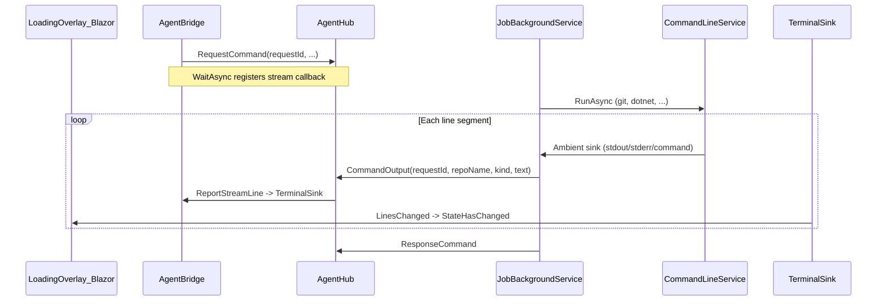

# Loading overlay live command terminal

## Concurrency and labeling

- **Order**: The terminal does **not** guarantee global chronological ordering across concurrent agent jobs. When multiple repositories run commands in parallel (e.g. parallel sync), stdout/stderr lines may **interleave** in whatever order they arrive over SignalR; that is acceptable.
- **Repository prefix**: Each displayed line should start with a **repository label** when the command’s request includes a repository identity (e.g. `[RepositoryName]` or `[repo:Name]`), so mixed streams stay readable. When no repo applies (e.g. `GetHostInfo`, `EnsureWorkspace`), use a short fallback such as `[agent]` or omit the bracket and show the hub command name only—pick one convention and apply it consistently.
- **Implementation note**: Resolve the label in the agent from the **typed job request** already deserialized in `ICommandJob` / `ProcessCommandAsync` (e.g. `repositoryName` on sync/push/checkout requests). Pass `repositoryName` (nullable) alongside `requestId` on each `CommandOutput` hub call so the app can format the prefix without re-parsing JSON.

## Architecture

## 1. Wire streaming on the wire

- Add a hub method name in [`GrayMoon.Abstractions/Agent/AgentHubMethods.cs`](src/GrayMoon.Abstractions/Agent/AgentHubMethods.cs), e.g. `CommandOutput`.
- Add primitives on the hub: `(string requestId, string? repositoryName, int kind, string text)` where `kind` maps to command echo / stdout / stderr (enum in Abstractions). `repositoryName` is optional; the agent fills it when the job request exposes a repo (see **Concurrency and labeling**).
- **Agent → server**: In [`JobBackgroundService.ProcessCommandAsync`](src/GrayMoon.Agent/Hosted/JobBackgroundService.cs), capture `repositoryName` (and any fallback) from `job.Request` via a small helper (reflection or pattern match on known request types), then wrap `dispatcher.ExecuteAsync` in an `IDisposable` scope that sets an **async-flow** callback (see below) so only command jobs (not notify-only jobs) stream. The ambient sink closure should include `repositoryName` so every `InvokeAsync` carries the same label for that job.
- Reuse the same resilience/send pattern as `ResponseCommand` where appropriate (or a lighter path if fire-and-forget is acceptable; see risks).
- **Server hub**: In [`AgentHub`](src/GrayMoon.App/Hubs/AgentHub.cs), add `CommandOutput(...)` that validates there is a pending request and forwards the line to the waiting operation (extend [`AgentResponseDelivery`](src/GrayMoon.App/Services/AgentResponseDelivery.cs)).

## 2. Correlate stream lines with pending requests

- Extend [`AgentResponseDelivery.PendingRequest`](src/GrayMoon.App/Services/AgentResponseDelivery.cs) with an optional `Action<AgentCommandStreamLine>` (or `IProgress<>`) registered in `WaitAsync`. Payload should include `RepositoryName`, `Kind`, and `Text` so the terminal can format `[repo] …` once on the server.
- Add `ReportStreamLine(requestId, line)` that finds the pending entry and invokes the callback; ignore unknown `requestId` (agent retry/late messages). Multiple pending requests may each append to the **same** singleton terminal buffer, so lines from different repos naturally interleave.
- Update [`AgentBridge.SendCommandAsync`](src/GrayMoon.App/Services/AgentBridge.cs) to register a callback that pushes into a new **singleton** terminal buffer service (next section) so **every** agent call gets streaming without changing all call sites.

## 3. Ambient hook in `CommandLineService` (no agent reference in Common)

- Add a static `AsyncLocal` + `IDisposable` scope in **GrayMoon.Common** (e.g. `CommandLineStreamScope` / `CommandLineStreamAmbient`) and a small `record` for `{ Kind, Text }` (command line vs stdout vs stderr).
- Extend [`CommandLineService.RunAsync`](src/GrayMoon.Common/CommandLineService.cs): after the existing DEBUG log line for “Command starting…”, report a **command echo** line to the ambient sink (use existing `LogSafe.ForLog` for arguments); in each `FlushSegment` for stdout/stderr, invoke the ambient sink with the appropriate kind.
- **Agent** [`JobBackgroundService`](src/GrayMoon.Agent/Hosted/JobBackgroundService.cs): on entering `ProcessCommandAsync`, `Push` a sink that maps ambient events to `connection.InvokeAsync(AgentHubMethods.CommandOutput, requestId, repositoryName, kind, truncatedText)`. Truncate each line (e.g. 2–4K chars) to protect SignalR and UI.
- **Non-blocking concern**: avoid `await InvokeAsync` on the same thread that reads the process stdout if that risks pipe backpressure; prefer enqueue + background sender (channel + single worker) if a quick prototype shows stalls. Document this in implementation.

## 4. In-memory terminal buffer + Blazor updates

- Add a **singleton** service, e.g. `OverlayCommandTerminalService`, registered in [`Program.cs`](src/GrayMoon.App/Program.cs): thread-safe bounded list (e.g. max 500–1000 lines), `IReadOnlyList` snapshot or immutable updates for UI, and `event EventHandler? Changed`. Store each row as `{ RepositoryLabel?, Kind, Text }` or a single **preformatted display string** that already includes the `[repo]` prefix for simplicity.
- `AgentBridge` appends lines when `ReportStreamLine` fires. **Do not** clear the buffer on every `SendCommandAsync` if multiple agent calls can be in flight (parallel repos); that would drop other repos’ output. Prefer **clear when the loading overlay becomes visible** (transition to shown) or a manual/user reset, and otherwise use a **rolling cap** on total lines only.
- [`LoadingOverlay.razor`](src/GrayMoon.App/Components/Shared/LoadingOverlay.razor): inject the service; when `IsVisible`, render a terminal region; subscribe to `Changed` and call `InvokeAsync(StateHasChanged)` (mirror existing `AgentQueueStateService` subscription pattern).

## 5. UI / CSS: look, layering, scroll

- **Layout**: Dock a terminal panel to the **bottom** (~25–35vh), full width, **below** `.loading-overlay-content` in stacking order so the spinner, message, and Abort stay visually dominant. Suggested z-index: above matrix canvas + veil, **below** `.loading-overlay-content` (currently `z-index: 1` in [`loading-overlay.css`](src/GrayMoon.App/wwwroot/css/loading-overlay.css)).
- **Visual**: Dark translucent panel (e.g. `rgba(12, 14, 18, 0.72)` with a subtle top border / inner shadow), **monospace** stack (e.g. `Consolas`, `Cascadia Mono`), muted green/amber for stdout/stderr, slightly brighter/dimmed prompt line for the command echo; optional subtle **dim styling for the `[repo]` prefix** so the rest of the line stays easy to scan when logs are interleaved.
- **Scroll**: `overflow-y: auto` on the inner container; `@ref` + `OnAfterRenderAsync`: when line count changes and overlay is visible, set `scrollTop = scrollHeight` (JS interop) or scroll last element into view—same pattern as typical chat logs.
- **Accessibility**: `aria-hidden="true"` on the decorative terminal (or `role="log"` with `aria-live="off"` to avoid noisy screen readers during long git output).

## 6. Edge cases

- **Install/uninstall CLI** and any `RunAsync` before hub is connected: ambient sink unset—no stream; behavior unchanged.
- **Notify jobs** that might run processes without `ProcessCommandAsync` scope: no stream unless you later extend scope there (optional follow-up).
- **Multiple `LoadingOverlay` instances** (e.g. [`WorkspaceRepositories.razor`](src/GrayMoon.App/Components/Pages/WorkspaceRepositories.razor)): each visible overlay can render the same singleton buffer; typically only one overlay is visible.

## Files to touch (expected)

| Area | Files |
|------|--------|
| Contracts | [`AgentHubMethods.cs`](src/GrayMoon.Abstractions/Agent/AgentHubMethods.cs), new stream line type/enum in Abstractions |
| Common | [`CommandLineService.cs`](src/GrayMoon.Common/CommandLineService.cs), new ambient scope type |
| Agent | [`JobBackgroundService.cs`](src/GrayMoon.Agent/Hosted/JobBackgroundService.cs), [`SignalRConnectionHostedService.cs`](src/GrayMoon.Agent/Hosted/SignalRConnectionHostedService.cs) only if hub client needs to know new method (server invokes from agent—no client `On` needed) |
| App hub + delivery | [`AgentHub.cs`](src/GrayMoon.App/Hubs/AgentHub.cs), [`AgentResponseDelivery.cs`](src/GrayMoon.App/Services/AgentResponseDelivery.cs), [`AgentBridge.cs`](src/GrayMoon.App/Services/AgentBridge.cs) |
| UI | [`LoadingOverlay.razor`](src/GrayMoon.App/Components/Shared/LoadingOverlay.razor), [`loading-overlay.css`](src/GrayMoon.App/wwwroot/css/loading-overlay.css) |

## Testing (manual)

- Start app + agent; trigger **Sync** or **Fetch** on a repo; confirm command lines and git progress appear in the bottom terminal, scroll as output grows, and spinner/message remain readable in both simple and matrix overlay modes.
- Trigger an operation that runs **multiple repositories in parallel**; confirm lines **interleave** and each line (or block) is identifiable via the **repository prefix**, with no requirement that all output for one repo finish before another repo’s lines appear.
