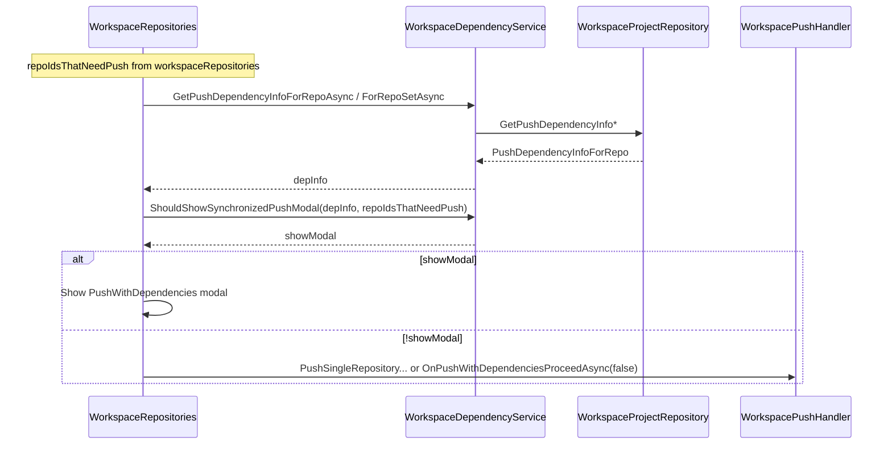

# Push modal only when dependencies need push + dependency service

## Current behavior

- **Single-repo (badge click):** Modal is shown whenever the repo has any `DependencyRepoIds`; no check whether those dependency repos have unpushed commits or lack upstream.
- **Header push:** Modal is shown when `RequiredPackages.Count > 0 || DependencyRepoIds.Count > 0`; again no check that a dependency repo actually needs push.

So the modal appears whenever there are dependencies, even if all dependency repos are already pushed.

## Desired behavior

- Show the **synchronized-push modal** only when **at least one dependency repo needs to be pushed** (i.e. has `OutgoingCommits > 0` or `BranchHasUpstream == false`).
- If the repo has dependencies but **none** of them need push, **push directly** without showing the modal.
- All dependency-related business logic lives in a dedicated **dependency service** (decoupled from UI and push execution).

## Key files

| Role                          | File                                                                                                                                                                       |
| ----------------------------- | -------------------------------------------------------------------------------------------------------------------------------------------------------------------------- |
| Push flow (badge + header)    | [WorkspaceRepositories.razor.cs](src/GrayMoon.App/Components/Pages/WorkspaceRepositories.razor.cs) — `OnPushBadgeClickAsync`, `OnPushClickAsync`                           |
| Push handler (plan + execute) | [WorkspacePushHandler.cs](src/GrayMoon.App/Services/WorkspacePushHandler.cs) — get dep info today; will stop returning dep info for modal decision                         |
| Push dependency data          | [WorkspaceProjectRepository.cs](src/GrayMoon.App/Repositories/WorkspaceProjectRepository.cs) — `GetPushDependencyInfoForRepoAsync`, `GetPushDependencyInfoForRepoSetAsync` |
| “Needs push” definition       | Same as existing: `(OutgoingCommits ?? 0) > 0                                                                                                                              |

## Implementation

### 1. Add WorkspaceDependencyService

- **New file:** `Services/WorkspaceDependencyService.cs`
- **Responsibilities:**
  - **Get push dependency info** (delegate to data layer):
    - `GetPushDependencyInfoForRepoAsync(workspaceId, repositoryId)` → call `WorkspaceProjectRepository.GetPushDependencyInfoForRepoAsync`
    - `GetPushDependencyInfoForRepoSetAsync(workspaceId, repoIds)` → call `WorkspaceProjectRepository.GetPushDependencyInfoForRepoSetAsync`
  - **Business rule:** `ShouldShowSynchronizedPushModal(PushDependencyInfoForRepo? depInfo, IReadOnlySet<int> repoIdsThatNeedPush)`  
    - Return `true` if and only if `depInfo != null` and at least one of `depInfo.DependencyRepoIds` is in `repoIdsThatNeedPush`.  
    - So: show modal only when some **dependency** repo needs push; if there are no dependency repos or none of them need push, return `false`.
- **Dependencies:** Inject `WorkspaceProjectRepository` (already scoped in [Program.cs](src/GrayMoon.App/Program.cs)).
- **Registration:** `builder.Services.AddScoped<WorkspaceDependencyService>();` in Program.cs.

### 2. Page: use dependency service and “needs push” set

- **Compute “repos that need push”** once per action from current `workspaceRepositories`:
  - `repoIdsThatNeedPush = workspaceRepositories.Where(wr => (wr.OutgoingCommits ?? 0) > 0 || wr.BranchHasUpstream == false).Select(wr => wr.RepositoryId).ToHashSet()`
- **Inject** `WorkspaceDependencyService` in [WorkspaceRepositories.razor](src/GrayMoon.App/Components/Pages/WorkspaceRepositories.razor) (and use in code-behind).

**OnPushBadgeClickAsync (single repo):**

1. Get `depInfo = await WorkspaceDependencyService.GetPushDependencyInfoForRepoAsync(WorkspaceId, repositoryId)`.
2. If `depInfo == null` **or** `!WorkspaceDependencyService.ShouldShowSynchronizedPushModal(depInfo, repoIdsThatNeedPush)` → call `PushSingleRepositoryWithUpstreamAsync` and return.
3. Otherwise show the existing PushWithDependencies modal with `depInfo`.

**OnPushClickAsync (header push):**

1. Keep existing: get push plan via `WorkspacePushHandler.GetPushPlanAsync`, compute `repoIdsWithUnpushed`.
2. Get `depInfo = await WorkspaceDependencyService.GetPushDependencyInfoForRepoSetAsync(WorkspaceId, repoIdsWithUnpushed)` (replace call to `WorkspacePushHandler.GetPushDependenciesForPlanAsync`).
3. If `depInfo == null` → show error and return.
4. If **no deps at all** (`depInfo.PayloadForRepo.RequiredPackages.Count == 0 && depInfo.DependencyRepoIds.Count == 0`) **or** `!WorkspaceDependencyService.ShouldShowSynchronizedPushModal(depInfo, repoIdsThatNeedPush)` → call `OnPushWithDependenciesProceedAsync(synchronizedPush: false)` and return (push immediately).
5. Otherwise show the modal.

So the modal is shown only when there are dependency repos **and** at least one of them is in `repoIdsThatNeedPush`.

### 3. WorkspacePushHandler

- **Remove** (or stop using for modal path) `GetPushDependenciesForPlanAsync` and `GetPushDependenciesForRepoAsync` from the **page**; the page will use `WorkspaceDependencyService` for dependency info and modal decision.
- **Keep** `WorkspacePushHandler` for: `GetPushPlanAsync`, `RunPushWithDependenciesAsync`, `PushSingleRepositoryWithUpstreamAsync`. Optionally keep the two get-dep-info methods and have them delegate to `WorkspaceDependencyService` for a single source of truth, or leave them as thin wrappers around `WorkspaceGitService` for any other callers. If nothing else calls them, the page can rely only on `WorkspaceDependencyService` for dependency info.

### 4. Data flow summary

## Edge cases

- **No dependency repos:** `DependencyRepoIds` empty → `ShouldShowSynchronizedPushModal` is false → push directly (unchanged for “no deps”).
- **Dependency repos all pushed:** All dependency repo IDs are outside `repoIdsThatNeedPush` → show modal false → push directly (new behavior).
- **At least one dependency needs push:** One or more dependency repo IDs in `repoIdsThatNeedPush` → show modal true (unchanged).

## Summary

- **New:** `WorkspaceDependencyService` with push-dependency info methods (delegating to `WorkspaceProjectRepository`) and `ShouldShowSynchronizedPushModal(depInfo, repoIdsThatNeedPush)`.
- **Page:** Compute `repoIdsThatNeedPush` from `workspaceRepositories`; use dependency service for dep info and modal decision; show modal only when `ShouldShowSynchronizedPushModal` is true.
- **Push execution:** Unchanged; still via `WorkspacePushHandler`. Dependency business logic is centralized in the dependency service and decoupled from the UI.

