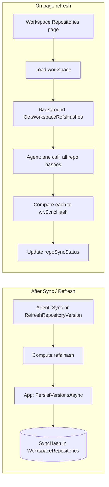

# SyncHash: Ref-state hashing for "sync required" detection

## Goal

- **Stored value:** Persist **SyncHash** (deterministic hash of Git ref state) on each WorkspaceRepository row.
- **When to set:** After every successful sync (full Sync or RefreshRepositoryVersion). Agent computes the hash from the repo on disk and returns it; app persists it.
- **Quick check:** On workspace repositories page load/refresh, one **workspace-scope** agent call: send workspace root + workspace name + list of repository names; agent returns all refs hashes in one response. App compares each to persisted SyncHash and marks sync required when they differ. Single round-trip per page. Covers both: app was not running (scenario 1) and push/fetch done outside GM (scenario 2).

## Why this approach

- **No network:** Hash is computed from local `.git/refs` and `.git/packed-refs` only. No `ls-remote`, no credentials.
- **Detects:** Local commits, push from terminal, fetch/pull (local or outside GM), tag/branch changes—anything that changes refs.
- **Scenarios:** When the app was not running, or when the user pushed/fetched outside GM, the next page refresh runs the hash check; if refs changed, hash differs and we show sync required.

## Hash definition

**Scope (all under repo root):**

- `.git/refs/`** (all files recursively)
- `.git/packed-refs` (single file, if present)

**Algorithm:**

1. Enumerate all files under `.git/refs` (files only; ignore timestamps).
2. Add `.git/packed-refs` if it exists.
3. Sort by relative path (e.g. ordinal string sort).
4. Build a buffer: for each path, append `<relative-path>\n<file-content>\n`.
5. SHA-256 hash the buffer; return hex string (e.g. 64 chars).

**Determinism:** Sorting by path and ignoring timestamps ensures the same ref state always yields the same hash.

**Packed-refs:** Including it covers refs that Git has packed (e.g. tags, sometimes branches); minimal extra cost.

## Architecture




## 1. Entity rename: WorkspaceRepositoryLink → WorkspaceRepositories

- **Rename the entity class** so it matches the table name `WorkspaceRepositories`.
- **Rename file:** [WorkspaceRepositoryLink.cs](src/GrayMoon.App/Models/WorkspaceRepositoryLink.cs) → `WorkspaceRepositories.cs`; class name `WorkspaceRepositories`.
- **Update all references** across the solution: type names, variables (e.g. `wr` can stay), navigation properties (e.g. `Workspace.Repositories` returns a collection of `WorkspaceRepositories`), DbSet name in [AppDbContext](src/GrayMoon.App/Data/AppDbContext.cs) (e.g. `WorkspaceRepositories` or keep `WorkspaceRepositories` as the set name; the entity type becomes `WorkspaceRepositories`). Search for `WorkspaceRepositoryLink` and update to `WorkspaceRepositories` everywhere (including related types like `WorkspaceRepositoryPullRequest.WorkspaceRepository` if it references the link entity).
- **Table name** remains `WorkspaceRepositories`; no schema change for the rename if the table is already so named (EF `ToTable("WorkspaceRepositories")` stays; entity type name is now aligned with it).

## 2. Schema and persistence

- **Model:** Add nullable `SyncHash` (e.g. `[MaxLength(64)]`) to the renamed entity [WorkspaceRepositories](src/GrayMoon.App/Models/WorkspaceRepositories.cs) (was WorkspaceRepositoryLink).
- **EF:** Map `SyncHash` in [AppDbContext](src/GrayMoon.App/Data/AppDbContext.cs).
- **Migration:** In [Migrations.cs](src/GrayMoon.App/Migrations.cs), add column `SyncHash TEXT` to `WorkspaceRepositories` (same pattern as existing migrations: `pragma_table_info` then `ALTER TABLE`).

## 3. Return and persist hash after any ref-changing operation

Any operation that can change `.git/refs` or `.git/packed-refs` **must** return the new refs hash, and the app **must** persist it to `WorkspaceRepositories.SyncHash` so the next lookup can compare correctly.

**Agent:** For each such operation, after the git work that may change refs, call `ComputeRefsHash(repoPath)` and include the result in the command response (e.g. `refsHash` / `SyncHash` field).

**App:** Whenever the app receives a successful response that includes a refs hash (from any of these operations), it must persist that hash to the corresponding `WorkspaceRepositories` row (update `SyncHash` and save).

**Operations that change refs (non-exhaustive; all must return and persist hash):**

- **SyncRepository** — fetch, checkout, etc. (already in plan).
- **RefreshRepositoryVersion** — reads refs; if it ever does fetch or modifies refs, include hash (already in plan).
- **PushRepository** — push updates refs (e.g. remote-tracking ref); return hash after push.
- **Pull** / merge flows — pull and merge update refs; return hash after success.
- **CheckoutBranchCommand** — checkout changes HEAD and possibly creates/updates refs; return hash.
- **CreateBranchCommand** — new branch creates refs; return hash.
- **CommitSyncRepositoryCommand** — commit + merge update refs; return hash.
- **SyncToDefaultBranchCommand** — merge/checkout update refs; return hash.
- Any other agent command that performs git operations that write under `.git/refs` or update `packed-refs`.

**Implementation note:** Add the `refsHash` (or `SyncHash`) field to the response type for each of these commands; in the handler, call `ComputeRefsHash(repoPath)` after the git work and set the field. On the app side, after invoking any of these commands, if the response contains a hash, load the relevant `WorkspaceRepositories` row(s), set `SyncHash`, and save. This keeps the persisted hash in sync with ref state so the page-refresh lookup is accurate.

## 4. Agent: refs hashing

**4a) Shared hashing implementation**

- **Location:** [GrayMoon.Agent](src/GrayMoon.Agent) (e.g. a small helper in `GitService` or a dedicated `RefsHashService` used by commands).
- **Method:** `string ComputeRefsHash(string repoPath)` (or `ComputeRefsHashAsync` if you prefer async file I/O).
  - Ensure `.git` exists and is a directory; resolve `path = Path.Combine(repoPath, ".git")`.
  - Collect paths:
    - All files under `Path.Combine(repoPath, ".git", "refs")` (recursive enumeration, files only).
    - If `Path.Combine(repoPath, ".git", "packed-refs")` exists, add it.
  - Normalize to relative paths from repo root (e.g. `refs/heads/main`, `packed-refs`).
  - Sort paths (ordinal).
  - For each path: read file content (UTF-8 or as bytes), append `relativePath + "\n" + content + "\n"` to a buffer.
  - Compute SHA-256 of the buffer (e.g. `System.Security.Cryptography.SHA256`), return hex string.
- **Edge cases:** If `.git/refs` is missing or empty and `packed-refs` is missing, still produce a deterministic hash (e.g. hash of empty string or a constant); avoid throwing so new/clone-in-progress repos don’t break.

**4b) Use hash in Sync and RefreshRepositoryVersion**

- **SyncRepositoryCommand:** After all git work (fetch, version, branches, etc.), call `ComputeRefsHash(repoPath)` and set `RefsHash` (or `SyncHash`) on [SyncRepositoryResponse](src/GrayMoon.Agent/Jobs/Response/SyncRepositoryResponse.cs).
- **RefreshRepositoryVersionCommand:** After reading version/branches from the repo, call `ComputeRefsHash(repoPath)` and set the same field on [RefreshRepositoryVersionResponse](src/GrayMoon.Agent/Jobs/Response/RefreshRepositoryVersionResponse.cs).

**4c) Single workspace-scope command for quick check**

- **Command:** `GetWorkspaceRefsHashes` — one agent call per workspace, returns hashes for all requested repos.
- **Request:**
  - `workspaceName` (string) — workspace folder name.
  - `workspaceRoot` (string) — root path under which the workspace folder lives.
  - `repositoryNames` (string[]) — names of repository folders (direct children of the workspace path). Each repo path is `Path.Combine(workspaceRoot, workspaceName, repositoryName)` and `.git` is at `Path.Combine(..., repositoryName, ".git")`.
- **Response:**
  - `hashes` — map from repository name to refs hash (e.g. `Dictionary<string, string?>` or JSON object). Key = repository name; value = hex hash string, or null/omit if repo missing, not a git repo, or error. Only repos that were requested need entries; use name as key so the app can match to `WorkspaceRepositories` rows via `Repository.RepositoryName`.
- **Handler:**
  - Resolve workspace path: `workspacePath = Path.Combine(workspaceRoot, workspaceName)`.
  - For each name in `repositoryNames`, resolve `repoPath = Path.Combine(workspacePath, name)`, call `ComputeRefsHash(repoPath)`, add `name -> hash` to the result. Run in parallel (e.g. `Task.WhenAll`) for speed.
  - Return the map. One round-trip for the whole workspace.

**4d) App: parse and persist**

- [RepoGitVersionInfo](src/GrayMoon.App/Models/RepoGitVersionInfo.cs): add property `RefsHash` (or `SyncHash`).
- [WorkspaceGitService](src/GrayMoon.App/Services/WorkspaceGitService.cs):
  - In `ParseSyncRepositoryResponse` and `ParseRefreshRepositoryVersionResponse`, map the new field into `RepoGitVersionInfo`.
  - In `PersistVersionsAsync`, set `wr.SyncHash = info.RefsHash` when present.

## 5. Quick check on page refresh

**5a) App service method (single workspace call)**

- In [WorkspaceGitService](src/GrayMoon.App/Services/WorkspaceGitService.cs) add:
  - `Task CheckSyncHashesAsync(int workspaceId, IReadOnlyList<WorkspaceRepositories> links, Action<int, RepoSyncStatus> onResult, CancellationToken cancellationToken)`
  - Build request: get workspace (name, root) and collect `repositoryNames` from the links (e.g. `wr.Repository?.RepositoryName` or stored repo name), ensuring no duplicates if multiple links refer to the same repo (by name).
  - Call agent **once**: `GetWorkspaceRefsHashes(workspaceName, workspaceRoot, repositoryNames)`.
  - On failure (agent error or empty response): leave all statuses as-is or set Error/NeedsSync for the whole set; then invoke callback for each link as needed.
  - On success: for each link, look up `currentHash = response.Hashes[repoName]` (or similar). If `wr.SyncHash` is null, leave status as-is. Else if `currentHash == null` or missing, treat as NeedsSync or Error; else if `currentHash != wr.SyncHash` → `onResult(repositoryId, RepoSyncStatus.NeedsSync)`; else `onResult(repositoryId, RepoSyncStatus.InSync)`.
  - Do not persist these results to the DB; only report via callback so the page can update `repoSyncStatus` and sync badge.

**5b) Page: trigger background check**

- In [WorkspaceRepositories.razor.cs](src/GrayMoon.App/Components/Pages/WorkspaceRepositories.razor.cs), after workspace data is loaded (e.g. after `LoadWorkspaceAsync()` and `ApplySyncStateFromWorkspace()`), start a background check:
  - Call `CheckSyncHashesAsync` with the loaded `workspaceRepositories`; callback updates `repoSyncStatus` and `isOutOfSync`, then `InvokeAsync(StateHasChanged)`.
  - One agent round-trip per page load/refresh. Run without blocking initial render (fire-and-forget or after first paint).

## 6. Edge cases

- **Repo not cloned / no .git:** Agent returns no hash or empty; treat as NeedsSync or leave SyncStatus as-is; do not overwrite SyncHash.
- **SyncHash null:** First sync not done yet; hash check does not set InSync; leave persisted SyncStatus.
- **Agent unreachable:** Leave status unchanged or set Error for that repo; do not block the page.

## 7. Files to touch (summary)


| Layer          | Files                                                                                                                                                                                                                                                                                                                                                       |
| -------------- | ----------------------------------------------------------------------------------------------------------------------------------------------------------------------------------------------------------------------------------------------------------------------------------------------------------------------------------------------------------- |
| Entity rename  | Rename `WorkspaceRepositoryLink.cs` → `WorkspaceRepositories.cs`, class `WorkspaceRepositories`; update all references (AppDbContext, nav properties, DTOs, pages, services, API endpoints).                                                                                                                                                                |
| Model / DB     | Add `SyncHash` to `WorkspaceRepositories`; `AppDbContext.cs`; `Migrations.cs` (add column).                                                                                                                                                                                                                                                                 |
| Agent hash     | New helper (e.g. in `GitService` or `RefsHashService`): enumerate `.git/refs/`** + `.git/packed-refs`, sort, path+content, SHA-256.                                                                                                                                                                                                                         |
| Agent commands | Sync, RefreshRepositoryVersion, Push, Pull, CheckoutBranch, CreateBranch, CommitSync, SyncToDefault, etc.: each returns refs hash after ref-changing work. New **GetWorkspaceRefsHashes** (single workspace-scope call: workspaceRoot + workspaceName + repositoryNames → map of repoName → hash); CommandJobFactory, CommandDispatcher, RunCommandHandler. |
| App            | `RepoGitVersionInfo.cs` (RefsHash); `WorkspaceGitService.cs` (parse, PersistVersionsAsync, CheckSyncHashesAsync, and persist hash when handling any ref-changing operation response).                                                                                                                                                                       |
| Page           | `WorkspaceRepositories.razor.cs` (invoke CheckSyncHashesAsync after load/refresh).                                                                                                                                                                                                                                                                          |


## 8. Request/response shape (GetWorkspaceRefsHashes)

**Request (e.g. JSON):**

```json
{
  "workspaceName": "MyWorkspace",
  "workspaceRoot": "C:\\Workspaces",
  "repositoryNames": ["repo-a", "repo-b", "repo-c"]
}
```

**Response (e.g. JSON):**

```json
{
  "hashes": {
    "repo-a": "a1b2c3...",
    "repo-b": "d4e5f6...",
    "repo-c": null
  }
}
```

- Keys in `hashes` are repository names (same as in the request). Value is the refs hash hex string, or null if the repo is missing, not a git repo, or hashing failed.
- App matches by `Repository.RepositoryName` (or equivalent) to `WorkspaceRepositories` rows and compares value to `wr.SyncHash`.