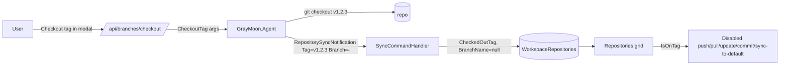

# Support tag checkout per repository

## Summary

Today GrayMoon has no concept of a tag/detached HEAD. After `git checkout v1.2.3` outside GM:

- GitVersion JSON's `BranchName` ends up as the literal `(no branch)`, persisted as `WorkspaceRepositoryLink.BranchName`.
- `BranchHasUpstream` is computed as `false` (no remote ref matches `(no branch)`), which triggers the "Push to set upstream" badge.
- The Switch Branch modal has no Tags tab, and the Remotes list shows the polluted `origin/(no branch)` if the remote-tracking ref stripping ever lets it through.

We will add explicit "on a tag" state end-to-end and gate all write operations off when set.

## Mermaid: data flow

## Changes

### 1. Agent: tag detection, listing, checkout

[src/GrayMoon.Agent/Abstractions/IGitService.cs](src/GrayMoon.Agent/Abstractions/IGitService.cs) + [src/GrayMoon.Agent/Services/GitService.cs](src/GrayMoon.Agent/Services/GitService.cs):
- `Task<IReadOnlyList<string>> GetTagsAsync(repoPath, ct)` - `git tag --sort=-creatordate`.
- `Task<(bool, string?)> CheckoutTagAsync(repoPath, tagName, ct)` - `git -c advice.detachedHead=false checkout refs/tags/<tag>`.
- `Task<string?> GetCheckedOutTagAsync(repoPath, ct)` - returns tag name iff `git symbolic-ref -q HEAD` fails (detached) AND `git describe --tags --exact-match` succeeds.

### 2. Agent: extend branch listing and sync payloads with tags / current tag

[src/GrayMoon.Agent/Jobs/Response/RefreshBranchesResponse.cs](src/GrayMoon.Agent/Jobs/Response/RefreshBranchesResponse.cs), [GetBranchesResponse.cs](src/GrayMoon.Agent/Jobs/Response/GetBranchesResponse.cs):
- Add `IReadOnlyList<string> Tags` and `string? CurrentTag`.

[src/GrayMoon.Agent/Commands/RefreshBranchesCommand.cs](src/GrayMoon.Agent/Commands/RefreshBranchesCommand.cs):
- Already fetches `--tags`; populate `Tags = GetTagsAsync(...)` and `CurrentTag = GetCheckedOutTagAsync(...)`. If `CurrentTag != null`, set `CurrentBranch = null` (don't echo GitVersion's `(no branch)`).

Hook + sync commands ([CheckoutHookSyncCommand](src/GrayMoon.Agent/Commands/CheckoutHookSyncCommand.cs), [CommitHookSyncCommand](src/GrayMoon.Agent/Commands/CommitHookSyncCommand.cs), [MergeHookSyncCommand](src/GrayMoon.Agent/Commands/MergeHookSyncCommand.cs), [PushHookSyncCommand](src/GrayMoon.Agent/Commands/PushHookSyncCommand.cs), [SyncRepositoryCommand](src/GrayMoon.Agent/Commands/SyncRepositoryCommand.cs), [RefreshRepositoryVersionCommand](src/GrayMoon.Agent/Commands/RefreshRepositoryVersionCommand.cs)):
- After GitVersion, if `GetCheckedOutTagAsync()` returns non-null OR `branch` is `(no branch)` / empty, set the outgoing `Branch = "-"` and add `Tag = currentTag` (new field); set `HasUpstream = null` (not false), and skip commit-count comparisons.

### 3. Agent: tag checkout command

New [src/GrayMoon.Agent/Commands/CheckoutTagCommand.cs](src/GrayMoon.Agent/Commands/CheckoutTagCommand.cs) + [src/GrayMoon.Agent/Jobs/Requests/CheckoutTagRequest.cs](src/GrayMoon.Agent/Jobs/Requests/CheckoutTagRequest.cs) and [Response/CheckoutTagResponse.cs](src/GrayMoon.Agent/Jobs/Response/CheckoutTagResponse.cs) modeled on [CheckoutBranchCommand.cs](src/GrayMoon.Agent/Commands/CheckoutBranchCommand.cs). Registered via the existing command job factory.

### 4. App: notification & DB

[src/GrayMoon.Abstractions/Notifications/RepositorySyncNotification.cs](src/GrayMoon.Abstractions/Notifications/RepositorySyncNotification.cs):
- Add `string? Tag { get; init; }`.

[src/GrayMoon.App/Models/WorkspaceRepositoryLink.cs](src/GrayMoon.App/Models/WorkspaceRepositoryLink.cs):
- Add `[MaxLength(200)] string? CheckedOutTag` + computed `[NotMapped] bool IsOnTag => !string.IsNullOrWhiteSpace(CheckedOutTag)`.

[src/GrayMoon.App/Models/RepositoryBranch.cs](src/GrayMoon.App/Models/RepositoryBranch.cs):
- Add `bool IsTag { get; set; }` (rows with `IsTag = true` represent tags; `IsRemote` stays false on those rows).

Migration in [src/GrayMoon.App/Migrations.cs](src/GrayMoon.App/Migrations.cs) (matching existing one-file migration pattern): add `CheckedOutTag` and `IsTag` columns.

[src/GrayMoon.App/Services/SyncCommandHandler.cs](src/GrayMoon.App/Services/SyncCommandHandler.cs):
- When `n.Tag` non-empty: `wr.BranchName = null; wr.CheckedOutTag = n.Tag; wr.BranchHasUpstream = null; wr.OutgoingCommits = null; wr.IncomingCommits = null; wr.DefaultBranchAheadCommits = null; wr.DefaultBranchBehindCommits = null;`. Else clear `CheckedOutTag` when a real branch name is reported.

[src/GrayMoon.App/Services/WorkspaceGitService.cs](src/GrayMoon.App/Services/WorkspaceGitService.cs):
- `PersistVersionsAsync`: same mapping using the new `Tag` field.
- `PersistBranchesAsync(int, localBranches, remoteBranches, defaultBranchName, tags, currentTag, ct)`: extend signature; upsert `IsTag = true` rows for tags; remove tags missing from the new list. Update `WorkspaceRepositoryLink.CheckedOutTag` based on `currentTag`.

### 5. App: branch API extensions

[src/GrayMoon.App/Api/Endpoints/BranchEndpoints.cs](src/GrayMoon.App/Api/Endpoints/BranchEndpoints.cs) + [src/GrayMoon.App/Models/Api/BranchesApiModels.cs](src/GrayMoon.App/Models/Api/BranchesApiModels.cs):
- `BranchesResponse`: add `List<string> Tags` and `string? CurrentTag`.
- `GetBranches`: read `IsTag` rows and `wr.CheckedOutTag` and include in response.
- `RefreshBranches`: pass `Tags`/`CurrentTag` to `PersistBranchesAsync`.
- `CheckoutBranchApiRequest`: add `bool IsTag`.
- `CheckoutBranch`: when `IsTag`, dispatch `CheckoutTag` to the agent; persist `wr.CheckedOutTag = body.BranchName; wr.BranchName = null` and clear divergence/commit counts and upstream.

### 6. UI: Switch Branch modal - new Tags tab

[src/GrayMoon.App/Components/Modals/SwitchBranchModal.razor](src/GrayMoon.App/Components/Modals/SwitchBranchModal.razor):
- Add a `tags` tab between Remotes and New Branch.
- Bind `List<string> tags` and `string? currentTag` from `BranchesResponse`.
- Render filtered tag list (same pattern as locals; no delete button).
- "Current" pill on the row where `tag == currentTag`.
- Check out button calls `OnCheckoutBranch.InvokeAsync((RepositoryId, selectedBranch))` with a new sibling event `OnCheckoutTag` (or a single `OnCheckout((repoId, name, isTag))` - prefer the latter to avoid duplicating wiring in [WorkspaceRepositories.razor.cs](src/GrayMoon.App/Components/Pages/WorkspaceRepositories.razor.cs)).
- When `currentTag != null`, suppress the Sync-to-default button and the Locals "Local Only" warning for that repo.

### 7. UI: grid row & gating

[src/GrayMoon.App/Components/Pages/WorkspaceRepositoriesRow.razor](src/GrayMoon.App/Components/Pages/WorkspaceRepositoriesRow.razor):
- Branch column: when `Link.IsOnTag`, render the tag name with a Bootstrap `badge bg-info` (or new CSS class `tag-badge`) and a `bi bi-tag` icon; click still opens Switch Branch modal.
- Pass new `IsOnTag` flag into [CommitsBadge.razor](src/GrayMoon.App/Components/Shared/CommitsBadge.razor): when set, hide the "Push to set upstream" cloud icon; render `-`.
- Disable push/pull badges, dependency-update badge, and the per-row sync-status badge action when `IsOnTag` (extend `ActionsDisabled` propagation or add a sibling flag).

[src/GrayMoon.App/Components/Pages/WorkspaceRepositories.razor.cs](src/GrayMoon.App/Components/Pages/WorkspaceRepositories.razor.cs):
- `hasIncomingCommits`, `isPushRecommended`, `hasUnmatchedDependencies` exclude `wr.IsOnTag`.
- `OnUpdateClickAsync`, `OnPushClickAsync`, `OnPullClickAsync` filter out `IsOnTag` repos before computing `repoIdsThatNeedPush` / `repoIdsWithIncoming` / update plan target set; if the resulting set is empty, toast and return.
- `OnPushBadgeClickAsync`, `OnPullBadgeClickAsync`, `ShowConfirmUpdateDependenciesAsync`, `CommitSyncAsync`, `SyncToDefaultFromModalAsync` early-return + toast `"Repository is on a tag; checkout a branch first."` when target repo `IsOnTag`.
- `ShowConfirmSyncToDefaultLevel` and `ShowConfirmSyncLevel` / `CommitSyncLevelAsync` filter `IsOnTag` repos out of their input lists.

[src/GrayMoon.App/Components/Pages/WorkspaceRepositoriesLevelHeader.razor](src/GrayMoon.App/Components/Pages/WorkspaceRepositoriesLevelHeader.razor):
- When every repo in a level is `IsOnTag`, fade the level action icons (or hide them); otherwise actions just operate on the remaining set (already handled by parent filtering).

## Preconditions

- Before running, the user ensures no repository is currently on a detached HEAD / tag (every repo is on a real branch). The plan does not include cleanup of pre-existing `(no branch)` / `origin/(no branch)` artifacts.
- DB migration is additive (two nullable / false-default columns); no data loss.

## Non-goals

- Creating tags from GrayMoon.
- Deleting tags from the modal.
- Showing per-tag commit comparisons.
