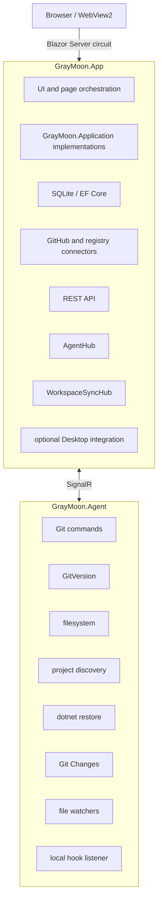
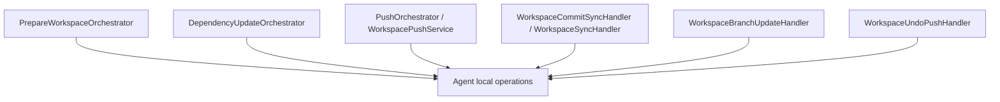

# 02 - System Architecture

## 1. High-level architecture

GrayMoon is a distributed local-development application with a strict App/Worker boundary.



This separation is foundational.

GrayMoon.App normally runs in Docker and cannot assume access to the developer's local repository paths.

GrayMoon.Agent (the Worker, packaged as `graymoon-worker`) runs on the developer host and performs operations against the real working copies.

---

## 2. Solution projects

### GrayMoon.App

`src/GrayMoon.App`

Responsibilities:

```text
Blazor Server UI
application-service implementations
orchestration
SQLite persistence
GitHub API interaction
connector management
background jobs
browser notifications
REST endpoints
Worker command coordination
Desktop-mode integration
```

The App must not run local Git directly.

### GrayMoon.Agent

`src/GrayMoon.Agent`

Responsibilities:

```text
host-side Git
GitVersion
filesystem reads/writes
project discovery
restore
Git Changes status/diff/mutations
Git hooks
Worker command execution
local HTTP callback listener
```

It is packaged as a .NET tool/service and supports console/service hosting.

CLI verbs include:

```text
run
install
uninstall
start
stop
```

### GrayMoon.Application

`src/GrayMoon.Application`

This is the application-facing contract assembly.

It contains:

```text
IWorkspace*Operations
OperationProgress
OperationResult
operation DTOs
automation-friendly contracts
```

Blazor pages and REST endpoints should use this boundary instead of reaching directly into orchestration internals where a suitable application operation exists.

This layer is also the intended future seam for automation such as MCP.

### GrayMoon.Abstractions

`src/GrayMoon.Abstractions`

Shared App-Worker contracts and hub method constants.

### GrayMoon.Common

`src/GrayMoon.Common`

Shared utilities and domain helpers, including:

```text
process/command-line helpers
Git change models
filter/search expression parsing
common Git models
```

### Test projects

The repository has dedicated test projects for Common, Worker (GrayMoon.Agent), and App behavior.

The standard development contract is:

```text
dotnet build GrayMoon.slnx
dotnet test src/GrayMoon.Common.Tests/GrayMoon.Common.Tests.csproj
dotnet test src/GrayMoon.Agent.Tests/GrayMoon.Agent.Tests.csproj
dotnet test src/GrayMoon.App.Tests/GrayMoon.App.Tests.csproj
```

---

## 3. UI architecture

GrayMoon uses interactive Blazor Server components.

Workspace pages are split into Razor markup and partial code-behind files to keep large workflows manageable.

Shared patterns include:

```text
modal components
page partials by workflow
FilterSearchInput
virtualized/paged query services
ToastService
BackgroundJobService
loading overlays
SignalR hub connections for refresh events
```

The UI is persistence-first.

Pages generally read fast SQLite projections, then schedule or react to background refreshes.

They should not synchronously execute Git just to paint a cell.

---

## 4. Application-service boundary

The preferred direction for mutations is:

```text
Page / Modal / REST endpoint
        │
        ▼
IWorkspace*Operations
        │
        ▼
GrayMoon.App implementation
        │
        ▼
orchestrator / repository / Worker bridge
```

Examples:

```text
IWorkspaceSyncOperations
IWorkspacePushOperations
IWorkspaceUpdateOperations
IWorkspaceBranchOperations
IWorkspacePullRequestOperations
IWorkspaceGitChangesOperations
IWorkspaceFileOperations
IWorkspacePreparationOperations
IWorkspaceCatalogOperations
```

This matters because domain behavior should not be encoded only in a Razor page.

Return to Default is a good example of the desired shape:

```text
AnalyzeReturnToDefaultAsync
→ structured plan
→ UI/REST policy
→ ExecuteReturnToDefaultAsync
```

---

## 5. Query layer

Large Workspace pages use dedicated query services instead of loading entire EF graphs into the circuit.

Examples include:

```text
IWorkspaceRepositoryLinkListQueryService
IWorkspaceProjectListQueryService
```

These provide:

```text
count
index
paged/virtualized results
targeted hydration
header summaries
snapshot queries
```

This is important for large Workspaces.

New read-heavy features should prefer the same pattern over loading a full Workspace aggregate and filtering it in memory.

---

## 6. Connector architecture

Connectors represent external systems.

Current connector types support source control and package registries, including GitHub and NuGet scenarios.

Connector responsibilities include:

```text
repository discovery
GitHub API access
authentication
package registry access
health checking
```

Tokens are protected at rest and are supplied to Git/GitHub operations when needed.

Git remote authentication is injected at command execution time rather than written permanently into repository config.

---

## 7. Workspace service layer

Major Workspace service responsibilities include:

### WorkspaceService

Workspace CRUD and root-path resolution.

The per-Workspace `RootPath` is the source of truth when present.

Global settings provide defaults for new Workspaces.

### WorkspaceGitService

The main App-side facade for many Git-oriented Workspace operations.

It coordinates Worker requests for:

```text
sync
fetch
project refresh
branch operations
commit synchronization
return to default
restore
other repository operations
```

### WorkspaceRepositoryStateWriter

Central persistence seam for mutable repository checkout state.

It accepts a `RepositoryStateSnapshot` plus write options and only rewrites the state groups that were actually probed.

That "probed groups only" rule prevents partial Worker responses from blanking unrelated fields.

### WorkspaceProjectRepository

Owns persisted Workspace projects and project dependency relationships.

It also computes repository-level dependency information used by orchestration.

### WorkspaceFileVersionService

Owns configured-file version validation and update planning.

### WorkspacePullRequestService

Owns persisted current-branch PR refresh and reconciliation.

### WorkspaceActionService / repositories

Own GitHub Actions persistence and refresh logic.

---

## 8. Orchestration layer

GrayMoon has workflows that span many repositories and therefore cannot be expressed as one Worker command.

Examples:



Orchestrators own:

```text
batch planning
dependency ordering
parallelism boundaries
progress reporting
error aggregation
batch-end recomputation
```

The Worker remains responsible for concrete local operations.

---

## 9. App-Worker bridge

`AgentBridge` sends commands over `AgentHub`.

The App generates a request ID and waits through a response-delivery mechanism.

Conceptually:

```text
App
  RequestCommand(requestId, commandName, payload)
        │
        ▼
Worker
  enqueue by command category
  execute handler
        │
        ▼
App
  ResponseCommand(requestId, payload)
```

Command output can also stream back for the terminal/loading overlay.

The App uses generous SignalR message sizing because repository sync responses can include branch lists and project/package graphs.

---

## 10. Worker command pipeline

The Worker has three bounded command pools:

```text
main command pool
Git Changes status/read pool
Git diff pool
```

This prevents expensive or long-running mutations from making Git Changes status and diff feel unresponsive.

Core hosted services include:

```text
SignalRConnectionHostedService
HookListenerHostedService
MainJobBackgroundService
ReadJobBackgroundService
DiffJobBackgroundService
```

Commands are routed by command name to the appropriate pool.

---

## 11. Local hook listener

The Worker exposes a local loopback HTTP listener, normally on:

```text
127.0.0.1:9191
```

Managed Git hooks POST notifications to this listener.

The hook listener turns them into Worker notification jobs, which collect repository state and push it back to the App over SignalR.

Hook failure must not block the developer's normal Git command.

---

## 12. Browser synchronization

A separate Workspace synchronization hub broadcasts server-side state changes to connected browser circuits.

Typical concepts include:

```text
WorkspaceSynced
RepositorySynced
GitChangesUpdated
```

Pages debounce refreshes and often reload only the affected rows.

Browser broadcasts are notifications to re-read persisted state, not authoritative state payloads.

---

## 13. Background jobs and page lifetime

Long-running Workspace operations must survive page navigation correctly.

The process-wide `WorkspaceOperationRunner` owns mutation exclusivity.

`BackgroundJobService` provides circuit/page overlay handles over those operations.

Important design rule:

- the operation belongs to the process/application, not to a disposed Razor component;
- page components must not keep background work dependent on page-owned disposable state;
- navigating to another page should not make an unrelated job appear to have moved there.

---

## 14. Desktop mode

GrayMoon can run through a separate native desktop wrapper.

Desktop integration provides native host behaviors such as:

```text
window context/title
open local repository folder
Explorer/native shell actions
clipboard/external URL integration
```

GrayMoon.App remains the core application.

Native OS process behavior belongs at the Desktop boundary, not in the normal web/container App.

---

## 15. REST API

GrayMoon exposes thin Workspace operation endpoints.

Examples include:

```text
list/get Workspaces
list repository snapshots
update dependencies
push
Prepare Workspace
sync
Return to Default
pull
Undo Push
restore packages
create/merge PRs
Git Changes read/stage/unstage/commit
update file versions
```

The REST layer should delegate to the same Application operations used by the UI.

It should not become an independent second implementation of Workspace rules.

---

## 16. Architectural constraints for future work

When adding functionality:

1. keep local Git/filesystem work in the Worker;
2. keep orchestration in the App;
3. persist expensive remote/local observations and render from SQLite;
4. use Application contracts for reusable mutations;
5. use query services for large read surfaces;
6. preserve batch recomputation boundaries;
7. keep remote credentials transient;
8. avoid page-owned business rules when a headless operation can own them.
