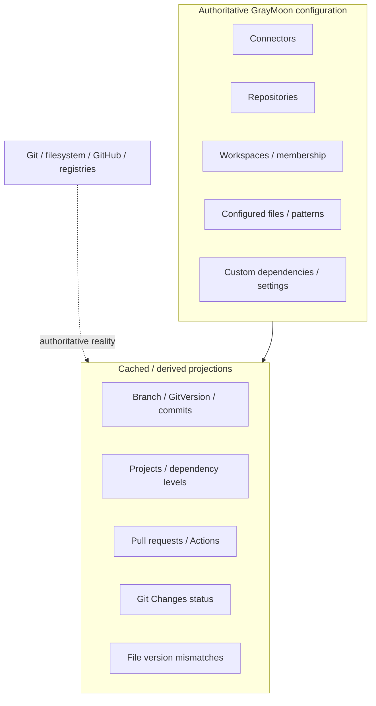

# 03 - Data Model and Persistence

## 1. Persistence model

GrayMoon.App persists application state in SQLite through EF Core.

The database is more than configuration storage. It also contains durable projections of external/local state so the UI can render quickly without running Git or GitHub requests during every page render.

This means the database contains two categories:



### Authoritative GrayMoon configuration

Examples:

```text
Connectors
Repositories
Workspaces
Workspace repository membership
configured files
version patterns
custom dependencies
settings
```

### Cached / derived projections

Examples:

```text
current branch/version state
commit counts
project discovery
dependency levels
pull request state
Actions state
Git Changes state
configured-file mismatch state
```

Git, the filesystem, GitHub, and registries remain authoritative for the external reality behind these projections.

---

## 2. Database creation and migrations

Brand-new databases are created from the EF model.

Existing databases use guarded, idempotent migration logic in the application migration layer.

Repository conventions require migrations for schema changes even during active development.

New columns should be nullable or have safe defaults so existing databases remain upgradeable.

SQLite is configured with shared cache/WAL-style concurrency choices to reduce contention between Blazor circuits and background writers.

---

## 3. Repository identity

### Repository

Represents a source repository known from a connector.

Important fields include:

```text
ConnectorId
RepositoryName
OrgName
CloneUrl
GitHubRepositoryId / provider identity
visibility/archive metadata
```

The database uses provider identity where available and does not rely solely on repository name.

### WorkspaceRepositoryLink

Table: `WorkspaceRepositories`

Unique:

```text
WorkspaceId + RepositoryId
```

This represents membership of a Repository in a Workspace.

Today it also stores most of the current checkout projection:

```text
GitVersion
BranchName
CheckedOutTag
HasNewerTag
DefaultBranchName
Projects
OutgoingCommits
IncomingCommits
DefaultBranchBehindCommits
DefaultBranchAheadCommits
BranchHasUpstream
SyncStatus
DependencyLevel
Dependencies
UnmatchedDeps
OutOfDateFileLines
OutOfDateFileRepos
TotalFileConfigRepos
HasSelfFileVersionToken
RepositoryType
```

It also owns one-to-one or one-to-many current projections such as PR, Actions, Git status, and Git change entries.

This "membership plus current checkout state" combination is a key current-state assumption.

---

## 4. Workspace

A Workspace stores:

```text
WorkspaceId
Name
IsDefault
RootPath
LastSyncedAt
IsInSync
ExcludeAiWorkflows
Repositories
```

`RootPath` is per Workspace.

`LastSyncedAt` and `IsInSync` describe the Workspace's current persisted synchronization state.

---

## 5. Branch and tag inventory

`RepositoryBranches` stores branch/tag inventory per `WorkspaceRepositoryLink`.

Fields include:

```text
BranchName
IsRemote
IsDefault
IsTag
SortIndex
LastSeenAt
```

This table is the persisted ref inventory.

Current checkout identity is stored separately on the Workspace repository link through `BranchName` / `CheckedOutTag`.

Synthetic detached-head placeholders are explicitly filtered out and must never be persisted as real branch names.

---

## 6. Project persistence

`WorkspaceProjects` stores projects discovered in Workspace repositories.

Current uniqueness:

```text
WorkspaceId + RepositoryId + ProjectName
```

Project fields include:

```text
ProjectName
ProjectType
ProjectFilePath
TargetFramework
PackageId
IsGenerated
MatchedConnectorId
```

Generated projects represent virtual/package-producing entities inferred from GrayMoon configuration or CI behavior.

They are intentionally protected from deletion by normal physical project reconciliation.

---

## 7. Project dependencies

`ProjectDependencies` stores internal project relationships.

Each row connects:

```text
DependentProjectId
ReferencedProjectId
Version
```

Only Workspace-internal package relationships become persisted project dependency edges.

The project graph is later collapsed into repository-level relationships and dependency levels.

---

## 8. Custom repository dependencies

`WorkspaceRepositoryCustomDependencies` stores explicit user-declared repository dependencies.

Unique:

```text
DependentWorkspaceRepositoryId
ReferencedWorkspaceRepositoryId
```

These are merged with implicit relationships discovered from project references and configured files.

The UI prevents circular dependency choices and distinguishes user-declared edges from implicit locked edges.

---

## 9. Dependency-level projection

Repository-level dependency metrics are currently persisted on `WorkspaceRepositoryLink`.

They include:

```text
DependencyLevel
Dependencies
UnmatchedDeps
RepositoryType
```

Configured file references contribute additional diagnostics:

```text
OutOfDateFileLines
OutOfDateFileRepos
TotalFileConfigRepos
HasSelfFileVersionToken
```

The repository grid reads these values directly.

A batch recomputation must operate on a complete snapshot after all repository changes in the batch have been persisted.

---

## 10. Configured files

### WorkspaceFile

Represents a user-selected file in a Workspace repository.

Fields include:

```text
WorkspaceId
RepositoryId
FileName
FilePath
IsMissingOnDisk
```

`FilePath` is relative to the repository root.

### WorkspaceFileVersionConfig

One optional version-pattern configuration per file.

The pattern contains repository tokens used to validate or update file lines.

### WorkspaceFileLineStatus

Persists current mismatch details for configured file tokens.

Typical data includes:

```text
WorkspaceId
RepositoryId
FilePath
FileName
TokenName
CurrentValue
ExpectedValue
```

This table supports diagnostics and dependency badge computation.

---

## 11. Pull request projection

`WorkspaceRepositoryPullRequests` is currently one-to-one with `WorkspaceRepositoryId`.

Persisted fields include:

```text
PullRequestNumber
State
Mergeable
MergeableState
HtmlUrl
MergedAt
ChangedFiles
LastCheckedAt
```

This allows the repository grid to render PR state immediately after page refresh.

The service refreshes the projection for the current branch and clears/reconciles stale PR state after branch changes.

---

## 12. Actions projection

`WorkspaceRepositoryActions` is currently one-to-one with `WorkspaceRepositoryId`.

It stores:

```text
aggregate status
HtmlUrl
UpdatedAt
BranchName
RunId
WorkflowId
WorkflowName
WorkflowsJson
LastCheckedAt
```

The persisted `BranchName` is used to verify that cached workflow state belongs to the repository's current branch.

---

## 13. Git Changes persisted read model

### WorkspaceGitRepositoryStatus

One row per `WorkspaceRepositoryId`.

Stores the latest Worker-reported snapshot metadata:

```text
SnapshotVersion
BranchName
HeadCommit
detached/unborn flags
merge/rebase/cherry-pick state
staged/changed/conflict counts
insertions/deletions
scan/persist timestamps
last error
```

### WorkspaceGitChangeEntry

Stores changed paths for the latest snapshot.

Every new snapshot replaces the set of entries for the repository.

Fields include:

```text
Path
OriginalPath
IndexChange
WorktreeChange
IsTracked
IsConflicted
IsSubmodule
```

The page reads these rows instead of invoking Git during rendering.

---

## 14. RepositoryStateSnapshot and partial writes

`WorkspaceRepositoryStateWriter` is a central correctness mechanism.

Worker operations do not always probe every category of repository state.

For example, one operation may know:

```text
branch
GitVersion
outgoing/incoming
```

but not project or tag details.

The state writer therefore accepts write options / probed groups and only updates fields whose values are authoritative for that operation.

Do not replace this with a naive "copy all response properties to the row" implementation.

---

## 15. Project merge semantics

Project reconciliation for a repository:

```text
discover projects
compare with persisted physical projects
add new
update existing
remove disappeared physical projects
preserve generated rows
rebuild relevant dependency edges
recompute repository graph metrics
```

This logic is central to dependency-aware orchestration.

---

## 16. PR and Actions cache philosophy

PR and Actions rows are caches, not configuration.

The branch on which they were obtained matters.

A cached remote state that belongs to a previous branch must not be shown as if it belongs to the current branch.

This is why branch transitions trigger reconciliation/refresh.

---

## 17. Settings and preferences

GrayMoon uses persisted Settings for application preferences and defaults.

Examples include:

```text
default Workspace root
UI preferences
last selections
other application settings
```

A Workspace-specific persisted value should take precedence over a global default where the domain supports per-Workspace configuration.

---

## 18. Secret storage

Connector tokens are protected before persistence.

Current security design uses a token-protection abstraction so callers do not implement encryption themselves.

The database stores protected token material, not raw cleartext tokens.

Runtime operations obtain decrypted credentials through the security/connector layer.

---

## 19. Persistence-first UI rule

The UI should normally:

```text
read persisted projection
render immediately
schedule/receive refresh
persist new projection
broadcast lightweight notification
re-read projection
```

It should not:

```text
render
block on N Git operations
block on N GitHub calls
then finally show the page
```

This design is visible throughout the repository grid, Git Changes, PR status, and Actions.

---

## 20. Derived-state recomputation rule

When many repositories are updated concurrently, do not let every repository independently recompute the same Workspace-wide graph and overwrite one another.

GrayMoon intentionally uses batch boundaries such as `WorkspaceStateRecomputeScope` or caller-owned recompute calls.

Pattern:

```text
update repository A state
update repository B state
update repository C state
all writes complete
→ recompute dependency/file-version aggregate once
→ broadcast WorkspaceSynced once
```

This avoids read-then-overwrite races.

---

## 21. Database design rules for contributors

When adding persisted state:

1. decide whether it is configuration or a cache/projection;
2. identify its authority;
3. define its refresh trigger;
4. define its invalidation trigger;
5. define its uniqueness key;
6. preserve backward-compatible migration;
7. index the fields used by Workspace list/query services;
8. do not create multiple competing sources of truth;
9. keep large page reads in query services rather than navigation-heavy EF graphs.
