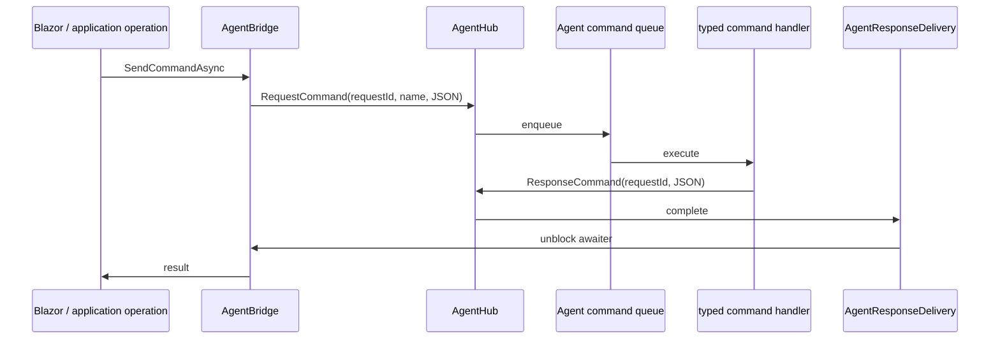
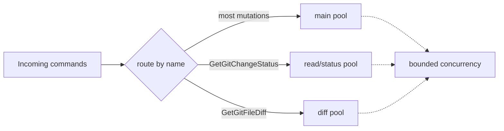
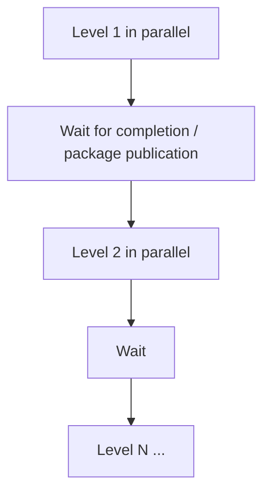
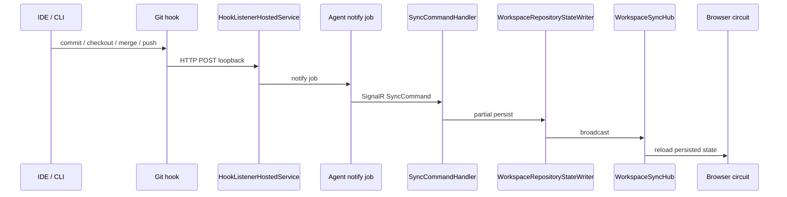
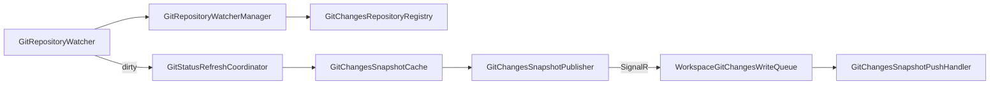
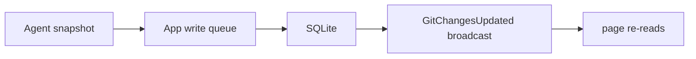

# 04 - Runtime Communication and Concurrency

## 1. App to Agent request flow

The App sends local-work commands to the Agent through SignalR.

Conceptually:



A unique request ID correlates response and caller.

Command terminal output is streamed separately so long-running operations can show live progress.

---

## 2. Agent job pools

The Agent uses separate bounded queues for different command categories.

Current architecture:



This isolation matters.

A long push, restore, or repository sync should not force a user to wait behind the same queue for a diff or Git status scan.

Do not collapse these pools into one queue without a deliberate performance redesign.

---

## 3. App-side operation locking

GrayMoon currently treats Workspace mutations as exclusive.

`WorkspaceOperationRunner` is the process-wide mutation coordinator.

A second conflicting Workspace mutation should not start while another mutation is active.

This protects multi-step orchestration from overlapping writes and Git operations.

`BackgroundJobService` is not the lock itself. It attaches UI/circuit job handles and overlays to process-wide operations.

---

## 4. Page jobs and cancellation

A long operation may continue after the user navigates away from the page that started it.

Therefore:

- page code must not capture disposable page state inside long-running background callbacks unless safely marshaled;
- cancellation must flow through application/Agent boundaries;
- the operation result is persisted independently from the initiating page;
- a later page can re-read the resulting persisted state.

---

## 5. Workspace parallelism

Many batch operations use `Workspace:MaxParallelOperations`.

This controls bounded fanout such as:

```text
repository sync
branch fetch
return-to-default batches
push batches
project refresh
```

Parallelism is deliberate and bounded.

Do not replace it with unrestricted `Task.WhenAll` across arbitrarily large Workspaces.

---

## 6. Dependency-ordered operations

Some operations cannot simply fan out across all repositories.

Synchronized push and dependency update work by dependency level.

Pattern:



Dependency ordering is a business rule, not a performance detail.

---

## 7. Hook-driven synchronization

GrayMoon installs Git hooks into managed repositories.

Hooks report local Git events even when changes were initiated outside GrayMoon.

End-to-end:



Hook notification failure must not break the Git operation that triggered the hook.

---

## 8. Hook types

Current hook-driven synchronization covers events including:

```text
post-commit
post-checkout
post-merge
pre-push
```

Different hooks may gather different state.

For example, pre-push is intentionally not a general-purpose fetch operation.

The state writer's partial/probed-group semantics are therefore essential.

---

## 9. Git Changes watcher architecture

Git Changes uses filesystem watchers on the Agent.

Important components include:



### Watcher lifecycle

A `GetGitChangeStatus` request establishes or renews a watcher lease for a repository path.

The watcher is not permanent forever.

Leases expire after an idle grace period when the Workspace/page is no longer active.

### Watcher event

Filesystem activity does not immediately run unlimited Git status processes.

It marks the repository dirty.

`GitStatusRefreshCoordinator` debounces and coalesces events, then performs a bounded scan.

### Snapshot push

The Agent can push a fresh snapshot without waiting for an explicit page request.

The App validates version ordering and persists through the single write queue.

---

## 10. Git Changes activity tracking

The App tracks whether a Workspace has recently needed Git Changes monitoring.

Opening relevant pages activates monitoring.

The background service only refreshes active/recent Workspaces instead of scanning every repository forever.

This is a deliberate scalability choice.

---

## 11. Git Changes refresh

"Refresh" is not merely re-reading SQLite.

An explicit refresh ultimately requests a new Agent status scan.

When the snapshot returns:



The UI remains projection-driven.

---

## 12. Git Changes mutation consistency

Stage, unstage, commit, and discard flows must converge back into the same authoritative snapshot model.

Do not maintain a permanent optimistic browser-only Git state after mutation.

Mutation result:

```text
perform Git command
obtain/refresh authoritative status
persist snapshot
notify page
```

---

## 13. Snapshot versioning

Agent snapshots carry versions.

This protects the App from persisting an older result after a newer result has already arrived.

Any new Git Changes path must preserve the monotonic/latest-wins semantics.

---

## 14. Browser activity and polling

Some pages adapt polling to browser activity.

Actions, for example, uses faster polling when actively viewed and slower polling when idle/hidden.

Git Changes watcher lifetime is a separate concept from browser active/idle/hidden state.

Do not conflate:

```text
browser tab activity
Git watcher lease activity
Agent connection status
background job activity
```

They are independent mechanisms.

---

## 15. GitHub Actions refresh

The Actions page:

```text
loads persisted state
starts background refresh
polls at activity-dependent cadence
reacts to Workspace/Repository sync broadcasts
refreshes targeted repositories
```

Dispatch/rerun operations account for GitHub eventual consistency by retrying until the new run becomes visible or the attempt budget is exhausted.

---

## 16. Connector health and remote operations

Remote operations should verify connector health when appropriate.

Git operations that contact a remote receive authentication dynamically.

Failure categories such as protected branch, unauthorized, non-fast-forward, or unavailable remote should be handled as operation outcomes, not blindly retried forever.

---

## 17. SignalR browser broadcasts

WorkspaceSyncHub events are invalidation signals.

A browser handler generally:

```text
receives workspace/repository id
debounces
opens a fresh scope/query
reloads the persisted row(s)
updates UI
```

This avoids sending large domain graphs through browser broadcast events.

---

## 18. Agent connection state

The App tracks Agent connectivity.

Operations that require local filesystem/Git access must fail clearly when no Agent is connected.

Read-only persisted UI may remain available even when the Agent is offline.

---

## 19. Error handling model

Multi-repository operations frequently produce partial failures.

GrayMoon therefore preserves:

```text
page-level error
repository-level error
dependency-level error
operation result
```

A single repository failure should not erase successful state from other repositories.

Application `OperationResult` can carry repository and level error dictionaries.

---

## 20. Concurrency rules for contributors

When adding a new operation:

1. determine whether it is read-only or mutating;
2. decide whether Workspace mutation exclusivity is required;
3. define bounded concurrency;
4. define dependency ordering if needed;
5. define cancellation propagation;
6. define persisted result/state;
7. define one batch recomputation boundary;
8. define browser invalidation;
9. avoid duplicate polling if hooks/watchers already provide a trigger.
