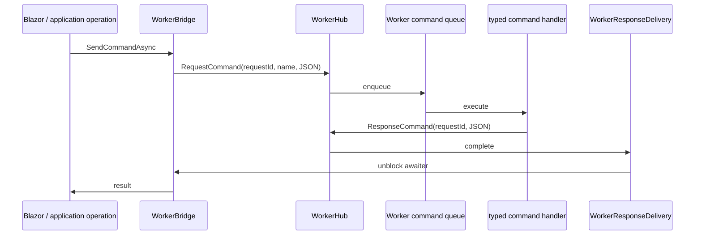
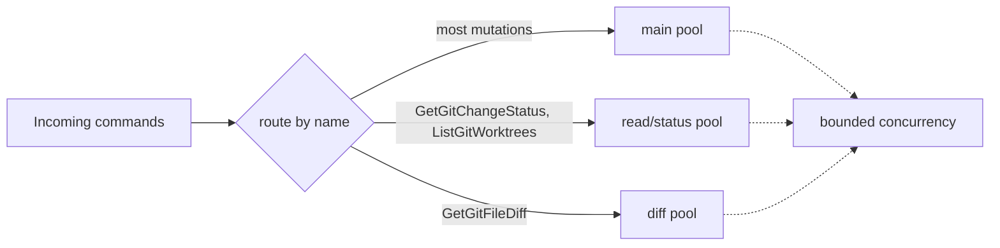
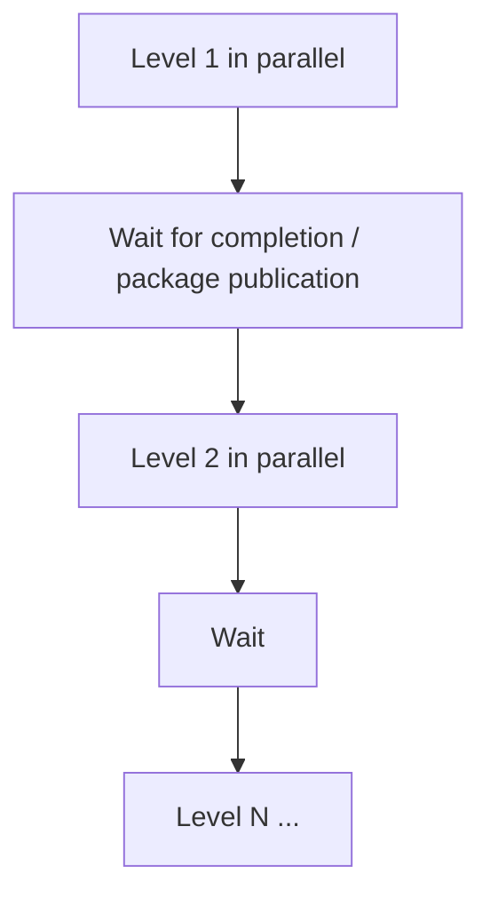
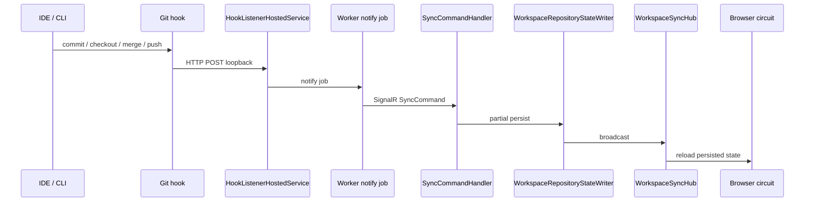
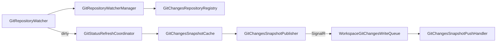
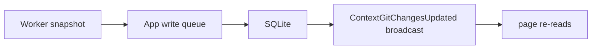

# 04 - Runtime Communication and Concurrency

## 1. App to Worker request flow

The App sends local-work commands to the Worker through SignalR.

Conceptually:


```mermaid
sequenceDiagram
  participant UI as Blazor / application operation
  participant Bridge as WorkerBridge
  participant Hub as WorkerHub
  participant Queue as Worker command queue
  participant Handler as typed command handler
  participant Delivery as WorkerResponseDelivery

  UI->>Bridge: SendCommandAsync
  Bridge->>Hub: RequestCommand(requestId, name, JSON)
  Hub->>Queue: enqueue
  Queue->>Handler: execute
  Handler->>Hub: ResponseCommand(requestId, JSON)
  Hub->>Delivery: complete
  Delivery->>Bridge: unblock awaiter
  Bridge->>UI: result
```

A unique request ID correlates response and caller.

Command terminal output is streamed separately so long-running operations can show live progress.

---

## 2. Worker job pools

The Worker uses separate bounded queues for different command categories.

Current architecture:


```mermaid
flowchart LR
  In["Incoming commands"] --> Route{"route by name"}
  Route -->|"most mutations"| Main["main pool"]
  Route -->|"GetGitChangeStatus, ListGitWorktrees"| Read["read/status pool"]
  Route -->|"GetGitFileDiff"| Diff["diff pool"]
  Main -.-> Cap["bounded concurrency"]
  Read -.-> Cap
  Diff -.-> Cap
```

Routing is by command name in `SignalRConnectionHostedService` (`ReadOnlyCommands`, `DiffCommands`); everything else goes to the main pool. Defaults: main `ProcessorCount * 2`, read 8, diff 4 (`WorkerOptions`).

This isolation matters.

A long push, restore, or repository sync should not force a user to wait behind the same queue for a diff or Git status scan.

Do not collapse these pools into one queue without a deliberate performance redesign.

---

## 3. App-side operation locking

`WorkspaceOperationRunner` is the process-wide mutation coordinator. It implements both `IWorkspaceOperationRunner` and the hierarchical `IWorkspaceOperationLock`.

The lock has two levels:

```text
structural (TryStartStructural)   whole Workspace; refused while any context mutation runs
context    (TryStartContext)      one per WorkspaceFeatureContextId; refused while a structural one runs
```

Mutations in different contexts (the special Workspace and Feature A, or Feature A and Feature B) can run concurrently. A second mutation in the same context does not start; the caller attaches to the running one.

Create Feature and Remove Feature are structural (`create-feature`, `remove-feature`). The legacy `TryStart` entry point is treated as structural.

`BackgroundJobService` picks the level from the job key: keys shaped `/workspaces/{id}/ctx/{contextId}/...` (`WorkspaceJobKeys.ContextOverlayKey`) take a context lock; other `/workspaces/{id}...` keys take the structural lock.

This protects multi-step orchestration from overlapping writes and Git operations.

`BackgroundJobService` is not the lock itself. It attaches UI/circuit job handles and overlays to process-wide operations.

---

## 4. Page jobs and cancellation

A long operation may continue after the user navigates away from the page that started it.

Therefore:

- page code must not capture disposable page state inside long-running background callbacks unless safely marshaled;
- cancellation must flow through application/Worker boundaries;
- the operation result is persisted independently from the initiating page;
- a later page can re-read the resulting persisted state.

---

## 5. Workspace parallelism

Many batch operations use `Workspace:MaxParallelOperations`.

This controls bounded fanout such as:

```text
repository sync
branch fetch
return-to-default batches
push batches
project refresh
```

Parallelism is deliberate and bounded.

Do not replace it with unrestricted `Task.WhenAll` across arbitrarily large Workspaces.

---

## 6. Dependency-ordered operations

Some operations cannot simply fan out across all repositories.

Synchronized push and dependency update work by dependency level.

Pattern:


```mermaid
flowchart TB
  L1["Level 1 in parallel"]
  W1["Wait for completion / package publication"]
  L2["Level 2 in parallel"]
  W2["Wait"]
  Ln["Level N ..."]
  L1 --> W1 --> L2 --> W2 --> Ln
```

Dependency ordering is a business rule, not a performance detail.

---

## 7. Hook-driven synchronization

GrayMoon installs Git hooks into managed repositories.

Hooks report local Git events even when changes were initiated outside GrayMoon.

End-to-end:


```mermaid
sequenceDiagram
  participant Dev as IDE / CLI
  participant Hook as Git hook
  participant Listen as HookListenerHostedService
  participant Worker as Worker notify job
  participant App as SyncCommandHandler
  participant Writer as WorkspaceRepositoryStateWriter
  participant Hub as WorkspaceSyncHub
  participant Browser as Browser circuit

  Dev->>Hook: commit / checkout / merge / push
  Hook->>Listen: HTTP POST loopback
  Listen->>Worker: notify job
  Worker->>App: SignalR SyncCommand
  App->>Writer: partial persist
  Writer->>Hub: broadcast
  Hub->>Browser: reload persisted state
```

Hook notification failure must not break the Git operation that triggered the hook.

### Context attribution

Feature worktrees share the hooks directory of the main checkout, so the hook script also sends `repositoryPath` (`git rev-parse --show-toplevel`). `WorkspaceHookContextAttributor` matches that path against the special Workspace checkout and the Feature worktree paths:

```text
matches the Workspace checkout   -> special Workspace context
matches one Feature worktree     -> that Feature context
unknown or ambiguous path        -> notification skipped (never defaulted to the Workspace)
no path (hook from older Worker) -> special Workspace context
```

`CreateGitWorktree` rewrites the hooks of the main checkout before `git worktree add`, so the `post-checkout` hook fired by the new worktree is attributed correctly.

---

## 8. Hook types

Current hook-driven synchronization covers events including:

```text
post-commit
post-checkout
post-merge
pre-push
```

Different hooks may gather different state.

For example, pre-push is intentionally not a general-purpose fetch operation.

The state writer's partial/probed-group semantics are therefore essential.

---

## 9. Git Changes watcher architecture

Git Changes uses filesystem watchers on the Worker.

Important components include:


```mermaid
flowchart LR
  Watch["GitRepositoryWatcher"] --> Mgr["GitRepositoryWatcherManager"]
  Mgr --> Reg["GitChangesRepositoryRegistry"]
  Watch -->|"dirty"| Coord["GitStatusRefreshCoordinator"]
  Coord --> Cache["GitChangesSnapshotCache"]
  Cache --> Pub["GitChangesSnapshotPublisher"]
  Pub -->|"SignalR"| Queue["WorkspaceGitChangesWriteQueue"]
  Queue --> Handler["GitChangesSnapshotPushHandler"]
```

### Watcher lifecycle

A `GetGitChangeStatus` request establishes or renews a watcher lease for a repository path.

The watcher is not permanent forever.

Leases expire after an idle grace period when the Workspace/page is no longer active.

### Watcher event

Filesystem activity does not immediately run unlimited Git status processes.

It marks the repository dirty.

`GitStatusRefreshCoordinator` debounces and coalesces events, then performs a bounded scan.

### Snapshot push

The Worker can push a fresh snapshot without waiting for an explicit page request.

The App validates version ordering and persists through the single write queue.

After a snapshot commits, `GitChangesSnapshotPushHandler` publishes to `IWorkspaceGitChangesNotifier`, the in-process singleton fan-out for persisted snapshot changes, next to the `ContextGitChangesUpdated` SignalR broadcast. Unlinking repositories from a Workspace publishes too, with the all-contexts sentinel. Circuit-side consumers such as the Changes nav dot subscribe to it instead of opening their own hub connection.

---

## 10. Git Changes activity tracking

The App tracks whether a Workspace has recently needed Git Changes monitoring.

Opening relevant pages activates monitoring.

The background service only refreshes active/recent Workspaces instead of scanning every repository forever.

This is a deliberate scalability choice.

---

## 11. Git Changes refresh

"Refresh" is not merely re-reading SQLite.

An explicit refresh ultimately requests a new Worker status scan.

When the snapshot returns:


```mermaid
flowchart LR
  A["Worker snapshot"] --> B["App write queue"]
  B --> C["SQLite"]
  C --> D["ContextGitChangesUpdated broadcast"]
  D --> E["page re-reads"]
```

`GitChangesSnapshotPushHandler` resolves the context from the reported repository path, writes the context tables, and broadcasts `ContextGitChangesUpdated(workspaceId, contextId, repositoryId)`. For the special Workspace context it also writes the legacy tables and broadcasts `GitChangesUpdated(workspaceId, repositoryId)`.

The UI remains projection-driven.

---

## 12. Git Changes mutation consistency

Stage, unstage, commit, and discard flows must converge back into the same authoritative snapshot model.

Do not maintain a permanent optimistic browser-only Git state after mutation.

Mutation result:

```text
perform Git command
obtain/refresh authoritative status
persist snapshot
notify page
```

---

## 13. Snapshot versioning

Worker snapshots carry versions.

This protects the App from persisting an older result after a newer result has already arrived.

Any new Git Changes path must preserve the monotonic/latest-wins semantics.

---

## 14. Browser activity and polling

Some pages adapt polling to browser activity.

Actions, for example, uses faster polling when actively viewed and slower polling when idle/hidden.

Git Changes watcher lifetime is a separate concept from browser active/idle/hidden state.

Do not conflate:

```text
browser tab activity
Git watcher lease activity
Worker connection status
background job activity
```

They are independent mechanisms.

---

## 15. GitHub Actions refresh

The Actions page:

```text
loads persisted state
starts background refresh
polls at activity-dependent cadence
reacts to Workspace/Repository sync broadcasts
refreshes targeted repositories
```

Dispatch/rerun operations account for GitHub eventual consistency by retrying until the new run becomes visible or the attempt budget is exhausted.

---

## 16. Connector health and remote operations

Remote operations should verify connector health when appropriate.

Git operations that contact a remote receive authentication dynamically.

Failure categories such as protected branch, unauthorized, non-fast-forward, or unavailable remote should be handled as operation outcomes, not blindly retried forever.

### Git CLI versus in-process LibGit2Sharp

The Worker runs Git two ways:

```text
LibGit2Sharp (in process, read-only, one Repository per logical operation)
  ignore evaluation                 IGitIgnoreService
  sync's local repository snapshot  ILocalGitSnapshotReader (refs, HEAD, tags, default branch, upstream, ahead/behind)

Git CLI
  network and authentication        clone, fetch, pull, push, ls-remote
  mutations                         checkout, branch, merge, commit, reset, tag, ...
  worktree changes                  git worktree add/remove
  repair operations                 origin/HEAD repair (remote set-head)
  hooks, safe.directory, GitVersion
  every other local read            IGitRepositoryReader (also sync's fallback when the snapshot cannot read a repository)
```

A LibGit2Sharp `Repository` is never cached, pooled or shared across threads, and is disposed before the operation returns. See `docs/git-lib/graymoon-libgit2sharp-local-read-design.md`.

---

## 17. SignalR browser broadcasts

WorkspaceSyncHub events are invalidation signals.

A browser handler generally:

```text
receives workspace/repository id
debounces
opens a fresh scope/query
reloads the persisted row(s)
updates UI
```

This avoids sending large domain graphs through browser broadcast events.

Current `WorkspaceSyncHub` events:

```text
ContextRepositorySynced(workspaceId, contextId, repositoryId)
ContextSynced(workspaceId, contextId)
ContextGitChangesUpdated(workspaceId, contextId, repositoryId)
RepositorySynced(workspaceId, repositoryId)       legacy
WorkspaceSynced(workspaceId)                      legacy
GitChangesUpdated(workspaceId, repositoryId)      legacy, special Workspace only
RepositoryError(workspaceId, repositoryId, message)
```

The hook path (`SyncCommandHandler`) sends the legacy `RepositorySynced` / `WorkspaceSynced` only for the special Workspace context. Many mutation paths (for example `WorkspaceStateRecomputeScope.CompleteAsync` and branch operations) still send `WorkspaceSynced` regardless of context, so context-aware listeners must filter by the selected context and treat `WorkspaceSynced` as a coarse invalidation.

---

## 18. Worker connection state

The App tracks Worker connectivity.

Operations that require local filesystem/Git access must fail clearly when no Worker is connected.

Read-only persisted UI may remain available even when the Worker is offline.

---

## 19. Error handling model

Multi-repository operations frequently produce partial failures.

GrayMoon therefore preserves:

```text
page-level error
repository-level error
dependency-level error
operation result
```

A single repository failure should not erase successful state from other repositories.

Application `OperationResult` can carry repository and level error dictionaries.

---

## 20. Concurrency rules for contributors

When adding a new operation:

1. determine whether it is read-only or mutating;
2. decide whether Workspace mutation exclusivity is required;
3. define bounded concurrency;
4. define dependency ordering if needed;
5. define cancellation propagation;
6. define persisted result/state;
7. define one batch recomputation boundary;
8. define browser invalidation;
9. avoid duplicate polling if hooks/watchers already provide a trigger.
