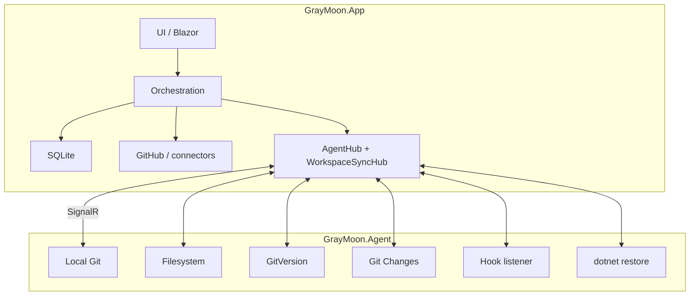
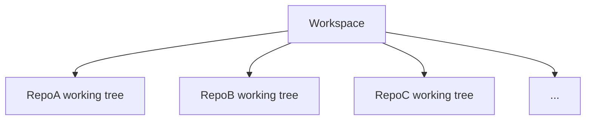
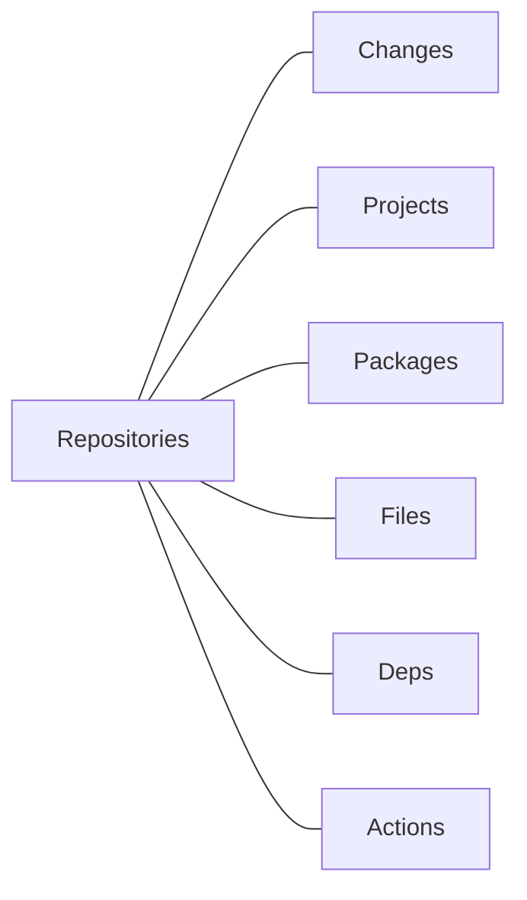

# GrayMoon Current Architecture

**State documented:** GrayMoon before worktree-backed Features  
**Code baseline reviewed through:** `b10994375a8fd7711a92e34dc4f82070e992ea46`  
**Runtime:** .NET 10, ASP.NET Core / Blazor Server, EF Core 10, SQLite, GrayMoon.Agent .NET 10

This folder is the current-state architecture reference for GrayMoon.

It replaces the older collection of feature design notes, implementation prompts, point-in-time analyses, and narrow implementation documents that accumulated under `docs/`.

The purpose is to answer four questions for a developer joining the project:

1. What problem does GrayMoon solve?
2. What can a user do with it today?
3. How are those capabilities implemented?
4. What architectural rules must be preserved when GrayMoon evolves?

This documentation intentionally describes **the current product without worktree-backed Features**. A Workspace currently has one physical checkout per repository. That single-checkout assumption is expected to change in the future Feature/worktree project, but all current user-facing behavior documented here is the compatibility baseline unless a later approved design explicitly changes it.

## Reading order

Read these documents in order:

1. [01 - Product Model and User Workflows](01-product-model-and-user-workflows.md)  
   Why GrayMoon exists, its terminology, its pages, and the main end-to-end workflows.

2. [02 - System Architecture](02-system-architecture.md)  
   Process boundaries, project layout, service layering, connectors, REST/Application boundaries, and Desktop integration.

3. [03 - Data Model and Persistence](03-data-model-and-persistence.md)  
   SQLite ownership, Workspace repository state, projects/dependencies, PR/Actions/Git Changes persistence, file configuration, and migration conventions.

4. [04 - Runtime Communication and Concurrency](04-runtime-communication-and-concurrency.md)  
   App-Agent SignalR, hook-driven synchronization, Git Changes watchers, background jobs, browser broadcasts, locking, polling, and cancellation.

5. [05 - User Capability Reference](05-user-capability-reference.md)  
   A page-by-page and operation-by-operation reference of current user functionality and the code paths behind it.

6. [06 - Developer Extension Guide](06-developer-extension-guide.md)  
   Rules for adding or changing functionality without violating GrayMoon architecture.

7. [DELETE-MANIFEST](DELETE-MANIFEST.md)  
   The recommended cleanup of the existing `docs/` tree after this replacement set is accepted.

## GrayMoon in one paragraph

GrayMoon is a control plane for multi-repository .NET development. A Workspace groups related Git repositories, discovers their projects and package relationships, calculates dependency levels, coordinates branch and Git operations across them, updates package and configured-file versions, restores and pushes in dependency order, tracks pull requests and GitHub Actions, and provides a multi-repository Git Changes experience. GrayMoon.App owns orchestration and persisted state. GrayMoon.Agent runs on the developer machine and owns all local Git and filesystem work.

## The most important architecture rule

GrayMoon is a two-process system:



GrayMoon.App must not directly operate the developer's local repositories.

## Current Workspace model

Today:



Each `WorkspaceRepositoryLink` represents membership plus the current persisted checkout projection for that repository.

Important current derived state includes:

```text
GitVersion
current branch or checked-out tag
incoming / outgoing commits
divergence from default branch
upstream state
dependency level and mismatch counts
project count / repository type
pull request state
GitHub Actions state
Git Changes status
configured-file mismatch state
```

The future worktree project will move many of these observations behind an execution-context model. Until that migration is complete, this documentation is the current behavior baseline.

## Core user surfaces

A Workspace exposes:



The Repositories page is the main operational dashboard. The remaining pages provide focused views over source control, project/package discovery, configured files, dependency relationships, and GitHub workflow state.

## Core workflows

GrayMoon's differentiating workflows are:

- coordinated Workspace branch preparation;
- dependency-aware updates across many repositories;
- synchronized push ordered by dependency level;
- package availability waiting before downstream pushes;
- configured version-file validation and update;
- multi-repository Git Changes;
- PR creation and merge across repositories;
- live GitHub Actions visibility;
- hook-driven local state synchronization.

## Documentation policy going forward

This folder should remain a **current-state reference**, not a historical archive.

When functionality changes:

- update the relevant current-state document;
- do not add a second "design v2", "implementation notes", or "analysis" document for the same feature unless it is a temporary proposal outside this architecture folder;
- delete or archive temporary implementation prompts once the feature is shipped;
- keep future proposals under a clearly separate proposal location until they become current behavior.

The goal is one coherent description of what GrayMoon is now.
