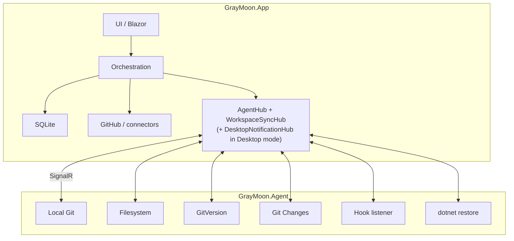
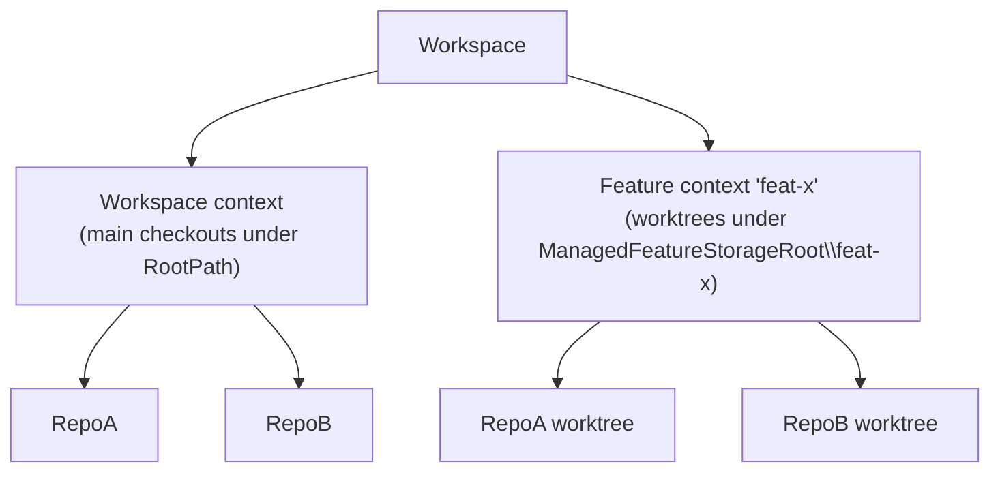
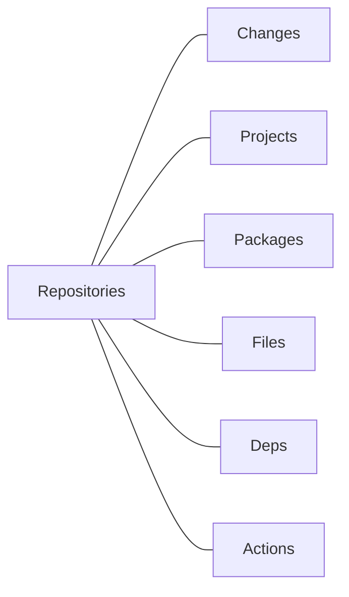

# GrayMoon Current Architecture

**State documented:** GrayMoon with worktree-backed Features  
**Code baseline reviewed through:** `b10994375a8fd7711a92e34dc4f82070e992ea46` (original set); Feature updates reviewed against `a06fe3344b4bfe10f282fd667b39fdcbd56f41fc`  
**Runtime:** .NET 10, ASP.NET Core / Blazor Server, EF Core 10, SQLite, GrayMoon.Agent .NET 10

This folder is the current-state architecture reference for GrayMoon.

It replaces the older collection of feature design notes, implementation prompts, point-in-time analyses, and narrow implementation documents that accumulated under `docs/`.

The purpose is to answer four questions for a developer joining the project:

1. What problem does GrayMoon solve?
2. What can a user do with it today?
3. How are those capabilities implemented?
4. What architectural rules must be preserved when GrayMoon evolves?

A Workspace has one main checkout per repository (the special **Workspace** context) and zero or more **Features**. A Feature is a named set of `git worktree` checkouts, one per Workspace repository, on a branch of the same name. Every Workspace page shows one context at a time. Sections that still say "the Workspace" without qualification describe the special Workspace context.

## Reading order

Read these documents in order:

1. [01 - Product Model and User Workflows](01-product-model-and-user-workflows.md)  
   Why GrayMoon exists, its terminology, its pages, and the main end-to-end workflows.

2. [02 - System Architecture](02-system-architecture.md)  
   Process boundaries, project layout, service layering, connectors, REST/Application boundaries, and Desktop integration.

3. [03 - Data Model and Persistence](03-data-model-and-persistence.md)  
   SQLite ownership, Workspace repository state, projects/dependencies, PR/Actions/Git Changes persistence, file configuration, and migration conventions.

4. [04 - Runtime Communication and Concurrency](04-runtime-communication-and-concurrency.md)  
   App-Worker SignalR, hook-driven synchronization, Git Changes watchers, background jobs, browser broadcasts, locking, polling, and cancellation.

5. [05 - User Capability Reference](05-user-capability-reference.md)  
   A page-by-page and operation-by-operation reference of current user functionality and the code paths behind it.

6. [06 - Developer Extension Guide](06-developer-extension-guide.md)  
   Rules for adding or changing functionality without violating GrayMoon architecture.

The worktree Feature design and review notes under `docs/worktree/` are historical design records, not current-state references. Where they disagree with this folder or the code, the code wins.

## GrayMoon in one paragraph

GrayMoon is a control plane for multi-repository .NET development. A Workspace groups related Git repositories, discovers their projects and package relationships, calculates dependency levels, coordinates branch and Git operations across them, updates package and configured-file versions, restores and pushes in dependency order, tracks pull requests and GitHub Actions, and provides a multi-repository Git Changes experience. GrayMoon.App owns orchestration and persisted state. GrayMoon.Agent (the Worker, executable `graymoon-worker`) runs on the developer machine and owns all local Git and filesystem work.

## The most important architecture rule

GrayMoon is a two-process system:


```mermaid
flowchart TB
  subgraph AppSide["GrayMoon.App"]
    UI["UI / Blazor"]
    Orch["Orchestration"]
    DB["SQLite"]
    GH["GitHub / connectors"]
    Hub["AgentHub + WorkspaceSyncHub<br/>(+ DesktopNotificationHub in Desktop mode)"]
  end

  subgraph AgentSide["GrayMoon.Agent"]
    Git["Local Git"]
    FS["Filesystem"]
    GV["GitVersion"]
    GC["Git Changes"]
    Hooks["Hook listener"]
    Restore["dotnet restore"]
  end

  UI --> Orch
  Orch --> DB
  Orch --> GH
  Orch --> Hub
  Hub <-->|"SignalR"| Git
  Hub <--> FS
  Hub <--> GV
  Hub <--> GC
  Hub <--> Hooks
  Hub <--> Restore
```

GrayMoon.App must not directly operate the developer's local repositories.

## Current Workspace model


```mermaid
flowchart TB
  WS["Workspace"]
  SC["Workspace context<br/>(main checkouts under RootPath)"]
  F1["Feature context 'feat-x'<br/>(worktrees under ManagedFeatureStorageRoot\\feat-x)"]
  A["RepoA"]
  B["RepoB"]
  A1["RepoA worktree"]
  B1["RepoB worktree"]
  WS --> SC
  WS --> F1
  SC --> A
  SC --> B
  F1 --> A1
  F1 --> B1
```

Each `WorkspaceRepositoryLink` represents membership plus the persisted checkout projection of the special Workspace context. Each context, including the special one, also has its own per-context projection rows keyed by `WorkspaceFeatureContextId` (see 03, section 22).

Important current derived state includes:

```text
GitVersion
current branch or checked-out tag
incoming / outgoing commits
divergence from default branch
upstream state
dependency level and mismatch counts
project count / repository type
pull request state
GitHub Actions state
Git Changes status
configured-file mismatch state
```

These observations are tracked per context. Operations always receive an explicit `WorkspaceFeatureContextId`; the selected context is carried in the page URL (`?context=<id>`; a bare Workspace URL falls back to the remembered selection, then the special Workspace).

## Core user surfaces

A Workspace exposes:


```mermaid
flowchart LR
  Repos["Repositories"]
  Changes["Changes"]
  Projects["Projects"]
  Packages["Packages"]
  Files["Files"]
  Deps["Deps"]
  Actions["Actions"]
  Repos --- Changes
  Repos --- Projects
  Repos --- Packages
  Repos --- Files
  Repos --- Deps
  Repos --- Actions
```

The Repositories page is the main operational dashboard. The remaining pages provide focused views over source control, project/package discovery, configured files, dependency relationships, and GitHub workflow state.

## Core workflows

GrayMoon's differentiating workflows are:

- coordinated Workspace branch preparation;
- dependency-aware updates across many repositories;
- synchronized push ordered by dependency level;
- package availability waiting before downstream pushes;
- configured version-file validation and update;
- multi-repository Git Changes;
- PR creation and merge across repositories;
- live GitHub Actions visibility;
- hook-driven local state synchronization;
- worktree-backed Features that run the same workflows in parallel, isolated checkouts.

## Documentation policy going forward

This folder should remain a **current-state reference**, not a historical archive.

When functionality changes:

- update the relevant current-state document;
- do not add a second "design v2", "implementation notes", or "analysis" document for the same feature unless it is a temporary proposal outside this architecture folder;
- delete or archive temporary implementation prompts once the feature is shipped;
- keep future proposals under a clearly separate proposal location until they become current behavior.

The goal is one coherent description of what GrayMoon is now.
