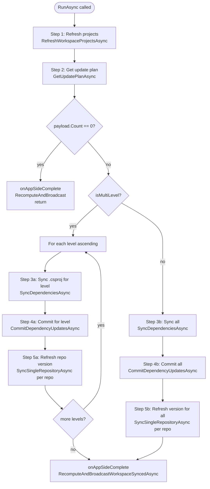
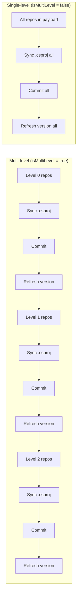
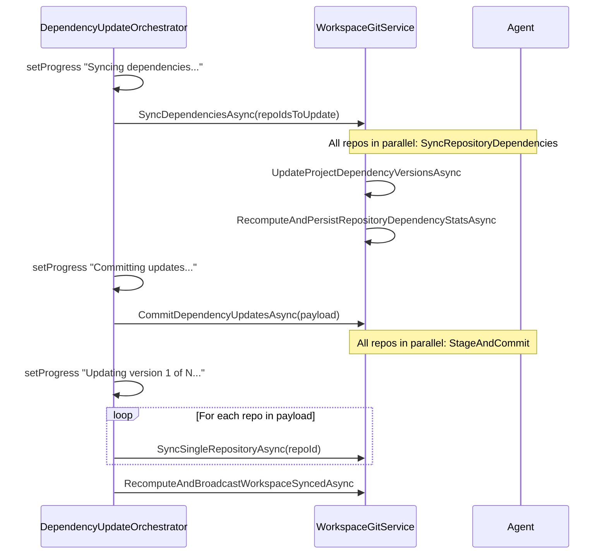

# Dependency Update: Design and Orchestration Proposal

This document describes how **csproj dependencies** and **version file dependencies** are updated today, where responsibility lies, and a proposal to unify both under a single **Dependency Update Orchestrator**.

---

## 1. Current State: Two Types of Dependencies

### 1.1 Csproj Dependencies

**What they are:** PackageReference versions in `.csproj` files. A project in repo A references a package produced by a project in repo B; the version in A’s `.csproj` should match the current version (e.g. GitVersion) of B.

**Data sources:**
- **WorkspaceProjects** — projects and their `ProjectFilePath` (path to `.csproj`), `PackageId`, `ProjectName`
- **ProjectDependencies** — dependent project → referenced project, and current `Version` in the `.csproj`
- **WorkspaceRepositoryLink.GitVersion** — current version of each repo (source of truth for “new” version)

**Mismatch rule:** For each dependency edge, `ProjectDependency.Version` ≠ referenced repo’s `GitVersion` ⇒ needs update.

| Layer | Responsibility |
|-------|----------------|
| **WorkspaceProjectRepository** | Builds update plan: `GetSyncDependenciesPayloadAsync` — which repos/projects/packages need version bumps and to what version. |
| **WorkspaceGitService** | Refresh projects from disk (`RefreshWorkspaceProjectsAsync`), get plan (`GetUpdatePlanAsync`), sync `.csproj` on disk (`SyncDependenciesAsync`), commit `.csproj` changes (`CommitDependencyUpdatesAsync`), refresh repo version and broadcast. |
| **DependencyUpdateOrchestrator** | Runs the **csproj-only** workflow: refresh → plan → (multi/single level) sync → commit → refresh version. Stateless; no UI. |
| **WorkspaceUpdateHandler** | Thin wrapper: calls orchestrator with progress/error callbacks. |
| **Agent** | `RefreshRepositoryProjects` (read `.csproj`), `SyncRepositoryDependencies` (write PackageReference versions via `ICsProjFileService.UpdatePackageVersionsAsync`), `StageAndCommit` for commits. |

**Flow (high level):**
1. Refresh: read all `.csproj` from disk → merge into `WorkspaceProjects` / `ProjectDependencies`.
2. Plan: `GetSyncDependenciesPayloadAsync` → list of repos with per-project package updates.
3. Per level (or single level): sync (agent writes `.csproj`) → commit (agent stages + commits) → refresh repo version.
4. Broadcast `WorkspaceSynced` so UI refreshes.

---

### 1.2 Version File Dependencies

**What they are:** Arbitrary files (e.g. `Directory.Build.props`, `version.json`) that contain version placeholders. The user configures a **version pattern** per file (e.g. `Version="{RepoA}"`). At update time, placeholders are replaced with current repo versions from workspace links (no GitVersion run).

**Data sources:**
- **WorkspaceFileVersionConfig** — `FileId`, `VersionPattern` (multi-line: `KEY={repositoryName}`)
- **WorkspaceRepositoryLink.GitVersion** — current version per repo (same as for csproj)
- **WorkspaceFile** — file path and repository

**“Mismatch” rule:** There is no explicit mismatch. The operation is “update all configured files with current workspace repo versions.” So it’s always “run update” if there are configs.

| Layer | Responsibility |
|-------|----------------|
| **WorkspaceFileVersionService** | Load configs, build `repoVersions` from workspace links, call agent `UpdateFileVersions` per configured file; return updated file list. |
| **WorkspaceGitService** | Commit updated paths: `CommitFilePathsAsync` (generic “stage these paths and commit” with message e.g. `chore(deps): update versions (N)`). |
| **Orchestrator** | **None.** Version-file update is not part of `DependencyUpdateOrchestrator`. |
| **UI (WorkspaceRepositories.razor.cs)** | After csproj update completes: call `RunFileVersionUpdateAndGetUpdatedFilesAsync()`; if any files updated, either auto-commit (`CommitFileVersionUpdatesAsync`) or show `VersionFilesCommitModal`. When Update is clicked and **no** csproj updates: run version-file update and show modal if there are updated files. Same for single-repo update. |
| **Agent** | `UpdateFileVersions` — in-place substitution in one file using pattern + `repoVersions`. |

**Flow (high level):**
1. No plan step: all configured files are candidates.
2. For each config: agent replaces `{repoName}` tokens with current versions; returns updated file paths.
3. UI collects updated files, then either commits them (via `WorkspaceGitService.CommitFilePathsAsync`) or shows a modal for user to confirm commit.

---

## 2. How GetUpdatePlanAsync Works (Detailed)

`GetUpdatePlanAsync` is the entry point that decides **which repositories need csproj dependency updates** and whether the update is **single-level** or **multi-level**. It delegates the actual plan building to the repository and then filters and classifies the result.

### 2.1 Signature and Location

- **Location:** `WorkspaceGitService.GetUpdatePlanAsync(int workspaceId, IReadOnlySet<int>? repositoryIds, CancellationToken)`
- **Returns:** `(IReadOnlyList<SyncDependenciesRepoPayload> Payload, bool IsMultiLevel)`
  - **Payload:** One entry per repository that has at least one project with mismatched package references. Each entry includes repo id/name, dependency level, and a list of project updates (path + list of package id → current/new version).
  - **IsMultiLevel:** `true` when the payload spans more than one distinct `DependencyLevel`; `false` when zero or one level. Drives whether the orchestrator runs per-level (sync → commit → refresh per level) or one batch (sync all → commit all → refresh all).

### 2.2 Call Chain

```
GetUpdatePlanAsync(workspaceId, repositoryIds?, ct)
  → WorkspaceProjectRepository.GetSyncDependenciesPayloadAsync(workspaceId, ct)
  → filter: payloads where ProjectUpdates.Count > 0
  → filter: if repositoryIds set, keep only repos in that set
  → if no entries left → return ([], false)
  → levelsWithUpdates = distinct DependencyLevel from payload
  → isMultiLevel = (levelsWithUpdates.Count > 1)
  → return (withUpdates, isMultiLevel)
```

### 2.3 GetSyncDependenciesPayloadAsync (Repository Layer)

This method builds the full list of **repos that have at least one PackageReference version mismatch** with the referenced repo’s current GitVersion. Steps:

1. **Load current repo versions**  
   Query `WorkspaceRepositories` for the workspace → `(RepositoryId, GitVersion)`. Build `versionByRepo`: repo id → version string (source of truth for “new” version).

2. **Load all workspace projects**  
   Query `WorkspaceProjects` (with `Repository`) for the workspace. Build `byProject`: project id → project (includes `ProjectFilePath`, `PackageId`, `ProjectName`, `RepositoryId`). If no projects, return empty list.

3. **Load dependency edges**  
   Query `ProjectDependencies` for edges where both dependent and referenced project are in the workspace. Each row: `DependentProjectId`, `ReferencedProjectId`, `Version` (the version currently in the dependent’s .csproj).

4. **Build repo → project → package updates**  
   For each dependency edge:
   - Resolve dependent project and referenced project from `byProject`.
   - **Referenced version:** `refVersion = versionByRepo[referencedProject.RepositoryId]`.
   - **Dependent version:** `depVersion = dependency.Version` (from DB, i.e. from .csproj).
   - If `depVersion == refVersion` or `refVersion` is empty → skip (no update).
   - **PackageId:** referenced project’s `PackageId` if set, else `ProjectName`.
   - **Project path:** dependent project’s `ProjectFilePath` (path to .csproj).
   - Accumulate per repo: `repoToProjectUpdates[depProj.RepositoryId][projectPath][packageId] = (depVersion, refVersion)`.

5. **Load dependency levels**  
   Query `WorkspaceRepositories` for the workspace → `(RepositoryId, DependencyLevel)`. Level is computed earlier (e.g. by `MergeWorkspaceProjectDependenciesAsync(persistDependencyLevel: true)` or `RecomputeAndPersistRepositoryDependencyStatsAsync`) from the project dependency graph: repos that depend only on repos at lower levels get a higher level; level 0 = no workspace dependencies.

6. **Build result list**  
   For each repo that has at least one project with updates in `repoToProjectUpdates`:
   - Build `SyncDependenciesProjectUpdate` per project path: list of `(PackageId, CurrentVersion, NewVersion)`.
   - Add `SyncDependenciesRepoPayload(RepoId, RepoName, DependencyLevel, ProjectUpdates)`.
   - Sort by repo name (case-insensitive).

Result: list of repos with at least one mismatched dependency, each with its level and the exact project/package updates to apply.

### 2.4 Data Flow Diagram: GetUpdatePlanAsync / GetSyncDependenciesPayloadAsync

```mermaid
flowchart TB
    subgraph Input["Input"]
        WID[workspaceId]
        RIDS[repositoryIds optional]
    end

    subgraph WGS["WorkspaceGitService.GetUpdatePlanAsync"]
        GSP[GetSyncDependenciesPayloadAsync]
        F1[Filter: ProjectUpdates.Count > 0]
        F2[Filter: repo in repositoryIds if set]
        LV[levelsWithUpdates = distinct DependencyLevel]
        IM[isMultiLevel = levelsWithUpdates.Count > 1]
    end

    subgraph WPR["WorkspaceProjectRepository.GetSyncDependenciesPayloadAsync"]
        Q1[Query WorkspaceRepositories → versionByRepo]
        Q2[Query WorkspaceProjects → byProject]
        Q3[Query ProjectDependencies]
        Q4[Query WorkspaceRepositories → linkLevelByRepo]
        LOOP[For each dependency edge]
        MATCH{depVersion != refVersion?}
        ACC[Accumulate repo→project→package updates]
        BUILD[Build SyncDependenciesRepoPayload per repo]
    end

    subgraph DB[(Database)]
        WR[WorkspaceRepositories]
        WP[WorkspaceProjects]
        PD[ProjectDependencies]
    end

    WID --> GSP
    GSP --> Q1
    Q1 --> WR
    Q2 --> WP
    Q3 --> PD
    Q2 --> LOOP
    Q3 --> LOOP
    Q1 --> LOOP
    LOOP --> MATCH
    MATCH -->|yes| ACC
    ACC --> Q4
    Q4 --> WR
    Q4 --> BUILD
    BUILD --> GSP
    GSP --> F1
    F1 --> F2
    F2 --> LV
    LV --> IM
    IM --> Output["(Payload, IsMultiLevel)"]
```

### 2.5 Example

- Workspace has RepoA (level 0), RepoB (level 1), RepoC (level 1). RepoB and RepoC reference RepoA. GitVersion of RepoA is `2.0.0`; RepoB’s .csproj has `1.0.0`. Then:
  - `GetSyncDependenciesPayloadAsync` returns one payload: RepoB, level 1, one project update (path to RepoB’s .csproj, package RepoA → current `1.0.0`, new `2.0.0`).
  - `GetUpdatePlanAsync` filters to repos with updates (RepoB only), distinct levels = [1] → `IsMultiLevel = false`. Single-level update: sync RepoB, commit RepoB, refresh RepoB.

---

## 3. How the Update Is Executed (Charts)

### 3.1 High-Level Orchestrator Flow



### 3.2 Multi-Level vs Single-Level Execution



### 3.3 Per-Level Steps (Multi-Level Detail)

```mermaid
sequenceDiagram
    participant Orch as DependencyUpdateOrchestrator
    participant WGS as WorkspaceGitService
    participant Agent as Agent (SignalR)
    participant Disk as .csproj on disk

    loop For each level (0, 1, 2, ...)
        Orch->>Orch: setProgress "Updating N repositories..."
        Orch->>WGS: SyncDependenciesAsync(repoIdsAtLevel)
        WGS->>WGS: GetSyncDependenciesPayloadAsync (plan already from step 2)
        WGS->>Agent: SyncRepositoryDependencies (per repo, parallel)
        Agent->>Disk: UpdatePackageVersionsAsync (write .csproj)
        Agent-->>WGS: response
        WGS->>WGS: UpdateProjectDependencyVersionsAsync (persist new versions)
        WGS->>WGS: RecomputeAndPersistRepositoryDependencyStatsAsync

        Orch->>Orch: setProgress "Committing..."
        Orch->>WGS: CommitDependencyUpdatesAsync(reposAtLevel)
        WGS->>Agent: StageAndCommit (.csproj paths, message)
        Agent-->>WGS: response

        Orch->>Orch: setProgress "Updating version 1 of N..."
        loop For each repo at level
            Orch->>WGS: SyncSingleRepositoryAsync(repoId)
            WGS->>Agent: Get version / refresh repo state
            Agent-->>WGS: GitVersion etc.
            WGS->>WGS: Persist versions, recompute stats
        end
    end
    Orch->>WGS: RecomputeAndBroadcastWorkspaceSyncedAsync
```



### 3.4 Single-Level Execution (Sequence)



---

## 4. Where Responsibility Lives Today

- **Csproj update workflow** is orchestrated in one place: `DependencyUpdateOrchestrator` → `WorkspaceGitService` (refresh, sync, commit, refresh version). Clear chain: Handler → Orchestrator → GitService/Repository.
- **Version file update** has **no orchestrator**. The **page** (`WorkspaceRepositories.razor.cs`) owns when to run it (after csproj update, or when Update with no csproj updates, or single-repo update) and whether to commit or show the modal. Logic is duplicated and spread across:
  - `RunUpdateCoreAsync` (after orchestrator: run file version update → if updated files → commit)
  - `OnUpdateClickAsync` (if no csproj payload: run file version update → if updated files → show modal)
  - Single-repo update (after update: run file version update → if updated files → show modal)
  - `TryUpdateFileVersionsAsync` / `CommitFileVersionUpdatesAsync` (commit path and post-commit refresh)

So:
- **Csproj:** orchestration in app service layer; UI only triggers and shows progress.
- **Version files:** orchestration in UI; service layer only does “update all” and “commit these paths.”

---

## 5. What Can Be Improved

1. **Single place for “dependency update”**  
   Conceptually, “Update dependencies” should mean “update csproj **and** version files” in one policy. Today that policy is implemented in the page in multiple branches.

2. **Consistent commit policy**  
   Csproj: always commit per level (orchestrator). Version files: sometimes auto-commit (after full update), sometimes modal (after single-repo or when no csproj updates). Unifying under one orchestrator allows one configurable policy (e.g. “always commit both” or “always show modal for version files”).

3. **Less UI logic**  
   The page should trigger “run full dependency update” and show progress/errors; it should not decide the order of “csproj then version files” or “commit version files or show modal.” That belongs in a service/orchestrator.

4. **Easier to test**  
   One orchestrator that runs refresh → csproj plan → csproj sync/commit per level → version-file update → version-file commit (or modal) can be unit/integration tested without the UI.

5. **Clearer progress**  
   One progress callback can report “Refreshing…”, “Updating .csproj…”, “Committing .csproj…”, “Updating version files…”, “Committing version files…” in order.

6. **Reuse of “commit these paths”**  
   Both flows already use the same agent command `StageAndCommit`. The orchestrator can call the same `CommitFilePathsAsync` for version-file paths after running version-file update, so commit behavior stays consistent.

---

## 6. Proposal: Single Dependency Update Orchestrator

### 6.1 Goal

- One entry point for “update dependencies” (csproj + version files).
- Orchestrator owns: refresh → csproj plan → csproj sync/commit per level → version-file update → version-file commit (or hand back to UI for modal).
- UI only: start update, show progress/errors, and optionally show a modal for version-file commit when the orchestrator reports “updated version files; confirm to commit.”

### 6.2 Orchestrator Contract (Extended)

Current:

- `DependencyUpdateOrchestrator.RunAsync(workspaceId, cancellationToken, setProgress, onRepoError, onAppSideComplete, repoIdsToUpdate?)`  
  — runs only the **csproj** flow.

Proposed:

- Same method name, but **steps** become:
  1. **Refresh projects** (unchanged).
  2. **Get csproj update plan** (unchanged). If empty, skip to step 5 (version files).
  3. **Csproj sync + commit per level** (unchanged). For each level: sync → commit → refresh version.
  4. **Recompute and broadcast** after csproj (so grid is up to date before version-file update).
  5. **Version-file update:** call `WorkspaceFileVersionService.UpdateAllVersionsAsync` (optionally scoped to `repoIdsToUpdate`). If no configs, skip.
  6. **Version-file commit policy:**
     - **Option A (simple):** If any version files were updated, call `WorkspaceGitService.CommitFilePathsAsync` from inside the orchestrator (same as today’s auto-commit after full update). No modal; one consistent behavior.
     - **Option B (flexible):** If any version files were updated, do **not** commit; invoke a new callback e.g. `onVersionFilesUpdated(byRepo)` and return. UI shows `VersionFilesCommitModal`; on confirm, UI calls a new method e.g. `CommitVersionFileUpdatesAsync(byRepo)` (thin wrapper around `CommitFilePathsAsync`). Orchestrator stays stateless and does not need to know about the modal.

Recommendation: **Option B** for backward compatibility with “confirm before committing version files” in single-repo and “no csproj updates” flows. Option A can be a setting later (“Always auto-commit version files”).

### 6.3 Where Each Piece Lives

| Responsibility | Current | Proposed |
|----------------|--------|----------|
| Refresh projects | Orchestrator → WorkspaceGitService | Unchanged |
| Csproj plan | Orchestrator → WorkspaceGitService.GetUpdatePlanAsync | Unchanged |
| Csproj sync/commit per level | Orchestrator → WorkspaceGitService | Unchanged |
| Version-file update | UI → WorkspaceFileVersionService | **Orchestrator** → WorkspaceFileVersionService |
| Version-file commit | UI (CommitFileVersionUpdatesAsync or modal) | **Orchestrator** calls callback with updated files, or commits (Option A); UI only shows modal if Option B and callback invoked |
| Progress messages | Orchestrator setProgress | Add “Updating version files…”, “Committing version files…” (or “Updated N version files; confirm to commit”) |

### 6.4 Dependency Injection

- `DependencyUpdateOrchestrator` today depends on `WorkspaceGitService` and `IOptions<WorkspaceOptions>`.
- Add `WorkspaceFileVersionService` (and, for Option B, no extra dependency for modal — just a callback).
- Orchestrator stays in App layer; no UI types. Callback `onVersionFilesUpdated(byRepo)` can be a simple delegate so the page can pass a method that opens the modal and stores `byRepo` for commit on confirm.

### 6.5 UI Changes

- **WorkspaceRepositories.razor.cs:**
  - **Update (full):** One path: call `WorkspaceUpdateHandler.RunUpdateAsync` (which calls the extended orchestrator). Pass `onVersionFilesUpdated` that sets modal state and shows `VersionFilesCommitModal`. Remove duplicate “run file version update after update” and “if no csproj run file version update” branches; orchestrator does both.
  - **Single-repo update:** Same: call orchestrator with `repoIdsToUpdate: { repositoryId }`. Orchestrator runs csproj (if any) then version-file update; if version files updated, same callback → modal.
  - **OnUpdateClickAsync:** Get plan only to decide “multi-level modal” for csproj. If plan empty, still call orchestrator (orchestrator will do only version-file update and then callback or commit). So “Update” always goes through the orchestrator; no separate “only version files” branch in the page.
- **VersionFilesCommitModal:** Unchanged. On Proceed, call existing `CommitFileVersionUpdatesAsync` (which uses `WorkspaceGitService.CommitFilePathsAsync`). Optionally call `TryUpdateFileVersionsAsync` + refresh after commit (already present).

### 6.6 Order of Operations (Proposed)

```
1. setProgress("Refreshing projects...")
2. RefreshWorkspaceProjectsAsync
3. GetUpdatePlanAsync (csproj)
4. If payload.Count > 0:
   - Per level (or single): SyncDependenciesAsync → CommitDependencyUpdatesAsync → refresh repo version
   - RecomputeAndBroadcastWorkspaceSyncedAsync
5. setProgress("Updating version files...")
6. FileVersionService.UpdateAllVersionsAsync (optionally repoIdsToUpdate)
7. If updatedFiles.Count > 0:
   - Option A: CommitFilePathsAsync(byRepo) then setProgress("Committed version files.")
   - Option B: onVersionFilesUpdated(byRepo); UI shows modal; on confirm, UI calls CommitFilePathsAsync
8. onAppSideComplete / RecomputeAndBroadcast if needed
```

### 6.7 Backward Compatibility

- If there are no version configs, step 6 returns no updated files; step 7 is skipped. Behavior matches “csproj only.”
- If there are no csproj updates but there are version configs, step 4 is skipped, step 6 runs, step 7 runs — “version files only” is just a subset of the same flow.
- Single-repo: same orchestrator with `repoIdsToUpdate: { id }`; version-file update can be scoped to that repo in `UpdateAllVersionsAsync(selectedRepositoryIds: repoIdsToUpdate)`.

---

## 7. Summary

| Topic | Csproj dependencies | Version file dependencies |
|-------|---------------------|---------------------------|
| **Data** | WorkspaceProjects, ProjectDependencies, GitVersion | WorkspaceFileVersionConfig, GitVersion |
| **Plan** | GetSyncDependenciesPayloadAsync (mismatch vs GitVersion) | None (update all configured files) |
| **Apply** | SyncRepositoryDependencies → ICsProjFileService | UpdateFileVersions per file |
| **Commit** | CommitDependencyUpdatesAsync (.csproj paths + message) | CommitFilePathsAsync (any paths + message) |
| **Orchestration today** | DependencyUpdateOrchestrator | UI only |
| **Orchestration proposed** | Same orchestrator | Same orchestrator; one flow: csproj then version files; one commit policy or callback for version files |

This keeps the code simple and human-readable: one place defines “what a full dependency update is,” and the UI only starts it and reacts to progress and optional modal for version-file commit.
