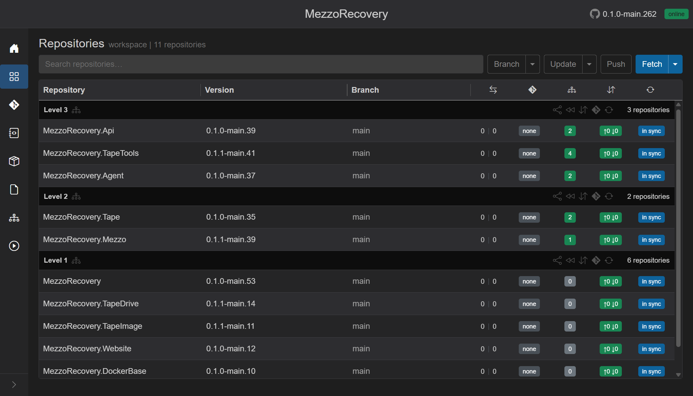
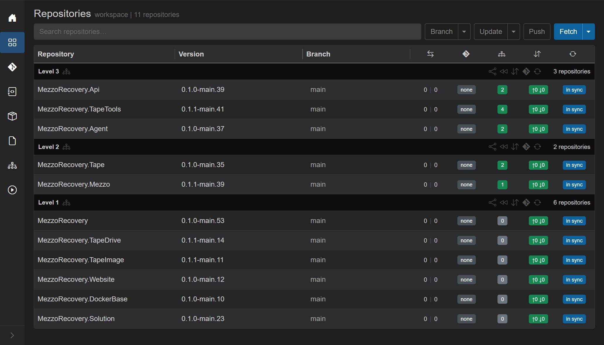

# Layout

GrayMoon's chrome is three bands: the **left sidebar**, the **top bar**, and the **main page**. Collapsing the sidebar (and, in GrayMoon Desktop, hiding the top bar) is how you give the grid more horizontal space.

## Sidebar

Always present. Expanded it is a labeled nav (~180px). Collapsed it is icons only (~3.5rem), with the same routes and the same active highlight.

- **Brand** (expanded only) - moon icon + "GrayMoon". Clicking it goes to Home (`/`). Hidden when collapsed.
- **Nav items** - first-level pages, or workspace pages once you open a workspace. See [shared.md](shared.md#sidebar-navigation) for the two item sets.
- **Toggle** - chevron at the bottom of the sidebar (`Toggle sidebar`). Click to collapse to icons; click again to expand. The chevron flips direction when collapsed. The choice is stored as `Sidebar.Collapsed` and survives reload.

On MezzoRecovery Repositories, collapsing the sidebar leaves the 11-repo grid (search, Fetch, Level groups, all badge columns) on almost the full width:

Hover a collapsed icon for the same tooltip / aria name as the expanded label (Repositories, Changes, Deps, ...).

## Top bar

The top bar sits above the main page (not inside the sidebar):

- **Workspace title** (workspace pages only) - large clickable name. Goes to `/workspaces`.
- **GitHub** icon - `https://github.com/Jandini/GrayMoon` (new tab).
- **App version** - for example `0.1.0-main.262`.
- **Agent badge** - `online` / `running` / `offline` / ... ([shared.md](shared.md#agent-status-badge)).

Hiding this entire top bar is a **GrayMoon Desktop** feature (tray toggle). It is not in the web UX. When Desktop hides it, the page uses `page--topbar-hidden` so the sidebar brand row is also CSS-hidden and the grid uses the leftover height.

Same MezzoRecovery Repositories page with the sidebar collapsed **and** the top bar hidden - no workspace name, GitHub link, version, or agent badge in a header strip. The grid starts at the top of the window:

