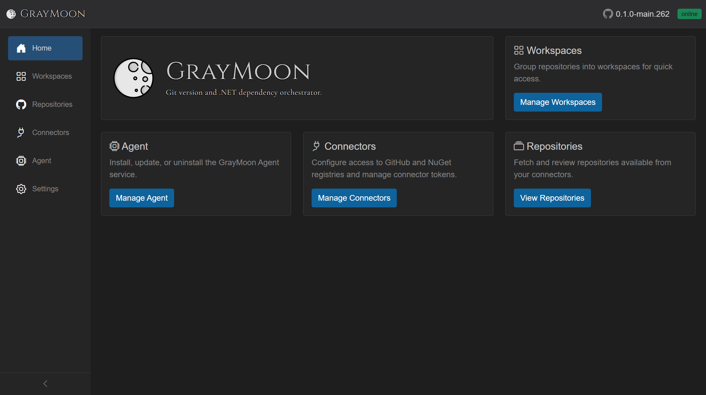
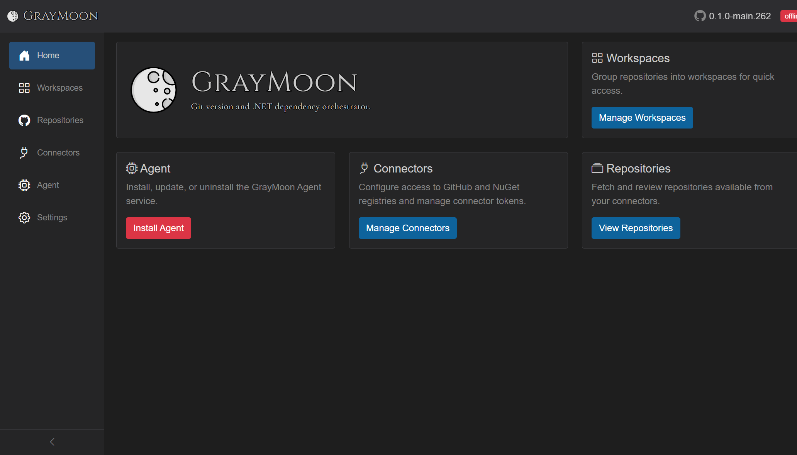
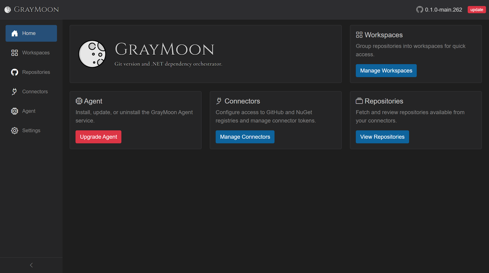

# Home

Route: `/`

## Purpose

Landing tiles that describe each first-level area and jump the user there in one click.

## Default-workspace redirect

On the first visit in a browser tab, if a workspace is marked **Default**, Home does not stay visible: the app navigates to that workspace's Repositories page (`/workspaces/{id}`). A session flag prevents this from looping when you click Home later in the same tab. After that, Home is shown normally.

While deciding, the page shows a muted "Loading..." line.

## Banner

- GrayMoon moon logo.
- Title: **GrayMoon**.
- Subtitle: **Git version and .NET dependency orchestrator.**

## Tiles

Each tile has an icon, title, one-line description, and a button.

### Workspaces

- Description: "Group repositories into workspaces for quick access."
- Button: **Manage Workspaces** (blue) -> `/workspaces`

### Agent

- Description: "Install, update, or uninstall the GrayMoon Agent service."
- Button label and color depend on agent connection (same meaning as the [agent status badge](shared.md#agent-status-badge)):

| Agent state | Button text | Button color |
| --- | --- | --- |
| Online | Manage Agent | blue (primary) |
| Version mismatch | Upgrade Agent | red |
| Offline / connecting / anything else | Install Agent | red |

When the Agent is not installed, Home looks like this (red **Install Agent**, red **offline** badge):

When the Agent is connected but its version does not match the App, the tile is red **Upgrade Agent** and the top-bar badge is red **update**:

**Upgrade Agent** goes to `/agent` (Update tab). Clicking the **update** badge starts a self-update instead of navigating - see [Agent - Self-update from the badge](05-agent.md#self-update-from-the-badge).

- Click the tile -> `/agent`

### Connectors

- Description: "Configure access to GitHub and NuGet registries and manage connector tokens."
- Button: **Manage Connectors**
- Color: **red** if any connector that is in use is unhealthy; otherwise blue.
- Click -> `/connectors`

### Repositories

- Description: "Fetch and review repositories available from your connectors."
- Button: **View Repositories** (blue) -> `/repositories`

The tiles sit in a two-row layout: banner + Workspaces on the first row, Agent / Connectors / Repositories on the second.
