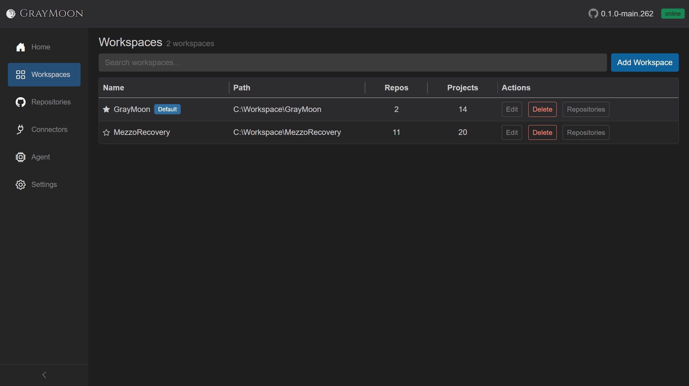

# Workspaces

Route: `/workspaces`

List of all workspaces. Opening a workspace name switches the sidebar to the [workspace pages](workspace/repositories.md).

## Header

- Title: **Workspaces**
- Subtitle count: `N workspace(s)` or `N workspace(s) found` when a search is active; `0 workspaces` when empty.
- [Filter search](shared.md#filter-search-shared) - placeholder "Search workspaces…". Disabled when there are no workspaces.
- **Add Workspace** (blue) - opens the Add Workspace modal. Creating a workspace requires a connected Agent and a configured workspace root path (Settings).

## Search fields

Plain terms match **name**, **path**, **repo count**, and **project count**.

Field prefix:

- `path:` - match only the displayed filesystem path.

See [shared.md](shared.md) for `and` / `or` / coloring.

Empty match: "No workspaces match your search."

Never-created: "No workspaces found. Add your first workspace to get started."

Load failure: red alert with triangle icon.

## Grid columns

| Column | What it shows | Interaction |
| --- | --- | --- |
| Name | Star, workspace name (link), optional **Default** badge | Star toggles default. Name opens `/workspaces/{id}` |
| Path | Absolute folder: `{root}\{WorkspaceName}` (or the workspace's own root) | Display only; truncated with ellipsis |
| Repos | Count of linked repositories | Display only |
| Projects | Sum of `.csproj` project counts across those repos | Display only |
| Actions | **Edit**, **Delete**, **Repositories** | See below |

Columns are resizable.

### Default star

- Hollow star: not default. Click to make this workspace the default (and clear any previous default).
- Filled star + blue **Default** badge: this is the default. Click the star to unset it.
- Tooltip: "Toggle default workspace".
- Default workspace is the one Home redirects to on first visit of a tab.

### Row actions

- **Edit** - opens Edit Workspace modal (same fields as Add).
- **Delete** - confirmation modal: "Delete workspace **{name}**?" Buttons: Cancel, **Delete** (red, spinner while deleting). Escape cancels, Enter confirms.
- **Repositories** - opens the select-repositories modal for that workspace (not the nested Repositories page). Title: "Select repositories for {name}".

## Add / Edit Workspace modal

- Title: **Add Workspace** or **Edit Workspace**.
- **Workspace Name** (required, focused on open). Typing updates the path live.
- **Workspace Path** (read-only) - computed from Settings root path + name.
- Yellow warning if that directory already exists: "The workspace directory exists with N repository/repositories."
- Red error if Agent is offline ("Agent is not available. Please start the GrayMoon Agent to add workspaces.") or root path is missing ("Workspace root path is not configured. Go to Settings...").
- Save is disabled while the Agent is disconnected (create only), while saving, or while the directory check is in flight.
- Escape cancels, Enter saves.
- After save, if matching clone URLs already exist in the catalog, **Import Repositories** modal: "Found N repositories in this workspace that match your existing repositories by URL." **No** / **Yes, import**.

## Select repositories modal

Opened from the row **Repositories** button, or from the nested workspace Repositories subtitle count.

- Header: selected count "N selected".
- Switch: **Selected only** - hide unselected rows.
- [Filter search](shared.md#filter-search-shared) - "Search repositories…" (same fields as the catalog: name, owner, topics, connector; `topic:` prefix).
- **Fetch** - refreshes from GitHub connectors. Shows the [loading overlay](shared.md#loading-overlay) ("Fetching repositories..." / "Fetched N repositories") with Abort. Requires at least one connector.
- Grid: checkbox (including header select-all of the filtered set), Repository, Owner, Topics (topic badges), Connector.
- Empty states: no connectors, nothing fetched yet, or no search matches.
- Rename warnings if GitHub renamed repos during fetch.
- Save requires at least one selected repository.
- Escape closes.

## Opening a workspace

Clicking the workspace **name** (not the Repositories action button) goes to `/workspaces/{id}` and swaps the sidebar to Home / Repositories / Changes / Projects / Packages / Files / Deps / Actions. The top bar then shows the workspace name. See [workspace/repositories.md](workspace/repositories.md).
