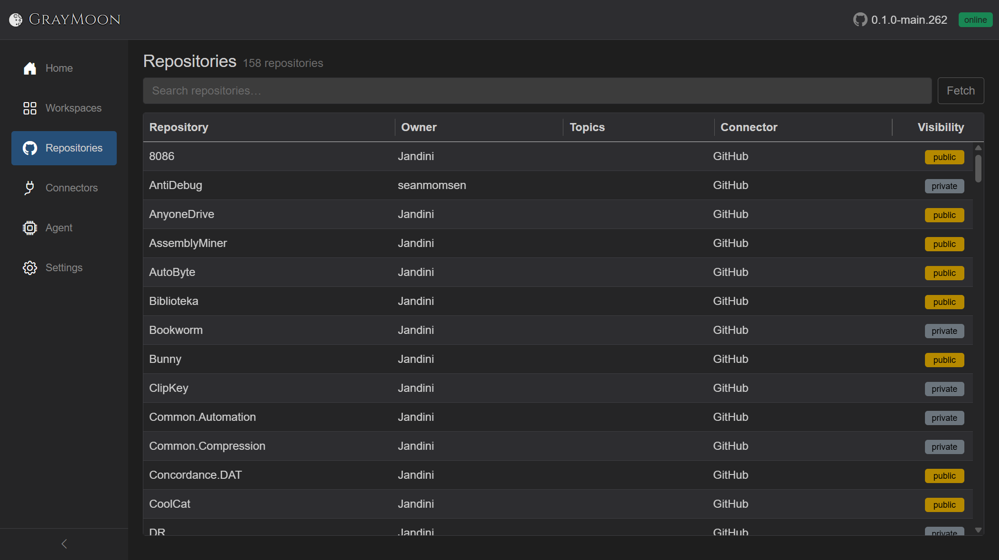

# Repositories (catalog)

Route: `/repositories`

This is the **global catalog** of GitHub repositories discovered through connectors. It is not the per-workspace Repositories grid.

## Header

- Title: **Repositories**
- Subtitle: `N repository/repositories` or `N ... found` when searching.
- [Filter search](shared.md#filter-search-shared) - placeholder "Search repositories…". Disabled only during the very first load.
- **Fetch** - pulls repositories from all GitHub connectors. Shows the [loading overlay](shared.md#loading-overlay) with live count ("Fetching repositories..." then "Fetched N repositories") and **Abort**.

## Search fields

Plain terms match **repository name**, **owner**, **topics**, and **connector name**.

Field prefix:

- `topic:` - match only the topics string.

See [shared.md](shared.md) for operators and coloring.

Empty match: "No repositories match your search."

No catalog yet: "No repositories found. Configure GitHub connectors to fetch repositories."

## Alerts (above the grid)

- **GitHub connector error(s)** (red, dismissible) - one bullet per connector: `ConnectorName: message`.
- **Repository rename detected** (yellow, dismissible) - "The following repositories were renamed in GitHub and updated automatically:" then `Org / OldName -> NewName`.

## Grid columns

Virtual-scrolled (large catalogs stay smooth). Columns are resizable.

| Column | What it shows |
| --- | --- |
| Repository | Repository name (strong) |
| Owner | Org / user, or `-` if empty |
| Topics | One pill badge per comma-separated topic |
| Connector | Connector name that fetched it |
| Visibility | Status badge: **public** (yellow), **private** (dark), or **archived** if the repo is archived |

There is no row click-through from this catalog. To put a repo into a workspace, use Workspaces -> row **Repositories** (select-repositories modal).
