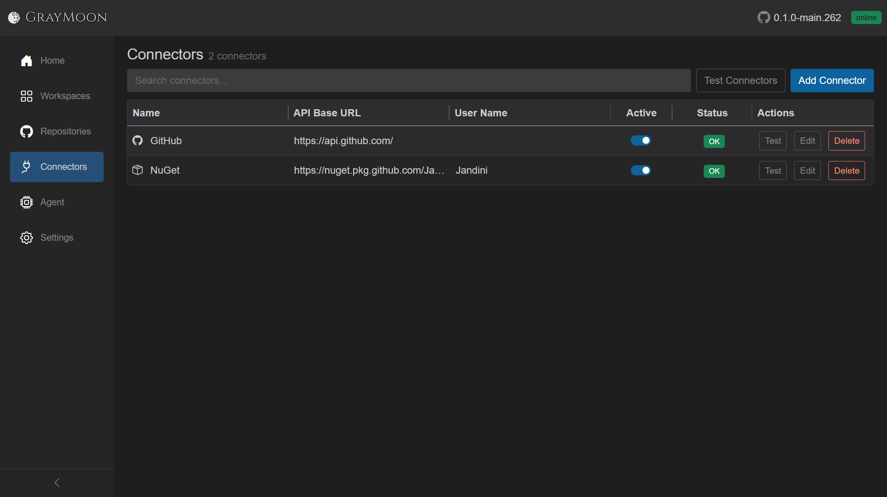
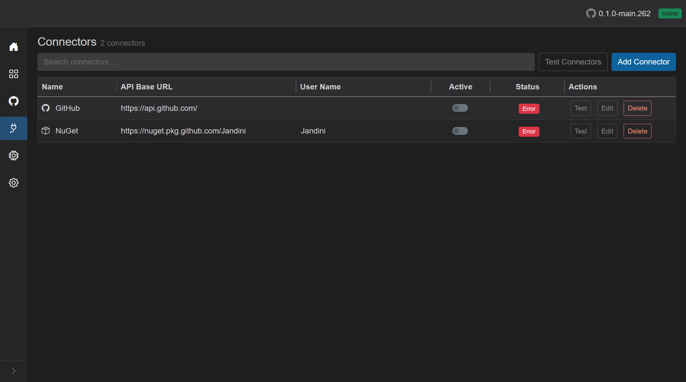
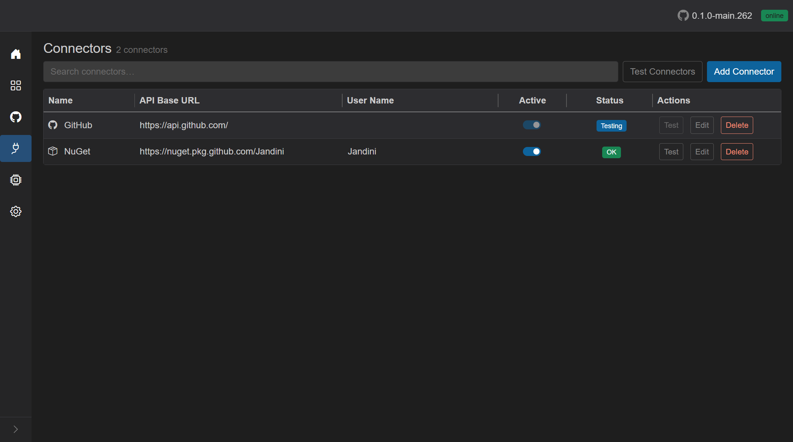
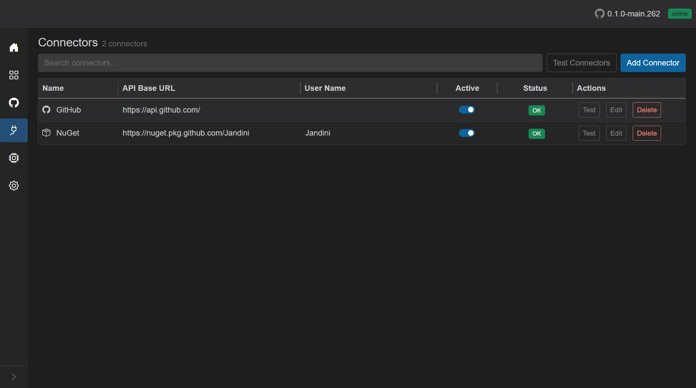

# Connectors

Route: `/connectors`

GitHub and NuGet credentials used to fetch repositories, packages, and GitHub Actions. **GrayMoon needs working connectors** (Active + **OK**) before those features run; see [getting started - prerequisites](getting-started/README.md#before-graymoon-can-do-real-work).

## Header

- Title: **Connectors**
- Subtitle: `N connector(s)` or `N connector(s) found`.
- [Filter search](shared.md#filter-search-shared) - placeholder "Search connectors…". Disabled when the list is empty.
- **Test Connectors** - tests every connector in parallel. Disabled while a test-all is running or when there are no connectors. Each row status becomes **Testing** then **OK** or **Error**.
- **Add Connector** (blue) - create modal.

## Search fields

Plain terms match **name**, **API base URL**, **user name**, **type** (GitHub/NuGet), and **status**.

Field prefixes:

- `type:` - GitHub or NuGet
- `status:` - Testing, Ok, Error, etc.

Empty match: "No connectors match your search."

Empty list: "No connectors found. Add your first connector to get started."

## Grid columns

| Column | What it shows | Interaction |
| --- | --- | --- |
| Name | Type icon + connector name | GitHub = octocat, NuGet = box |
| API Base URL | Endpoint | Display |
| User Name | Account associated with the token | Display (may be empty) |
| Active | Switch | On = used; turning on runs a test and turns back off if the test fails. Disabled while that row is busy |
| Status | Badge | Tooltip is the last error or "Connection OK." / "Testing connection..." / "Not tested yet." |
| Actions | **Test**, **Edit**, **Delete** | Disabled while that connector is testing or toggling |

### Status badges

| Status | Label | Meaning |
| --- | --- | --- |
| Testing | Testing | Connection check in progress |
| Ok | OK | Last test succeeded (green) |
| Error | Error | Last test failed (red). Tooltip = `LastError`. A connector-fault failure also deactivates the switch |
| anything else | Unknown | Not tested yet |

A used connector in Error is what turns the Home **Manage Connectors** button red.

## Inactive connectors and Error status

Connectors have an **Active** switch. A connector can be **inactive** (switch off) while still showing a previous **Error** badge from an earlier failed test.

In this example both connectors are **inactive** and their last connection test failed, so the **Status** column shows red **Error** badges. Hover the badge to read the last error message in the tooltip.

### What inactive means

When a connector is **inactive**:

- GrayMoon does not use it for operations that need credentials (fetch repositories, resolve package availability during synchronized push, GitHub Actions data, and similar).
- A background token health check records the state as **Connector is inactive.**

When GrayMoon needs that connector, it blocks the operation and shows:

`Connector '{name}' is inactive. Activate or update it on the Connectors page.`

### Activating and testing

Turn a connector back on with the **Active** switch. GrayMoon saves the active state, then **runs a connection test automatically** - the row status changes to blue **Testing** and the switch is disabled until the test finishes.

You can also re-test without changing the active state:

- **Test** on a row - tests that connector only.
- **Test Connectors** in the header - tests every connector in parallel.

While a test runs, that row shows **Testing**, and its **Active** switch plus **Test**, **Edit**, and **Delete** actions are disabled.

### After a successful test

If the test succeeds, the status becomes green **OK** and the **Active** switch **stays on**. GrayMoon keeps using the connector until you turn it off or a later test fails.

### After a failed test

If the test fails while you are turning the connector on, GrayMoon sets **Error** (tooltip shows why) and **turns the Active switch back off**. Fix the token or API URL with **Edit**, then toggle **Active** again or click **Test**.

If the connector was already active and **Test** fails with a connector fault (bad token, wrong URL, and similar), the status becomes **Error** and GrayMoon also deactivates the switch.

## Add / Edit modal

Title **Add Connector** or **Edit Connector**. Large dialog.

- **Connector Name** * required
- **Connector Type** * dropdown: GitHub / NuGet (with icons). Changing type fills a default API URL.
- **API Base URL** * with suggestions: `https://api.github.com/`, `https://api.nuget.org/v3/index.json`, `https://nuget.pkg.github.com/`, plus URLs already used by other connectors.
- **User Name** - shown when the type/URL needs it.
- **User Token** - password field. Required except for public nuget.org. For GitHub, a **Create** button opens GitHub's "new classic PAT" page with scopes `repo,workflow,read:packages`.
- Validation errors inline. Submit shows **Adding...** / **Updating...** with a spinner.
- After save, the connector is tested automatically (status goes Testing then OK/Error).
- Escape cancels.

## Delete modal

"Are you sure you want to delete **{name}**?" Cancel / **Delete** (red). Enter confirms delete. Escape cancels.
