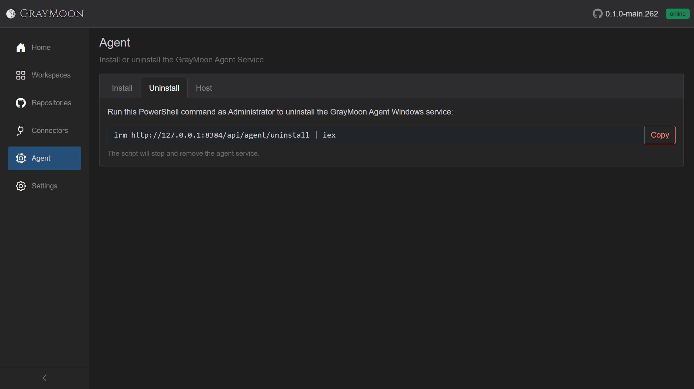
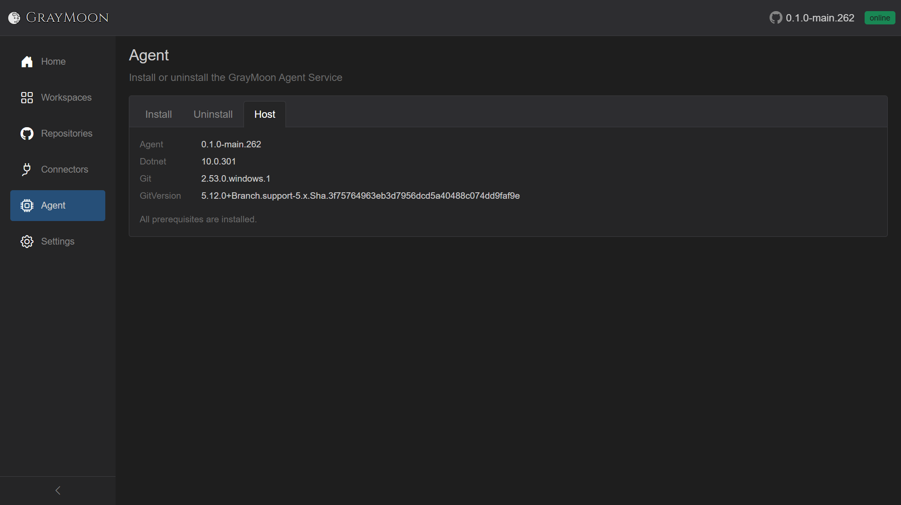

# Agent

Route: `/agent`

Install, update, uninstall, and inspect the host-side GrayMoon Agent Windows service. The [top-bar badge](shared.md#agent-status-badge) is the same connection state.

## Header

- Title: **Agent**
- Subtitle: "Install or uninstall the GrayMoon Agent Service"

## Tabs

The default tab depends on connection:

- Online -> **Host**
- Version mismatch -> **Install** (labeled **Update**, styled red)
- Offline -> **Install** (styled red)

**Host** is hidden entirely until the agent is Online or Version mismatch.

### Install / Update

- When the agent version does not match the app: note "The agent is running version **{semver}**, which is not compatible with this application. Run the command below to update." Tab label becomes **Update**.
- Otherwise the tab is **Install**.
- Copy: "Run this PowerShell command as Administrator to install the GrayMoon Agent as a Windows service:"
- Read-only command box: `irm {appBase}/api/agent/install | iex`
- **Copy** copies that command. Clipboard failures show an error toast (denied, needs HTTPS, or connection lost).
- Note: the script downloads, installs, and starts the service.
- Note: Windows service requires .NET 10 x64 runtime, with a **Download the .NET 10 runtime** link.
- Footer: "You can download and run the agent executable manually." **Download** starts a browser download of the agent binary.

### Uninstall

- "Run this PowerShell command as Administrator to uninstall the GrayMoon Agent Windows service:"
- Command: `irm {appBase}/api/agent/uninstall | iex`
- **Copy** (outline danger).
- Note: the script stops and removes the service.

### Host

Visible only when the agent is connected (including version mismatch). Two-column grid:

| Label | Value |
| --- | --- |
| Agent | Agent semver, or gray **not installed** badge |
| Dotnet | Host .NET version, or **Download .NET 10 runtime** link if missing |
| Git | Git version, or **not installed** badge + **Copy** of `winget install --id Git.Git -e --source winget` |
| GitVersion | GitVersion.Tool version, or a copyable `dotnet tool install --global GitVersion.Tool --version 5.*` command |

Footer note:

- "All prerequisites are installed." when Dotnet, Git, and GitVersion are all present.
- Otherwise "Install the missing prerequisites above." and the **Host** tab itself is styled as missing.

If host info fails to load, a muted error string is shown instead of the grid. While loading: "Loading…"
