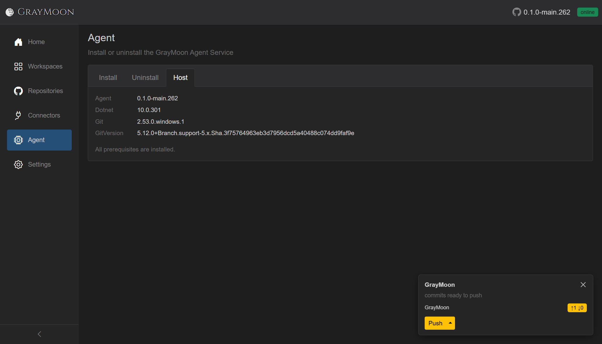

# Agent

Route: `/agent`

Install, update, uninstall, and inspect the host-side GrayMoon Agent Windows service. The [top-bar badge](shared.md#agent-status-badge) is the same connection state.

## Header

- Title: **Agent**
- Subtitle: "Install or uninstall the GrayMoon Agent Service"

## Tabs

The default tab depends on connection:

- Online -> **Host**
- Version mismatch -> **Install** (labeled **Update**, styled red)
- Offline -> **Install** (styled red)

**Host** is hidden entirely until the agent is Online or Version mismatch.

### Install


- Tab label is **Install** when the agent is offline or already compatible.
- Copy: "Run this PowerShell command as Administrator to install the GrayMoon Agent as a Windows service:"
- Read-only command box: `irm {appBase}/api/agent/install | iex`
- **Copy** copies that command. Clipboard failures show an error toast (denied, needs HTTPS, or connection lost).
- Note: the script downloads, installs, and starts the service.
- Note: Windows service requires .NET 10 x64 runtime, with a **Download the .NET 10 runtime** link.
- Footer: "You can download and run the agent executable manually." **Download** starts a browser download of the agent binary.

A **fresh** Windows install always prompts for the current user's password so `GrayMoonAgent` can run as that account. You must enter the password; the service will not install without it. The installer then grants **Log on as a service** and starts the service. First-day walkthrough: [getting-started/00-agent.md](getting-started/00-agent.md).


```
PS C:\Windows\System32> irm http://127.0.0.1:8384/api/agent/install | iex
GrayMoon Agent Installation
Preparing installation directory...
Downloading agent from http://127.0.0.1:8384...
Download completed.
Extracting agent...
Installing service...
Service will run as: MATT80\matt
Password for MATT80\matt: *********
Granting 'Log on as a service' right...
Creating Windows service...
Service 'GrayMoonAgent' installed and started successfully.

Installation completed!
```

### Update

The same **Install** command is the update path. There is no separate update script. When the connected agent semver does not match the App, the tab label becomes **Update** (styled red) and a note names the running agent version:


- Note: "The agent is running version **{semver}**, which is not compatible with this application. Run the command below to update."
- Command is unchanged: `irm {appBase}/api/agent/install | iex`
- **Host** stays visible (the agent is still connected). The Host **Agent** row shows the old semver next to the App version in the top bar:


Because `GrayMoonAgent` already exists, the script does **not** ask for a password. It stops the running service, replaces the files under `C:\Program Files\GrayMoon`, updates the existing service configuration, and starts it again. After reconnect the badge returns to green **online** and the tab label is **Install** again.

Home shows the same mismatch as a red **Upgrade Agent** tile (see [Home](01-home.md#agent)). Walkthrough: [getting-started/00-agent.md](getting-started/00-agent.md#update).

### Uninstall


- "Run this PowerShell command as Administrator to uninstall the GrayMoon Agent Windows service:"
- Command: `irm {appBase}/api/agent/uninstall | iex`
- **Copy** (outline danger).
- Note: the script stops and removes the service, then deletes `C:\Program Files\GrayMoon`.

```
PS C:\Windows\System32> irm http://127.0.0.1:8384/api/agent/uninstall | iex
GrayMoon Agent Uninstallation
Removing service...
Stopping service...
Service 'GrayMoonAgent' removed.
Removing installation directory...
Installation directory removed.

Uninstallation completed!
```

### Host


Visible only when the agent is connected (including version mismatch). Two-column grid:

| Label | Value |
| --- | --- |
| Agent | Agent semver, or gray **not installed** badge |
| Dotnet | Host .NET version, or **Download .NET 10 runtime** link if missing |
| Git | Git version, or **not installed** badge + **Copy** of `winget install --id Git.Git -e --source winget` |
| GitVersion | GitVersion.Tool version, or a copyable `dotnet tool install --global GitVersion.Tool --version 5.*` command |

Footer note:

- "All prerequisites are installed." when Dotnet, Git, and GitVersion are all present.
- Otherwise "Install the missing prerequisites above." and the **Host** tab itself is styled as missing.

If host info fails to load, a muted error string is shown instead of the grid. While loading: "Loading…"

## Self-update from the badge

When versions do not match, the [top-bar badge](shared.md#agent-status-badge) is red **update** instead of green **online**. Tooltip: "Agent version mismatch. Agent version: {semver}. Click to update." Home uses the same state for the red **Upgrade Agent** button.


Clicking the **update** badge starts an in-place self-update. It does **not** navigate to `/agent` first.

1. The App sends a `SelfUpdate` command to the running agent over SignalR, with the same install URL (`{appBase}/api/agent/install`).
2. The badge turns blue **updating** immediately and stays there while the service restarts.
3. On Windows the agent launches a detached process: `powershell.exe -NoProfile -NonInteractive -Command "irm .../api/agent/install | iex"`. That is the same install script as the **Update** tab.
4. The script stops the old service, downloads the App's current agent zip, replaces the files, and starts the service again (no password prompt; the service already exists).
5. When the new agent connects and its version matches the App, the badge returns to green **online**.

If the command cannot be dispatched (agent not connected, process failed to start), a toast shows **Agent update failed.** and the app navigates to `/agent` so you can run the command manually.

Badge self-update is Windows-only. On Linux, run the install script from the **Update** tab yourself.

## Live git tracking

The Agent is what keeps GrayMoon up to date when you use git **outside** the app (IDE, terminal, another GUI). After a repo is cloned, the Agent writes git hooks into it (`post-commit`, `post-checkout`, `post-merge`, `pre-push`). Those hooks POST to the Agent's local listener (`http://127.0.0.1:9191/hook/...`) on every matching git event, whether GrayMoon started the command or not.

The Agent then recounts outgoing and incoming commits (and version / branch) and sends that snapshot to the App. The App persists it and refreshes the [workspace action notification cards](shared.md#workspace-action-notification-cards). You do not have to open Repositories or click **Sync** for the card to appear.

That is why the same **commits ready to push** card shows on the Agent page itself - the Host tab is the machine that is watching the repos:



The card is **per workspace**, with one row per repository that still needs action. Here the GrayMoon workspace has two repos; only **GrayMoon** is listed (`↑1 ↓0`) because **GrayMoon.Desktop** is already `↑0 ↓0`. After a multi-repo commit both rows appear on the same card (see [shared.md](shared.md#workspace-action-notification-cards)).

If you **push outside** GrayMoon, the `pre-push` hook fires. The Agent waits until outgoing commits drop to 0, then the App updates. That repo leaves the card; when nothing in the workspace still needs push, pull, or update, the card disappears.
