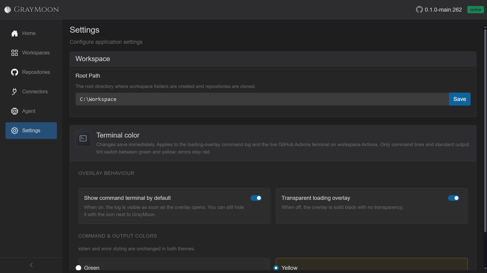
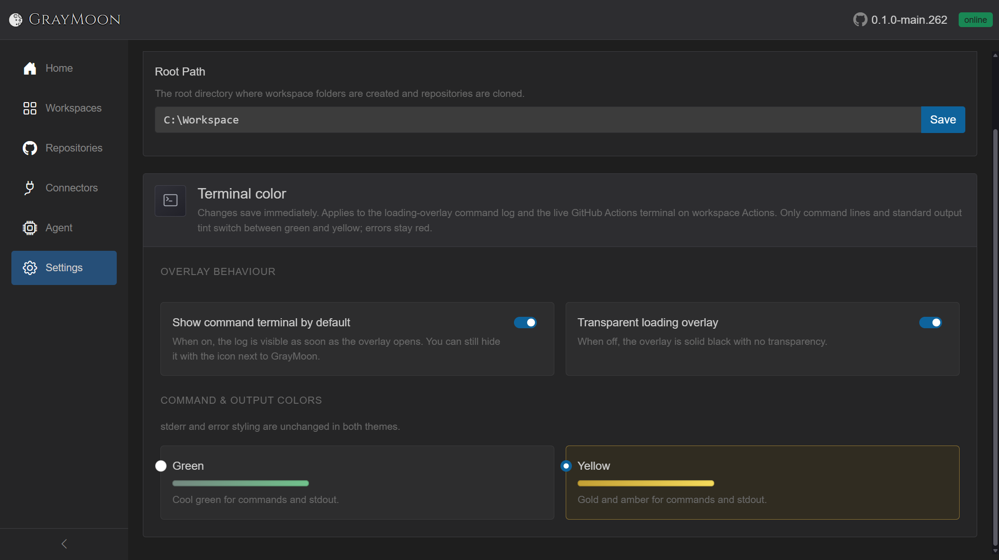

# Settings

Route: `/settings`

## Header

- Title: **Settings**
- Subtitle: "Configure application settings"

## Workspace card

- **Root Path** - directory where workspace folders are created and repositories are cloned.
- Placeholder: `e.g. C:\Workspaces or /home/user/workspaces`
- **Save** (blue) inside the input group; spinner while saving. Enter in the field also saves.
- Validation:
  - Invalid path: red input + "The path is not valid or cannot be created." (or the agent error).
  - Success: green "Workspace root path saved."
  - Failure: "Failed to save. Please try again."
- Empty path is allowed (clears the setting). New workspaces cannot be created until a valid path is set (Add Workspace modal explains this).

## Terminal color card

Changes save immediately (no Save button). Applies to the [loading-overlay](shared.md#loading-overlay) command log and the live GitHub Actions terminal on workspace Actions. Errors stay red in both themes.

### Overlay behaviour

- **Show command terminal by default** (switch) - when on, the log is visible as soon as an overlay opens. The overlay's terminal icon can still hide it. Default in the running app is typically on.
- **Transparent loading overlay** (switch) - when off, the overlay is solid black.

The whole row is clickable (label + switch).

### Command and output colors

Radio cards:

- **Green** - "Cool green for commands and stdout." Green swatch.
- **Yellow** - "Gold and amber for commands and stdout." Gold swatch. Currently selected card is outlined.

Note: "stderr and error styling are unchanged in both themes."

If persistence fails: red alert "Could not save terminal preferences. Check the database and try again."
