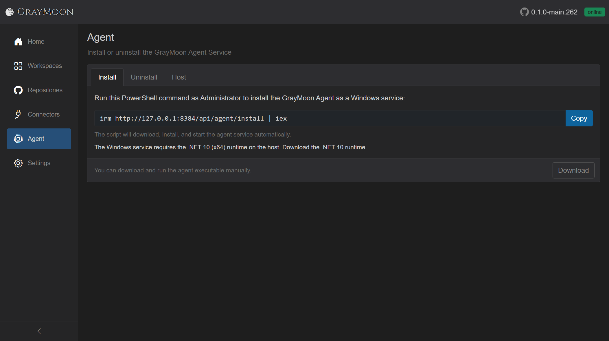
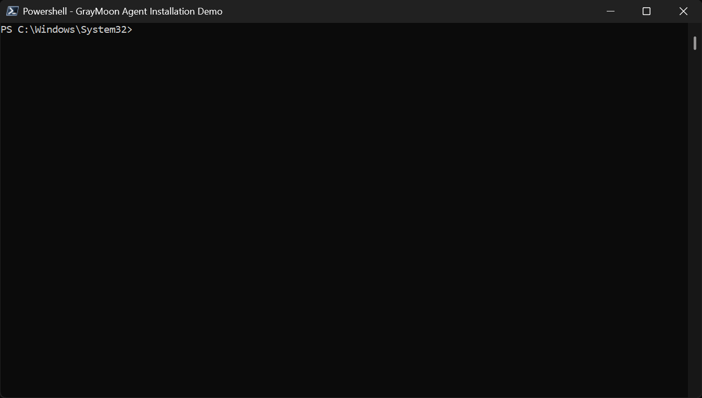
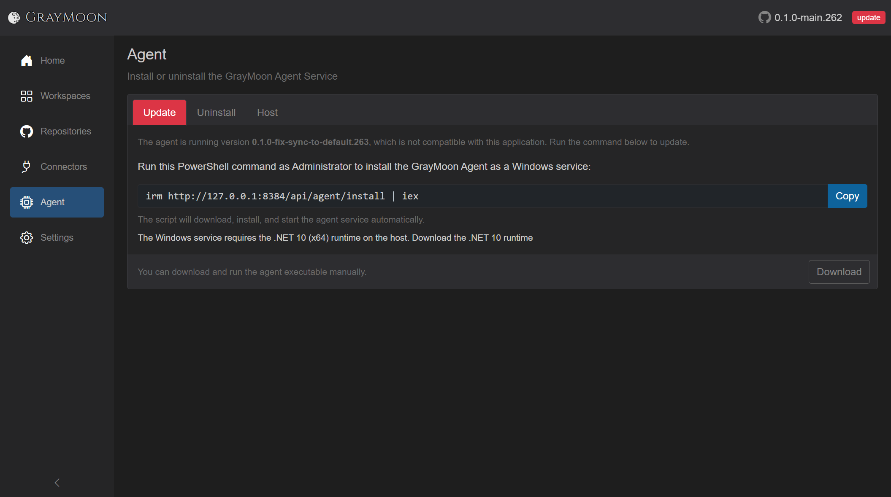
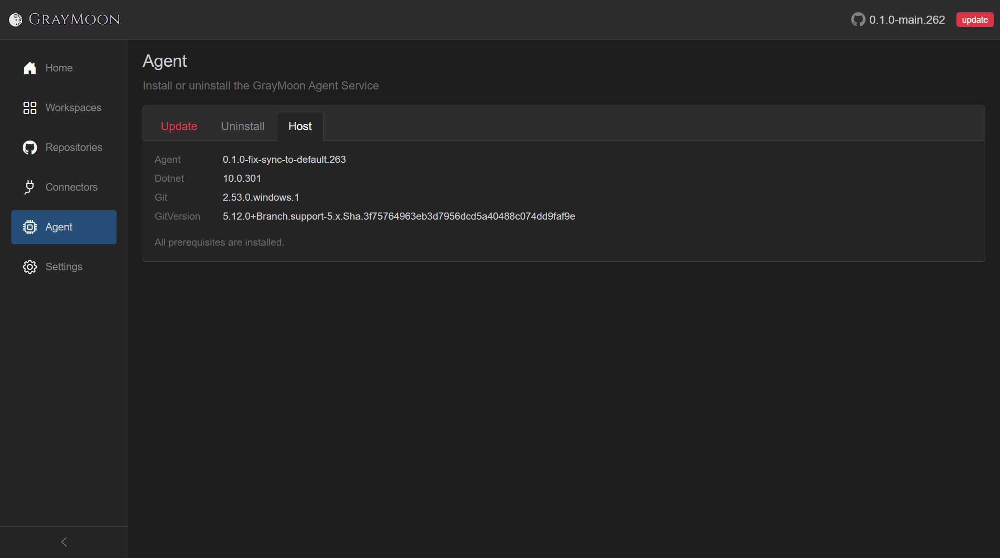

# Install the Agent

Route: `/` then `/agent`

The App runs in Docker and never touches the host disk. The Agent is a Windows service on this machine: it clones, fetches, writes hooks, and talks to the App over SignalR. A clean Docker install (or after uninstall) starts with the top-bar badge **offline**.

Home is the first place you see that. The Agent tile button is red **Install Agent**, and the top-bar badge is red **offline**.


Click **Install Agent** (or **Agent** in the sidebar). While the Agent is offline the **Install** tab is selected (styled red). **Host** stays hidden until the service connects.



Copy: **Run this PowerShell command as Administrator to install the GrayMoon Agent as a Windows service.** The read-only box is:

```powershell
irm http://127.0.0.1:8384/api/agent/install | iex
```

**Copy** puts that on the clipboard. The Windows service needs the **.NET 10 x64 runtime** on the host (**Download the .NET 10 runtime** on the same tab).

## PowerShell (Administrator)

Open an **Administrator** PowerShell window (the script exits immediately if it is not elevated). Paste the command and run it.

The script downloads the agent zip from the App, extracts it under `C:\Program Files\GrayMoon`, and runs `graymoon-agent.exe install`. A **fresh** install always prompts for the current Windows user's password so the `GrayMoonAgent` service can run as that account (workspace ACLs and git credentials). Type it at `Password for DOMAIN\user:` - the input is masked. You must enter the password; the service will not install without it. The installer then grants **Log on as a service** and starts the service.



```
PS C:\Windows\System32> irm http://127.0.0.1:8384/api/agent/install | iex
GrayMoon Agent Installation
Preparing installation directory...
Downloading agent from http://127.0.0.1:8384...
Download completed.
Extracting agent...
Installing service...
Service will run as: MATT80\matt
Password for MATT80\matt: *********
Granting 'Log on as a service' right...
Creating Windows service...
Service 'GrayMoonAgent' installed and started successfully.

Installation completed!
```

When it finishes, the top-bar badge turns green **online**. The **Host** tab appears with Agent / Dotnet / Git / GitVersion versions. Full page reference: [Agent](../05-agent.md).

## Update

The install script is also the update. After an App upgrade (or if you replace the host binary with a different build), the agent semver may not match the App. The top-bar badge turns red **update**, Home's Agent tile becomes red **Upgrade Agent**, and the Agent page tab is labeled **Update**.


Open **Agent**. The **Update** tab is selected (red). A note names the running agent version. The command box is the same install command:



```powershell
irm http://127.0.0.1:8384/api/agent/install | iex
```

**Host** stays available because the old agent is still connected. The **Agent** row shows the mismatched semver (here `0.1.0-fix-sync-to-default.263`) next to the App version in the top bar (`0.1.0-main.262`):



Run the command in Administrator PowerShell. Because `GrayMoonAgent` already exists, there is **no password prompt**. The script stops the service, downloads the zip from the App, replaces `C:\Program Files\GrayMoon`, updates the existing service, and starts it. When the new agent reconnects and versions match, the badge is green **online** again.

## Self-update from the badge

You do not have to copy the command. Click the red **update** badge in the top bar.

That sends a `SelfUpdate` command to the running agent. The badge turns blue **updating** while a detached PowerShell process runs the same `irm .../api/agent/install | iex` script (no password). When the new service connects and the version matches, the badge returns to green **online**.

If the click cannot start the update, a toast shows **Agent update failed.** and GrayMoon opens `/agent` so you can run the command yourself. Full write-up: [Agent - Self-update from the badge](../05-agent.md#self-update-from-the-badge).

## Uninstall

To remove the service later, use the **Uninstall** tab command in an Administrator PowerShell window:

```powershell
irm http://127.0.0.1:8384/api/agent/uninstall | iex
```

```
PS C:\Windows\System32> irm http://127.0.0.1:8384/api/agent/uninstall | iex
GrayMoon Agent Uninstallation
Removing service...
Stopping service...
Service 'GrayMoonAgent' removed.
Removing installation directory...
Installation directory removed.

Uninstallation completed!
```

That stops and deletes `GrayMoonAgent` and removes `C:\Program Files\GrayMoon`. The App stays running; the badge goes **offline** again.
