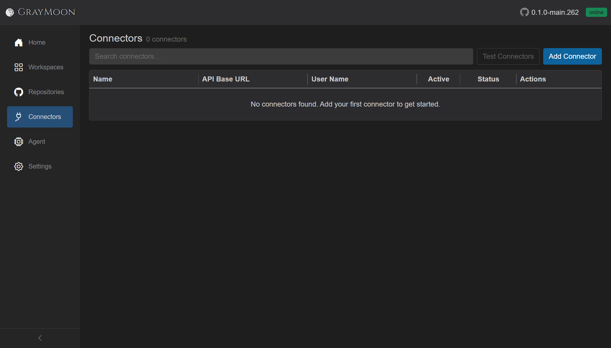
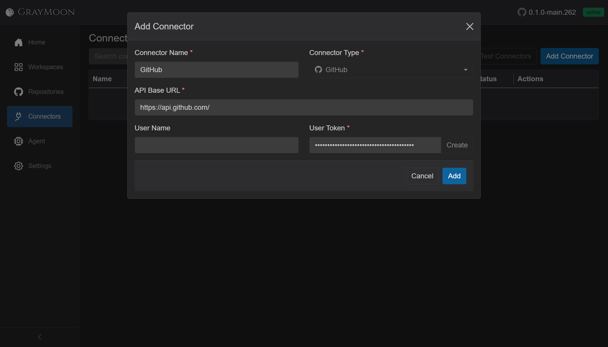
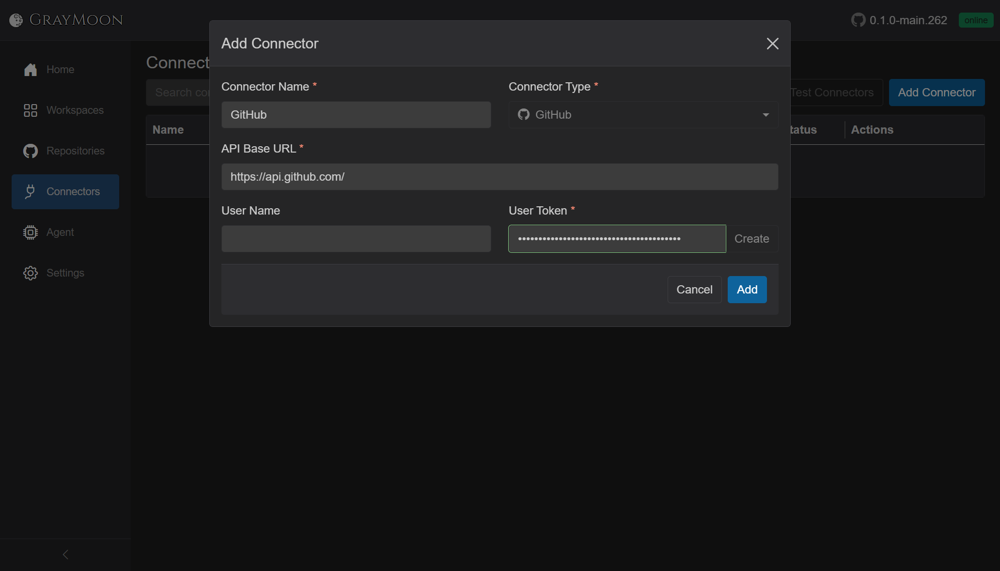
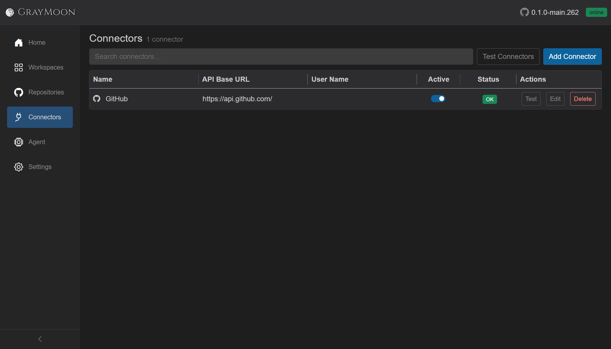
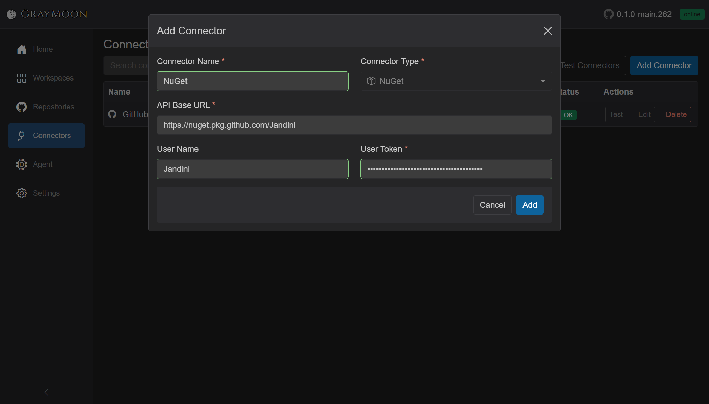
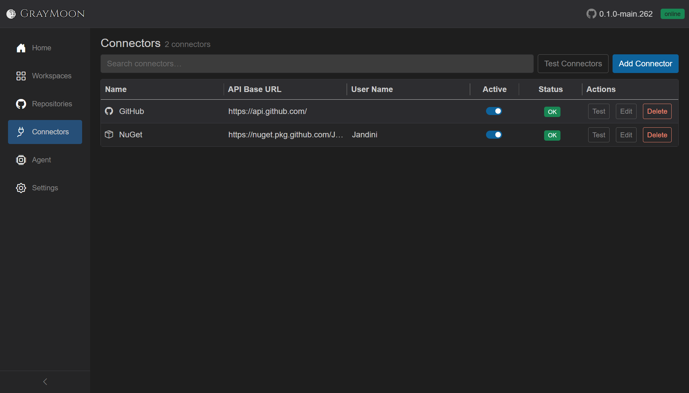

# Add connectors

Route: `/connectors`

**Working connectors are required.** GrayMoon cannot fetch the repository catalog, clone from GitHub, check package availability during push, or load GitHub Actions until every connector you need is **Active** with status **OK**. Inactive switches or red **Error** badges block those operations until you fix the token or URL and re-test. See [Connectors](../04-connectors.md#inactive-connectors-and-error-status) for activation and testing.

GrayMoon talks to GitHub (catalog, clone URLs, Actions) and to NuGet feeds (package availability during synchronized push) through **connectors**. A clean install starts empty.

Copy: **No connectors found. Add your first connector to get started.** Search is disabled until at least one connector exists. **Test Connectors** is disabled too.

Click **Add Connector**.

## GitHub connector

Fields:

- **Connector Name** - any label. Use `GitHub`.
- **Connector Type** - **GitHub**. Changing type fills a default API URL.
- **API Base URL** - `https://api.github.com/` for github.com (GitHub Enterprise uses its own API host).
- **User Token** - classic personal access token. The field is a password box, so the value stays masked.

### Create (GitHub token)

Next to **User Token**, **Create** is a link (not the form submit). It opens GitHub's **new classic PAT** page in a new tab, already filled with the scopes GrayMoon needs:

[https://github.com/settings/tokens/new?scopes=repo,workflow,read:packages&description=GrayMoon%20Token](https://github.com/settings/tokens/new?scopes=repo,workflow,read:packages&description=GrayMoon%20Token)

| Scope | Why GrayMoon asks for it |
| --- | --- |
| `repo` | Private and public repository list, clone, fetch, push, PR metadata |
| `workflow` | GitHub Actions (workflow list, runs, logs) |
| `read:packages` | GitHub Packages (same token can later back a NuGet connector) |

Generate the token on GitHub, paste it into **User Token**, then **Add**. Do not store the token in docs or screenshots. After save, GrayMoon tests the connector automatically (status **Testing**, then **OK** or **Error**).

Close the dialog after **Add**. The GitHub row shows **OK**, **Active** on.

Row **Test** runs the same health check again without editing. Tooltip on **OK** is "Connection OK." **Test Connectors** in the header tests every connector in parallel.

## NuGet connector (GitHub Packages)

GrayMoon also needs a NuGet feed if workspace repos publish packages that other workspace repos consume. For GitHub Packages, add a second connector that reuses the same PAT.

**Add Connector** again:

- **Connector Name** - `NuGet`
- **Connector Type** - **NuGet**
- **API Base URL** - `https://nuget.pkg.github.com/Jandini` (org or user that owns the packages)
- **User Name** - shown for GitHub Packages basic auth. Use the GitHub user (`Jandini`)
- **User Token** - the same classic PAT (`read:packages` is the scope that matters here). **Create** is GitHub-type only, so paste the token you already made.

Save. Status goes **Testing** then **OK**. Click row **Test** (or **Test Connectors**) to confirm both rows stay **OK**.

Active switches stay on after a successful test. Keep both rows **OK** before moving on - if either connector is inactive or in **Error**, fetch and workspace steps will fail.

A used connector in **Error** is what turns Home **Manage Connectors** red.

Next: [fetch the repository catalog](02-fetch-repositories.md).
