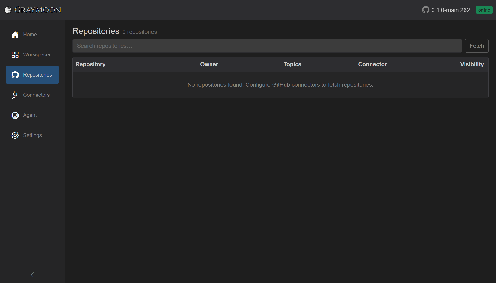
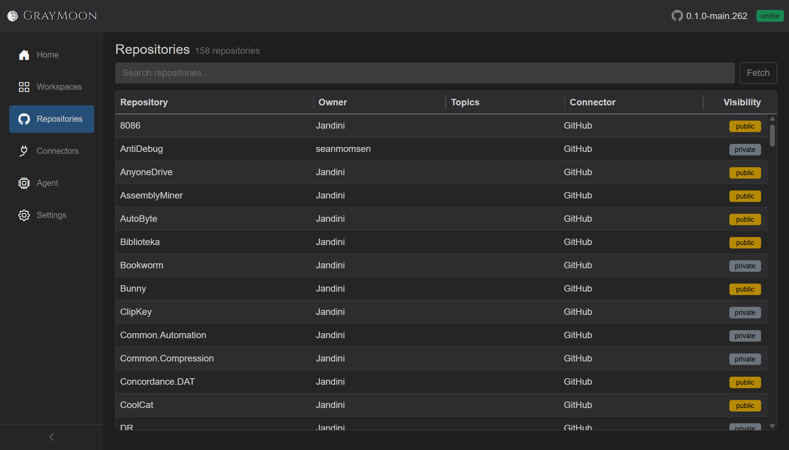

# Fetch repositories

Route: `/repositories`

This is the **global catalog** of GitHub repositories. It is not a workspace and it does not clone anything. Until you fetch, the page is empty even if connectors already test **OK**.

Copy: **No repositories found. Configure GitHub connectors to fetch repositories.**

Click **Fetch**. The [loading overlay](../shared.md#loading-overlay) shows **Fetching repositories...**, then **Fetched N repositories**, with **Abort**. GrayMoon pages GitHub through every **Active** GitHub connector and upserts name, owner, topics, visibility, and clone URL.

When it finishes, the grid is the full catalog (here **158 repositories**). Columns: Repository, Owner, Topics, Connector, Visibility (`public` / `private`). Virtual-scrolled, so large accounts stay usable.

Search uses the shared [filter search](../shared.md#filter-search-shared): plain words match name, owner, topics, and connector. `topic:` matches only the topics string (used in the next step when picking workspace repos).

There is no row click-through from this page. Linking repos into a workspace is [Create workspace and clone](03-workspace-clone.md).

You can Fetch again later to pick up new repos, topic changes, and renames. A yellow **Repository rename detected** alert appears if GitHub renamed a catalog row.
