# Create workspace and clone

A workspace is a named folder under Settings **Root Path**, plus a set of catalog repositories GrayMoon should manage together. The first **Sync** clones every missing folder as a **sibling** under that workspace path.

## Add workspace Demo

Route: `/workspaces`

A clean install shows **0 workspaces** / **No workspaces found. Add your first workspace to get started.** Agent must be **online** and Root Path must be set.

**Add Workspace**:


- **Workspace Name** - `Demo` (focused on open). The path updates live.
- **Workspace Path** - read-only `{Root Path}\{Name}` - here `C:\Workspace\Demo`.

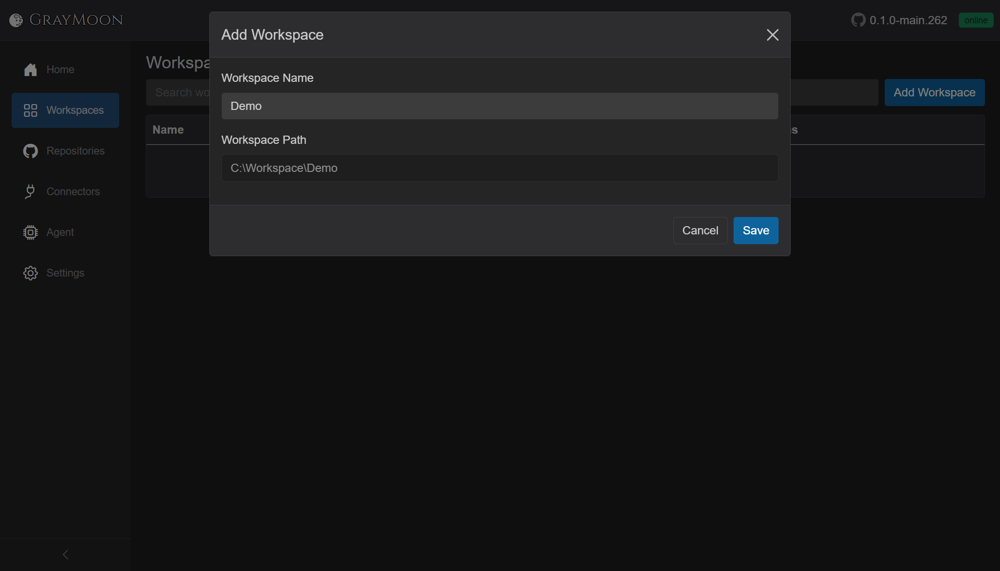

**Save**. The first workspace is starred **Default** (Home redirects here on a new tab). Repos and Projects are still `0`.

Open **Repositories** on the Demo row (or click the name later and use the subtitle count). That is the select-repositories modal, not the nested Repositories grid.

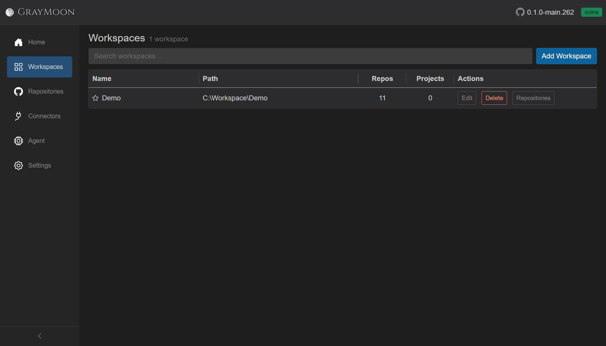

## Select repositories

Title: **Select repositories for Demo**. This is the same catalog you fetched, with checkboxes.

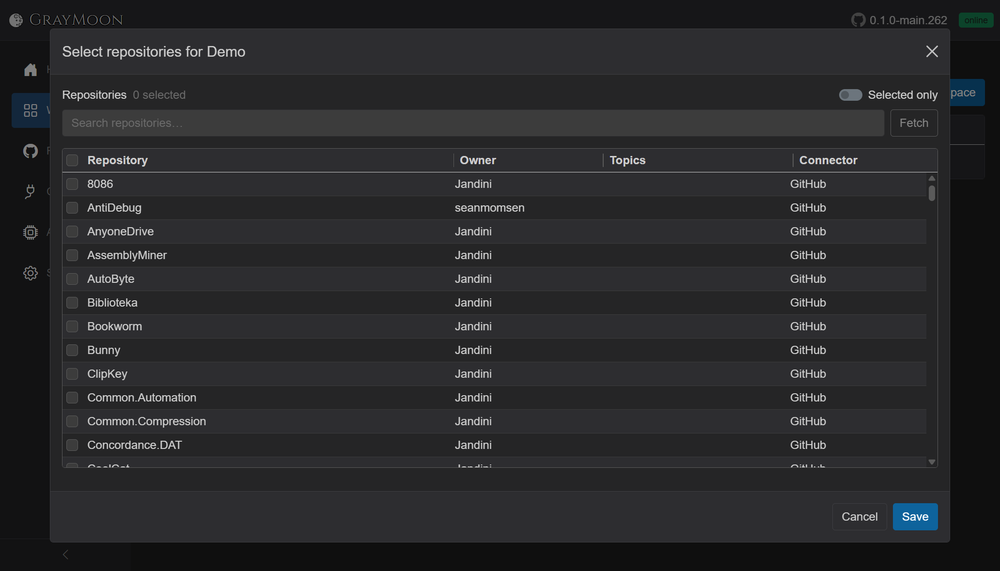

What the dialog gives you:

- Header **Repositories N selected**
- **Selected only** - hide rows that are not checked (useful after a search)
- Search - same fields as the catalog: name, owner, topics, connector. `topic:` is the fast path for GitHub Topics
- **Fetch** - refresh the catalog from GitHub without leaving the dialog
- Checkbox column, plus the header checkbox which selects **all currently filtered rows** (not the whole catalog)
- Columns: Repository, Owner, Topics (pills), Connector
- **Save** needs at least one selected repo. Escape / Cancel closes without linking

Clearing or changing the filter does **not** uncheck rows. Selection is a set of ids, independent of what the grid is showing.

### Search: TapeTools

Type `TapeTools`. Two rows match (`MezzoRecovery.TapeTools` by substring, and **TapeTools**). Check **TapeTools** only. Header becomes **1 selected**.

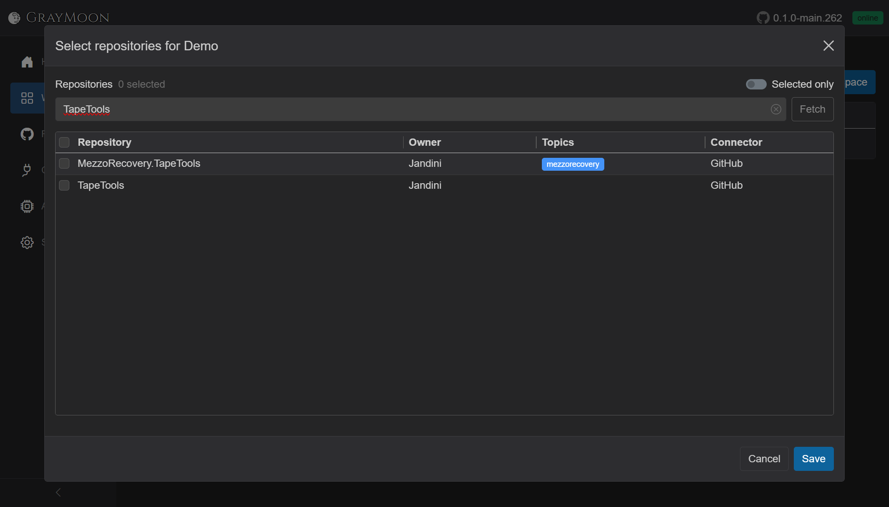

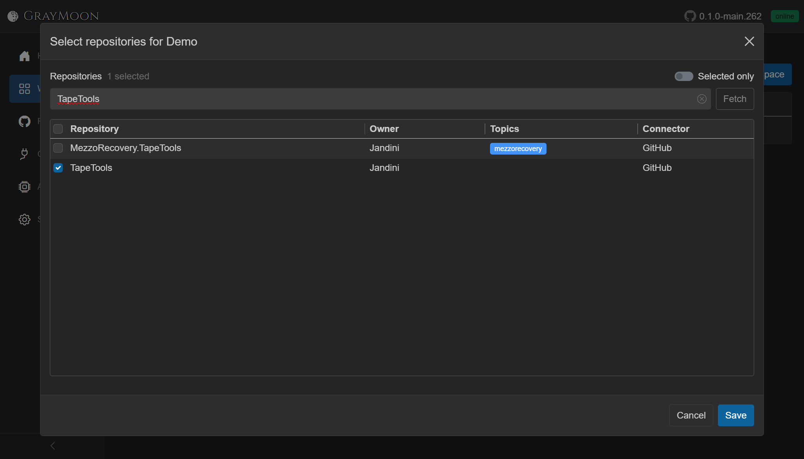

Clear the search (empty box or the input X). The full catalog comes back; **TapeTools stays checked**. **Selected only** on makes that obvious: one row, still selected.

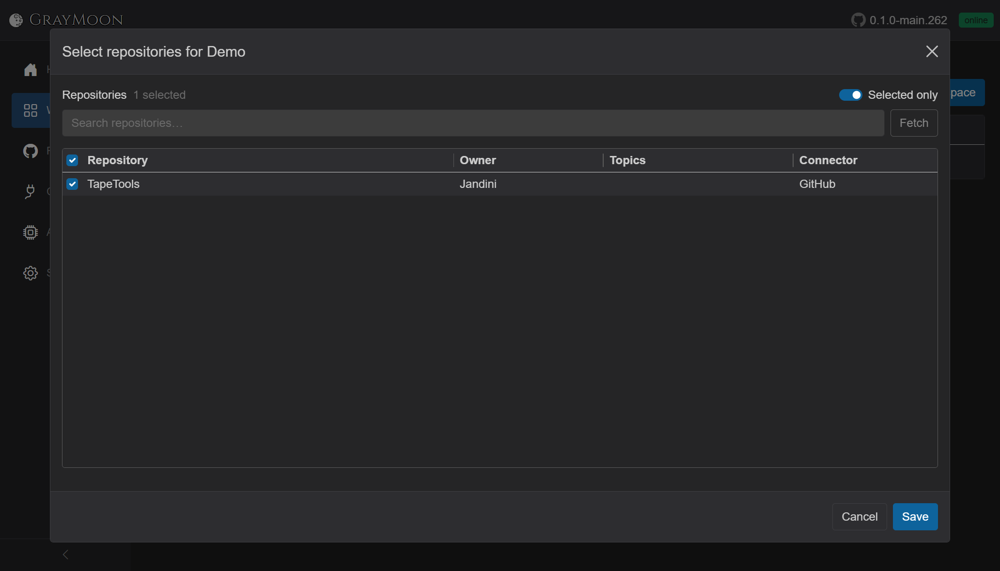

### Filter by GitHub topic

Turn **Selected only** off. Search `topic:mezzorecovery`. Every catalog repo tagged `mezzorecovery` is listed (here 11), with a blue topic pill. TapeTools without that topic is hidden from the grid but **stays selected**.


Click the **header checkbox** to select the whole filtered set. That **adds** those rows; it does not drop TapeTools.

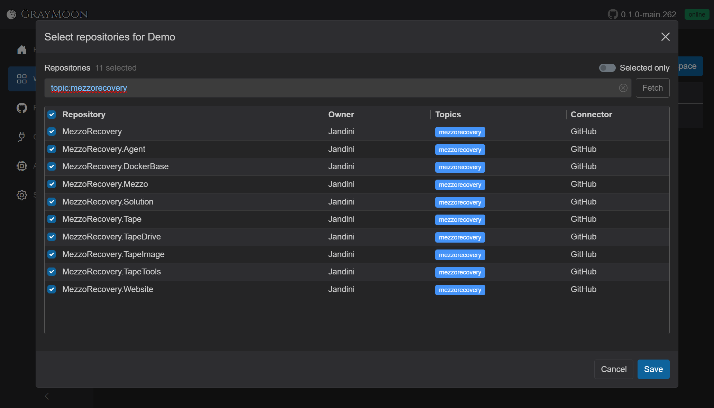

**Selected only** again: TapeTools plus every `mezzorecovery` repo. **Save**.

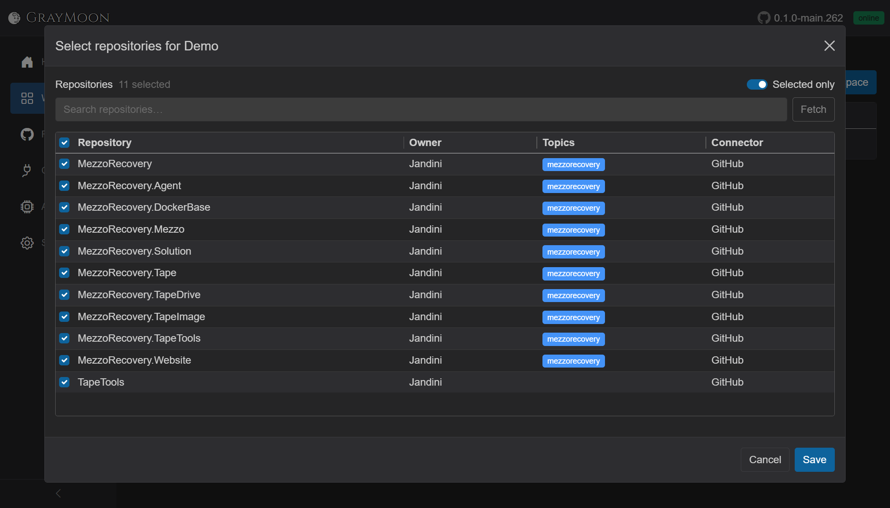

Workspaces now shows Demo with **11** repos and **0** projects. Projects stay 0 until clones exist and `.csproj` files can be scanned.

## Workspace grid before clone

Click **Demo**. Sidebar switches to workspace pages. Route: `/workspaces/1`.

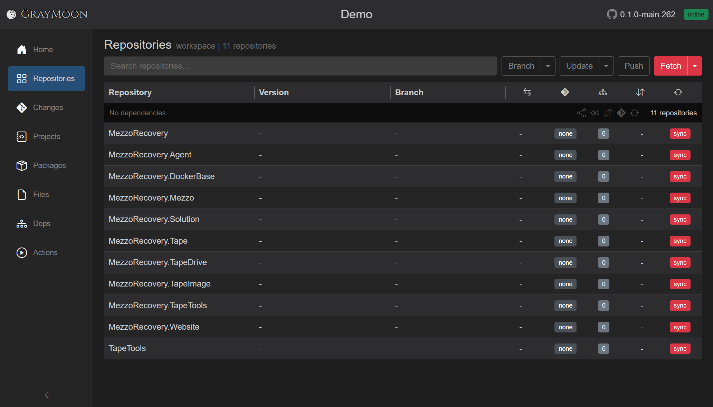

This is the state that needs the first Sync:

- Subtitle **workspace | 11 repositories**
- One group: **No dependencies** / 11 repositories. There are **no Level 1 / 2 / 3 groups yet**. Levels come from a topological sort of package references in `.csproj` files (plus file-config tokens and custom edges). Nothing is on disk, so there is nothing to scan. GrayMoon is not missing the graph - it has not been able to read it.
- **Version** and **Branch** are `-` (no GitVersion, no checkout)
- PR badge **none**, commits `0`, no `↑` / `↓`
- Each row has a red **sync** (folder missing / never cloned)
- Header split control is **red** (workspace out of sync). Label is **Fetch** or **Sync** depending on the last choice stored in the browser (`graymoon:sync-mode`)

Row **sync** clones that one repo. The header control clones every missing repo in the workspace.

## Fetch and Restore do not clone

Open the caret next to the red button. The menu is **Fetch**, **Sync**, **Restore**.

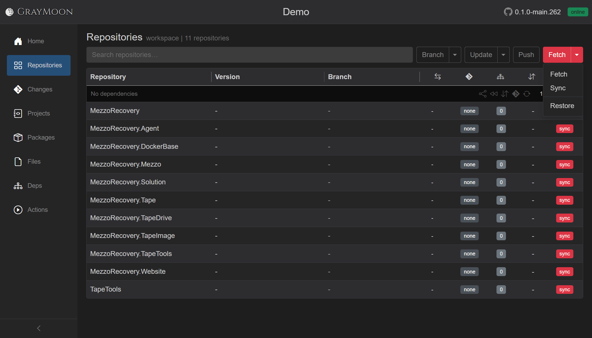

On a machine that already used **Fetch** as the daily refresh, the primary label is **Fetch**. **Fetch** only talks to remotes of folders that already exist: it does not create `{Root}\{Workspace}\{Repo}` and it does not write hooks. **Restore** runs `dotnet restore` on tracked projects - there are no `.csproj` paths until clones exist, so Restore cannot do the first-day job either.

For a clean workspace, pick **Sync** from that menu. That both remembers Sync as the primary button and starts the job. After this, the red (then blue) primary stays **Sync** until you choose Fetch again.

## Sync (clone)

**Sync** is the first-time clone. For each selected repo the Agent:

1. Creates `C:\Workspace\Demo\{RepositoryName}` if it is missing (`git clone`)
2. Fetches origin (prune + tags)
3. Runs GitVersion (version string + branch)
4. Writes live git hooks into `.git/hooks`
5. Recounts outgoing / incoming vs upstream and ahead / behind vs default
6. Scans `.csproj` files so **Levels** and project counts appear

Repos that already have a folder are refreshed in place, not cloned a second time.

Overlay: **Synchronizing...**, then **Synchronized N of 11**, **Abort**, live git terminal (`Cloning into 'MezzoRecovery.TapeTools'...`, fetch, GitVersion). Agent queue in the top bar: **Agent is completing N tasks.**

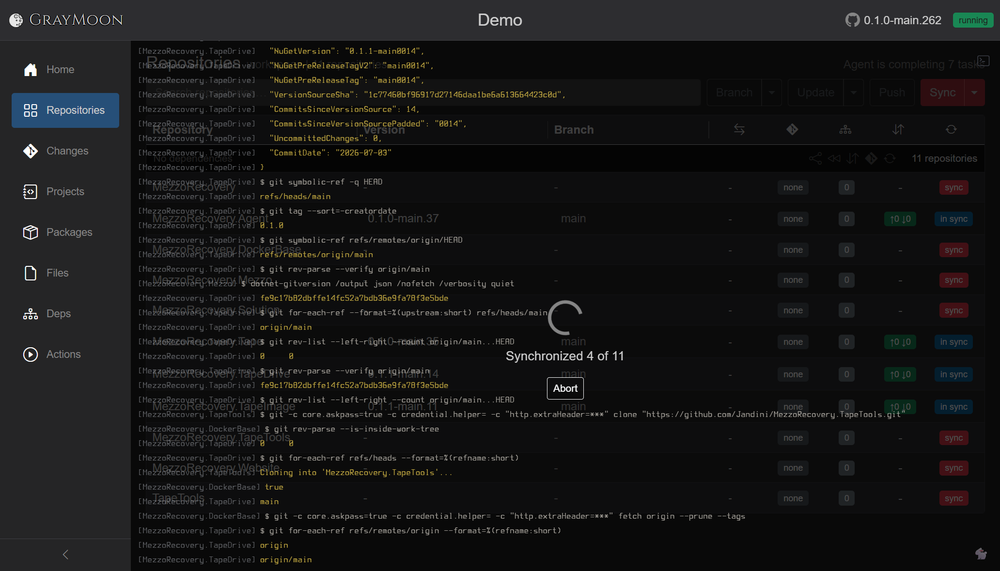

Benefit: **one Sync clones every selected repository as siblings** under `C:\Workspace\Demo\`. You do not open 11 terminals or clone into nested folders. Each repo is `{Root}\{WorkspaceName}\{RepositoryName}` next to the others - the layout IDEs and solution files expect for this kind of workspace.

When the job finishes, rows are **in sync**, versions and `main` are filled, and the grid is grouped by **Level** (Level 1 = no workspace package deps, higher levels consume lower ones). Header **Sync** turns blue.

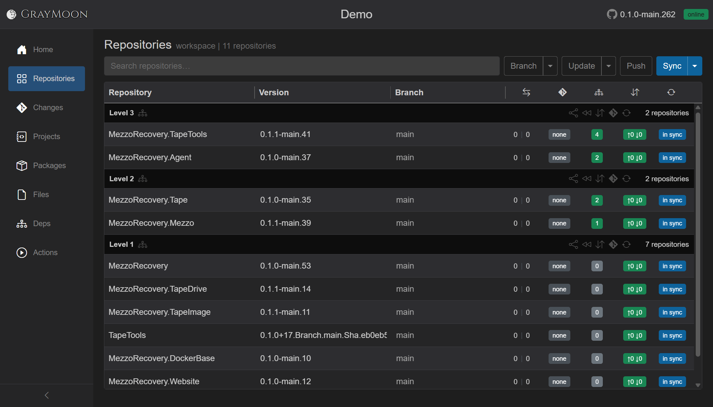

## Agent hooks

On clone (and on later Sync), the Agent writes these hooks into each repo's `.git/hooks`:

| Hook | When it fires | Agent URL |
| --- | --- | --- |
| `post-commit` | After a commit (GrayMoon, IDE, or terminal) | `POST http://127.0.0.1:9191/hook/commit` |
| `post-checkout` | After a branch/commit checkout (`$3 = 1` branch checkout) | `.../hook/checkout` |
| `post-merge` | After a merge (including pull that merged) | `.../hook/merge` |
| `post-update` | After a ref update | `.../hook/commit` |
| `pre-push` | Before a push | `.../hook/push` |

Each hook is a small `#!/bin/sh` script that `curl`s JSON `{ repositoryId, workspaceId, repositoryPath }` to the Agent's local listener (port **9191**). Timeouts are short (`--connect-timeout 1 --max-time 2`) and failures are ignored (`|| true`) so git is never blocked if the Agent is stopped.

The Agent then recounts commits / version / branch and pushes a snapshot to the App. That is how [workspace action notification cards](../shared.md#workspace-action-notification-cards) appear even when you commit outside GrayMoon. Full write-up: [Agent - Live git tracking](../05-agent.md#live-git-tracking).

Sample `post-commit` after this Demo clone (TapeTools):

```
#!/bin/sh
# Created by GrayMoon.Agent at ...
curl -s --connect-timeout 1 --max-time 2 -X POST "http://127.0.0.1:9191/hook/commit" ...
```

The job is done when every row is **in sync** and `C:\Workspace\Demo` contains the sibling clones. Daily refresh after that can use **Fetch**. Restore and dependency Update need those clones (and the NuGet connector) first.
