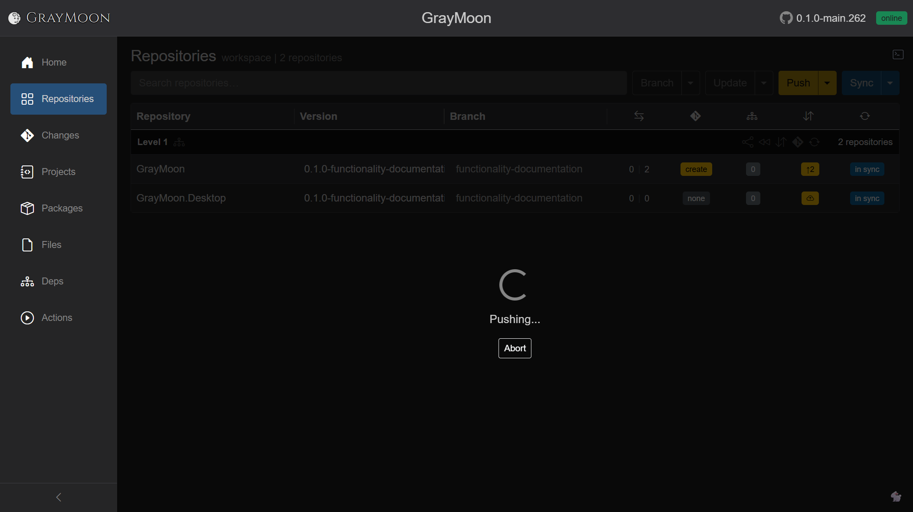
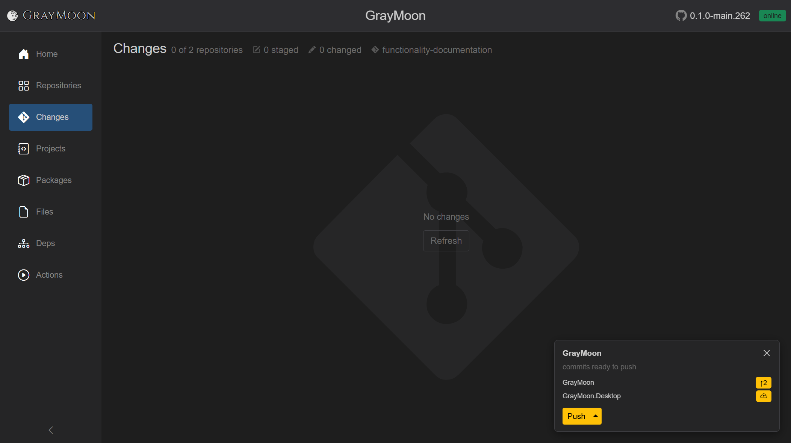
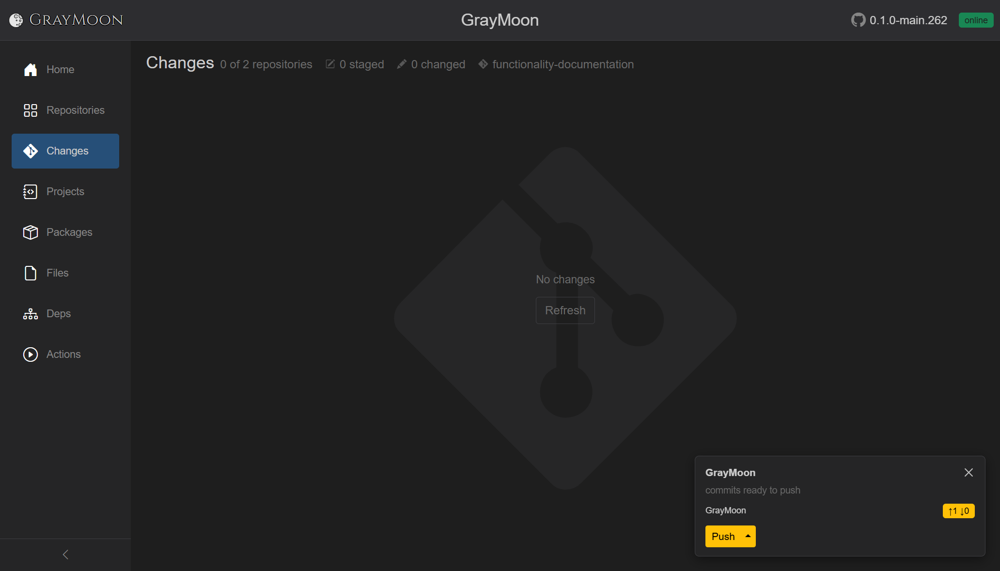

# Shared chrome and repeating features

These controls appear across pages. Page docs reference this file instead of repeating the same mechanics.

## Sidebar navigation

The left sidebar is always present. Collapsing it (icons only) is documented with a screenshot in [00-layout.md](00-layout.md).

- **Brand** - moon icon + "GrayMoon" at the top. Clicking it goes to Home (`/`). Hidden when the sidebar is collapsed.
- **Toggle sidebar** - chevron button at the bottom of the sidebar. Collapses the sidebar to icons only (labels hide). Click again to expand. Preference is persisted as `Sidebar.Collapsed`.
- **First-level items** (when URL is not `/workspaces/{id}/...`):

| Label | Icon | Route |
| --- | --- | --- |
| Home | house | `/` |
| Workspaces | grid | `/workspaces` |
| Repositories | GitHub octocat | `/repositories` |
| Connectors | plug | `/connectors` |
| Agent | CPU | `/agent` |
| Settings | gear | `/settings` |

- **Workspace items** (when URL is `/workspaces/{id}` or a nested workspace path). Labels in the sidebar are short; tooltips/aria still use the full names:

| Sidebar text | Aria / meaning | Route |
| --- | --- | --- |
| Home | Home | `/` |
| Repositories | Workspace repositories grid | `/workspaces/{id}` |
| Changes | Git changes | `/workspaces/{id}/changes` |
| Projects | Projects | `/workspaces/{id}/projects` |
| Packages | Packages | `/workspaces/{id}/packages` |
| Files | Files | `/workspaces/{id}/files` |
| Deps | Dependencies graph | `/workspaces/{id}/dependencies` |
| Actions | GitHub Actions | `/workspaces/{id}/actions` |

- The active item is highlighted (blue background).
- On narrow viewports a hamburger checkbox still exists for the Bootstrap navbar toggler.

## Top bar

Right of the content area:

- **Workspace title** (workspace pages only) - large clickable name of the current workspace. Tooltip is the workspace name. Clicking it goes to the Workspaces list (`/workspaces`). Aria label: "Go to Workspaces".
- **GitHub link** - GitHub icon linking to `https://github.com/Jandini/GrayMoon` (new tab).
- **App version** - informational version string next to the GitHub icon (for example `0.1.0-upstream-fix.261`).
- **Agent status badge** - see below.

GrayMoon Desktop can hide this entire top bar (tray toggle). That control is not in the web UX. The sidebar brand row stays in the DOM and is hidden with CSS (`page--topbar-hidden`) when the desktop top bar is off. See [00-layout.md](00-layout.md).

## Agent status badge

Always visible in the top-right. Clicking it usually navigates to `/agent`.

| State | Badge text | Color | Click |
| --- | --- | --- | --- |
| Online, idle | `online` | green | Go to Agent page |
| Online, jobs queued | `running` | green | Go to Agent page |
| Connecting | `connecting` | gray | Go to Agent page |
| Offline | `offline` | red | Go to Agent page |
| Version mismatch | `update` | red | Starts an in-place agent self-update (does not navigate first). See [Agent - Self-update from the badge](05-agent.md#self-update-from-the-badge). |
| Update in progress | `updating` | blue | Disabled visually while the update command runs |

Tooltips:

- Online: "Agent connection status: online" or "Agent is running tasks"
- Offline / connecting: matching connection status
- Version mismatch: "Agent version mismatch. Agent version: {semver}. Click to update."
- If self-update fails: error toast "Agent update failed." then navigate to `/agent`

## Filter search (shared)

Used on Workspaces, Repositories, Connectors, workspace grids, the add-repositories modal, custom-dependencies modal, and Git Changes.

Placeholder and searchable fields differ per page (see that page). The **syntax, coloring, and keys** are shared.

### What the user sees

- Text input with a page-specific placeholder.
- Disabled (still fully opaque, not grayed-out washed) when the grid has no rows to search, or while the first load is in progress.
- **Clear (x)** button appears on the right once any text is typed. Title: "Clear filter". Clicking it empties the query.
- **Escape** on most pages also clears the filter.
- Filtering is debounced (~150 ms) so coloring updates immediately while the grid waits a beat.

### Syntax

- Words separated by spaces are **AND**.
- Explicit `and` / `or` (case insensitive). `and` binds tighter than `or`.
- Parentheses group expressions: `(foo or bar) baz`.
- `field:value` restricts a term to a named field. Unknown fields are ignored or treated as always-true depending on the page matcher (see each page).
- If the query cannot be parsed, the bar turns **red** (invalid) and matching falls back to "every space-separated word must appear" so results never disappear because of a typo in operators.

### Token colors (valid queries)

| Token | Color |
| --- | --- |
| `and` | green (`#7ee787`) |
| `or` | orange (`#ffa657`) |
| `(` `)` | muted gray (`#8b949e`) |
| `field:` prefix and its value | blue (`#79c0ff`) |
| plain words | normal text color |

Invalid queries: the typed text itself turns the error color (red), no rainbow overlay.

### Result count

Most list pages show `N item(s)` in the subtitle. With an active filter this becomes `N item(s) found`. Empty match: a table empty-state row such as "No workspaces match your search."

## Toasts

Short bubble at the edge of the viewport.

- Normal messages auto-hide after **2.5 s**.
- Error messages (red styling) auto-hide after **6 s**.
- Used for clipboard failures, agent update failure, file-version updates, and similar one-shot feedback.

## Loading overlay

Full-screen (or page-scoped to the article) overlay during long operations: fetch repositories, sync, update, push, restore, initial workspace load, registry sync, file version update.

What the user sees:

- Centered spinner and a status message (for example "Fetching repositories...", "Fetched 12 repositories", "Loading workspace...").
- Optional **Abort** button when the operation can be cancelled.
- Optional live **command terminal** (left/top of overlay): lines prefixed `[agent]` (or another stream label). Line kinds:
  - command lines
  - stdout (green or yellow depending on Settings)
  - stderr / errors stay red
- Terminal visibility toggle: terminal icon next to the GrayMoon brand on the overlay. On by default if Settings "Show command terminal by default" is on.
- **Rabbit** button (bottom of overlay) toggles a Matrix-rain background vs a simple dim overlay.
- Backdrop is translucent or solid black depending on Settings "Transparent loading overlay".
- While a job is running, navigating away and back to the **same URL path** still shows this overlay (jobs are keyed by path). A pending-agent-task count in the workspace Repositories header also appears: "Agent is completing N task(s)" with a small spinner if the overlay is not already visible.

A push started from the notification card (or from the Repositories header **Push**) uses job key `/workspaces/{id}`, so this overlay appears on Repositories:

## Reconnect / session dialogs

- **GrayMoon needs to reload** - circuit died. Copy: "The current session can no longer continue. Reload the page to reconnect and restore the latest state." Action: **Reload page**.
- **Rejoining the server...** - first reconnect attempt.
- **Rejoin failed... trying again in N seconds.**
- **Failed to rejoin** with **Retry**.
- **The session has been paused by the server** with **Resume**.

## Workspace action notification cards

Floating cards in the bottom-right for workspaces that need attention. They exist so you can **Push / Pull / Update without opening that workspace's Repositories page**. The same header actions live on Repositories; the card is a shortcut from anywhere else.

The card for a workspace is hidden only while you are on that workspace's Repositories URL (`/workspaces/{id}`), because those buttons are already in the header. It stays visible on other pages of the same workspace (Changes, Projects, Packages, Files, Dependencies, Actions) and on first-level pages (Home, Workspaces, ...). It is also hidden while a job for that workspace is running.

One card covers **every repository in that workspace** that still needs action (outgoing, incoming, or unmatched deps), not only the repo you last touched. After the first commits on `functionality-documentation`, both **GrayMoon** and **GrayMoon.Desktop** sat on the same card. After Desktop was pushed, only GrayMoon remained (`↑1 ↓0`) - still the same workspace card, visible from Changes, Agent, and other non-Repositories pages:

The counts come from the [Agent](05-agent.md#live-git-tracking), not from the browser. Git hooks notify the Agent on commit / checkout / merge / push even when you run git in another tool. GrayMoon stays current; you can sit on Changes (**No changes** in the working tree) and still see unpushed commits on the card.

If you push that commit **outside** GrayMoon, the Agent's `pre-push` hook updates the counts. The repo row drops off; when the workspace has nothing left to push, pull, or update, the card disappears.

Each card shows:

- Workspace name (link to `/workspaces/{id}`) and a dismiss (x). Dismiss hides the card until pending state changes again.
- Description of pending work, joined with commas:
  - `dependency updates pending`
  - `incoming commits to pull`
  - `commits ready to push` (outgoing commits and/or a branch with no upstream, and no incoming)
- Per-repo rows: repo name, unmatched-deps badge (`N of M`, hover shows package `current -> new`), and [commits badges](workspace/repositories.md#commits-badge-out-in) (same meaning as the Repositories grid).
- "... and more" link if more repos exist than the card lists.

In the screenshot after committing on a new branch:

- **GrayMoon** - yellow `↑2` (two outgoing commits, no incoming). Incoming is omitted when the branch has no upstream yet; otherwise a clean pair is `↑N ↓0`.
- **GrayMoon.Desktop** - yellow cloud-up (new branch, nothing to count as outgoing yet, **Push to set upstream**).
- Yellow **Push** (split). One click pushes every listed repo in one job (sets upstream where needed). Caret: **Undo Push Commits** (local reset to origin; see [undo-push-commits.md](workspace/undo-push-commits.md)).

Primary actions (depend on state):

- **Push Updated** (yellow) with split menu: Level N Only, Update Only, Update Files, Push Only, **Undo Push Commits** (when outgoing commits exist; [undo-push-commits.md](workspace/undo-push-commits.md)).
- **Push** (yellow) when there is nothing to update and no incoming: push all listed repos at once.
- **Pull** (red) when any listed repo has incoming commits.
- **Update** (red) when unmatched deps exist together with incoming commits.

A job started from the card is keyed to `/workspaces/{id}` (the Repositories path), so navigating to Repositories during the run shows the [loading overlay](#loading-overlay) there.
