# Workspace Actions

Route: `/workspaces/{id}/actions`

GitHub Actions workflows for every repository in the workspace, on the repo's current branch. Status is live-polled while runs are active.

MezzoRecovery (`/workspaces/2`) after a refresh: **15 workflows**, all last-run **success**. The **success 15** chip is the status filter (only statuses that currently exist are shown).

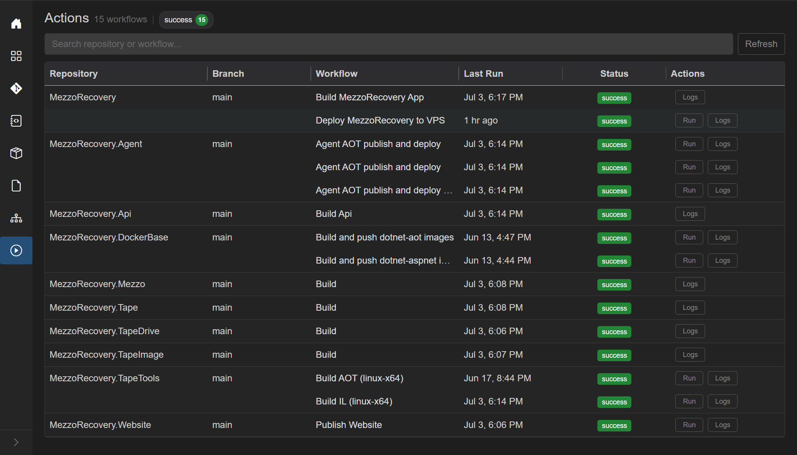

## Header

- Title: **Actions**
- Subtitle: `N workflow(s)` or `N workflow(s) found` when search is active
- Status filter chips (see below)
- [Filter search](../shared.md#filter-search-shared) - "Search repository or workflow..."
- **Re-run** (red split, only if any **failed** rows exist - not on the all-success MezzoRecovery page)
- **Refresh** - reload all workflow statuses (spinner on the button while refreshing)

### Status filter chips

Chips appear only for statuses that exist right now. Each chip is a toggle (**on** = those rows are included). Counts on the chip are **workspace totals**, not the search-filtered count.

| Chip | Meaning |
| --- | --- |
| errors | Failed to load workflows for a repo |
| failed | Last run failed |
| aborted | Last run cancelled |
| running | In progress (appears while a run is live) |
| success | Last run succeeded |
| none | No run / unknown (`never` in Last Run) |

Turning a chip **off** hides those rows. Combined with search:

- search miss: "No workflows match your search."
- chips hide everything: "No workflows match the current filters."

On MezzoRecovery only **success** exists, so there is a single green chip. Workspace 1 (GrayMoon) shows **failed**, **success**, and **none** together - see [Failed workflow (workspace 1)](#failed-workflow-workspace-1).

### Search

Plain terms match **repository name** and **workflow name**. Field prefixes:

- `repo:` - repository name only
- `workflow:` - workflow name only

Spaces are AND. `or` keeps several fragments.

Search `deploy` on MezzoRecovery: subtitle becomes **4 workflows found**. The **success 15** chip stays 15 (totals do not shrink). Rows: **Deploy MezzoRecovery to VPS** plus the Agent **publish and deploy** workflows.

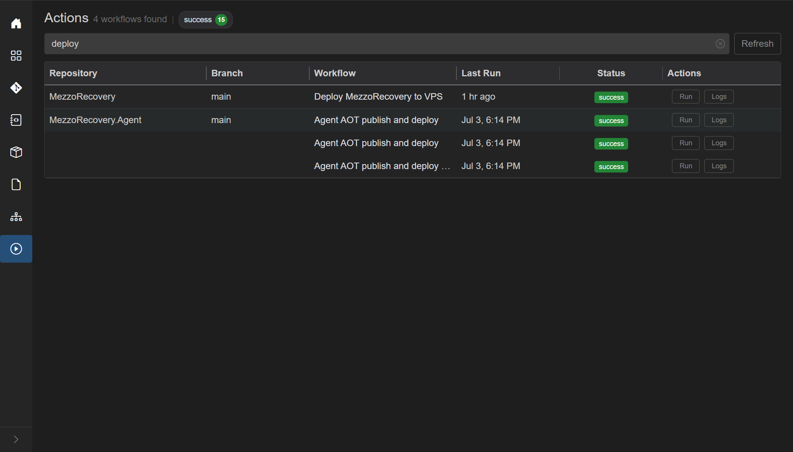

## Grid columns

Grouped by repository (repo name and branch repeat on the first workflow row, and on any running row). Running workflows get a highlight and an embedded live terminal row.

| Column | What it shows | Interaction |
| --- | --- | --- |
| Repository | Name, linked to GitHub | |
| Branch | Current branch, or `-` | |
| Workflow | Workflow name | Link to the workflow on GitHub |
| Last Run | Relative time (e.g. "1 hr ago", "just now"); tooltip is local `yyyy-MM-dd HH:mm:ss`; `never` if no run | |
| Status | [Action badge](#status-badge) | Click (when it is a link) opens the GitHub run |
| Actions | **Run** / **Re-run** / **Abort** / **Logs** | See below |

### Status badge

| Label | Color | Meaning |
| --- | --- | --- |
| none | gray | No verified status |
| success | green | All checks passed |
| running | orange | In progress |
| failed | red | Failed |
| aborted | violet | Cancelled |
| error | red | Repo-level load error (tooltip = message) |

### Row actions

Exactly one primary run control, depending on state:

- **Run** - `workflow_dispatch` on the current branch (hidden if the workflow YAML does not allow it - those rows may only show **Logs**, e.g. **Build MezzoRecovery App**)
- **Re-run** - failed run; split **Run again** when dispatch is also allowed
- **Abort** - cancel an in-progress run on GitHub
- Spinners replace the label while that line's run/abort is in flight

**Logs** - opens a modal that fetches job lists and full log text for that run (on demand, not polled).

Header **Re-run** (when any failed row exists):

- **Re-run** - re-run failed workflows
- **Re-run Failed Jobs Only**
- **Run again** (when those workflows support `workflow_dispatch`) - new run on the current branch

## Run: Deploy MezzoRecovery to VPS

On MezzoRecovery, **Deploy MezzoRecovery to VPS** supports **Run** (`workflow_dispatch`). Last run was success; **Run** starts a **new** run on `main`.

After **Run**:

- Overlay briefly: **Re-running actions...** (same overlay for dispatch and re-run)
- Status becomes orange **running**, Last Run **just now**
- Row action becomes **Abort**
- A **running 1** chip appears next to **success 14**
- An extra row under the workflow is the [live terminal](#live-terminal) (jobs/steps on the left)

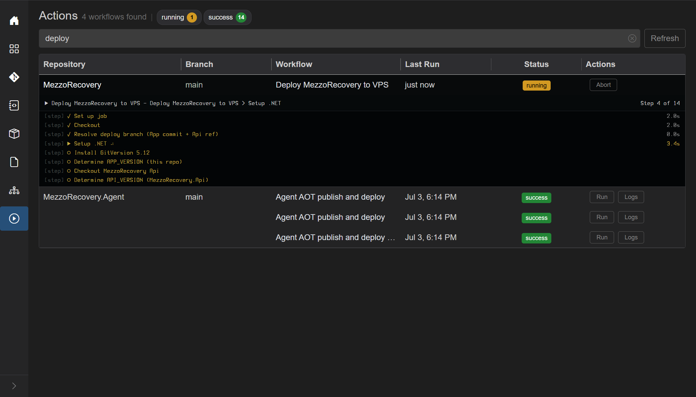

This run went through **Setup .NET**, GitVersion, and the remaining deploy steps (14 steps). When GitHub finishes, status returns to **success**, **Run** / **Logs** come back, and the running chip disappears.

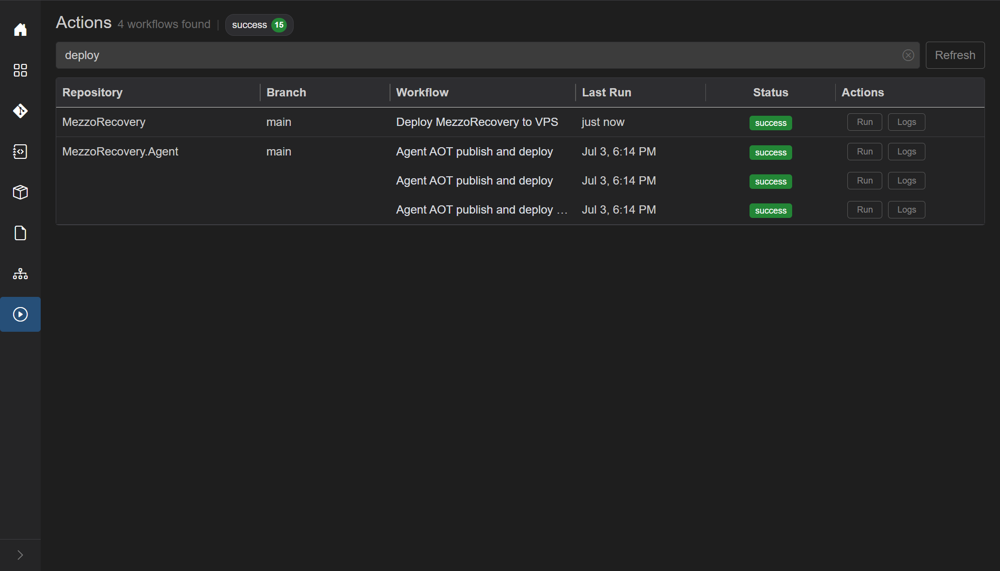

### Logs after the run

**Logs** opens a large modal. Title is the workflow name, repository, and GitHub run id (`MezzoRecovery #31831139339`). Job pills across the top select which job's log to show. Groups (runner image, OS, token permissions, steps) are expandable. Footer: **Download**, **Collapse** / **Expand**, optional **Error** / **Warning** filters, **Close**.

Logs are fetched once when the modal opens (job list, then full text per job). They are not tailed live - use the embedded terminal while the run is in progress.

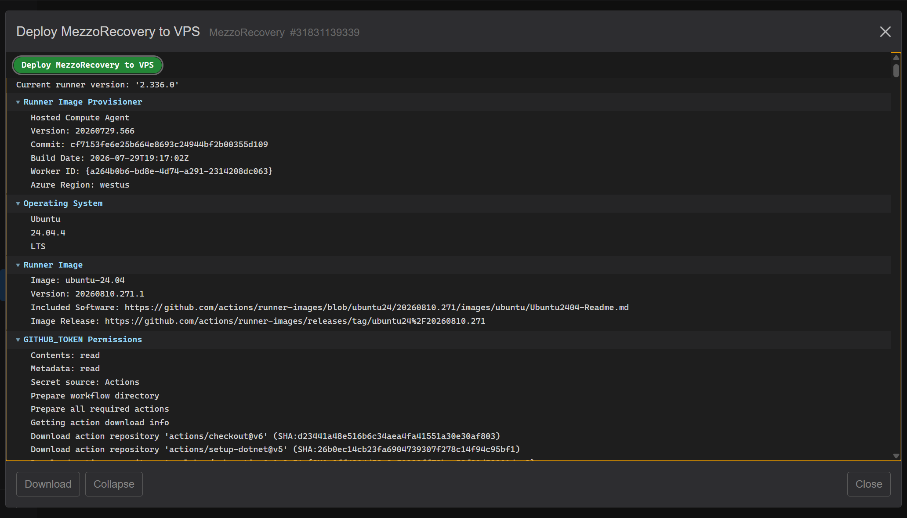

### Download

**Download** (footer, left) saves the **raw** GitHub job logs as a `.log` file in the browser - the same text GitHub returns, not the parsed groups you see in the modal. It is enabled once jobs have loaded (disabled only while the spinner is showing or if the run has no jobs). Outline styling makes it look quiet on the dark footer; it is still clickable.

Filename: `{workflow-name}-{runId}.log`. Spaces and `/` in the workflow name become hyphens. The Release run below downloads as `Release-31830736712.log`.

If the run has **more than one job**, the file concatenates them with a header per job:

```
=== JOB: Validate and resolve ===
...raw log...

=== JOB: Build and release ===
...raw log...
```

A single-job run (Deploy MezzoRecovery to VPS) is just that job's raw log, no `=== JOB:` banner. Missing job text is stored as `(no log available)`.

### Collapse / Expand

Groups open by default (`<details>` expanded): blue chevron down, body visible.

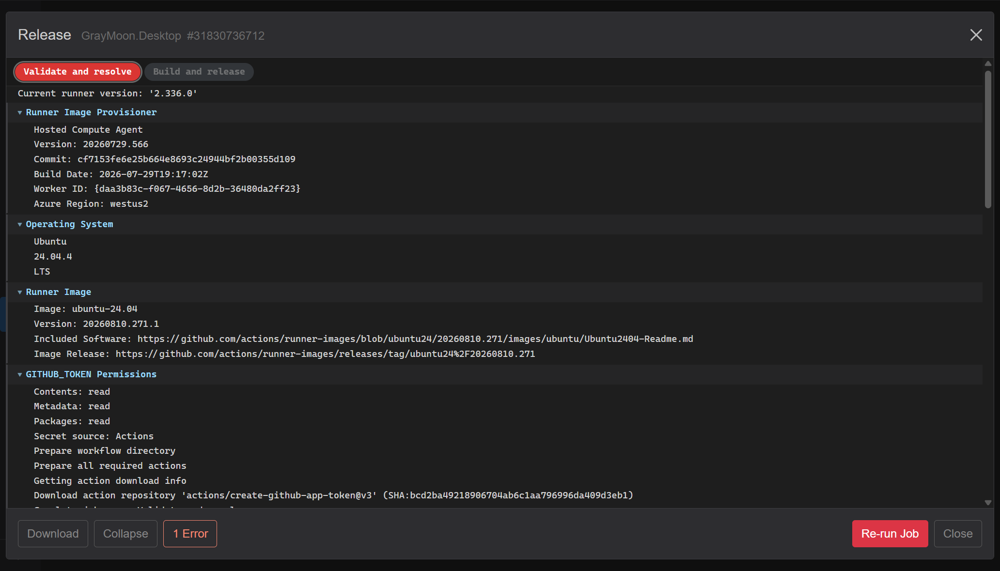

**Collapse** folds **every** group at once. Chevrons turn sideways, only the group titles remain (the failed `Run OWNER="Jandini"` step stays marked with a red chevron). The same button relabels to **Expand**.

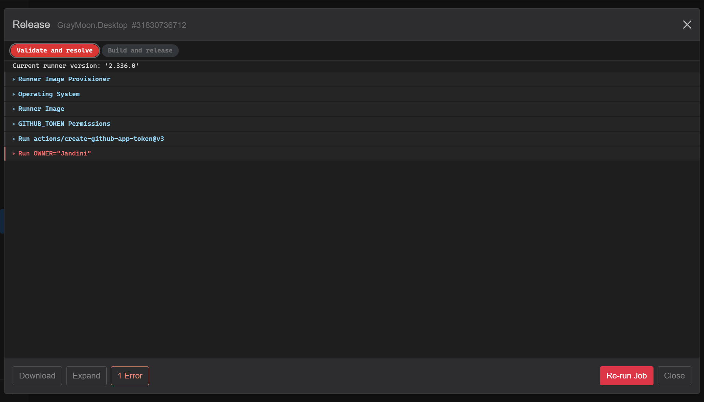

You can still open one group by clicking its title. **Expand** opens all groups again. This is independent of **1 Error** / **Warning** filters: those hide groups; Collapse only changes whether remaining groups are open.

### Live terminal

While a workflow is running for the current branch, the extra row under that workflow shows a split live feed (jobs/steps on the left, log-like output on the right). Colors follow Settings terminal green/yellow; errors stay red. Step markers: check = done, play = current, empty = queued, X = failed step.

## Failed workflow (workspace 1)

Workspace 1 (`/workspaces/1`, GrayMoon + GrayMoon.Desktop on `functionality-documentation`) is the mixed-status case: **failed 1**, **success 1**, **none 3**. Header **Re-run** is red because a failed row exists.

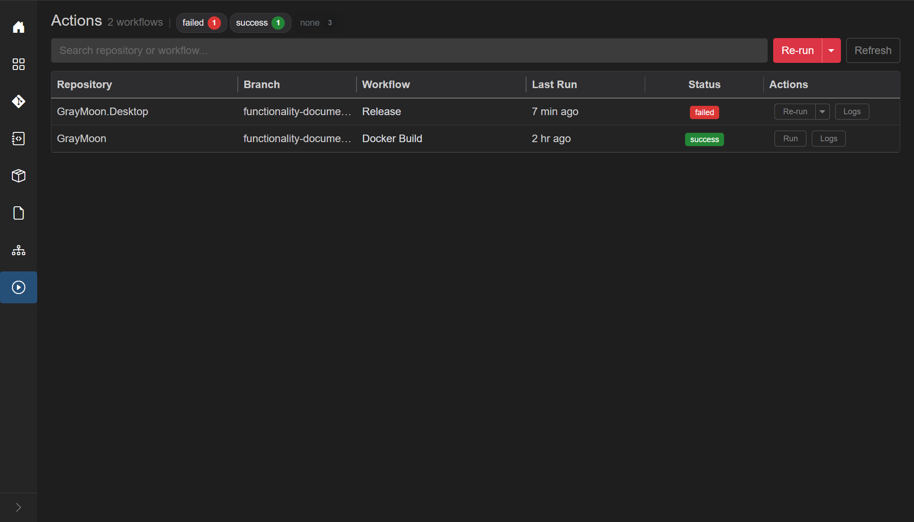

Turn **success** and **none** off to leave only **failed**. Subtitle **1 workflow**. The remaining row is **GrayMoon.Desktop** / **Release** / red **failed**, with row **Re-run** (split) and **Logs**.

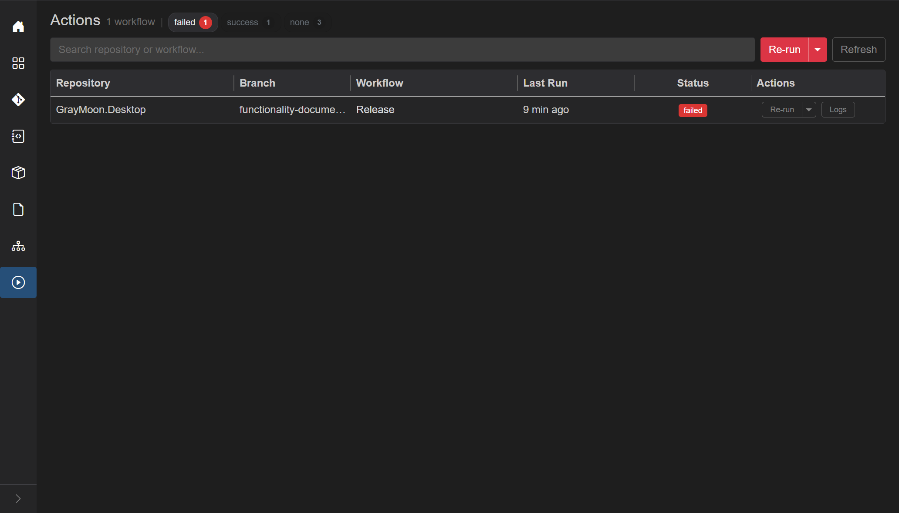

**Re-run** starts another GitHub run of that failed workflow (not a dispatch). Status goes **running**, live terminal appears. This Release job fails again on **Resolve GrayMoon SHA** - Re-run does not fix the workflow; it only repeats it. That is still useful: you can watch the live steps, then open **Logs** for the error.

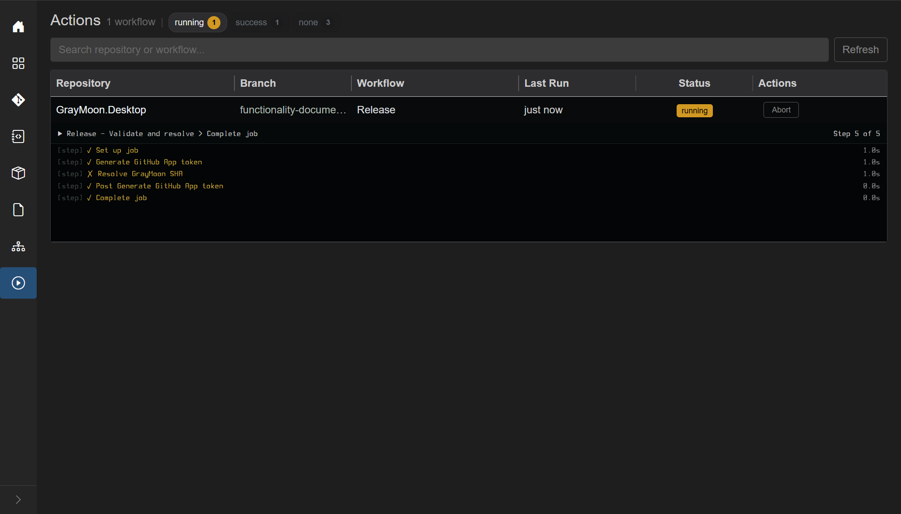


**Logs** for the failed run: two jobs (**Validate and resolve** red, **Build and release** not started). Footer **Download**, **Collapse**, **1 Error**, and **Re-run Job**. Same Download / Collapse behavior as [above](#download).

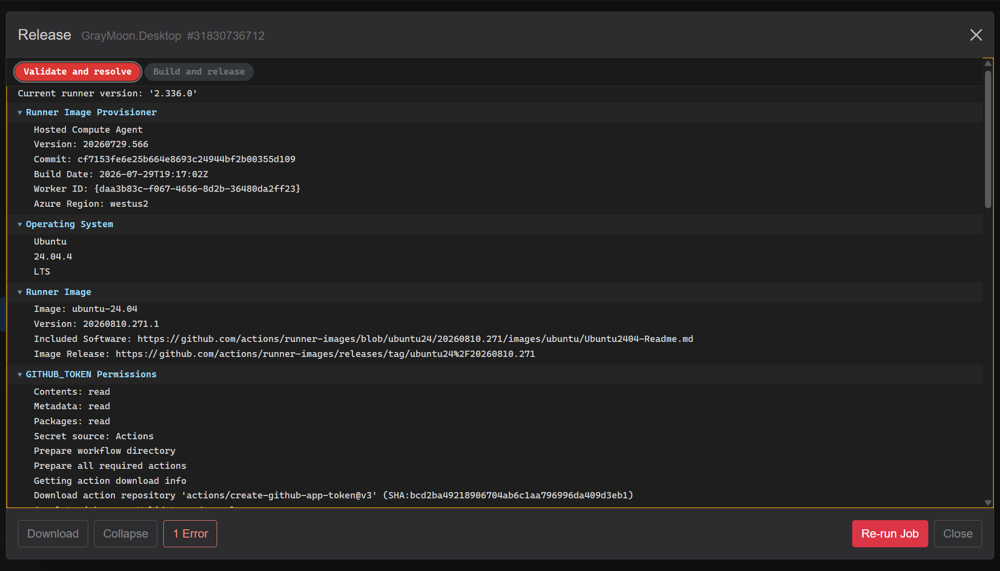

Click **1 Error** to keep only error groups/lines. Here the script requests `graymoon_source=latest-tag` and GitHub has no releases/tags on GrayMoon yet - Re-run will keep failing until that is true. The modal is how you see that without leaving GrayMoon.

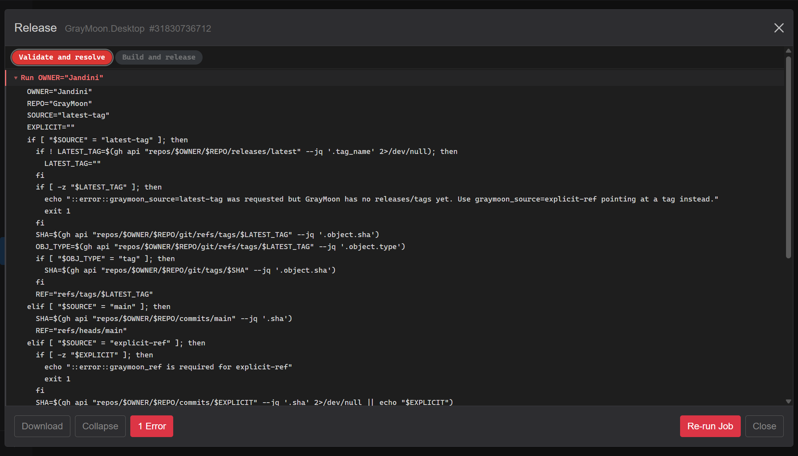
