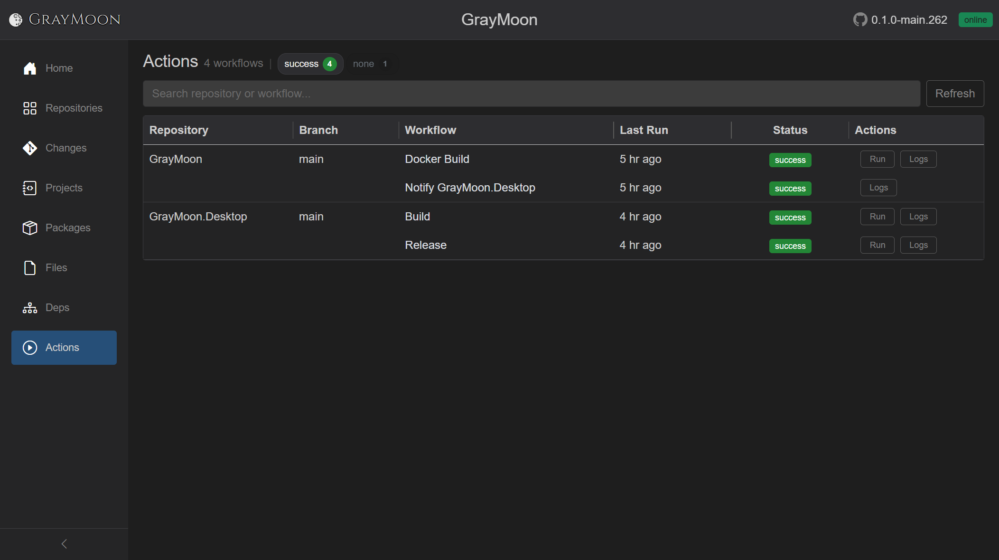

# Workspace Actions

Route: `/workspaces/{id}/actions`

GitHub Actions workflows for every repository in the workspace, on the repo's current branch. Status is live-polled while runs are active.

## Header

- Title: **Actions**
- Subtitle: `N workflow(s)` or `N workflow(s) found`
- Status filter chips (only statuses that currently exist are shown). Each chip is a toggle (on = included):

  | Chip | Meaning |
  | --- | --- |
  | errors | Failed to load workflows for a repo |
  | failed | Last run failed |
  | aborted | Last run cancelled |
  | running | In progress |
  | success | Last run succeeded |
  | none | No run / unknown |

  Counts sit on the chip (colored). Turning a chip off hides those rows. Combined with search: "No workflows match your search." vs "No workflows match the current filters."

- [Filter search](../shared.md#filter-search-shared) - "Search repository or workflow..."
- **Re-run** (red split, only if any failed rows exist):
  - **Re-run** - re-run failed workflows
  - **Re-run Failed Jobs Only**
  - **Run again** (when those workflows support `workflow_dispatch`) - new run on the current branch
- **Refresh** - reload all workflow statuses (spinner on the button while refreshing)

## Grid columns

Grouped by repository (repo name and branch repeat on the first workflow row, and on any running row). Running workflows get a highlight and an embedded live terminal row.

| Column | What it shows | Interaction |
| --- | --- | --- |
| Repository | Name, linked to GitHub | |
| Branch | Current branch, or `-` | |
| Workflow | Workflow name | Link to the workflow on GitHub |
| Last Run | Relative time (e.g. "4 hr ago"); tooltip is local `yyyy-MM-dd HH:mm:ss`; `never` if no run | |
| Status | [Action badge](#status-badge) | Click (when it is a link) opens the GitHub run |
| Actions | **Run** / **Re-run** / **Abort** / **Logs** | See below |

### Status badge

| Label | Color | Meaning |
| --- | --- | --- |
| none | gray | No verified status |
| success | green | All checks passed |
| running | orange | In progress |
| failed | red | Failed |
| aborted | violet | Cancelled |
| error | red | Repo-level load error (tooltip = message) |

### Row actions

Exactly one primary run control, depending on state:

- **Run** - `workflow_dispatch` on the current branch (hidden if the workflow YAML does not allow it - those rows may only show **Logs**)
- **Re-run** - failed run; split **Run again** when dispatch is also allowed
- **Abort** - cancel an in-progress run on GitHub
- Spinners replace the label while that line's run/abort is in flight

**Logs** - opens a modal that fetches job lists and full log text for that run (on demand, not polled).

### Live terminal

While a workflow is running for the current branch, an extra row under that workflow shows a split live feed (jobs/steps on the left, log-like output on the right). Colors follow Settings terminal green/yellow; errors stay red.
