# Workspace Changes

Route: `/workspaces/{id}/changes`

Combined git status for **every repository in the workspace**: one tree, one commit box, one Monaco diff. Stage, unstage, and commit without opening each repo in a separate IDE window.

Visual Studio's Git Changes window stops at **25 repositories** in a solution. GrayMoon does not have that cap. The page is the workspace: MezzoRecovery is 11 repos here; a larger workspace is the same UI.

Updates are watcher-driven. The browser does not poll. The Agent watches working trees and pushes snapshots to the App; this page re-reads the persisted projection. You can edit in Cursor, Visual Studio, VS Code, or `git` on the CLI. GrayMoon stays current. Commit wherever is comfortable - the [notification card](../shared.md#workspace-action-notification-cards) and Repositories grid pick up outgoing commits through git hooks even when this tree is empty.

The two-repo GrayMoon workspace looks like this (new markdown file selected):

The walkthrough below is MezzoRecovery (`/workspaces/2`, 11 repos) on `new-branch-demo` after [New Branch](new-branch.md) and [Update Only / Push Only](repositories.md#update-vs-push-updated). Working trees started clean.

## MezzoRecovery: review comments across 1, then 2, then 5 repos

Empty: **No changes**, **Refresh**, header `0 of 11 repositories`, `0 staged`, `0 changed`, branch `new-branch-demo`.

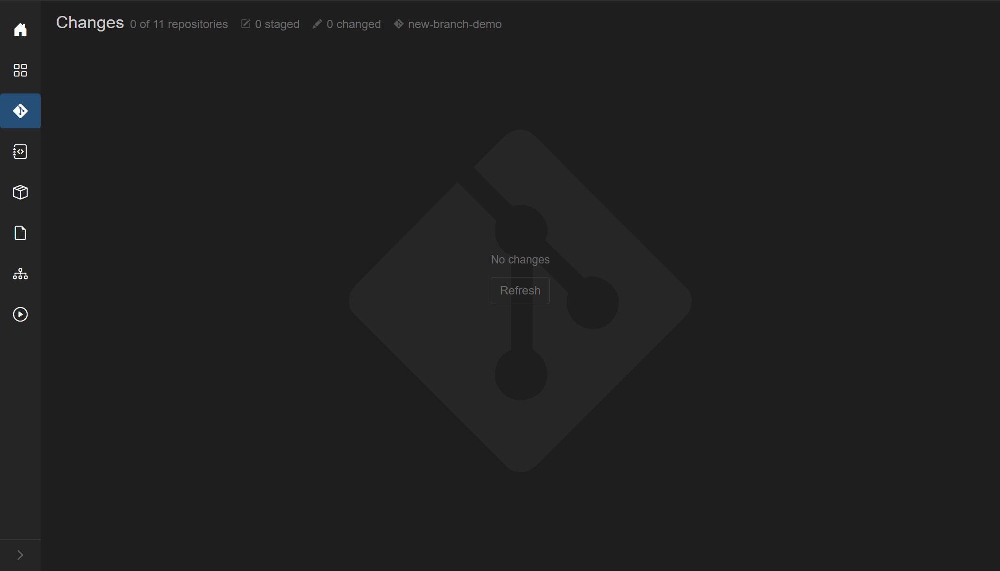

A one-line comment was added to `MezzoRecovery.Api` `Program.cs` on disk (the same kind of small edit an AI or a teammate would leave). The watcher picked it up: header **1 of 11 repositories**, **1 changed**. Click the file for a side-by-side diff (**Index** vs **Working Tree**). Status letter **M**.

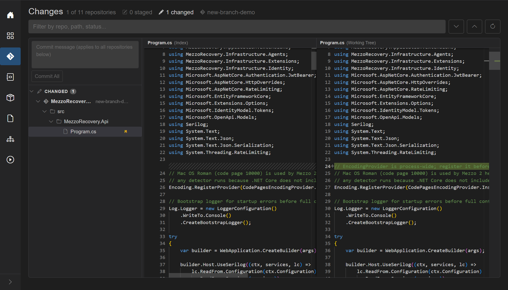

A second comment in `MezzoRecovery.Agent` `Program.cs`. Header **2 of 11**. Same commit box still applies to every repo in the tree. You do not switch windows to compare the two edits.

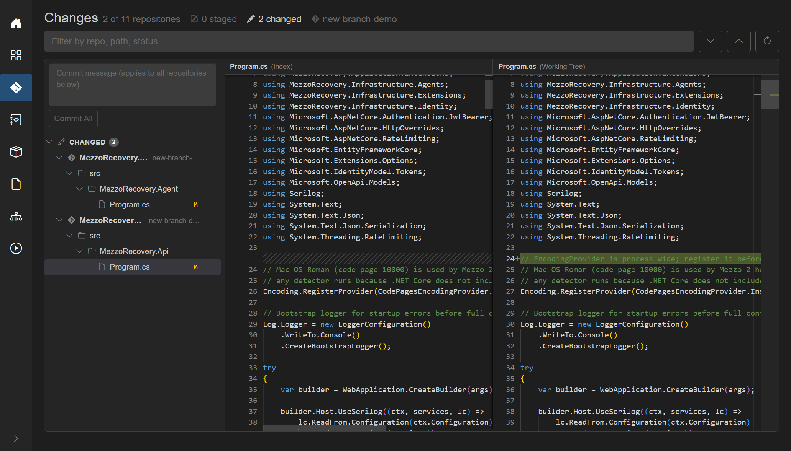

Three more comment-only edits (`TapeTools` `Program.cs`, `Tape` `TapeCloneService.cs`, `Mezzo` `MezzoServiceFactory.cs`) plus a second file in Api (`AgentHub.cs`). Header **5 of 11 repositories**, **6 changed**. One place to review AI-generated (or any) comments across the graph.

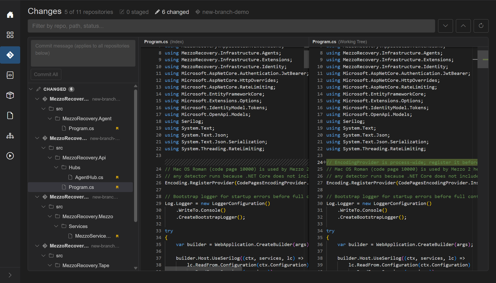

That is the point of this page: the workspace is the review surface, not 5 (or 50) separate Git Changes windows.

## Stage and unstage

Each row has **+** (stage) or **-** (unstage): file, folder, whole repository, or the entire **Changed** / **Staged** section.

Staging only `MezzoRecovery.Api` `Program.cs` splits the tree: **STAGED (1)** and **CHANGED (5)**. The primary button becomes **Commit Staged**. Api still has `AgentHub.cs` unstaged. Diff labels for a staged file are **(HEAD)** vs **(Index)**.

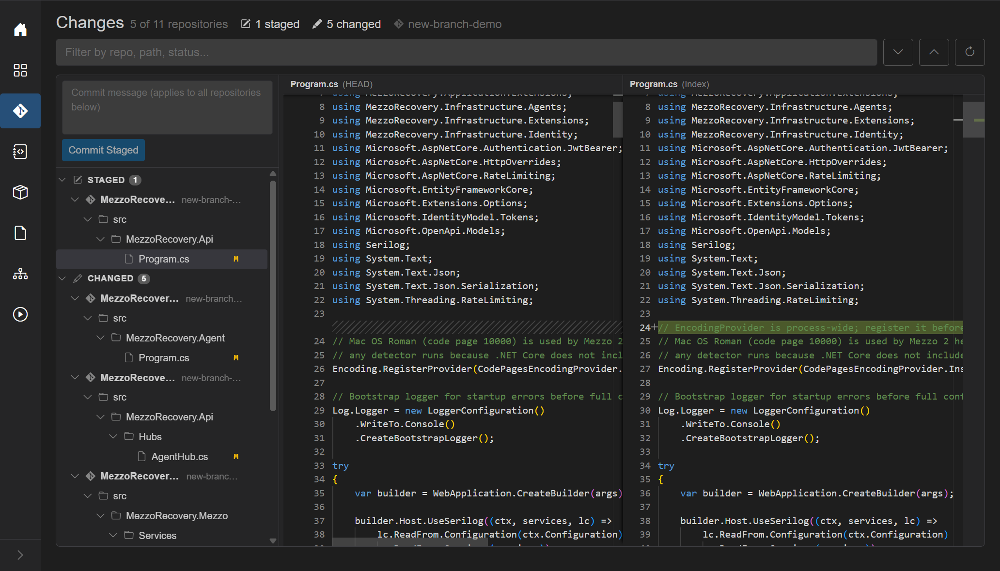

**-** on that file puts it back. Header returns to **0 staged**, **6 changed**, button **Commit All**.

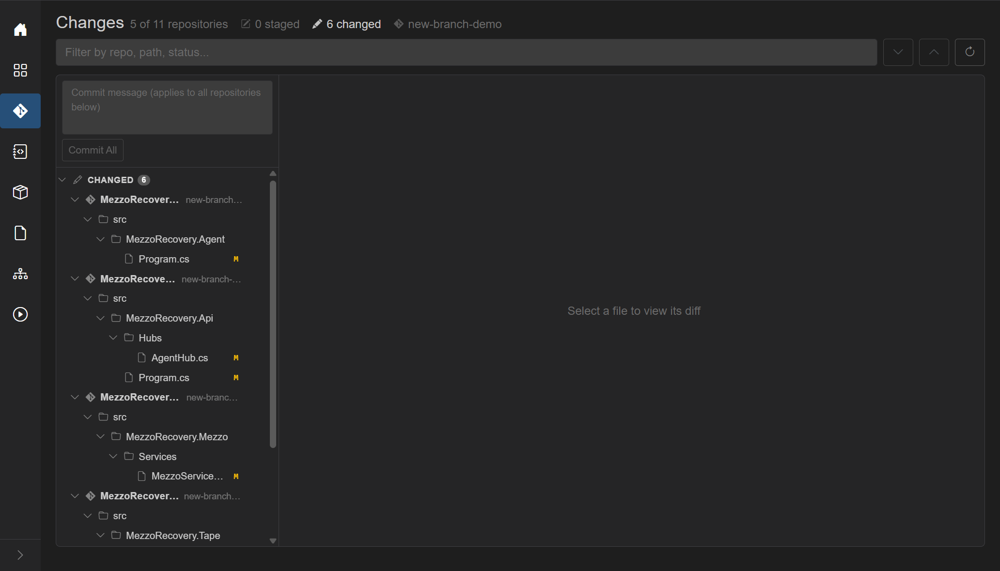

Staging two whole repos (Agent and Tape) is the same **+** on the repository rows. **2 staged**, **4 changed**, **Commit Staged** again. Unstaged files are left alone when you commit staged.

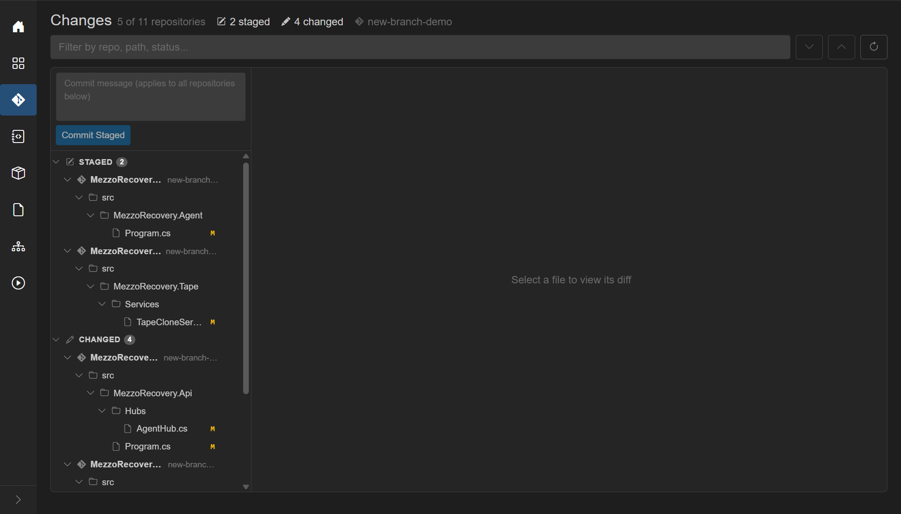

## Commit Staged, then Commit All

One message box at the top of the left pane. Placeholder: **Commit message (applies to all repositories below)**. The same text is used for each git commit, in parallel. Draft is remembered if you leave the page.

- **Commit All** - when nothing is staged. Stages everything then commits in each repo that has changes.
- **Commit Staged** (blue) - when any repo has staged files. Only staged paths are committed.

**Commit Staged** with `chore: document agent formatter and tape clone logging` committed Agent and Tape. Toast **Committed in 2 repositories.** Remaining three repos stayed in **CHANGED**. The floating card appeared at once: **commits ready to push** (and, because those commits moved GitVersion on package repos, some consumers also show unmatched `N of M`).

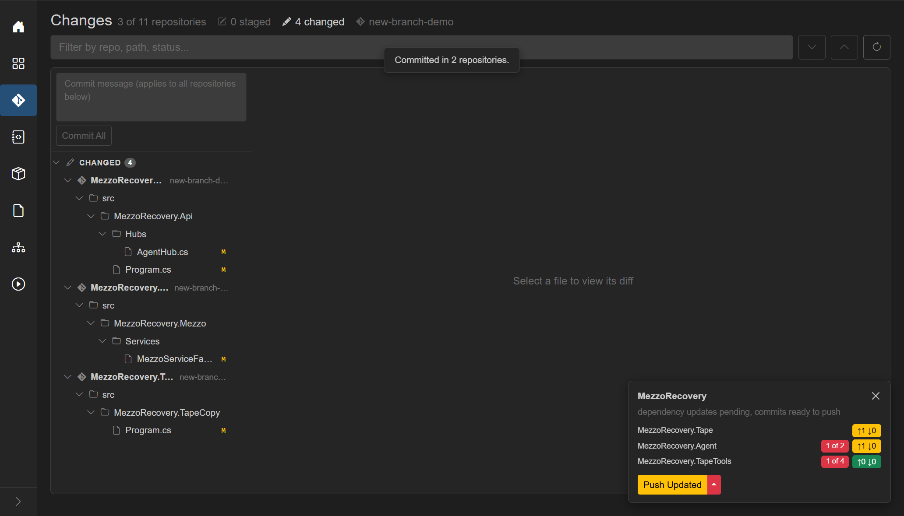

**Commit All** on the rest (`chore: document host startup, hub policy, and format detection`) cleared the tree: **No changes**, `0 of 11`. Outgoing commits do **not** live in this tree. They live on the card.

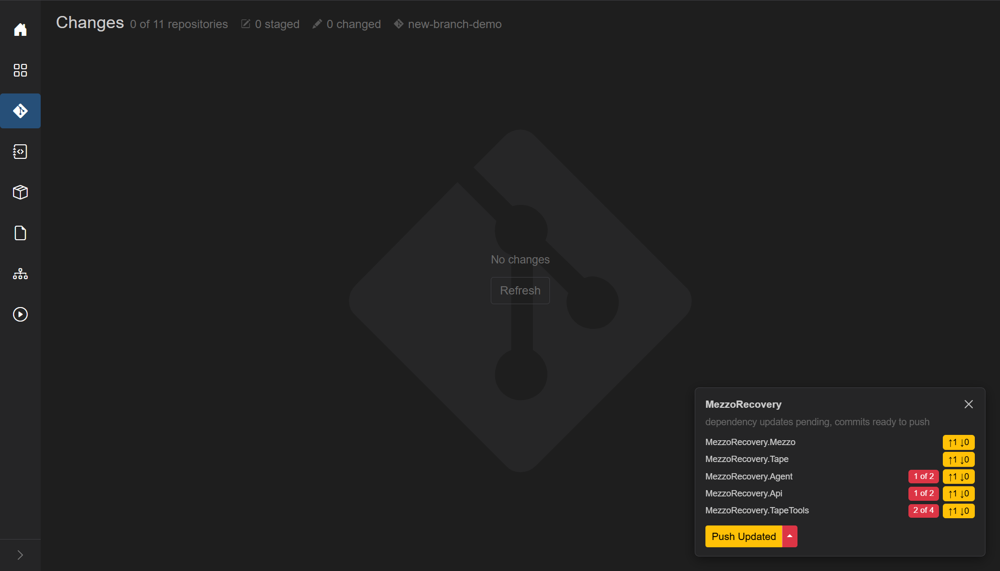

GrayMoon is tracking. You could have made those same commits in Visual Studio or `git commit` in a terminal. Hooks (`post-commit`, and `pre-push` later) update the Agent; the card and the Repositories grid stay honest. This page is optional, not a gate.

## Push from the card

The card on Changes is the same [workspace action notification](../shared.md#workspace-action-notification-cards) as on Agent and other non-Repositories pages. After the comment commits it listed Mezzo, Tape, Agent, Api, TapeTools with yellow `↑1 ↓0`. Some rows also had red unmatched-dep badges: a commit in a package repo bumps GitVersion, so consumers look out of date until **Update**. That is expected, not a failed commit.

The card primary was yellow **Push Updated** (unmatched deps + outgoing, no incoming). This run used the caret **Push Only**: push the comment commits without another `.csproj` rewrite. Combined **Push Updated** is [documented on Repositories](repositories.md#update-vs-push-updated) and will be shown as one click later.

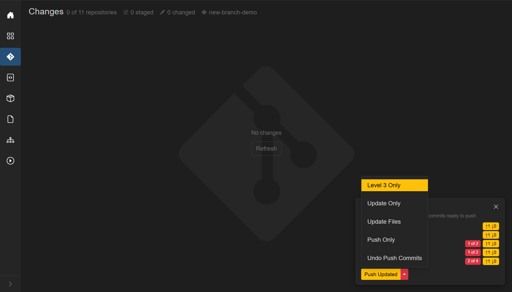

After **Push Only**, every `↑1` dropped off. The working tree was already empty. The card shrank to **dependency updates pending** on the consumers (Agent, Api, TapeTools). Those badges stay until an Update (or until the next demo drops these branches).

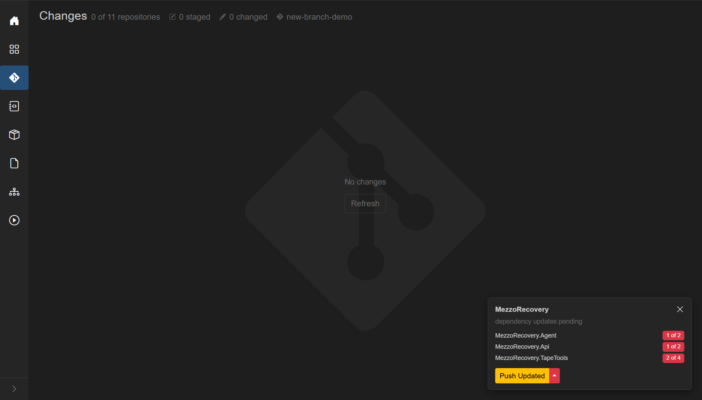

## Header

- Title: **Changes**
- Summary (when the view has loaded):
  - `N of M repositories` - how many repos currently have changes
  - staged count (pencil-square icon) - emphasized when > 0
  - changed (unstaged) count (pencil icon) - emphasized when > 0
  - branch label (git icon): the common branch name, `multiple` if repos disagree, or `-`. Tooltip lists `branch: count` per group
- Empty summary: "No changed repositories."

When **any** repo has changes, extra header controls appear:

- [Filter search](../shared.md#filter-search-shared) - "Filter by repo, path, status..."
- **Next change** / **Previous change** (chevrons) - jump hunks in the Monaco diff. Disabled until a diffable file is selected.
- **Refresh** - rescan every repository in the workspace (tooltip explains this).

## Search fields

Plain terms match **repository name**, **path**, and **original path** (renames).

Field prefixes:

- `repo:` - repository name
- `status:` - `modified`, `added`, `deleted`, `renamed`, `copied`, `untracked`, `conflict` / `unmerged`, `typechanged`
- `staged:` - `true` / `false`
- `ext:` - file extension (`cs`, `.cs` both work)

No matches: "No changes match the current filter."

## Empty state

Large muted git icon, **No changes**, and **Refresh**.

While a refresh of an empty workspace is running: spinner, status text such as "Refreshing repositories...", and **Abort**.

## Split layout (when there are changes)

Draggable splitter.

### Left: commit box + tree

See [Commit across repositories](#commit-across-repositories) for the shared message box and **Commit All** / **Commit Staged**.

Tree rows (indent by depth):

| Kind | Icon | Extra | Actions |
| --- | --- | --- | --- |
| Repository | git | branch name | +/- stage or unstage the whole repo |
| Section | pencil-square (Staged) or pencil (Changed) | count badge | +/- stage/unstage all in that section |
| Folder | folder | | +/- stage/unstage the folder |
| File | file | status letter; rename shows `<- old path` | +/- stage or unstage that file |

Status letters: **A** added/untracked, **M** modified, **D** deleted, **R** renamed, **C** copied, **T** type changed, **U** conflict/unmerged. Color classes: added, deleted, renamed, modified, conflict.

Click a file to select it (highlight). Click a folder/repo/section to expand/collapse.

While a file/folder mutation runs, that row's +/- becomes a spinner. Repo-wide stage/unstage uses the page loading overlay instead.

Optional **offline notice** banner if the agent is unreachable.

### Right: diff

- Placeholder: "Select a file to view its diff" or "Loading diff..."
- Monaco side-by-side for text: labels **(HEAD)** vs **(Index)** when staged, or **(Index)** vs **(Working Tree)** when unstaged.
- Non-Monaco states: "Binary file changed" (with byte sizes), "File is too large to diff automatically.", "File encoding is not supported for preview."

## Commit across repositories

One message box at the top of the left pane commits every repository that currently has matching changes. You do not pick repos one by one.

- **Commit message** textarea (max 10000 chars, no spellcheck). Placeholder: "Commit message (applies to all repositories below)". The draft is remembered if you leave the page and come back.
- **Commit All** - shown when nothing is staged. Outline until a message is typed, then solid primary. Tooltip: "Stages all changes then creates one commit in each repository using the same message." Disabled while a job runs or the message is empty.
- **Commit Staged** (blue) - replaces **Commit All** when any repo has staged files. Tooltip: "Creates one commit in each staged repository using the same message." Unstaged files in those repos are left uncommitted.

Repos with no matching changes are skipped. Overlay progress is `Committing in N repositories...` (or a single repo name when N is 1), then `Committed k of N repositories...`. A toast reports how many succeeded; failures are listed by repo name.

If any target repo is on its default branch, a warning lists those repos before anything is written: committing would go straight to the protected default branch. **Proceed** continues; **Cancel** aborts.

The agent must be online. Empty message shows the error toast "Enter a commit message."

When every repo is clean, the page shows **No changes**. Outgoing (unpushed) commits do not appear in this tree; they show on the floating [notification card](../shared.md#workspace-action-notification-cards). The header still says `0 of 2 repositories` because the working trees are clean - the Agent is separately tracking the unpushed commit on **GrayMoon** (`↑1 ↓0`). **Push** on the card applies to every listed repo in that workspace.

The same card appears on [Agent](../05-agent.md#live-git-tracking) and other pages. If the commit is pushed outside GrayMoon, the Agent updates the counts and the card goes away.
