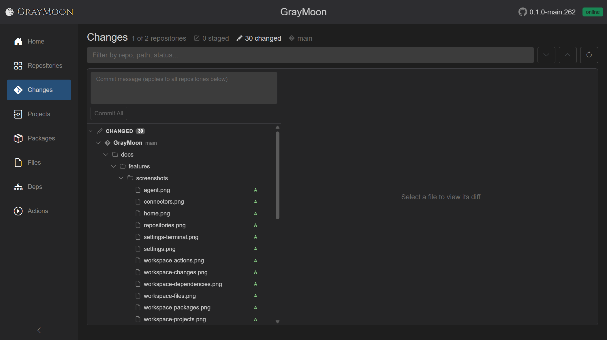
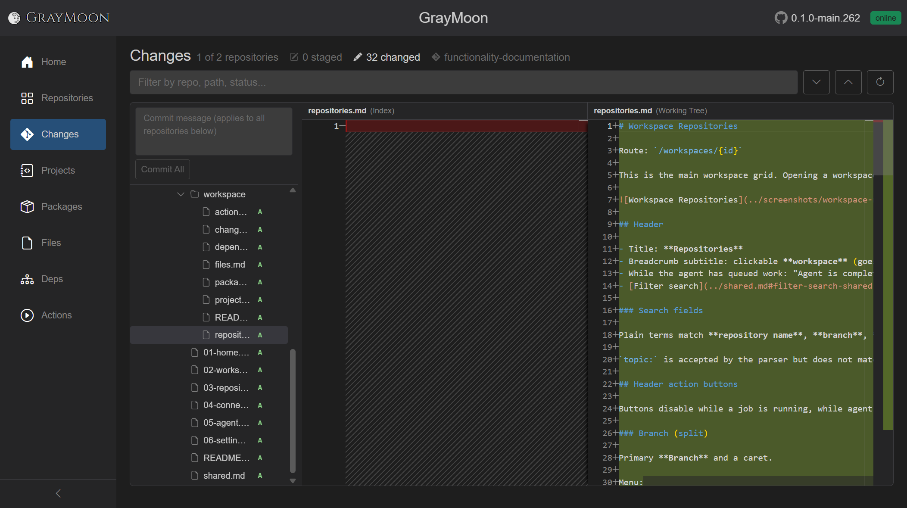
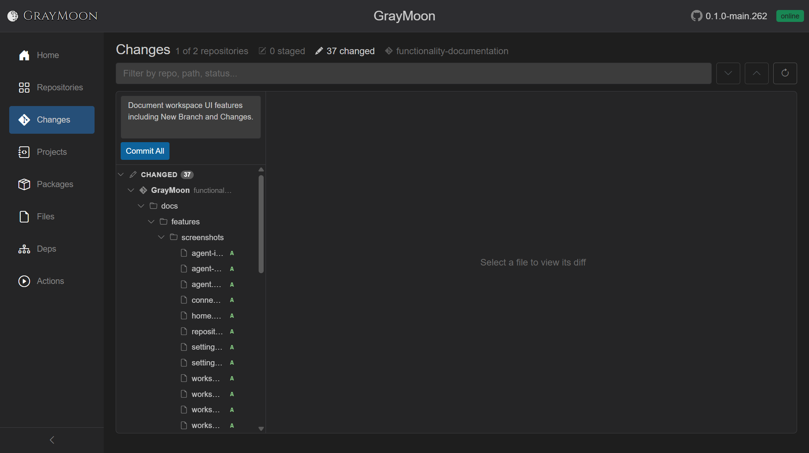
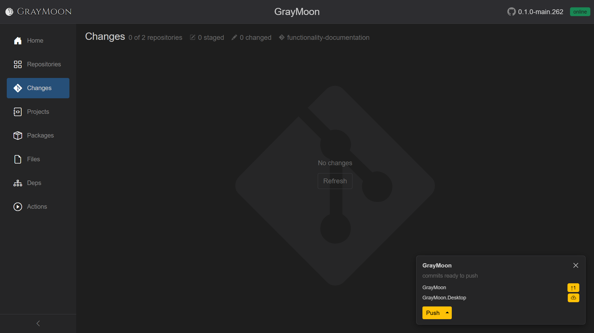

# Workspace Changes

Route: `/workspaces/{id}/changes`

Combined git status for every repository in the workspace: file tree, stage/unstage, commit, and a Monaco diff viewer. Updates are watcher-driven (the page does not poll from the browser). After [New Branch](repositories.md#new-branch), the header branch label is the new common name (here `functionality-documentation`).

Click a file in the tree to load its diff. New files show an empty **(Index)** pane (hashed) and the full working-tree content as added lines:

## Header

- Title: **Changes**
- Summary (when the view has loaded):
  - `N of M repositories` - how many repos currently have changes
  - staged count (pencil-square icon) - emphasized when > 0
  - changed (unstaged) count (pencil icon) - emphasized when > 0
  - branch label (git icon): the common branch name, `multiple` if repos disagree, or `-`. Tooltip lists `branch: count` per group
- Empty summary: "No changed repositories."

When **any** repo has changes, extra header controls appear:

- [Filter search](../shared.md#filter-search-shared) - "Filter by repo, path, status..."
- **Next change** / **Previous change** (chevrons) - jump hunks in the Monaco diff. Disabled until a diffable file is selected.
- **Refresh** - rescan every repository in the workspace (tooltip explains this).

## Search fields

Plain terms match **repository name**, **path**, and **original path** (renames).

Field prefixes:

- `repo:` - repository name
- `status:` - `modified`, `added`, `deleted`, `renamed`, `copied`, `untracked`, `conflict` / `unmerged`, `typechanged`
- `staged:` - `true` / `false`
- `ext:` - file extension (`cs`, `.cs` both work)

No matches: "No changes match the current filter."

## Empty state

Large muted git icon, **No changes**, and **Refresh**.

While a refresh of an empty workspace is running: spinner, status text such as "Refreshing repositories...", and **Abort**.

## Split layout (when there are changes)

Draggable splitter.

### Left: commit box + tree

See [Commit across repositories](#commit-across-repositories) for the shared message box and **Commit All** / **Commit Staged**.

Tree rows (indent by depth):

| Kind | Icon | Extra | Actions |
| --- | --- | --- | --- |
| Repository | git | branch name | +/- stage or unstage the whole repo |
| Section | pencil-square (Staged) or pencil (Changed) | count badge | +/- stage/unstage all in that section |
| Folder | folder | | +/- stage/unstage the folder |
| File | file | status letter; rename shows `<- old path` | +/- stage or unstage that file |

Status letters: **A** added/untracked, **M** modified, **D** deleted, **R** renamed, **C** copied, **T** type changed, **U** conflict/unmerged. Color classes: added, deleted, renamed, modified, conflict.

Click a file to select it (highlight). Click a folder/repo/section to expand/collapse.

While a file/folder mutation runs, that row's +/- becomes a spinner. Repo-wide stage/unstage uses the page loading overlay instead.

Optional **offline notice** banner if the agent is unreachable.

### Right: diff

- Placeholder: "Select a file to view its diff" or "Loading diff…"
- Monaco side-by-side for text: labels **(HEAD)** vs **(Index)** when staged, or **(Index)** vs **(Working Tree)** when unstaged.
- Non-Monaco states: "Binary file changed" (with byte sizes), "File is too large to diff automatically.", "File encoding is not supported for preview."

## Commit across repositories

One message box at the top of the left pane commits every repository that currently has changes. You do not pick repos one by one: the same text is used for each git commit, in parallel.

- **Commit message** textarea (max 10000 chars, no spellcheck). Placeholder: "Commit message (applies to all repositories below)". The draft is remembered if you leave the page and come back.
- **Commit All** - shown when nothing is staged. Outline until a message is typed, then solid primary. Tooltip: "Stages all changes then creates one commit in each repository using the same message." Disabled while a job runs or the message is empty.
- **Commit Staged** (blue) - replaces **Commit All** when any repo has staged files. Tooltip: "Creates one commit in each staged repository using the same message." Unstaged files in those repos are left uncommitted.

Repos with no matching changes are skipped. Overlay progress is `Committing in N repositories...` (or a single repo name when N is 1), then `Committed k of N repositories...`. A toast reports how many succeeded; failures are listed by repo name.

If any target repo is on its default branch, a warning lists those repos before anything is written: committing would go straight to the protected default branch. **Proceed** continues; **Cancel** aborts.

The agent must be online. Empty message shows the error toast "Enter a commit message."

When every repo is clean, the page shows **No changes**. Repos that now have outgoing (unpushed) commits appear on the floating [notification card](../shared.md#workspace-action-notification-cards) with **Push**:

