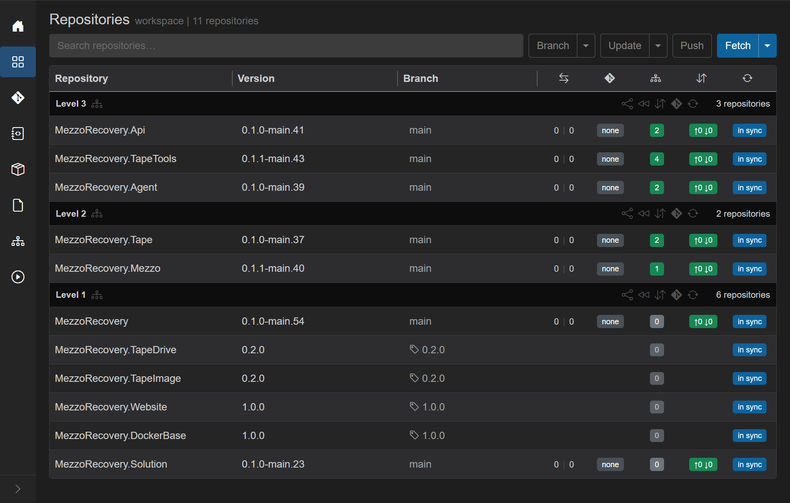
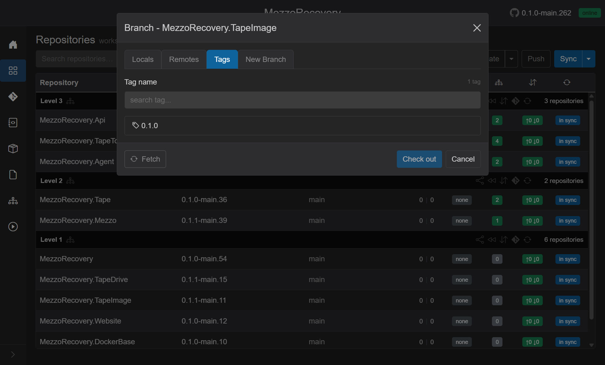
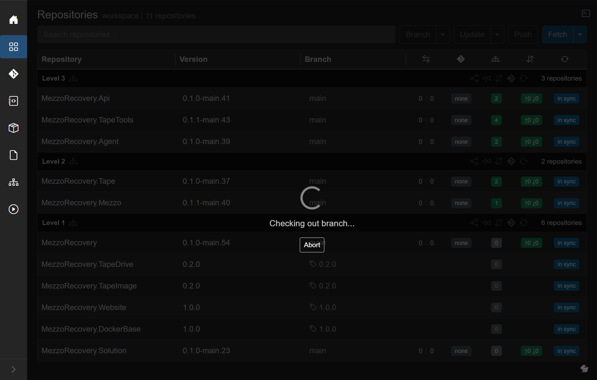
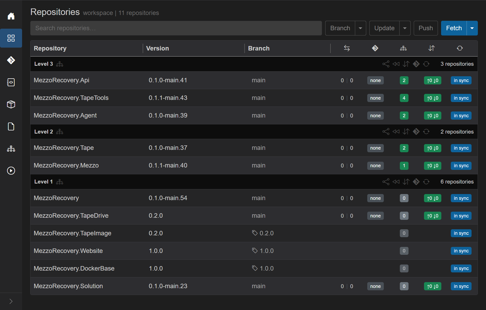
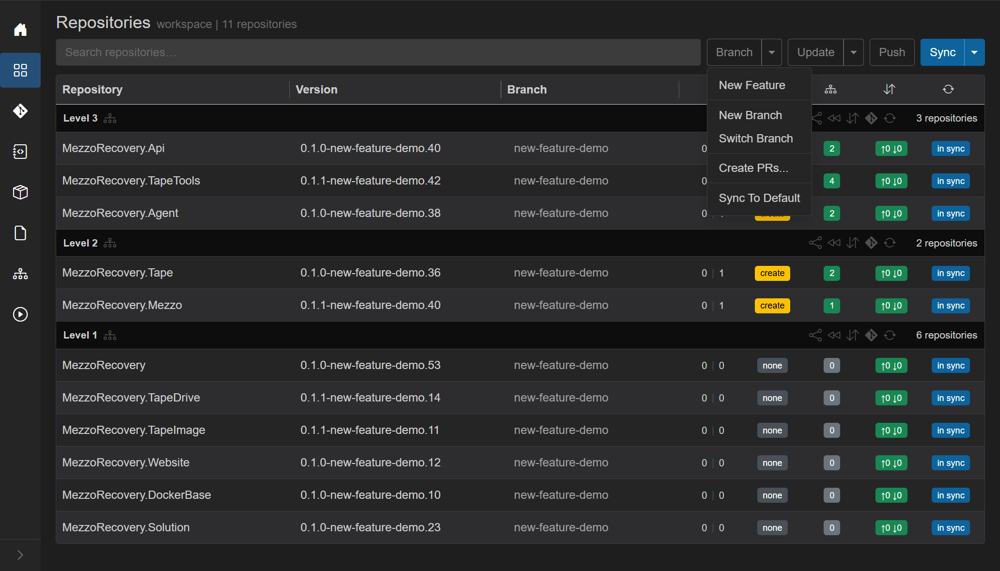
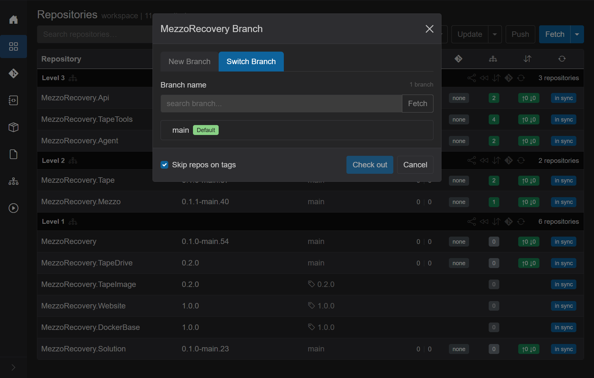
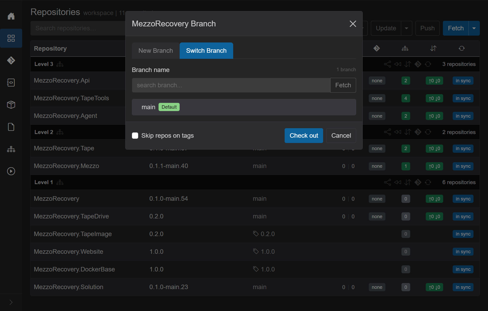
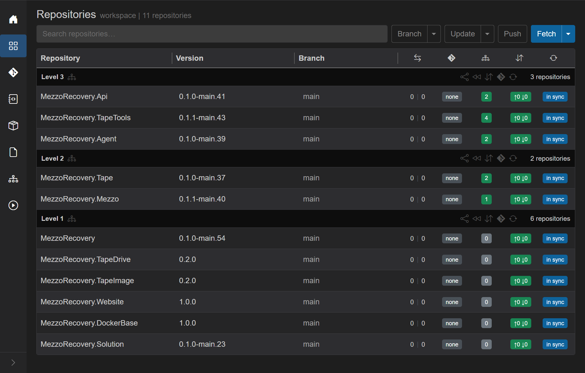

# Checkout from tags to default branch

Route: Repositories (`/workspaces/{id}`).

After workflows like [library-update](library-update-feature-walkthrough/README.md) or [tag upgrade](tag-upgrade.md), some Level 1 repos may stay **frozen on release tags** while the rest of the workspace is on `main`. GrayMoon suppresses divergence, PR, and commit badges on those rows until you check out a branch again.

This page shows two ways to move tag-pinned repos back to the default branch (`main`):

1. **Per-repo** - click one tag, open the branch dialog, check out `main` for that clone only.
2. **Workspace-wide** - header **Branch** caret, **Switch Branch**, select `main`, and **uncheck Skip repos on tags** so tagged repos are included in the checkout.

Both paths only run `git checkout` - they do not delete branches, rewrite `.csproj` files, or push. For abandoning a feature branch entirely, use [Sync To Default](sync-to-default.md) instead.

Walkthrough workspace: **MezzoRecovery** (`/workspaces/2`). Starting state after [Phase 5](library-update-feature-walkthrough/phase-5-merging-prs.md): four Level 1 repos on tags (**TapeDrive** / **TapeImage** `0.2.0`, **Website** / **DockerBase** `1.0.0`); all other repos already on `main`.

## Starting state

| Repo | Branch column | Frozen? |
| --- | --- | --- |
| **MezzoRecovery.TapeDrive** | tag `0.2.0` | yes |
| **MezzoRecovery.TapeImage** | tag `0.2.0` | yes |
| **MezzoRecovery.Website** | tag `1.0.0` | yes |
| **MezzoRecovery.DockerBase** | tag `1.0.0` | yes |
| All other repos | `main` | no |

Tooltip on a tag cell: *Repository is pinned to a tag. Click to switch.*

See [frozen grid behavior](repository-branch-management.md#frozen-on-the-repositories-grid) for what disappears while a repo is on a tag.

## Method 1 - One repo at a time (per-repo branch dialog)

Use this when you only need to unfreeze one or two repos, or when tagged repos should move to `main` at different times.

### Step 1 - Click the tag in the Branch column

On **MezzoRecovery.TapeDrive**, click the **Branch** cell (tag icon + `0.2.0`).

GrayMoon opens **Branch - MezzoRecovery.TapeDrive** on the **Tags** tab with **Current** on the active tag (same dialog shell as [repository branch management](repository-branch-management.md); Tags tab example from **TapeImage**):

### Step 2 - Switch to Locals and select main

Open the **Locals** tab. Select **`main`** (the repo default). **Check out** enables because the clone is still pinned to the tag, not on `main`.

Click **Check out**. A brief Agent job runs (**Checking out...**). The dialog closes.

### Step 3 - Repeat for other tag repos (if needed)

**TapeDrive** now shows **`main`** in the **Branch** column with full divergence / PR / commit badges restored. The other three tag repos are unchanged until you repeat the same steps on each row.

Per-repo checkout details (all four tabs, Fetch, delete branch): [repository-branch-management.md](repository-branch-management.md).

## Method 2 - All repos at once (workspace Switch Branch)

Use this when every tag-pinned repo should land on `main` in one job.

### Step 1 - Open Switch Branch

Header **Branch** caret -> **Switch Branch**. Same dialog as [switch-branch.md](switch-branch.md) (**MezzoRecovery Branch**, **Switch Branch** tab).

### Step 2 - Select main

Pick **`main`** (green **Default** badge). The list shows only branch names that exist in **every** repository in the workspace.

### Step 3 - Skip repos on tags (default)

When at least one repo is on a tag, the footer shows **Skip repos on tags**. It defaults to **checked**:

With the box **checked**, tagged repos are **excluded** from the checkout. **Check out** moves only repos already on a branch (here, the eight repos already on `main` - a no-op). **TapeDrive**, **TapeImage**, **Website**, and **DockerBase** stay on their tags.

That default matches [New Feature](new-feature.md) and [New Branch](new-branch.md): release-pinned repos are left alone unless you opt in.

### Step 4 - Uncheck Skip repos on tags

Clear **Skip repos on tags** to include tag-pinned repos in the workspace checkout:

Tooltip on the checkbox: *Repositories checked out on a tag will not be affected* (when checked). Unchecking removes that filter - all 11 repos are eligible for `git checkout main`.

Click **Check out**. Overlay **Checking out...** then **Checked out N of M**. Every repo, including the four that were on tags, moves to **`main`**.

### After workspace checkout

| Column | State |
| --- | --- |
| **Branch** | `main` on every row - no tag icons |
| **Version** | `*-main.*` GitVersion on branch repos |
| **Divergence / PR / Commits** | visible again on rows that were frozen |
| **Deps** | GrayMoon recomputes package badges against live GitVersion |

Run header **Sync** -> **Fetch** or a full **Sync** if you want remote tips and dependency math refreshed immediately after the checkout.

## Which method to use

| Situation | Prefer |
| --- | --- |
| Unfreeze one repo for a quick fix | Per-repo dialog (Method 1) |
| Move every tag-pinned repo to `main` after a feature lands | Workspace **Switch Branch** with **Skip repos on tags** off (Method 2) |
| Start a new feature but keep some repos on release tags | Workspace **New Feature** / **Switch Branch** with **Skip repos on tags** **on** (default) |
| Drop a feature branch and delete it | [Sync To Default](sync-to-default.md) - not Switch Branch |

## Related docs

- [Switch Branch](switch-branch.md) - workspace-wide checkout, common branch list, Fetch
- [Repository branch management](repository-branch-management.md) - per-repo Locals / Remotes / Tags / New Branch
- [Tag upgrade](tag-upgrade.md) - moving **to** a newer tag (opposite direction)
- [New Feature - Skip repos on tags](new-feature.md) - why tagged repos are skipped by default
