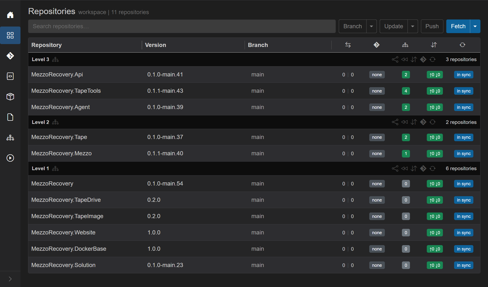
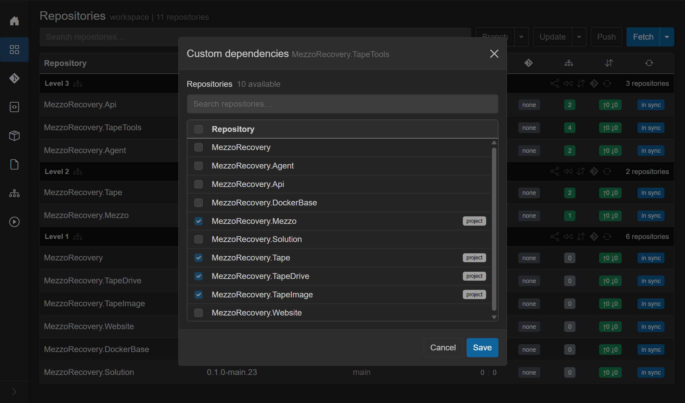
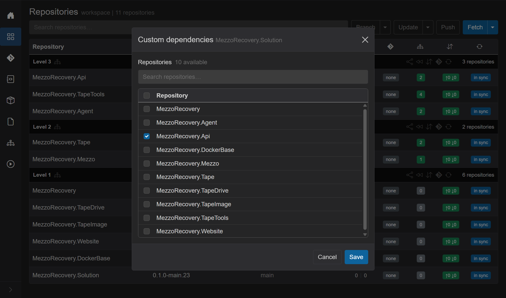
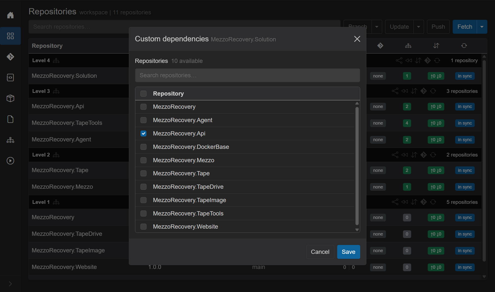

# Custom dependencies

Route: Repositories (`/workspaces/{id}`) - click the **dependencies** badge on a repository row.

**Custom dependencies** are user-declared ordering edges between workspace repositories. They are merged with csproj `PackageReference` edges (and version-file token edges, when configured) before Kahn's level sort. Use them when a repo has **no package reference** to another workspace repo, but you still want it to wait on that repo for Update, synchronized Push, and PR merge order.

Typical reason: bubble a repo that holds documentation, solution/config files, or release metadata to a **higher** level so its feature-branch PRs close **last**. Merge / Sync To Default still walks **lowest level first**, then higher levels - packages and libraries land before consumers, and the bubbled repo lands after everything it depends on.

Walkthrough workspace: **MezzoRecovery** (`/workspaces/2`).

## Levels with and without dependencies

On Repositories, dependency levels group the grid. Level **1** = no remaining workspace deps; higher levels depend on lower ones.

| Level | Repos | Deps badge (examples) |
| --- | --- | --- |
| **3** | Api, TapeTools, Agent | green `2`, `4`, `2` - csproj package deps |
| **2** | Tape, Mezzo | green `2`, `1` |
| **1** | MezzoRecovery, TapeDrive, TapeImage, Website, DockerBase, **Solution** | `0` - no workspace package edges |

Repos with a green count **have** project (and/or custom) dependencies. Repos with **`0`** do not - they sit on Level 1 unless you add a custom edge (or a version-file token later).

**TapeTools** is the rich csproj example (badge **4**). **Solution** starts with badge **0** on Level 1 - nothing in `.csproj` forces it above Api / TapeTools / Agent.

## Open the dialog

Click the dependencies badge on a row (tooltip / hint: manage custom dependencies). Title: **Custom dependencies** plus the dependent repo name.

### Example - TapeTools (many project dependencies)

Four repos are checked and tagged **`project`**: Mezzo, Tape, TapeDrive, TapeImage. Those come from `.csproj` `PackageReference` entries discovered by Sync. They are **visible and checked**, but the checkbox is **disabled** - you cannot clear a project dependency here. Change them in the csproj (then Sync), not in this dialog.

Unchecked rows (Api, Agent, Solution, Website, ...) are available as **custom** edges you can toggle.

| Badge in dialog | Meaning | Editable? |
| --- | --- | --- |
| **`project`** | Referenced from `.csproj` | No - locked |
| **`file`** | Referenced from a version-file token | No - locked (when version files are configured) |
| (none, checkbox enabled) | Optional custom dependency | Yes |

GrayMoon also hides or blocks candidates that would create a **cycle** in the combined graph.

## Why add a custom edge

GrayMoon orders multi-repo work by dependency level:

1. Update / Push wait level-by-level (packages publish before consumers restore).
2. Feature walkthroughs and Sync To Default prefer closing or rewinding **from lowest level to highest**.

A documentation or **Solution** repo often has no `PackageReference` to Api or tools, so it wrongly sits on Level 1 next to libraries. Declaring "Solution depends on Api" (or on another high-level consumer) moves Solution **above** that consumer so its PR is last.

## Demonstrate - Solution depends on Api

Goal: put **MezzoRecovery.Solution** on the highest level by depending on **MezzoRecovery.Api** (already Level 3).

1. Click Solution's deps badge **`0`**. Dialog opens with every other repo unchecked (no project locks).

2. Check **MezzoRecovery.Api**. No **`project`** badge - this is a custom edge only.

3. **Save**. GrayMoon recomputes levels and refreshes the grid (no git commit - the edge lives in GrayMoon's database).

### After Save

| | Before | After |
| --- | --- | --- |
| Solution level | Level **1** (with other `0`-dep repos) | Level **4** (alone at the top) |
| Solution deps badge | `0` | green **`1`** |
| Api / TapeTools / Agent | Level 3 | still Level 3 |
| Level 1 | 6 repos including Solution | 5 repos (Solution left) |

Re-open Solution's dialog: **Api** stays checked, checkbox **enabled**, no **`project`** badge - you can uncheck and Save to remove the edge.

With this edge, synchronized push and level Sync To Default treat Solution as waiting on Api's level. On a feature branch, close PRs Level 1 → 2 → 3 → **4** so Solution (config / docs / version files) merges last.

## What custom dependencies are not

- They do **not** rewrite `.csproj` or NuGet restores.
- They do **not** replace package version updates - unmatched deps badges still come from project/file version checks.
- Project (and file) edges remain authoritative; custom edges only **add** ordering.

## Related docs

- [Dependencies graph](dependencies.md) - visual graph of the same merged edges
- [Repositories - Dependencies badge](repositories.md#dependencies-badge) - badge click opens this dialog
- [Sync To Default](sync-to-default.md) - level order when discarding feature branches
- [Update / Push Updated](repositories.md#update-vs-push-updated) - level-by-level package publish wait
