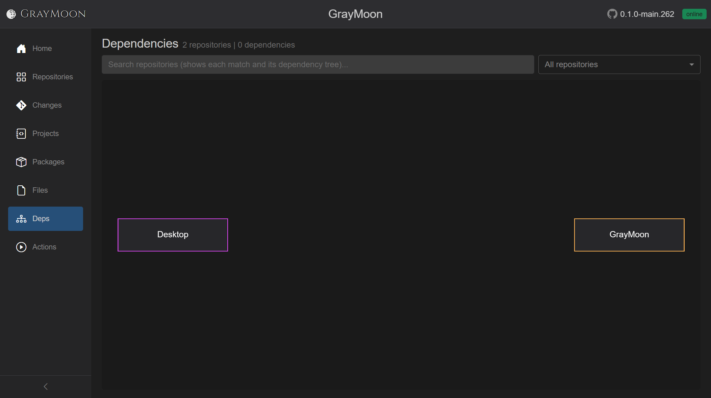

# Workspace Dependencies

Route: `/workspaces/{id}/dependencies`

Optional query: `?level={n}` or `?repo={repositoryId}` (used from level-header / "Show dependencies" links).

Interactive Cytoscape graph of workspace repositories and the edges between them (csproj PackageReference, file-config tokens, and user-declared custom dependencies).

## Header

- Title: **Dependencies**
- Subtitle: `N repositories | M dependencies` plus ` - matching search` when a search is active. "No dependency data" if the graph has no nodes.
- [Filter search](../shared.md#filter-search-shared) - "Search repositories (shows each match and its dependency tree)..." Matches **repository name** only (plain terms / boolean syntax). Search and the scope dropdown are mutually exclusive: while a search is typed, the scope dropdown is disabled ("Clear search to apply this scope to the graph.").
- **Scope dropdown** (default **All repositories**):
  - All repositories
  - **Level N** for each dependency level present
  - One item per repository name

Empty canvas: "No dependencies to display. Sync repositories to discover projects and dependencies."

No search hits: "No repositories match your search."

## Graph

- One node per repository (colored borders distinguish nodes).
- Edges are dependencies (consumer -> package / custom / file token).
- Search keeps each matching node **and its dependency tree**.
- Level or single-repo scope zooms the graph to that subset (same as following the diagram icon on a Repositories level header).
