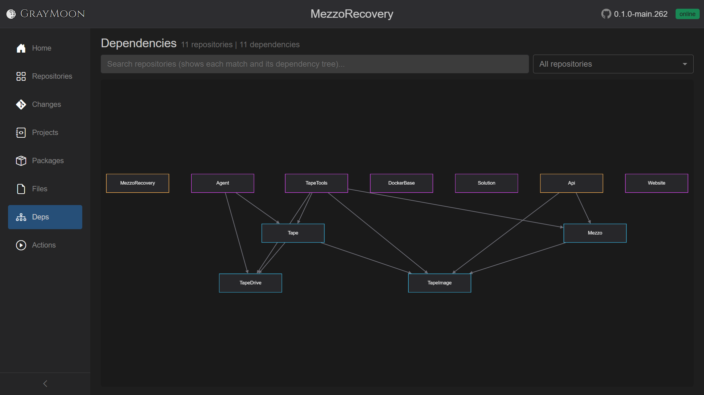
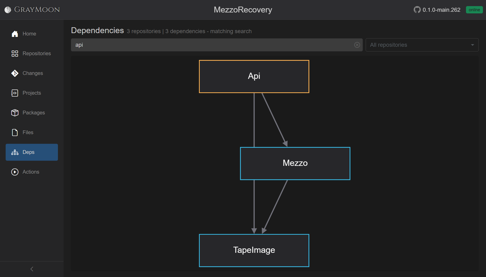
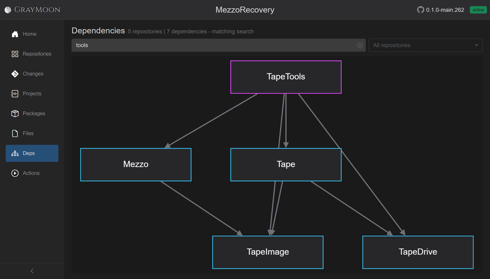

# Workspace Dependencies

Route: `/workspaces/{id}/dependencies`

Optional query: `?level={n}` or `?repo={repositoryId}` (used from level-header / "Show dependencies" links).

The two-repo GrayMoon graph is a single edge. A workspace with services, libraries, and tools shows the full fan-in: consumers at the top/sides, shared packages at the bottom.

In **MezzoRecovery** (11 repositories, 11 dependency edges):

- **Api** (service) depends on `Mezzo` and `TapeImage`.
- **TapeTools** (standalone tool) depends on `Tape` and `TapeImage`.
- **Agent** depends on `Tape` and `TapeDrive`.
- **Tape** (library package) depends on `TapeDrive` and `TapeImage`.
- **Mezzo** depends on `TapeImage`.
- **TapeDrive** and **TapeImage** are Level 1 packages used by several consumers.
- **MezzoRecovery**, **DockerBase**, **Solution**, and **Website** sit with no workspace package edges (standalone / infra).

That is why Update and synchronized Push walk **level by level**: Level 1 packages publish first, then Level 2, then the tools and services on Level 3.

Search keeps each matching node **and its dependency tree** (the packages it consumes). The subtitle becomes `N repositories | M dependencies - matching search`. The match itself uses a stronger border color.

`api` keeps **Api** plus `Mezzo` and `TapeImage` (3 repositories, 3 edges):

`tools` keeps **TapeTools** plus the libraries it uses (`Mezzo`, `Tape`, `TapeImage`, `TapeDrive` - 5 repositories, 7 edges):

Use one term at a time when you want a single consumer's tree. On Repositories, combine names with `or` instead (see [repositories.md](repositories.md#search-fields)).

Interactive Cytoscape graph of workspace repositories and the edges between them (csproj PackageReference, file-config tokens, and user-declared custom dependencies).

## Header

- Title: **Dependencies**
- Subtitle: `N repositories | M dependencies` plus ` - matching search` when a search is active. "No dependency data" if the graph has no nodes.
- [Filter search](../shared.md#filter-search-shared) - "Search repositories (shows each match and its dependency tree)..." Matches **repository name** only (plain terms / boolean syntax). Search and the scope dropdown are mutually exclusive: while a search is typed, the scope dropdown is disabled ("Clear search to apply this scope to the graph.").
- **Scope dropdown** (default **All repositories**):
  - All repositories
  - **Level N** for each dependency level present
  - One item per repository name

Empty canvas: "No dependencies to display. Sync repositories to discover projects and dependencies."

No search hits: "No repositories match your search."

## Graph

- One node per repository (colored borders distinguish nodes).
- Edges are dependencies (consumer -> package / custom / file token).
- Search keeps each matching node **and its dependency tree**.
- Level or single-repo scope zooms the graph to that subset (same as following the diagram icon on a Repositories level header).
