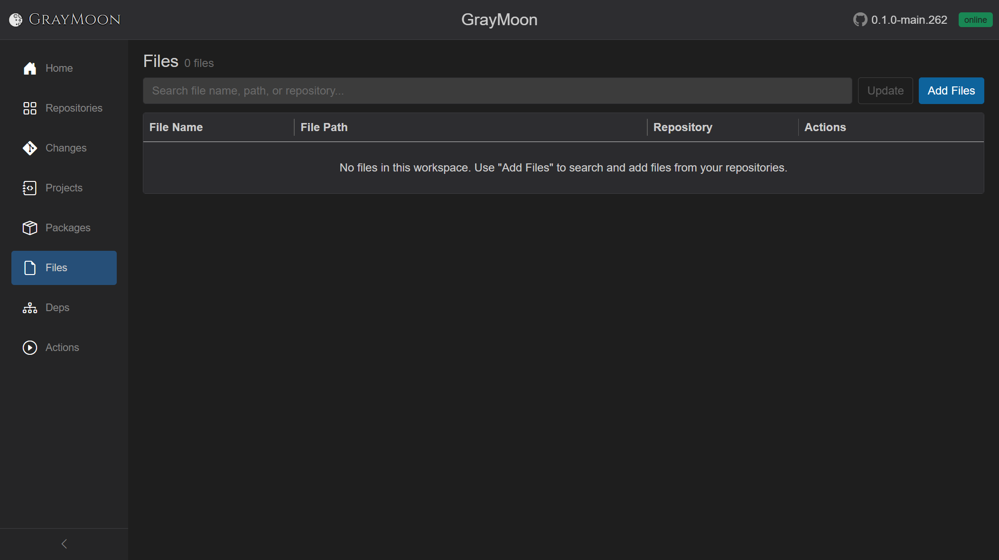

# Workspace Files

Route: `/workspaces/{id}/files`

Pin arbitrary files from workspace repos (version JSON, Dockerfiles, etc.) and optionally rewrite version tokens inside them.

## Header

- Title: **Files**
- Subtitle: `N file(s)` or `N file(s) found`
- [Filter search](../shared.md#filter-search-shared) - "Search file name, path, or repository..."
- **Update** (outline primary) - rewrite all configured file tokens to the expected workspace versions. Disabled until at least one file has a version config. Overlay with Abort. May open a commit modal afterward.
- **Add Files** (blue) - search-and-pick files from cloned repos.

Empty: "No files in this workspace. Use "Add Files" to search and add files from your repositories."

## Search fields

Plain terms match **file name**, **file path**, and **repository name**.

Field prefix:

- `repo:` - repository name

## Grid columns

| Column | What it shows | Actions |
| --- | --- | --- |
| File Name | Name; gray **Missing on disk** badge if the path vanished (excluded from dep/badge counts until restored) | |
| File Path | Path inside the repo | |
| Repository | Owning repo name, or `-` | |
| Actions | **View**, **Configure**, **Remove** | See below |

### Row actions

- **View** - modal with file contents. If already configured, can jump to Configure.
- **Configure** - outline when no pattern exists; **info (filled)** when a version config exists. Opens the version-pattern editor (`KEY={repositoryname}` lines mapping file tokens to workspace repo names).
- **Remove** - drop the file from the workspace list (does not delete it on disk).

Missing-on-disk tooltip: "File not found on disk; excluded from dependency and badge counts until restored."
