# Workspace Files (version files)

Route: `/workspaces/{id}/files`

Walkthrough workspace: **MezzoRecovery** (`/workspaces/2`).

**Version files** are ordinary repo files you pin in GrayMoon (`.env`, JSON, Dockerfiles, release metadata, etc.) plus an optional **version pattern**. The pattern maps line prefixes in the file to workspace repository names. GrayMoon then:

1. Treats those tokens as **file dependency edges** (same level graph as csproj / custom deps).
2. Compares each matched line's value to the owning repo's current workspace SemVer (`GitVersion` already stored on the link).
3. Lets you **Update** those lines in place (working tree only - no commit unless you choose a commit flow from Repositories).

Primary real-world use in this walkthrough: keep Compose image tags in `MezzoRecovery/docker/.env` pointed at the SemVer of `MezzoRecovery` and `MezzoRecovery.Api` so a local `docker compose` stack can run feature-branch (or `main`) builds without hand-editing tags.

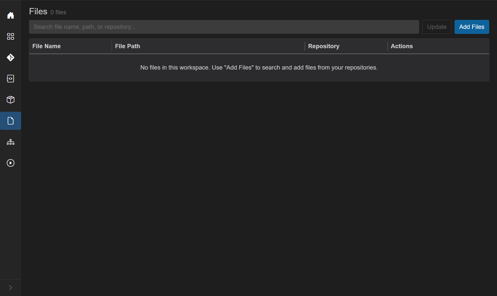

## Header

- Title: **Files**
- Subtitle: `N file(s)` or `N file(s) found`
- [Filter search](../shared.md#filter-search-shared) - "Search file name, path, or repository..." (disabled while empty / loading)
- **Update** (outline primary) - rewrite all configured file tokens to the expected workspace versions. Disabled until at least one file has a version config. Shows a loading overlay (Abort). Does **not** commit.
- **Add Files** (blue) - search-and-pick files from cloned repos via the Agent.

Empty: `No files in this workspace. Use "Add Files" to search and add files from your repositories.`

## Purpose

| Without version files | With version files |
| --- | --- |
| Compose / env / release files drift from repo SemVer | Tokens stay aligned with workspace versions |
| Host repo sits on Level 1 with no package edges | File tokens add **`file`** edges and bubble the host up the level sort |
| Manual tag edits before every local stack | **Update** rewrites tags in one click |

File-config tokens are merged into the same Kahn level sort as csproj `PackageReference` and [custom dependencies](custom-dependencies.md). Self-references (a file in repo A tokening `{A}`) still drive out-of-date line checks, but they do **not** create a graph edge (no self-loop). That mismatch is what produces the known badge bug **"2 of 1"** - see [TOFIX.md](../TOFIX.md).

---

## Walkthrough - pin and configure `docker/.env`

### 1. Open Files

Go to `/workspaces/2/files`. Start with no pinned files.


### 2. Add Files dialog

Click **Add Files**.

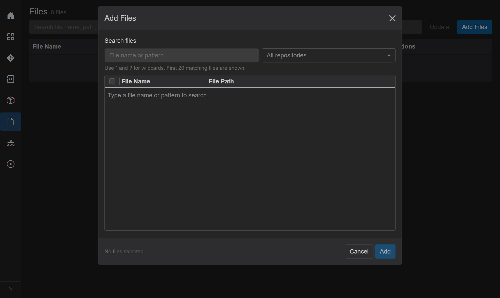

| Control | Behavior |
| --- | --- |
| **Search files** | File name or pattern. Debounced (~400 ms). `*` and `?` wildcards allowed. If you type a plain name with no wildcards, GrayMoon suffixes `*` (so `README` becomes `README*`). Bare `*` alone is rejected. First **20** matches shown. |
| **Repository dropdown** | Default **All repositories**. Narrows Agent search to one cloned workspace repo. |
| Results grid | Checkbox, **File Name**, **File Path** (shown as `Repo` or `Repo/dir`). Header checkbox selects all current results. |
| Footer | `N file(s) selected.` / **Cancel** / **Add** (enabled when at least one row is checked). |

Pinning only records the path in GrayMoon's DB - it does **not** copy or modify the file yet.

### 3. Search example - README across all repos

With **All repositories**, type `README`. Matches come back from many MezzoRecovery repos (host, Api, Agent, Tape*, Website, …).

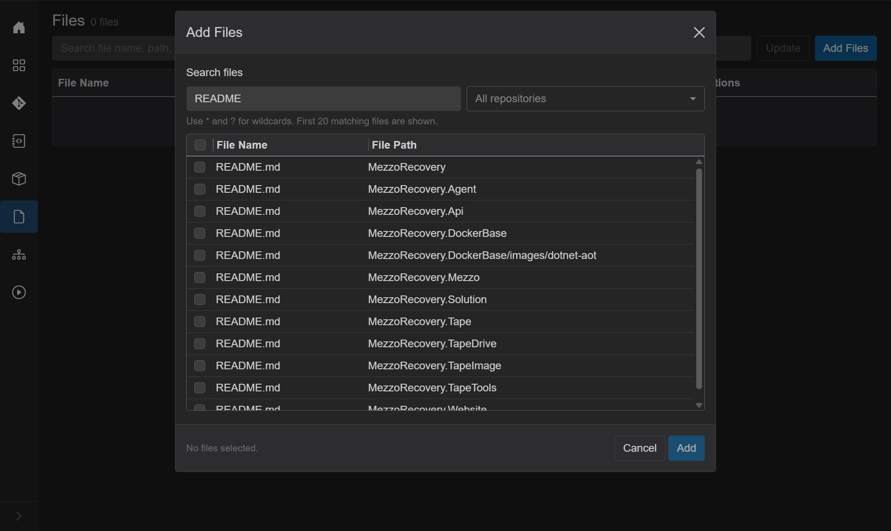

### 4. Narrow with the repository dropdown

Open the dropdown to pick a single repo.

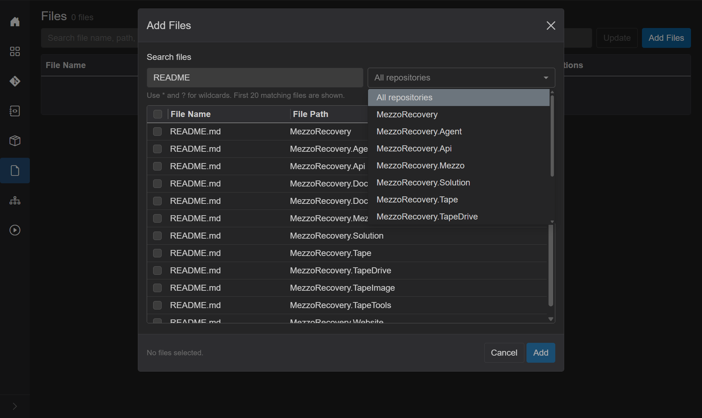

### 5. Find and add `MezzoRecovery/docker/.env`

1. Select **MezzoRecovery**.
2. Search `.env`.
3. Check **`.env`** at path **`MezzoRecovery/docker`** (leave `.env.dev` / `.env.prod` unchecked unless you want those too).
4. **Add**.

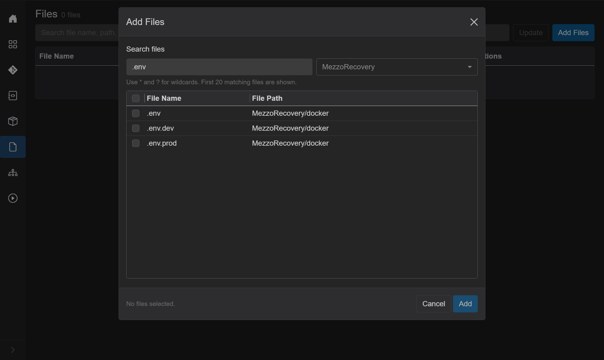

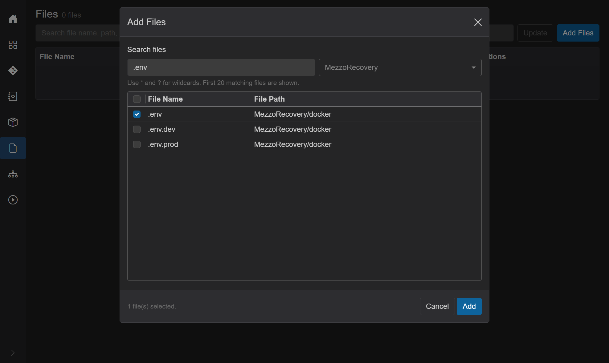

### 6. Files grid

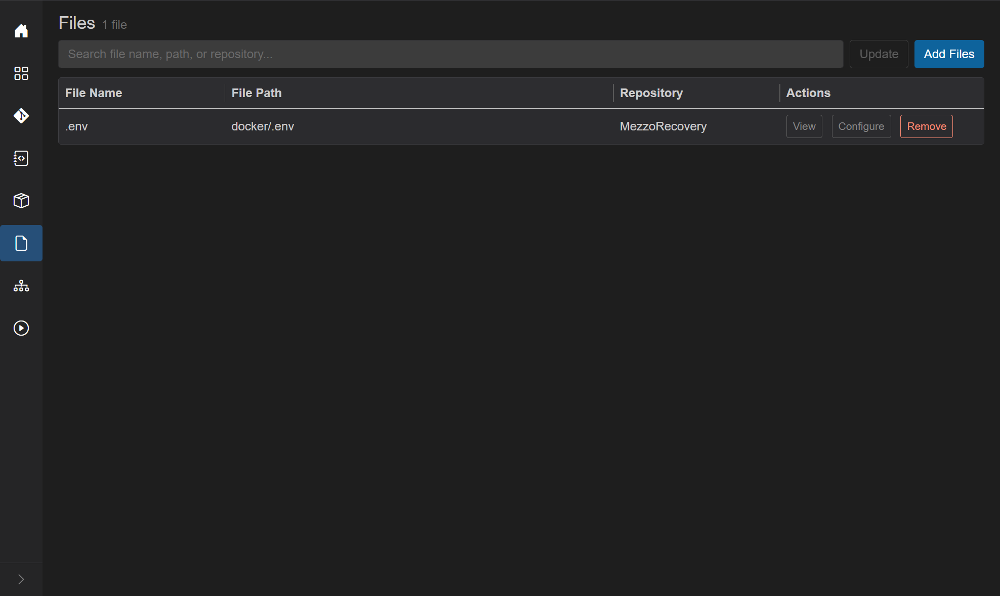

| Column | Meaning |
| --- | --- |
| File Name | Name; gray **Missing on disk** if the path vanished (excluded from dep/badge counts until restored) |
| File Path | Path inside the repo (`docker/.env`) |
| Repository | Owning repo |
| Actions | **View**, **Configure**, **Remove** |

#### Row actions

- **View** - loads file contents through the Agent (`GetFileContents`). Readonly textarea. Select text, then **Configure** to seed the version-pattern editor with that selection. **Copy** copies the selection and closes. If already configured, **Configure** in View is disabled - use **Configure** on the grid row instead.
- **Configure** - outline when no pattern exists; **info (filled / blue)** when a version config exists. Opens the version-pattern editor.
- **Remove** - drops the file from the workspace list only (does not delete it on disk).

Missing-on-disk tooltip: "File not found on disk; excluded from dependency and badge counts until restored."

---

## How version pattern matching works

Each pattern line is:

```text
PREFIX{RepositoryName}OPTIONAL_SUFFIX
```

Examples:

```text
APP_VERSION={MezzoRecovery}
API_VERSION={MezzoRecovery.Api}
MY_TAG={SomeRepo}-rc
```

Agent check / update (`CheckFileVersions` / `UpdateFileVersions`):

1. Split the pattern on newlines; ignore blank lines.
2. For each pattern line, find `{` … `}` - text before `{` is the **prefix**, text after `}` is an optional **suffix**, inside is the **repo token**.
3. Read the target file line by line. Leading whitespace is ignored for matching; the rest of the line must **start with** the prefix. If a suffix is present, the line must also **end with** that suffix.
4. The **current value** is the middle segment (between prefix and suffix).
5. The **expected value** is the workspace link's `GitVersion` for that repository name (already computed / synced - Update does not re-run GitVersion).
6. If current ≠ expected, the line is out of date. Tokens that never match any file line are logged as not found (not counted as out-of-date).

Unknown repository names in `{…}` are ignored during update. The Configure UI shows **N tokens resolved** and warns on unknown names.

---

## Walkthrough - configure from View

### 7. View and select lines

Click **View** on `.env`. Select the App / Api version block (comments optional - they will be stripped when you edit the pattern):

```text
# --- App (service: app; profile: web) ---
# Image tag only - compose does not build. Match a tag you built/pushed (e.g. CI SemVer).
APP_VERSION=0.0.0-local

# --- Api (service: api; profile: web) ---
# Image tag only - compose does not build. Match a tag you built/pushed (e.g. CI SemVer).
API_VERSION=0.1.0-mezzorecovery-api.3
```

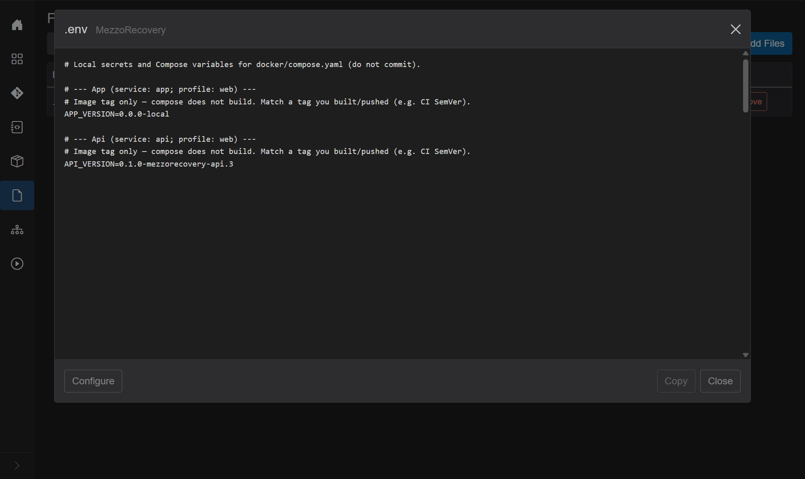

Click **Configure** in the View footer. The selection becomes the initial pattern text.

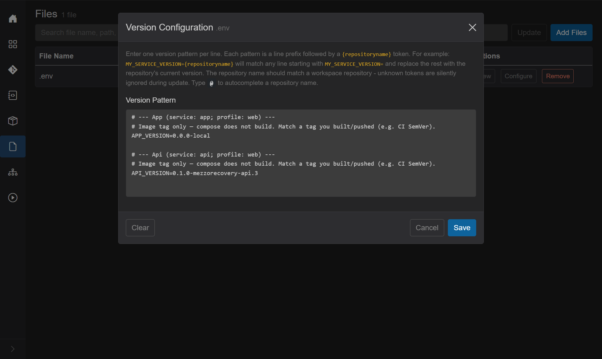

### 8. `@` autocomplete

In the pattern editor, type `@` after `=` (or anywhere you need a repo token). A dropdown lists workspace repository names. Accepting a suggestion inserts `{RepoName}`.

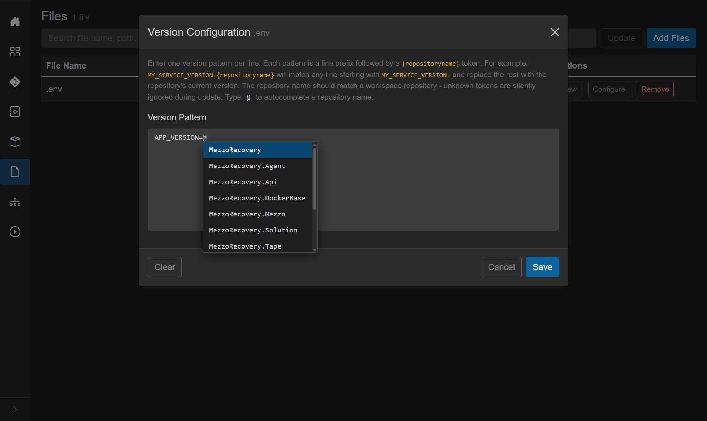

### 9. Final pattern

Replace the seeded text with only the mapping lines (no comments required):

```text
APP_VERSION={MezzoRecovery}
API_VERSION={MezzoRecovery.Api}
```

Confirm **2 tokens resolved**, then **Save**.

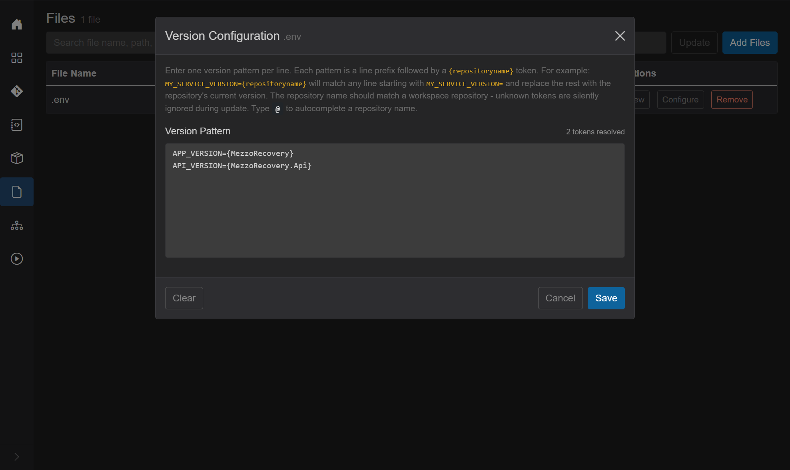

After save:

- Grid **Configure** turns **info (blue)**.
- **Update** enables.
- Dependency stats recompute; a pending-deps notification may appear for MezzoRecovery.

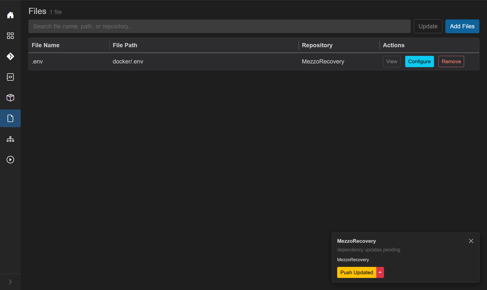

---

## Effect on repository levels

Open Repositories (`/workspaces/2`). **MezzoRecovery** moves up (here **Level 4**) because `API_VERSION={MezzoRecovery.Api}` adds a **file** edge onto Api (already a high-level consumer). The self-token `{MezzoRecovery}` does not add a graph edge.

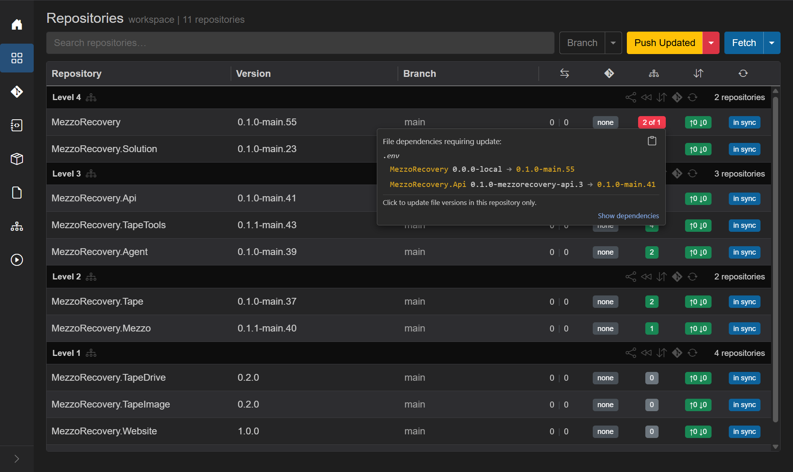

Hover the red mismatch badge. Tooltip (values illustrative):

```text
File dependencies requiring update:
.env
  MezzoRecovery: 0.0.0-local -> 0.1.0-main.55
  MezzoRecovery.Api: 0.1.0-mezzorecovery-api.3 -> 0.1.0-main.41
```

Badge text may show **"2 of 1"** when the file also self-references its own repo - known bug ([TOFIX.md](../TOFIX.md)).

**Show dependencies** opens [Custom dependencies](custom-dependencies.md). Locked **`file`** badge on **MezzoRecovery.Api** (checkbox checked, not editable - same rule as **`project`**):

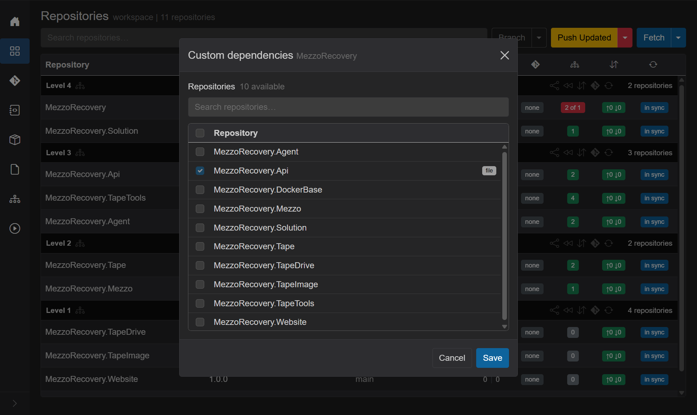

---

## Manual Update (no commit)

### 10. Files → Update

On `/workspaces/2/files`, click **Update**.

GrayMoon calls `UpdateFileVersions` for each configured file: for every matching line, replace the middle value with the workspace SemVer for that token. Overlay may show progress then **Checking file versions...**.

This edits the working tree only. Nothing is staged or committed.

On disk after Update (MezzoRecovery example):

```text
APP_VERSION=0.1.0-main.55
API_VERSION=0.1.0-main.41
```

### 11. Inspect on Changes

Open `/workspaces/2/changes`. Click **Refresh** if the tree is empty. Expand MezzoRecovery → `docker` → `.env`.

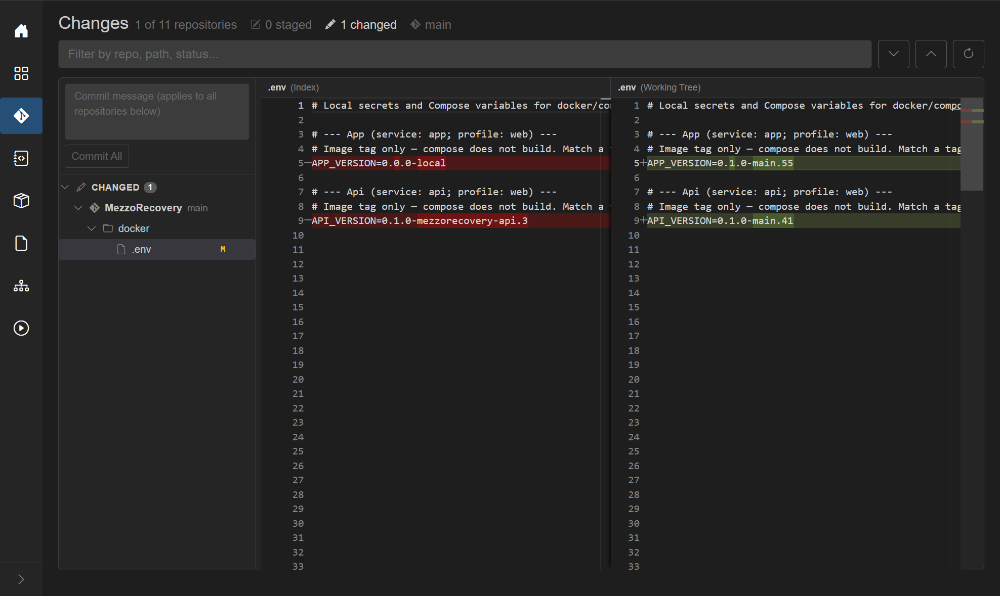

Diff (Index → Working Tree):

| Line | Before | After |
| --- | --- | --- |
| `APP_VERSION` | `0.0.0-local` | `0.1.0-main.55` |
| `API_VERSION` | `0.1.0-mezzorecovery-api.3` | `0.1.0-main.41` |

Commit from Changes (or a Repositories file-version commit flow) only if you want those tag bumps on a branch.

### Other ways to update

| Entry point | Behavior |
| --- | --- |
| Files **Update** | All configured files in the workspace; no commit |
| Repositories red file-dep badge click | Per-repo update; optional commit modal |
| Update / Push Updated / New Feature orchestration | Can refresh file versions as part of the larger job when configured |

Automatic **checks** (badge / tooltip refresh) run via `CheckAndPersistFileVersionStatusAsync` after configure, after Update, and on workspace sync paths - concurrent checks for the same workspace coalesce onto one in-flight run.

---

## Why version files help

### Compose / local stacks (this walkthrough's main reason)

Pin `docker/.env` (or compose override env) so image tags track workspace SemVer. After branching libraries and services, **Update** retargets App/Api tags to the feature SemVer without hunting strings. Spin compose against the images you just built/pushed from CI or a local build.

### More uses

1. **Multi-service pin file** - one `.env` or `versions.json` can reference many workspace repos; one Update refreshes all tokens.
2. **Level ordering without packages** - a host/docs/deploy repo that does not PackageReference Api still waits on Api when file tokens say so (PR close / Sync To Default / synchronized push order).
3. **Release metadata** - VERSION files, Helm values, installer manifests that embed SemVer strings.
4. **Safe local trial** - Update writes the working tree only; review on Changes before committing.
5. **Drift visibility** - red file-dep badge + tooltip shows exact `current -> expected` per token.
6. **Shared with custom / project deps** - file edges show as locked **`file`** in the custom-deps dialog so you see why a level moved.

---

## Search fields (Files grid filter)

Plain terms match **file name**, **file path**, and **repository name**.

Field prefix:

- `repo:` - repository name

---

## Related docs

- [Custom dependencies](custom-dependencies.md) - locked **`file`** badges; level bubbling
- [Repositories](repositories.md) - dependency badge, Update / Push Updated
- [Changes](changes.md) - review Update diffs before commit
- [TOFIX - file self-ref badge "2 of 1"](../TOFIX.md)
