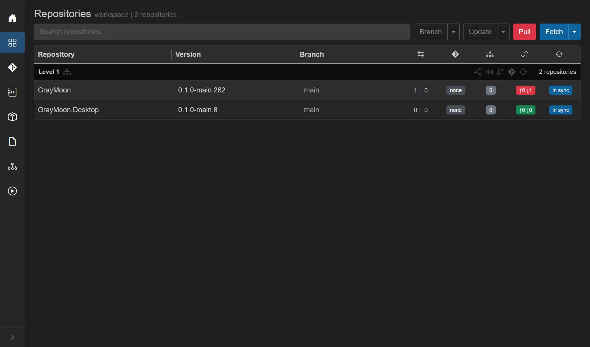
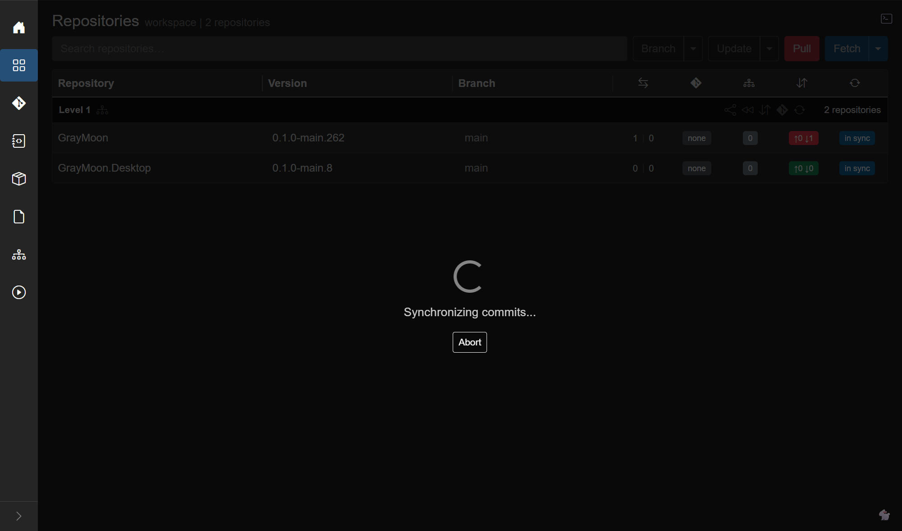
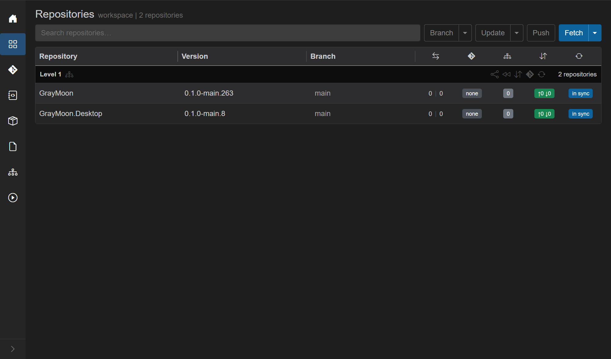
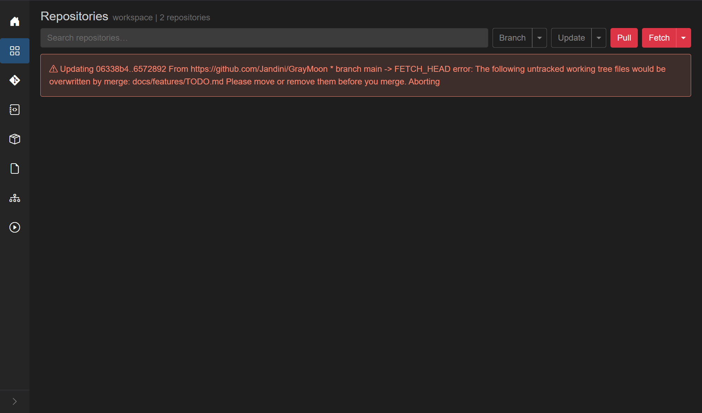

# Incoming commits (Pull)

Route: Repositories (`/workspaces/{id}`), commits badge - red **`↑N ↓M`** when **incoming** (`↓M`) is greater than zero.

When `origin/<your-branch>` has commits your local clone does not, GrayMoon turns the commits badge **red** and replaces the yellow header **Push** with a red **Pull**. That is upstream collaboration on the **same** branch (teammate push, or another machine / workspace clone that pushed). It is not [Update branch from default](update-branch-from-default.md) (yellow divergence **behind** on a feature branch vs `main`).

Walkthrough workspace: **workspace** (`/workspaces/9`). **GrayMoon** is on **`main`** with red **`↑0 ↓1`** (one commit on `origin/main` not pulled yet). **GrayMoon.Desktop** stays green **`↑0 ↓0`**. Header **Push** has become red **Pull**.

## Starting state - before Pull

| Column | GrayMoon | Desktop |
| --- | --- | --- |
| Branch | `main` | `main` |
| Divergence | `1 \| 0` | `0 \| 0` |
| Commits | red `↑0 ↓1` | green `↑0 ↓0` |
| Header | red **Pull** | (same workspace header) |

On **`main`**, divergence behind and incoming vs upstream are the same remote tip. Pull is still driven by the **commits** badge / **Pull** button, not by clicking divergence behind (that Update Branch flow only applies on a **feature** branch).

## How you see incoming

| Signal | Meaning |
| --- | --- |
| Commits badge red **`↑N ↓M`** (M > 0) | Local branch is behind upstream; tooltip **Click to pull** |
| Header button red **Pull** | At least one repo in the workspace has incoming |
| [Notification card](../shared.md#workspace-action-notification-cards) **Pull** | Same pending state from other pages (`incoming commits to pull`) |

**Fetch** / **Sync** only refresh the counts. They do **not** merge. Incoming appears after a Fetch (or a hook / Sync recount) once origin has moved.

## Pull one repo - click the red badge

Click the red commits badge on that row (here **`↑0 ↓1`** on GrayMoon). GrayMoon runs commit-sync for **that repository only**.

Use this when only one clone needs the pull, or when you want to pull repos one at a time.

## Pull every repo that has incoming - header Pull

Click the red header **Pull**. GrayMoon collects every workspace repository with incoming (`↓` > 0) and syncs them:

| How many repos have incoming | What runs |
| --- | --- |
| **1** | Same as clicking that row's red badge (single-repo commit sync) |
| **2 or more** | Parallel commit sync for **all** repos that still have incoming (repos already at `↑0 ↓0` are skipped) |

So if several rows show red `↓M`, one header **Pull** brings them all up to date. You do not have to click each badge.

Repos without incoming stay untouched. Tag-pinned rows are skipped.

This walkthrough used header **Pull** (only GrayMoon had incoming). Overlay:

## Level Sync commits (optional)

On a **Level N** header, the **Sync commits** icon (tooltip: *Sync commits for all repositories in this level*) runs commit-sync for every branch checkout in that level. If more than one repo is included, GrayMoon asks for confirm. Prefer header **Pull** when you only want repos that currently show incoming.

## What GrayMoon does (git logic)

Agent command: `CommitSyncRepository` via `WorkspaceCommitSyncHandler`.

1. **Fetch** - refresh origin (including tags).
2. If incoming **> 0**, **pull** into the current branch (`git pull` via `GitRemoteIntegrateService`).
3. Recount outgoing / incoming (and vs default) so the grid updates.
4. If outgoing remain after a successful pull, the same command **pushes** them (full commit-sync). Pure incoming (`↑0 ↓1`) stops after the pull.

GrayMoon does **not** open a confirm dialog for header **Pull** or the red badge - the job starts immediately.

## After a successful pull

| Column | Before | After |
| --- | --- | --- |
| Commits badge (GrayMoon) | red `↑0 ↓1` | green `↑0 ↓0` |
| Divergence (GrayMoon on `main`) | `1 \| 0` | `0 \| 0` |
| Header | red **Pull** | outline **Push** |
| Desktop | green `↑0 ↓0` | unchanged |

## When Pull fails (untracked files or merge conflict)

If git cannot complete the pull, GrayMoon shows a dismissible red **Error:** banner under the toolbar (and keeps red **Pull** / incoming counts).

Example from this workspace: an untracked local `docs/features/TODO.md` would be overwritten by the incoming commit, so git aborted:

Fix: move or remove the untracked file(s), then **Pull** again.

Unlike [Update branch from default](update-branch-from-default.md) (which leaves `MERGE_HEAD` for you to finish in an IDE), a **merge conflict** during Pull is also **aborted** - clean tree restored, row error such as *Merge conflict detected. Merge aborted.* Resolve outside GrayMoon, then Fetch / Pull again.

## When to use this vs other actions

| Goal | Use |
| --- | --- |
| Bring local branch up to date with **upstream** (same branch tip on origin) | Red commits badge or header **Pull** (this page) |
| Merge latest **default** into a **feature** branch | Yellow divergence **behind** -> [Update branch from default](update-branch-from-default.md) |
| Only refresh remote tips / counts | Header **Fetch** or **Sync** |
| Discard feature work and return to default | [Sync To Default](sync-to-default.md) |

## Prerequisites

- Agent connected
- Repo on a **branch** (not a tag)
- Branch has an upstream and incoming **> 0**
- Working tree must allow the pull (no conflicting untracked files; no unresolved merge)

## Related docs

- [Repositories - Commits badge](repositories.md#commits-badge-out-in) - badge color table
- [Repositories - Pull / Push](repositories.md#pull--push) - header button colors
- [Update branch from default](update-branch-from-default.md) - behind vs default on a feature branch
- [Shared - notification cards](../shared.md#workspace-action-notification-cards) - red **Pull** from other pages
