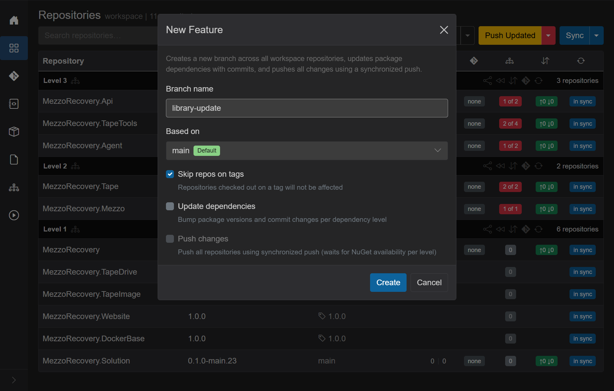
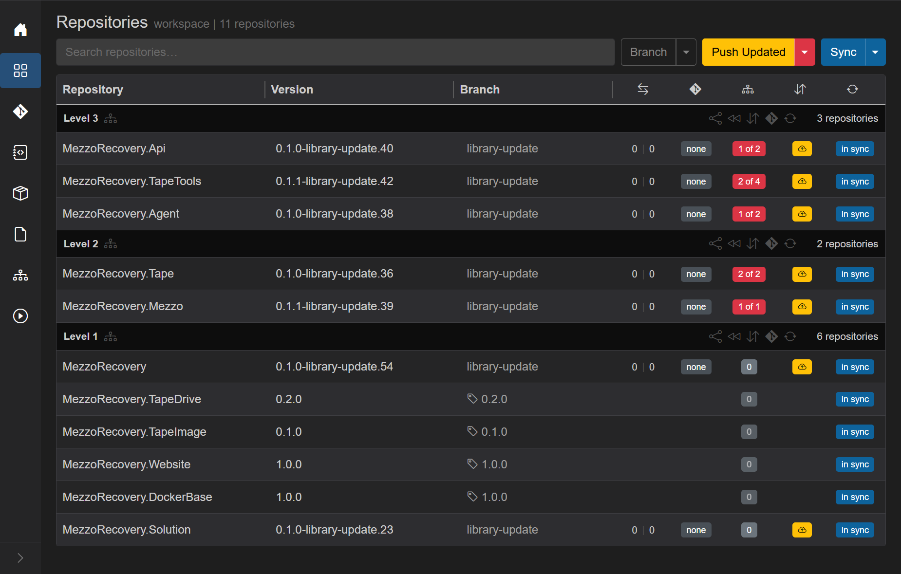

# Phase 1 - New Feature branch only (`library-update`)

Goal: create coordinated branch **`library-update`** on every repo that is **on a branch**, while **frozen tag repos are left untouched**.

## Open New Feature

**Branch** caret -> **New Feature**.

| Field | Value | Why |
| --- | --- | --- |
| **Branch name** | `library-update` | Shared feature branch name |
| **Based on** | `main` (Default) | Each repo starts from its default tip |
| **Skip repos on tags** | checked | TapeDrive, TapeImage, Website, DockerBase stay pinned |
| **Update dependencies** | unchecked | Deps update is a separate **Push Updated** step in this walkthrough |
| **Push changes** | unchecked | Disabled when update is off |

Click **Create**. One job runs **Creating branches...** / **Created N of M** (branch creation only).

## After branch creation

What to verify:

- **Frozen rows** (tag icon + tag name): TapeDrive `0.2.0`, TapeImage `0.1.0`, Website / DockerBase `1.0.0` - branch column unchanged.
- **Branch repos** show **`library-update`** and GitVersion strings like `0.1.0-library-update.41`.
- Red **`N of M`** deps badges remain - no `.csproj` rewrite yet.
- Yellow **cloud-up** on branch repos (new branch, no upstream).

## Why branch-only first

This walkthrough separates **branch creation** from **dependency update + push** so you can see:

1. How **Skip repos on tags** limits branch scope.
2. How **Push Updated** is the dedicated deps + synchronized push path ([phase 2](phase-2-push-updated.md)).

For a single combined job, leave **Update dependencies** and **Push changes** checked ([New Feature](../new-feature.md)).

Next: [Phase 2 - Push Updated](phase-2-push-updated.md).
