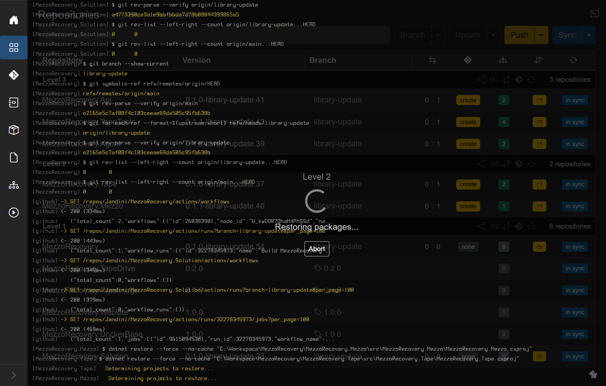

# Phase 2 - Push Updated (deps + synchronized push)

Goal: rewrite package references on every **non-tag** repo, commit, and push **by dependency level** with NuGet feed wait between levels.

## Run Push Updated

With red dependency badges on Level 2 / 3 and no incoming commits, the header is yellow **Push Updated**. Click the primary button (or use **Update Only** then **Push Only** from the caret for split control).

**Update dependencies** modal: confirm message, **Proceed**. GrayMoon commits `chore(deps): update package versions` per repo (`.csproj` pins move to current workspace package versions, including tag versions from frozen Level 1).

## Synchronized push overlay

During the push phase the [loading overlay](../../shared.md#loading-overlay) shows git output, NuGet polling, and GitHub Actions API lines (status only):



Typical lines:

- **Waiting for N packages...** / **Found X of N packages** with **MM:SS** countdown
- Timeout = **3 minutes per required package** at that level (`PushWaitDependencyTimeoutMinutesPerDependency`, default 3)
- GHA log lines are informational - GrayMoon unblocks the next level when the **nupkg appears on the mapped NuGet connector**, not when a workflow turns green

If the countdown reaches zero before all packages are found, GrayMoon **stops the job** with a timeout. Repos already pushed stay on origin; later levels may never push.

## What completed in this run

After the job ended:

| Level | Repos | Remote `library-update` | Notes |
| --- | --- | --- | --- |
| 1 | MezzoRecovery, Solution | Yes | Pushed (no deps commit needed / no extra commit) |
| 1 | TapeDrive, TapeImage, Website, DockerBase | N/A | Frozen on tags - skipped |
| 2 | Tape, Mezzo | Yes | Deps commit pushed; **Build** workflows triggered |
| 3 | Api, Agent, TapeTools | **No** | Still local only - yellow cloud-up, no upstream |

Level 3 never received `git push` because synchronized push was still waiting for Level 2 packages on the NuGet feed when the wait window expired (**Found 2 of 4 packages** in the overlay).

## Grid signals for unpushed repos

On **Repositories**, unpushed branch repos show:

- Yellow **cloud-up** commits badge (no upstream)
- Yellow **`create`** PR badge (ahead of default locally)
- Green dependency counts after the deps commit landed locally

Do **not** assume the job failed silently - check **Actions** and whether origin has the branch:

```powershell
git ls-remote --heads origin library-update
```

Next: [Phase 3 - Push failure, NuGet wait, and GitHub Actions](phase-3-push-failure-and-gha.md).
