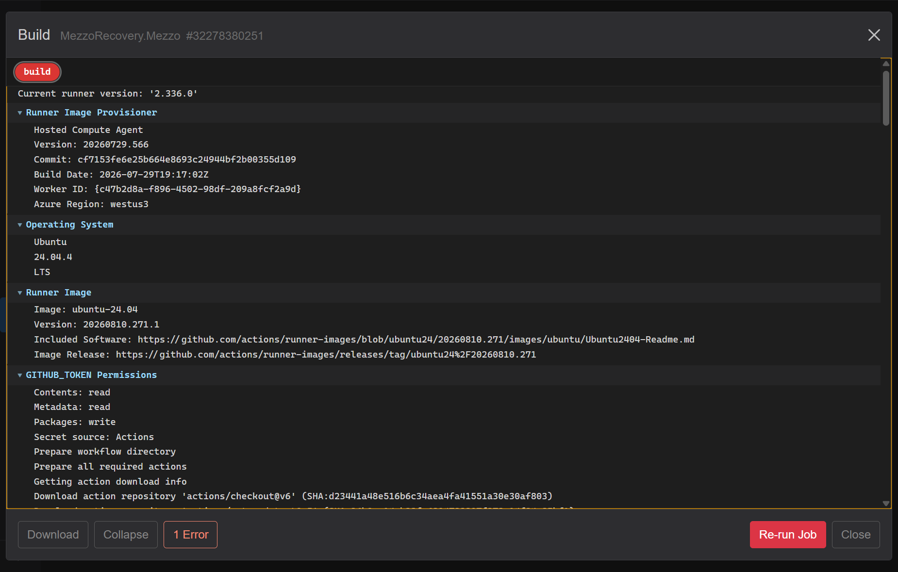
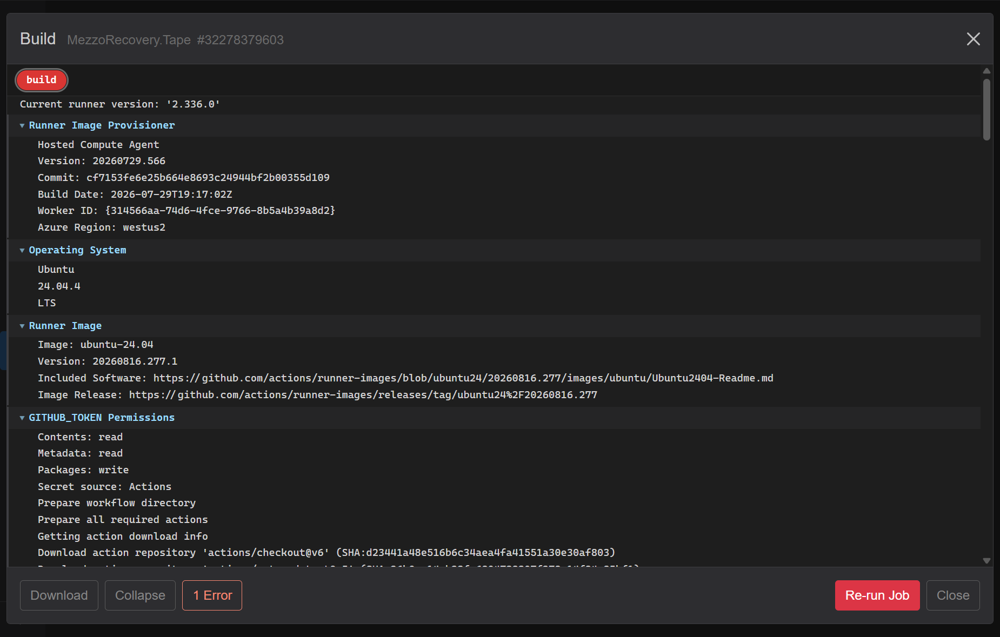

# Phase 3 - Unpushed repos, NuGet wait, and GitHub Actions

When **Push Updated** finishes but Level 3 (or any level) still shows yellow **cloud-up**, the synchronized push did not complete for those repos. This phase explains how to diagnose and recover.

## Symptom on Repositories

- **Tape**, **Mezzo**, **MezzoRecovery**, **Solution**: green **`↑0 ↓0`** (on `origin/library-update`)
- **Api**, **Agent**, **TapeTools**: yellow **cloud-up**, deps commit exists **locally only**
- Frozen tag repos: unchanged

The push job may have ended without error toast while Level 3 was never pushed - NuGet wait timeout stops the orchestrator after partial progress.

## Why NuGet wait blocks the next level

Synchronized push pushes Level 1 packages first, then **polls the NuGet connector** until each required nupkg at that level is on the feed, then pushes Level 2, waits again, then Level 3.

GrayMoon does **not** publish packages itself. Something else (usually **GitHub Actions** `dotnet pack` + push to GitHub Packages) must put the nupkg on the feed. If that never happens within **3 minutes x number of packages** at the level, you see:

- Overlay: **Found 2 of 4 packages** (or similar) until countdown hits **00:00**
- Job stops; remaining repos are not pushed

So "NuGet timed out" often means **CI did not produce the package in time** (or at all), not that GrayMoon lost network access.

## Check GitHub Actions (recommended)

Open **Actions** (`/workspaces/2/actions`) for the same workspace. Filter **failed** (red chip) and **Refresh**.



In this run after Level 2 push:

| Repository | Workflow | Result |
| --- | --- | --- |
| MezzoRecovery | Build MezzoRecovery App | **success** |
| MezzoRecovery.Tape | Build | **failed** |
| MezzoRecovery.Mezzo | Build | **failed** |

Level 3 workflows did not run meaningfully yet - those repos were never pushed to origin.

### Read the logs in GrayMoon

Click **Logs** on a failed row. GrayMoon fetches the GitHub job log (same text as GitHub Actions UI).



**MezzoRecovery.Tape** - `dotnet pack` failed with errors like:

```text
error CS0117: 'TapeImageSplitWriterOptions' does not contain a definition for 'OnSegmentClosed'
error CS1061: 'TapeImageSplitWriter' does not contain a definition for 'FinalizeAsAbortedAsync'
```

**MezzoRecovery.Mezzo** - similar missing-type errors:

```text
error CS0246: The type or namespace name 'TapeImageTruncatedException' could not be found
```

### Root cause in this workspace

**Push Updated** pinned consumers to **tag** package versions from frozen Level 1 (**TapeImage `0.1.0`**, **TapeDrive `0.2.0`**) while **`library-update` branch code on Tape / Mezzo** (from `main`) already references **newer TapeImage APIs** that exist only in later packages (from the earlier `tape-density` work on `main`).

Result:

1. Level 2 **Build** workflows fail at compile time.
2. No nupkg is published to the NuGet feed for Tape / Mezzo.
3. Synchronized push waits, finds only **2 of 4** expected packages, times out.
4. Level 3 never pushes.

This is a **dependency / tag mismatch**, not a GrayMoon push bug.

## Recovery options

Pick one path after you understand the logs:

### A - Align tags and package pins (recommended for tag-based Level 1)

1. Upgrade frozen repos if needed ([tag-upgrade.md](../tag-upgrade.md)) - e.g. checkout **TapeImage** to a tag that includes the APIs your consumers need.
2. Run **Sync** on the workspace.
3. On `library-update`, run **Push Updated** again (or **Update Only** then **Push Only**).

### B - Fix CI first, then retry push

1. Fix compile errors on `library-update` (or merge/rebase consumer code to match pinned packages).
2. **Re-run** failed workflows from **Actions** (or push an fix commit).
3. When Level 2 builds succeed and packages hit the feed, run header **Push** or **Push Only** to finish Level 3.

### C - Push Level 3 manually (after packages exist)

If Level 2 packages are on the feed but GrayMoon already stopped:

1. **Repositories** -> yellow **Push** or **Push Updated** caret -> **Push Only**
2. Or push from git locally; the Agent hook updates the grid on next sync

**Push Only** skips `.csproj` rewrite and only pushes repos with outgoing commits or no upstream.

### D - Disable synchronized wait (advanced)

Uncheck **Synchronized Push** in the push confirmation dialog when you intentionally push before packages exist (not recommended for multi-level consumers).

## Manual push checklist

Before **Create PRs...**:

- [ ] `git ls-remote origin library-update` succeeds for **every** repo you want in the PR batch
- [ ] **Actions** Build workflows **success** for packages downstream repos consume
- [ ] Repositories grid: green **`↑0 ↓0`**, no cloud-up
- [ ] Yellow **`create`** PR badges on branch repos (not on frozen tags)

## What not to do

- Do not open PRs for repos whose branch never reached origin - GitHub has nothing to compare.
- Do not assume a green **in sync** badge means pushed - cloud-up / no upstream is the push signal.

When Level 3 is pushed and builds are green, continue with [Phase 4 - Create PRs](phase-4-create-prs.md).

## Recovery executed in this walkthrough

This workspace recovered via **TapeImage tag upgrade** (Fetch -> checkout **0.2.0** -> **Push Updated** again). Step-by-step screenshots and verification are in [Phase 3 recovery - TapeImage tag upgrade](phase-3-recovery-tapeimage-upgrade.md).
