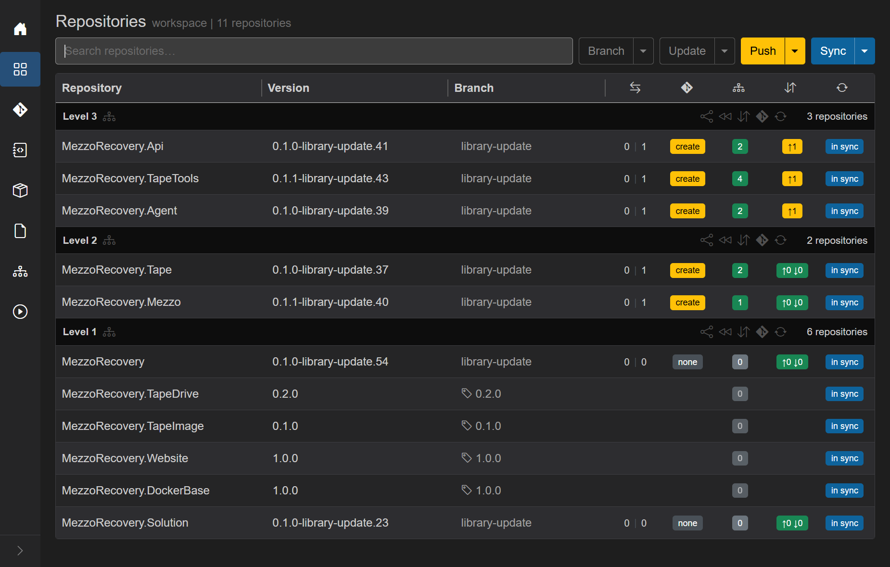
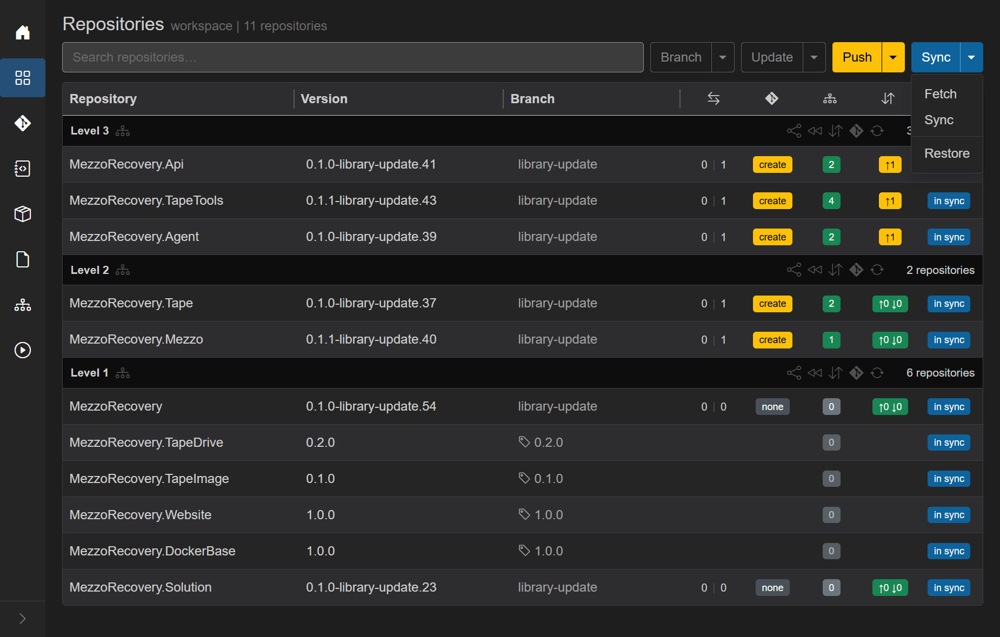
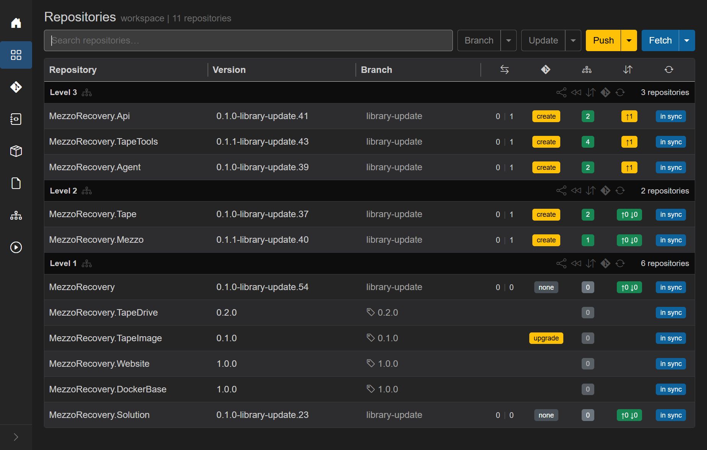
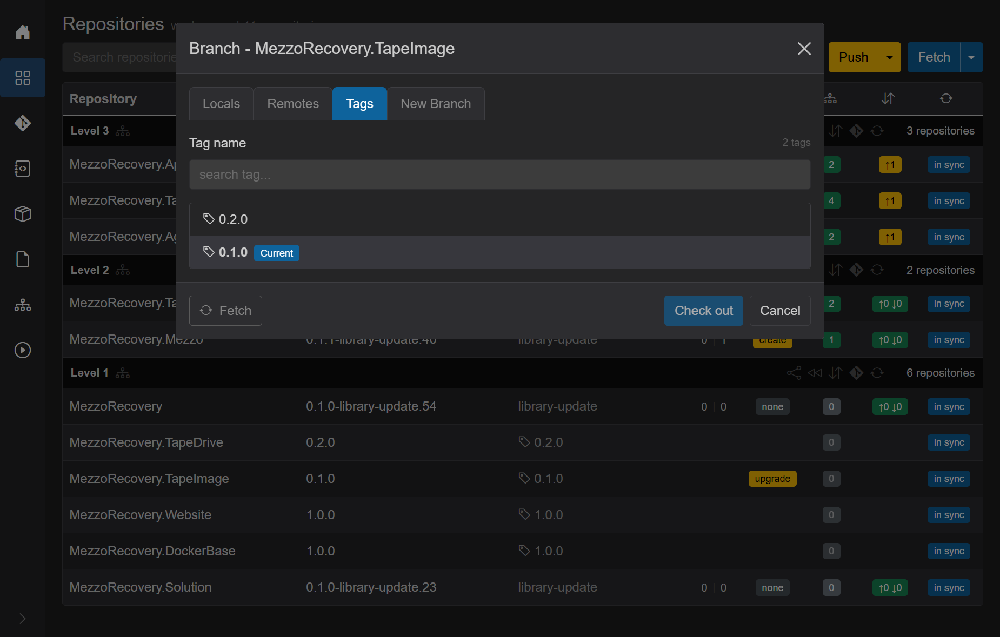
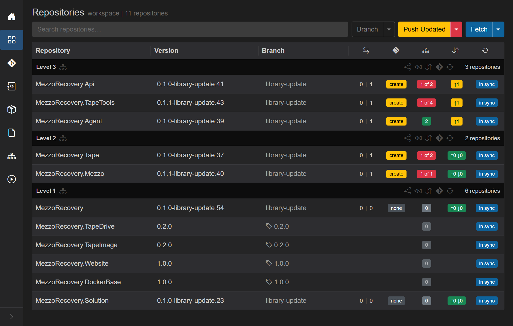
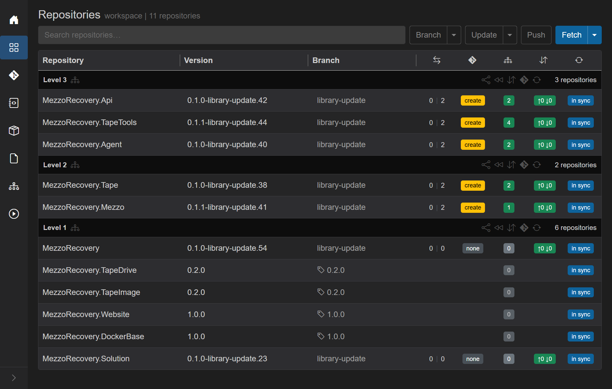
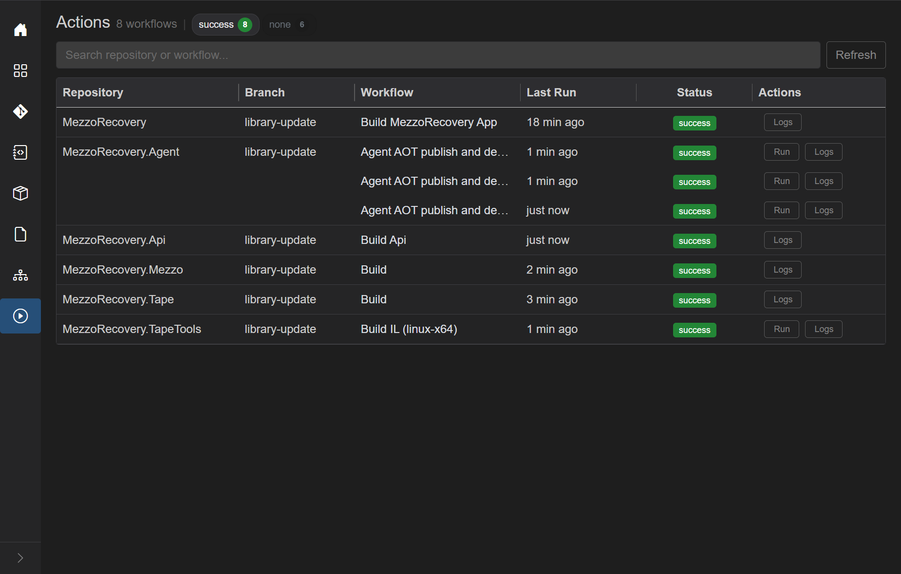

# Phase 3 recovery - TapeImage tag upgrade and re-push

After [Phase 3 diagnosis](phase-3-push-failure-and-gha.md), the fix is to align frozen **TapeImage** with the APIs your Level 2 consumers need, then run **Push Updated** again so builds succeed, packages land on the NuGet feed, and Level 3 pushes complete.

All steps below were done in GrayMoon on **MezzoRecovery** (`/workspaces/2`).

## Starting recovery state

Level 2 **Build** workflows failed; Level 3 repos still had yellow **cloud-up** (no upstream). **TapeImage** was pinned to tag **0.1.0** while branch code on Tape / Mezzo expected **0.2.0** APIs.

## Step 1 - Fetch remote tags

**Sync** caret -> **Fetch** (or header **Fetch**). GrayMoon refreshes remote refs for every workspace repo.

After Fetch, **TapeImage** shows a yellow **upgrade** badge: origin has tag **0.2.0** newer than the checked-out **0.1.0**.

## Step 2 - Check out TapeImage 0.2.0

Click the **upgrade** badge on **TapeImage** (or open the branch dialog from the row). Switch to the **Tags** tab, select **0.2.0**, click **Check out**.

Branch repos on `library-update` now show red **`N of M`** dependency badges again - consumers still pin **TapeImage 0.1.0** in `.csproj` until **Push Updated** rewrites them.

Header returns to yellow **Push Updated**.

## Step 3 - Push Updated again

Click **Push Updated**. GrayMoon runs **Update Only** (rewrite pins to **TapeImage 0.2.0**, commit) then **Push Only** (synchronized push with NuGet wait).

This run succeeds because Level 2 **Build** workflows compile against **TapeImage 0.2.0** packages and publish nupkgs to the feed before the wait window expires.

## Step 4 - Verify on Repositories

After the job completes:

- Every branch repo on `library-update` shows green **`↑0 ↓0`** (on `origin/library-update`)
- Dependency badges green
- Yellow **`create`** PR badges on Level 2 / 3 repos (ahead of default, no open PR yet)
- Frozen tag rows unchanged: TapeDrive **0.2.0**, TapeImage **0.2.0**, Website / DockerBase **1.0.0**
- Header **Push** outline (nothing left to push)

## Step 5 - Verify on Actions

Open **Actions** (`/workspaces/2/actions`). Filter **success** and **Refresh**.

All **Build** workflows on `library-update` should be **success** (contrast with the failed run in [phase 3](phase-3-push-failure-and-gha.md)):

| Repository | Workflow | Result (after recovery) |
| --- | --- | --- |
| MezzoRecovery | Build MezzoRecovery App | **success** |
| MezzoRecovery.Tape | Build | **success** |
| MezzoRecovery.Mezzo | Build | **success** |
| MezzoRecovery.Api | Build Api | **success** |
| MezzoRecovery.Agent | Agent AOT publish and deploy | **success** |
| MezzoRecovery.TapeTools | Build IL (linux-x64) | **success** |

## Recovery checklist

Before [Phase 4 - Create PRs](phase-4-create-prs.md):

- [x] **TapeImage** on tag **0.2.0** (not 0.1.0)
- [x] `git ls-remote origin library-update` succeeds for Api, Agent, TapeTools, Tape, Mezzo
- [x] **Actions** Build workflows **success** for Level 2 packages
- [x] Repositories grid: no cloud-up, green deps, yellow **`create`** PR badges

Continue with [Phase 4 - Create PRs](phase-4-create-prs.md).
