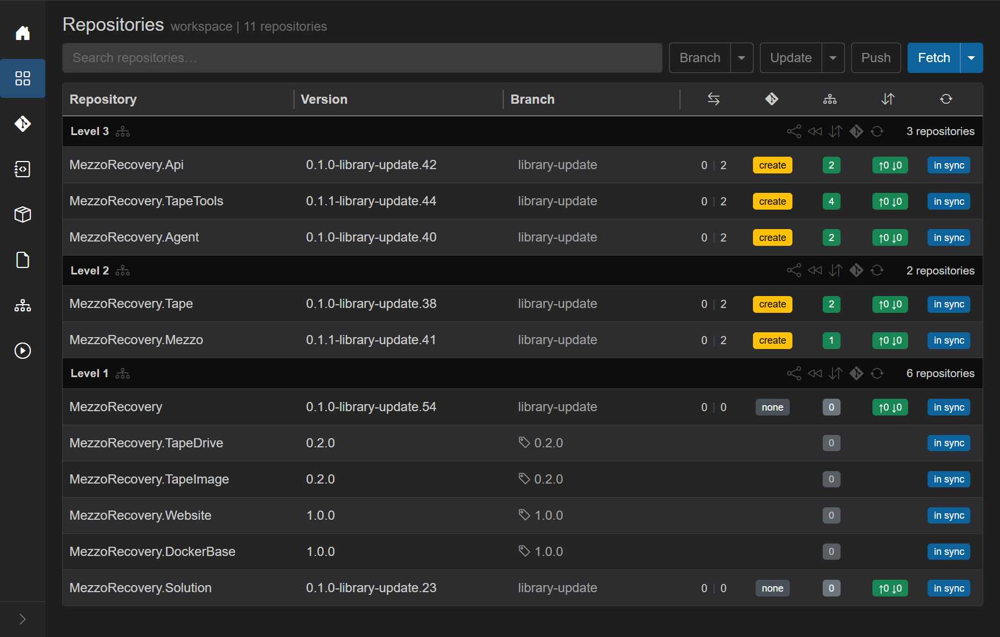
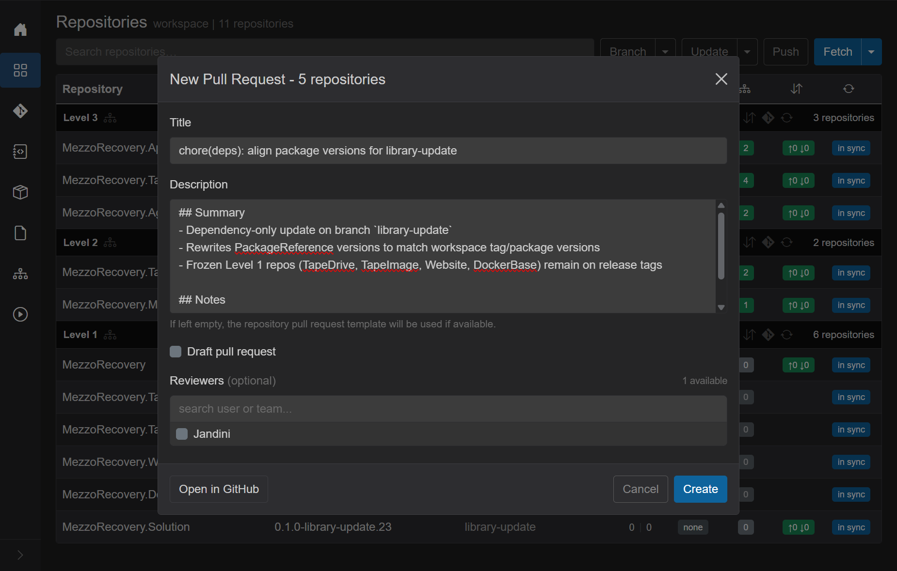
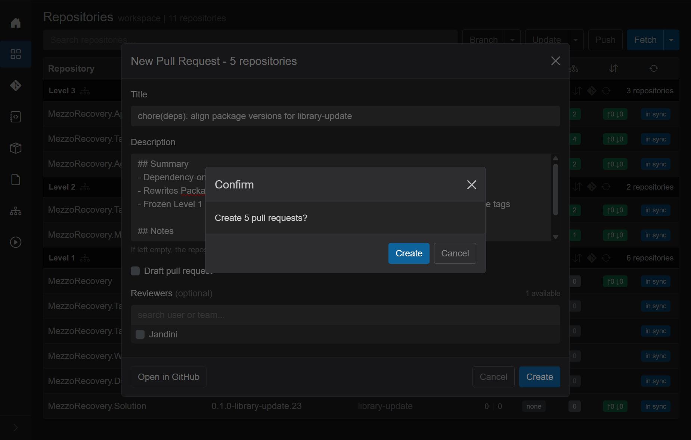
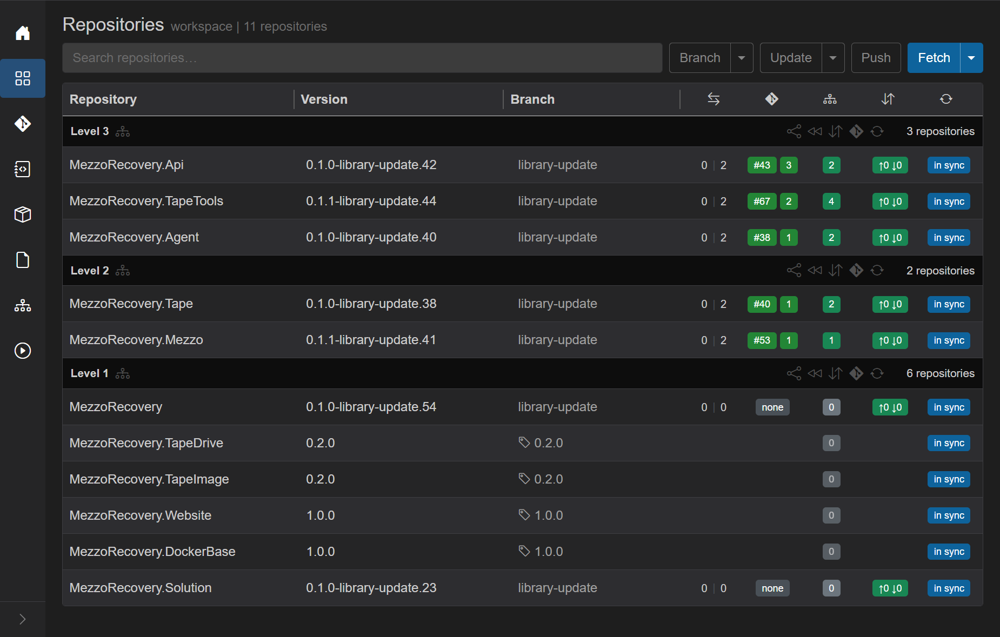

# Phase 4 - Create PRs (one Branch menu call)

**Prerequisite:** every repo that should get a PR has **`library-update` on origin**, green dependency badges, and yellow **`create`** PR badges. Complete [Phase 3 recovery](phase-3-recovery-tapeimage-upgrade.md) first if Level 3 was never pushed or builds were still failing.

## Grid before Create PRs

Five Level 2 / 3 repos show yellow **`create`** badges. Frozen tag repos and repos with **none** (MezzoRecovery root, Solution - not ahead of default) are excluded.



## One call for all eligible repos

1. **Repositories** -> **Branch** caret -> **Create PRs...**
2. GrayMoon opens **New Pull Request - 5 repositories** with every eligible repo in one list
3. Enter shared **title** and **body** (markdown)
4. **Create** -> confirm **Create 5 pull requests?** once

Frozen tag repos are **excluded automatically** (`IsOnTag` skipped in code).

### Eligibility rules (same as Repositories grid)

GrayMoon includes a repo when:

- Not pinned to a tag
- Current branch is not the default branch
- At least one commit ahead of default (`DefaultBranchAhead > 0`)
- No open PR for that head branch
- GitHub owner/repo parses from clone URL

In this run the five eligible repos were: **Tape**, **Mezzo**, **Api**, **Agent**, **TapeTools**.

## Fill the modal

**Title:** `chore(deps): align package versions for library-update`

**Body:**

```markdown
## Summary
- Dependency-only update on branch `library-update`
- Rewrites PackageReference versions to match workspace tag/package versions
- Frozen Level 1 repos (TapeDrive, TapeImage, Website, DockerBase) remain on release tags

## Notes
- Coordinated with GrayMoon Push Updated / synchronized push
- Merge by dependency level (Level 2 before Level 3)
```



Click **Create**. GrayMoon shows a confirmation dialog:



Click **Create** again. Toast: *Created 5 of 5 pull requests*.

## Created PRs

| Repository | PR |
| --- | --- |
| MezzoRecovery.Tape | [#40](https://github.com/Jandini/MezzoRecovery.Tape/pull/40) |
| MezzoRecovery.Mezzo | [#53](https://github.com/Jandini/MezzoRecovery.Mezzo/pull/53) |
| MezzoRecovery.Api | [#43](https://github.com/Jandini/MezzoRecovery.Api/pull/43) |
| MezzoRecovery.Agent | [#38](https://github.com/Jandini/MezzoRecovery.Agent/pull/38) |
| MezzoRecovery.TapeTools | [#67](https://github.com/Jandini/MezzoRecovery.TapeTools/pull/67) |

## After Create

Grid PR badges turn green `#NNN`. Frozen rows and repos with **none** stay blank in the PR column.



## Next step

Merge PRs **by dependency level** in GitHub (Level 2 Tape / Mezzo first, then Level 3 Api / Agent / TapeTools), then per-level **Sync to default branch** - documented in [Phase 5 - Merge and Sync to Default](phase-5-merging-prs.md).
