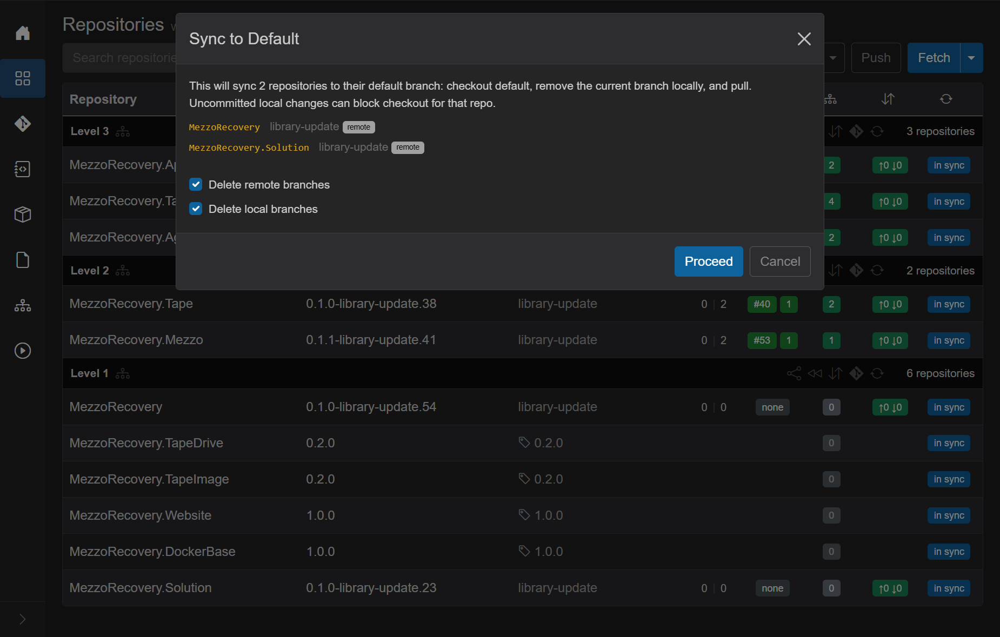
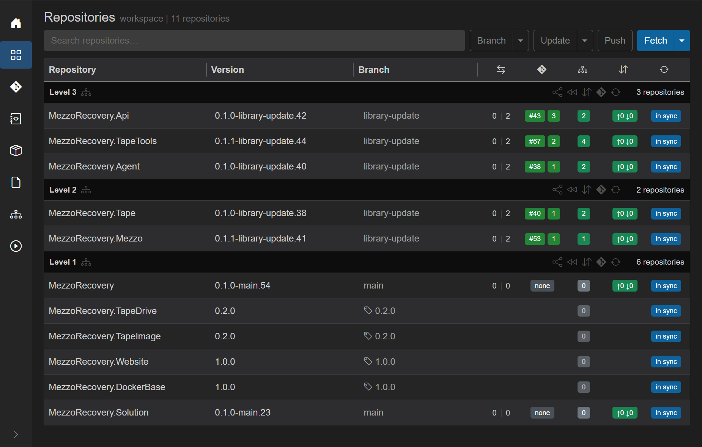
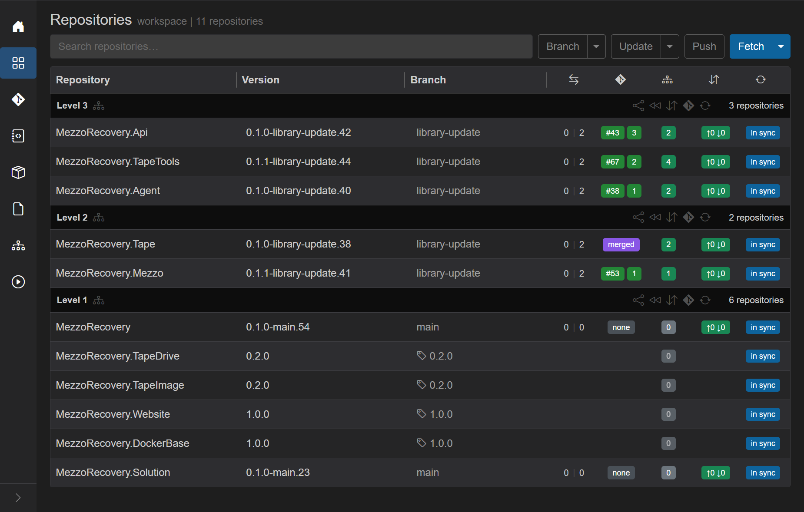
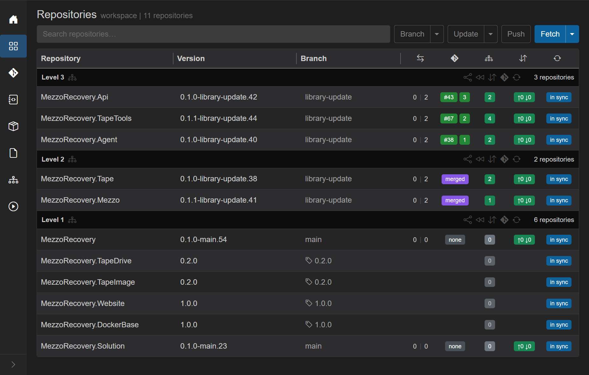
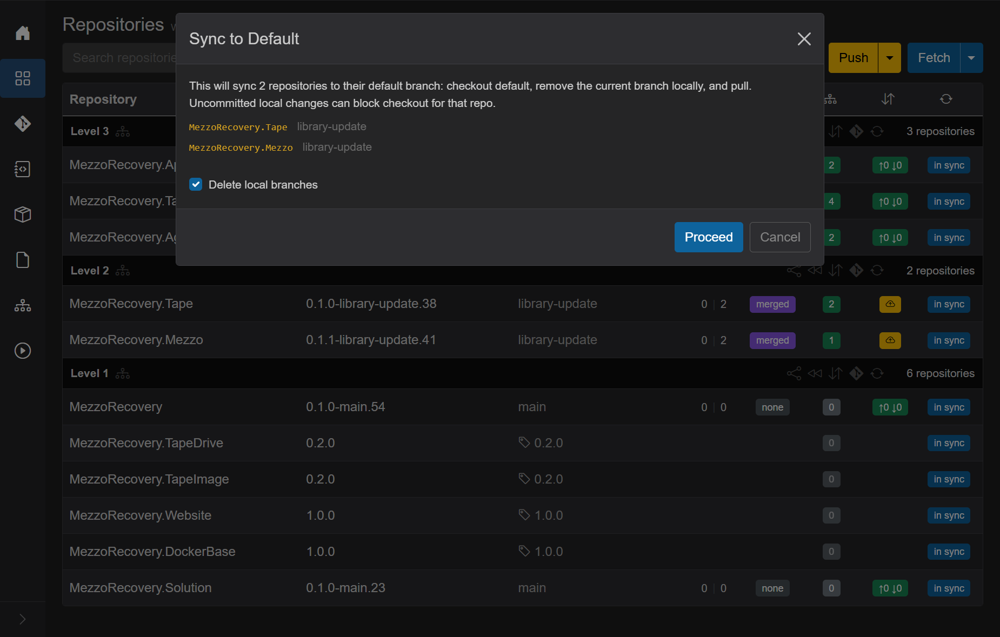
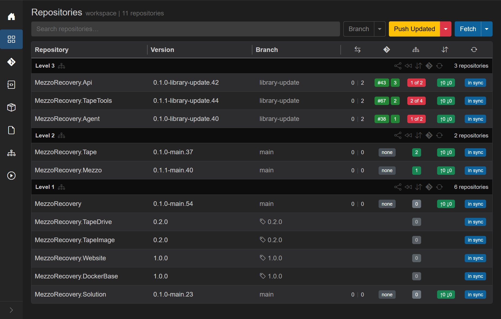
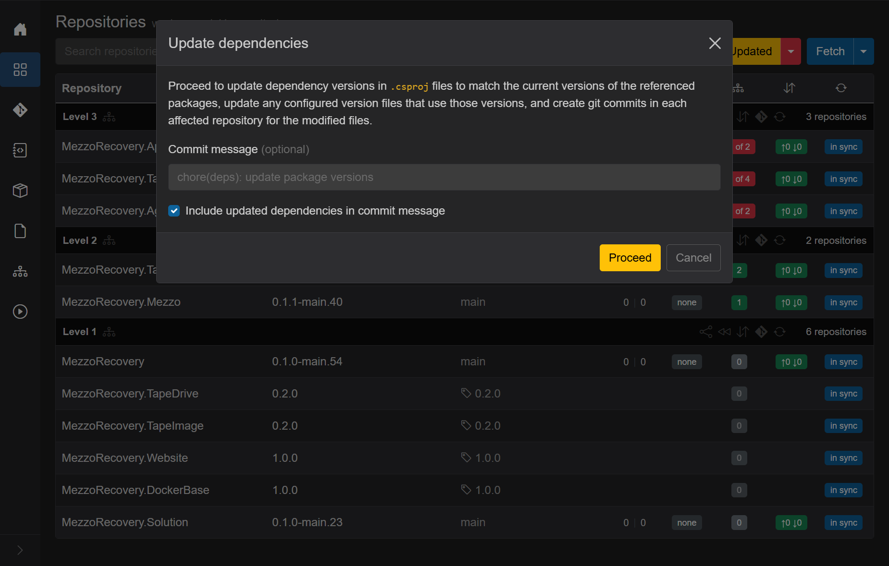
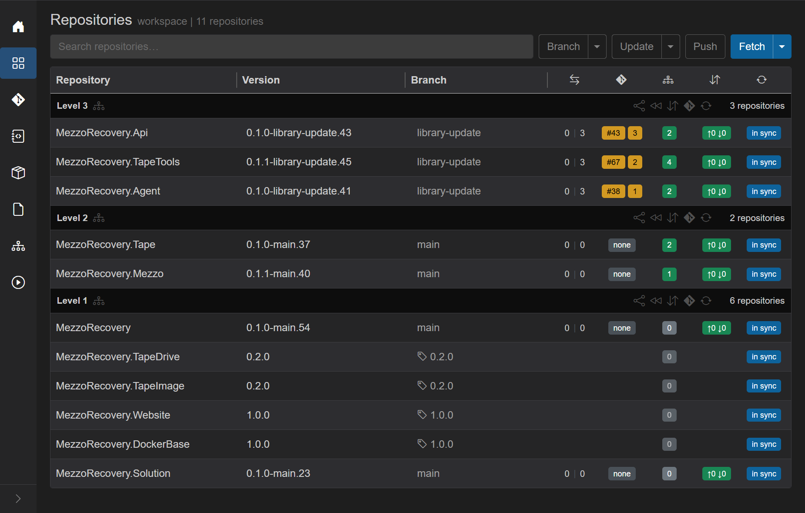
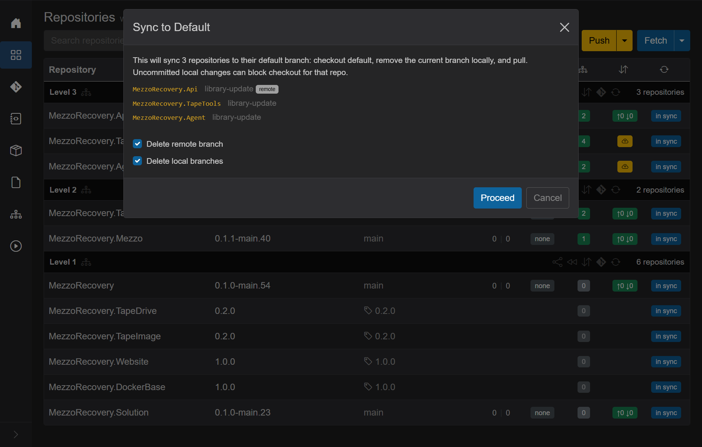

# Phase 5 - Merge PRs and Sync to Default

This phase follows [Phase 4 - Create PRs](phase-4-create-prs.md). Open PRs remain on Level 2 and Level 3; Level 1 had **no PRs** (MezzoRecovery root and Solution were on `library-update` but not ahead of default enough to need PRs).

The merge workflow proceeds **by dependency level**: clean up finished levels with per-level **Sync to default branch** (rewind icon), merge PRs on GitHub for the next level, then repeat.

See also: [Sync To Default](../sync-to-default.md) (general reference).

## Why Sync to Default matters

**Sync to default branch** checks out `main`, deletes the stale feature branch locally (and on origin when **Delete remote branches** is checked), and pulls latest default. That keeps every workspace clone on a short branch list and prevents accidentally working on yesterday's feature branch after the work is done or abandoned.

Use the **Level N** header rewind (`<<` icon, tooltip **Sync to default branch...**), not the workspace-wide **Branch** caret **Sync To Default**, while Level 2 / 3 still have open PRs. Workspace-wide sync would touch every non-default repo and show red **commits will be lost** warnings for repos still ahead on `library-update`.

## Starting state (after Phase 4)

| Area | State |
| --- | --- |
| Level 3 | `library-update`, open PRs **#43**, **#67**, **#38**, green deps |
| Level 2 | `library-update`, open PRs **#40**, **#53**, green deps |
| Level 1 | **MezzoRecovery** / **Solution** on `library-update`, PR **none**; **TapeDrive**, **TapeImage**, **Website**, **DockerBase** frozen on tags |
| Header | **Push** outline (nothing to push) |

Level 1 has **no PRs to merge**. The only branch repos still on `library-update` are MezzoRecovery and Solution (`0 \| 0` vs default - no unique commits, but the stale branch ref still exists locally and on origin). Tag repos are skipped automatically.

## Level 1 - Sync to default (no merge step)

Because Level 1 has no PRs, skip GitHub merge and go straight to rewind.

### Step 1 - Click Level 1 rewind

On the **Level 1** header row, click the rewind control (**Sync to default branch...**, double `<<` arrows).

GrayMoon runs a fetch job first: **Fetching latest branch state for N repositories...** (refreshes PR records and `git fetch`). When fetch completes, the **Sync to Default** dialog opens scoped to Level 1 only.

### Step 2 - Confirm the dialog

Dialog details for this run:

- **Title:** Sync to Default
- **Lead copy:** *This will sync 2 repositories to their default branch: checkout default, remove the current branch locally, and pull.*
- **Repo list:** `MezzoRecovery` and `MezzoRecovery.Solution`, both leaving `library-update` with gray **remote** badge (`origin/library-update` will be deleted)
- **No red alert** - neither repo is ahead of default with unmerged commits
- **Delete remote branches** - default **on** (removes `origin/library-update` for these two repos)
- **Delete local branches** - default **on** (removes local `library-update` ref after checkout)
- Tag repos (**TapeDrive**, **TapeImage**, **Website**, **DockerBase**) are **not listed** - already on tags, skipped

Click **Proceed**. Overlay: **Synchronizing to default branch...**, then per-repo git steps (remote delete, fetch --prune, checkout `main`, delete local branch, pull).

### Step 3 - After Level 1 Sync to Default

Level 1 after this step:

| Column | Level 1 state |
| --- | --- |
| **Branch** | `main` on **MezzoRecovery** and **Solution**; tag icon unchanged on frozen repos |
| **Version** | `*-main.*` GitVersion on branch repos |
| **PR** | blank (no PR was ever opened) |
| **Deps** | gray `0` on Level 1 rows |
| **Commits** | **in sync** with origin |

Level 2 / 3 **unchanged** - still on `library-update` with open PRs **#40**, **#53**, **#43**, **#67**, **#38**.

### Red dependency badges on Level 2 / 3 (expected)

After Level 1 rewind, Level 1 packages report `*-main.*` again. Level 2 / 3 `.csproj` files on `library-update` still pin `-library-update` package versions. GrayMoon paints red **`N of M`** badges on consumers (e.g. Tape **1 of 2**, TapeTools **2 of 4**).

That is expected - not a failed sync. The next step is merge Level 2 PRs on GitHub, refresh PR badges in GrayMoon, then **Level 2** header rewind.

## Refreshing PR status after GitHub merge

GrayMoon runs **locally** on your machine (App + Agent). GitHub cannot send webhook events to it, so the grid does **not** update the moment you click **Merge** in GitHub. PR badges stay green `#NNN` until GrayMoon pulls fresh state from the GitHub API.

### All ways to re-check PR status

| Trigger | Scope | Calls GitHub PR API? | Notes |
| --- | --- | --- | --- |
| **Hover PR badge** | One repo | Yes | Fastest manual check. Throttled to once per repo every 10 seconds. Also refreshes mergeability tint on open PRs. |
| **Level N `<<` Sync to default** | Repos in that level | Yes | Runs **before** the fetch job and dialog. Grid badges update immediately - **no need to hover or wait** before clicking rewind after a merge. See [sync-to-default.md](../sync-to-default.md#refreshing-pr-status). |
| **Branch -> Sync To Default** | Every non-default repo | Yes | Part of the workspace-wide fetch prep before that dialog opens. |
| **Header Sync** (Sync menu, not Fetch) | All repos (or level via sync icon) | Yes | Full git sync plus persist; refreshes PR records as each row is updated. Heavier than hover or per-level rewind. |
| **F5 (reload page)** | Whole page | No | Re-reads **last persisted** PR rows from SQLite. Does not call GitHub unless something else already saved fresh state. |
| **Header Fetch** | All repos | No | `git fetch` plus reload from DB only - **does not** refresh PR badges from GitHub. |
| **After Create PRs** | Repos just created | Yes | Automatic refresh when the bulk create job finishes. |

**Typical merge workflow:** merge on GitHub, then click **Level N** header **Sync to default branch...** (`<<`). That click refreshes PR status for the level **and** opens the rewind dialog - you do not need a separate hover or F5 step first. Use **hover** when you only want to confirm one badge without starting sync. Reserve full header **Sync** when you need git state refreshed everywhere, not just PR colors.

General reference: [Pull request badge - refreshing status](../repositories.md#refreshing-pr-status).

### Before refresh (stale open badges)

After merging **#40** and **#53** on GitHub, the grid may still show green open PR links until you refresh:

### Hover to refresh one repo

Move the mouse over the PR badge (e.g. **#40** on Tape). GrayMoon queries GitHub and repaints purple **merged**:

Hover **#53** on Mezzo the same way. Both Level 2 rows show **merged**:

Local clones are still on **`library-update`** until you run per-level Sync to Default - merged on GitHub is not the same as checked out on `main` locally.

## Level 2 - Sync to default (after PRs merged)

After merging **#40** and **#53** on GitHub, click **Level 2** header rewind (**Sync to default branch...**, `<<` icon). You do **not** need to hover the PR badges or press F5 first - the click refreshes PR status for every repo in Level 2 from GitHub, then runs the fetch job and opens the dialog.

If you already hovered and see purple **merged**, the rewind click still works the same way.

GrayMoon fetch job next, then dialog scoped to Level 2 only:

Dialog details:

- **Lead copy:** *This will sync 2 repositories to their default branch...*
- **Repo list:** `MezzoRecovery.Tape` and `MezzoRecovery.Mezzo`, both leaving `library-update`
- **No red alert** - merged PRs are resolved work, not commits about to be lost
- **Delete local branches** - default **on** (remote `library-update` was already removed by GitHub merge)
- **Proceed** - blue, no countdown

Click **Proceed**. Overlay **Synchronizing to default branch...**, then checkout `main`, delete local feature branch, pull.

### After Level 2 Sync to Default

| Column | Level 2 state |
| --- | --- |
| **Branch** | `main` on Tape and Mezzo |
| **Version** | `0.1.0-main.37`, `0.1.1-main.40` (GitVersion on default) |
| **PR** | blank (**none** - merged PR closed, feature branch gone locally) |
| **Deps** | green (`2`, `1`) - Level 1 package pins match |
| **Commits** | **in sync** with origin |

Level 3 **unchanged** - still on `library-update` with open PRs **#43**, **#67**, **#38**. Red dependency badges appear (**1 of 2**, **2 of 4**) because Level 2 packages now report `*-main.*` while Level 3 `.csproj` files still pin `-library-update` Level 2 versions. Header turns yellow **Push Updated** - run a scoped Level 3 update **before** merging those PRs so each open PR absorbs one deps alignment commit (same rhythm as **Level 2 Only** earlier in this phase).

## Push Updated vs Level 3 Only (final dependency level)

After Level 2 rewind, Level 3 is the **only** level with red dependency badges. The split-menu label becomes **Level 3 Only**. At this point it matches primary **Push Updated** in scope:

| Action | Scope | When only Level 3 has red badges |
| --- | --- | --- |
| **Push Updated** (primary click) | Every level that still needs work | Rewrites Level 3 `.csproj` refs to Level 2 `-main.*` packages, commits, push through Level 3 |
| **Level 3 Only** (split menu, first item) | Lowest level needing work (`maxLevel: 3`) | Same job - there is no lower level left to skip and no higher level to include |

**MezzoRecovery has three dependency levels; Level 3 is the top.** Once Level 1 and Level 2 are on `main` with green badges, the usual choice is the yellow **Push Updated** primary button - one click, same outcome.

This walkthrough clicks **Level 3 Only** once so the scoped menu item is documented alongside **Level 2 Only** (which *did* matter mid-merge). See the parallel explanation in [tape-density Phase 4 - Push Updated vs Level 3 Only](../tape-density-feature-walkthrough/phase-4-merging-prs.md#push-updated-vs-level-3-only-final-dependency-level).

During earlier merge waves you needed **Level 2 Only** so Level 3 PRs stayed stable while Level 2 landed. Now every repo below Level 3 is already on `main`; scoping buys nothing except menu clarity.

## Run Level 3 Only

We chose **Level 3 Only** from the **Push Updated** caret for documentation. Primary **Push Updated** would have opened the same **Update dependencies** modal and run the same job.

### Before

Level 1 and Level 2 are on `main` with green dep badges. Level 3 still shows red **`1 of 2`**, **`2 of 4`**, **`1 of 2`** on `library-update` with open PRs **#43**, **#67**, **#38**. Header is yellow **Push Updated**.

Open the **Push Updated** caret. The first item reads **Level 3 Only** because Level 3 is the only level with unmatched refs. Click **Level 3 Only** (not the primary button - equivalent here, but documented explicitly for this walkthrough).

### Update dependencies modal

GrayMoon opens the same **Update dependencies** modal as a full **Push Updated** run, but the job that follows is scoped to Level 3 (`maxLevel: 3`).

Leave the default message (`chore(deps): update package versions`) and **Include updated dependencies in commit message** on. Click **Proceed**.

### What the job does

One background job runs **Updating Level 3...** then push through Level 3:

1. **Update phase** - rewrites `.csproj` in `MezzoRecovery.Api`, `MezzoRecovery.TapeTools`, and `MezzoRecovery.Agent` so Level 1 and Level 2 `<PackageReference>` versions point at `-main.*` (matching clones after Level 2 rewind). Level 1 / 2 repos are not edited.
2. **Commit phase** - one deps commit per Level 3 repo with the shared message.
3. **Push phase** - push publishes Level 3 refs on `library-update`. Level 3 is the top level; there is no NuGet wait for downstream consumers in this workspace.

### After Level 3 Only

| Area | What changed | What did not change |
| --- | --- | --- |
| **Level 3** | Dep badges green (`2`, `4`, `2`). Each repo gained a deps commit and push (`0 \| N` ahead of `main`). Open PR badges **#43** / **#67** / **#38** still point at the same PRs - now including the alignment commit. | Branch still `library-update`. |
| **Level 2 / 1** | Still `main`, green deps, PR **none**. | Unchanged. |
| **Header** | Yellow **Push Updated** drops; header shows separate **Update** and **Push** (no unmatched deps left to rewrite). | - |

Pushing the deps commit re-runs GitHub Actions on the open Level 3 PRs. PR check badges may show **orange** while workflows run, then **green** after CI succeeds (same pattern as [Level 2 PR checks](#refreshing-pr-status-after-github-merge) - hover, header **Sync**, or wait and refresh).

Wait for GHA on the Level 3 PRs to turn green, then merge in GitHub.

## Merge Level 3 PRs in GitHub (your action)

GrayMoon does not merge for you. When checks are green:

1. Open each Level 3 PR via the row badge (**#43**, **#67**, **#38**) or hover **3 repositories** on the Level 3 header -> **Open in GitHub...** -> **Pull Requests** ([level header menu](../repositories.md#open-in-github-level-header)).
2. Merge each PR on GitHub (all three carry dependency work plus the deps alignment commit from **Level 3 Only**).

Refresh the grid - hover PR badges, **F5**, header **Sync**, or **Level 3** header **Sync to default branch...** (`<<`). See [Refreshing PR status](#refreshing-pr-status-after-github-merge). GrayMoon paints **purple merged** on Api, TapeTools, and Agent. All three rows still show branch **`library-update`** locally until you run **Level 3** header rewind.

| Row | GitHub outcome | Grid badge | Branch (local) |
| --- | --- | --- | --- |
| **MezzoRecovery.Api** | Merged **#43** | purple **merged** | `library-update` |
| **MezzoRecovery.TapeTools** | Merged **#67** | purple **merged** | `library-update` |
| **MezzoRecovery.Agent** | Merged **#38** | purple **merged** | `library-update` |
| **Level 2 / 1** | Already rewound | **none** | `main` / tags |

That mixed state is correct. Merged PRs are finished on GitHub; local clones still need per-level cleanup.

## Level 3 rewind - fetch, then dialog

On the **Level 3** header, click **Sync to default branch...** (`<<`). Same pattern as Level 1 and Level 2: PR refresh for the level first, then fetch job, then dialog scoped to Level 3 only. You do **not** need to hover badges before clicking - the rewind click refreshes PR status from GitHub automatically.

Dialog details (same merged-PR pattern as Level 1 and Level 2):

- **Lead copy:** *This will sync 3 repositories to their default branch: checkout default, remove the current branch locally, and pull.*
- **Repo list** - `MezzoRecovery.Api`, `MezzoRecovery.TapeTools`, and `MezzoRecovery.Agent`, all leaving `library-update`. Api may show a gray **remote** hint (merged PR; origin may still have the feature branch until delete runs).
- **No red alert** - merged PRs are treated as resolved work, not commits about to be destroyed.
- **Delete remote branch** and **Delete local branches** - both default **on**. After checkout of `main`, GrayMoon removes the local `library-update` ref and deletes the remote feature branch when it existed.
- **Proceed** stays **blue** with no countdown.

Click **Proceed**. Overlay **Synchronizing to default branch...**, then per-repo checkout / pull / branch cleanup for all three Level 3 repos.

## After Level 3 Sync to Default - walkthrough complete

Every row in the workspace:

| Column | Final state |
| --- | --- |
| **Branch** | `main` on branch repos; **TapeDrive** / **TapeImage** on tag **0.2.0**; **Website** / **DockerBase** on tag **1.0.0** (frozen repos unchanged throughout) |
| **Version** | `*-main.*` GitVersion on branch repos; tag versions on frozen repos |
| **PR** | **none** - merged PRs closed; feature branch refs gone |
| **Deps** | green badges - every package pin matches live GitVersion |
| **Commits** | **in sync** with origin |
| **Header** | **Update** / **Push** / **Sync** - no yellow **Push Updated** (nothing left to align) |

The `library-update` feature is fully landed. Local clones match GitHub default; the feature branch no longer exists locally or on origin (when delete-remote was checked).

## Summary - the PR merge rhythm (this walkthrough)

Cross-repo dependency updates in GrayMoon follow one repeating pattern. **You** own review and merge decisions in GitHub. **GrayMoon** owns coordination, dependency math, and fast cleanup across every clone.

### What you did (human, in GitHub)

- **Merged** Level 2 PRs **#40** (Tape) and **#53** (Mezzo), then Level 3 PRs **#43**, **#67**, **#38** after deps alignment commits landed.
- **Decided timing** - Level 1 rewind first (no PRs), then Level 2 merge + rewind, then **Level 3 Only**, then Level 3 merge + rewind.

### What GrayMoon did (coordination)

| Step | GrayMoon action | This walkthrough |
| --- | --- | --- |
| **New Feature** | Branch creation with **Skip repos on tags** | `library-update` on 7 branch repos; 4 tag repos frozen |
| **Push Updated** | Deps rewrite + synchronized push | Initial partial push; recovery after TapeImage **0.2.0** upgrade |
| **Create PRs** | Batched PR creation | Five PRs for Level 2 / 3 |
| **Scoped update** | **Level 3 Only** between merge waves | One deps commit on Api / TapeTools / Agent before Level 3 merge |
| **Per-level rewind** | **Sync to default branch...** on each Level N header | Level 1 (2 repos), Level 2 (2 repos), Level 3 (3 repos) |
| **Track status** | Purple **merged**, green checks, PR refresh on rewind click | No separate hover step needed before Level 3 rewind |

### The level-by-level loop (library-update)

For each dependency level from bottom (Level 1) to top (Level 3):

1. **Merge** (or skip when no PRs) that level's work in GitHub.
2. **Rewind** that level in GrayMoon (**Sync to default branch...** on the level header).
3. **Update the next level** - **Level N Only** from the **Push Updated** menu while lower levels still have open PRs; primary **Push Updated** (or **Level 3 Only**, equivalent) when only the top level remains.
4. Wait for **GHA green**, then repeat for the next level.

Level 1 had no PRs (MezzoRecovery + Solution only). Level 2 had two merges. Level 3 had three merges after **Level 3 Only**. After the last rewind, all 11 repos sit on `main` or their frozen tags with green deps - done.

### Why not one big Push Updated during merge?

If you clicked full **Push Updated** while Level 2 and Level 3 PRs were still open, GrayMoon would commit deps bumps onto every consumer at once. Reviewers would see moving targets, CI would re-run on PRs they already approved, and you would need another update pass after each merge wave anyway. **Level N Only** keeps each PR set stable until its level merges, then adds exactly one alignment commit before you merge that level.

At the **final** level, **Push Updated** and **Level 3 Only** are the same job - this walkthrough used **Level 3 Only** once for documentation; primary **Push Updated** would have been the usual choice.

### GrayMoon vs traditional multi-repo merge

| Traditional | With GrayMoon |
| --- | --- |
| Manually track which of 11 repos have open PRs, merged PRs, or stale branches | One Repositories grid with PR badges, branch column, and dep badges |
| Hand-edit `.csproj` package versions after each merge wave | **Level N Only** or **Push Updated** rewrites pins and commits in one job |
| Push repos one-by-one; guess when NuGet packages are available | Synchronized push with NuGet wait between levels |
| `git checkout main && git pull && git branch -d library-update` in 11 folders | Per-level **Sync to default branch** - fetch, dialog, proceed |
| Easy to forget a repo or leave a stale feature branch | Level headers scope rewind; delete-remote cleans origin too |

**Bottom line:** code review stays human. Branch creation, dependency alignment, push ordering, PR tracking, and cleanup across the whole workspace is what GrayMoon accelerates.
