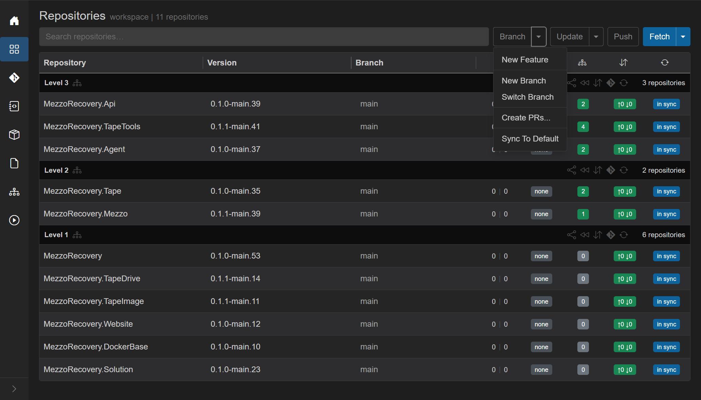
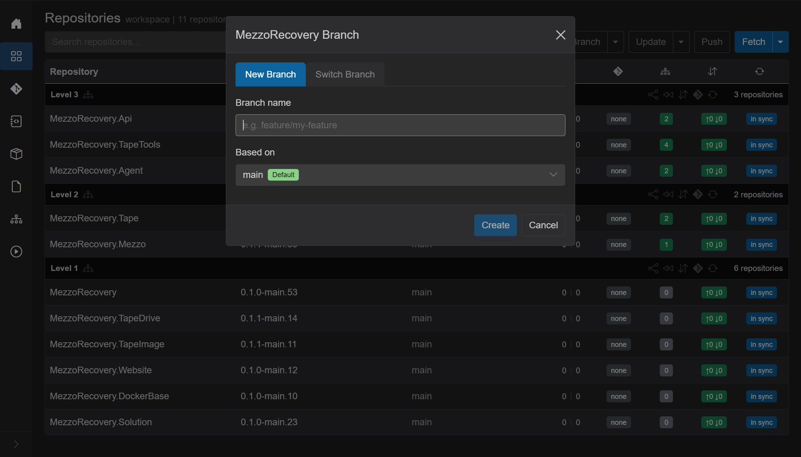
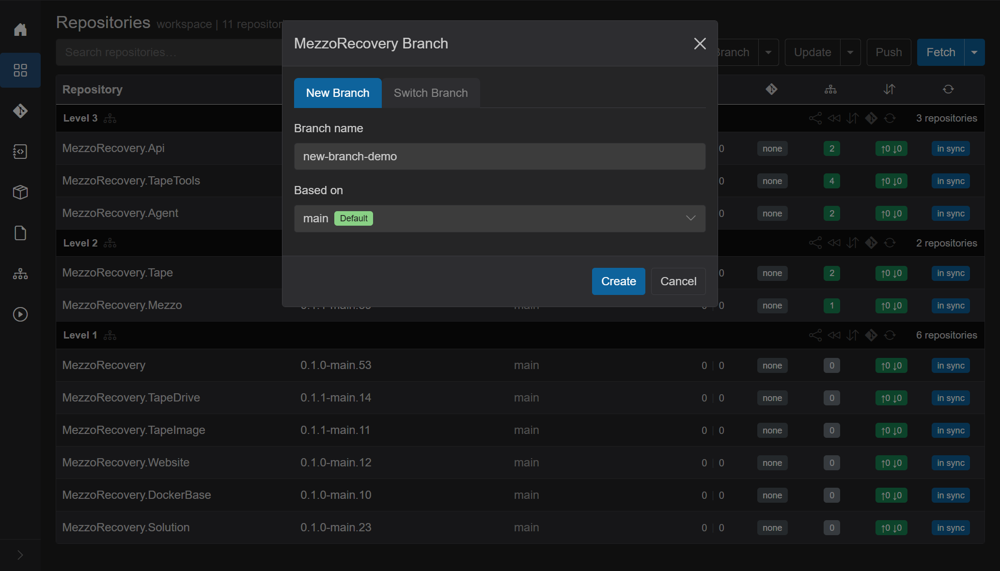

New Branch

Same dialog as [Switch Branch](switch-branch.md). Two tabs. Workspace-wide: every repository in the workspace gets the new branch. **New Feature** is a different wizard: branch plus update plus synchronized push. Full write-up: [new-feature.md](new-feature.md). Jumping to a branch that already exists is [switch-branch.md](switch-branch.md).

On MezzoRecovery (`/workspaces/2`, 11 repos) the header **Branch** caret opens:

- **New Feature** - [new-feature.md](new-feature.md).
- **New Branch** - this dialog, **New Branch** tab (same as clicking the primary **Branch** button).
- **Switch Branch** - this dialog, **Switch Branch** tab. Full write-up: [switch-branch.md](switch-branch.md).
- **Create PRs...** / **Sync To Default** - not this dialog. Sync To Default is [sync-to-default.md](sync-to-default.md).

## The dialog

Title: `{WorkspaceName} Branch` (here **MezzoRecovery Branch**). Tabs: **New Branch** | **Switch Branch**. Escape or the X / **Cancel** closes it.

### New Branch tab

- **Branch name** - required. Placeholder `e.g. feature/my-feature`. Focused when the dialog opens. **Create** stays disabled until the name is non-empty. Enter submits like **Create**.
- **Based on** - which commit the new branch starts from. Default is each repo's default branch, shown as that name (`main`) with a green **Default** badge (or `multiple` if defaults differ). The list also has every branch name that exists in **all** repos.
- **Skip repos on tags** - footer checkbox, only when at least one repo is on a tag. Not shown here (nothing is tagged). Checked: tagged repos are left alone.
- **Create** / **Cancel**.

If the name already exists in one or more repos, a warning asks to **Proceed** (check out the existing branch there) or **Cancel**.

Filled for this run (`new-branch-demo`, based on default `main`):

### Switch Branch tab

Same shell, different body. Check out a branch that already exists across the workspace. Conditions, badges, and a jump from `new-feature-demo` to `new-branch-demo` are in [switch-branch.md](switch-branch.md).

## Create

**Create** closes the dialog and runs a workspace job: overlay **Creating branches...** then **Created N of M**, **Abort**, live git log. Each repo gets `git checkout -b` from the chosen base (default branch, or the named common branch).

On MezzoRecovery that created `new-branch-demo` on all 11 repos from `main`:

What changed on the grid:

- **Branch** column is `new-branch-demo` on every row.
- GitVersion **Version** strings pick up the branch (`0.1.0-new-branch-demo.39` instead of `0.1.0-main.39`).
- Commits badge is a yellow cloud-up on repos with no upstream yet (the new branch has not been pushed). **in sync** stays blue: local status matches what the Agent last reported.
- Higher levels show unmatched-deps badges (`2 of 2`, `4 of 4`, ...) because package versions now include the new branch name. Header **Push Updated** (yellow) is the update-then-push shortcut for that. That is expected after leaving `main`; it is not a failed create. Hover a red `N of M` badge for `current -> new` package lines. Running **Update Only** then **Push Only** from that menu (the two halves of **Push Updated**) is in [repositories.md](repositories.md#update-vs-push-updated).

Clicking a row **Branch** cell opens the **per-repo** branch dialog (Locals / Remotes / Tags / New Branch), not this workspace-wide tab. Workspace [Switch Branch](switch-branch.md) is the header **Branch** caret.
