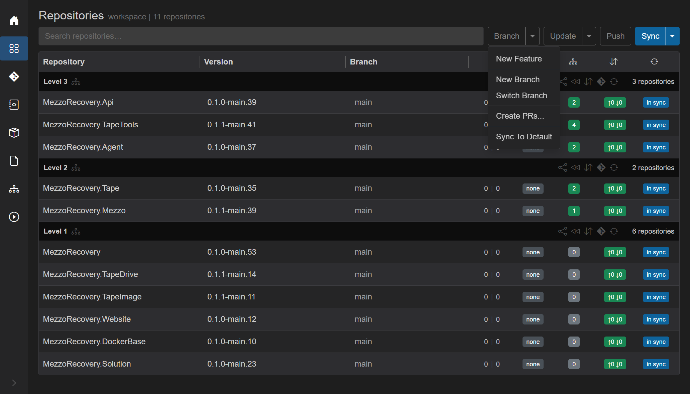
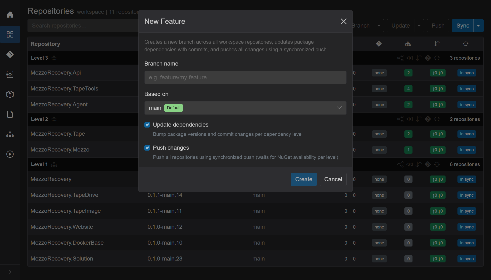
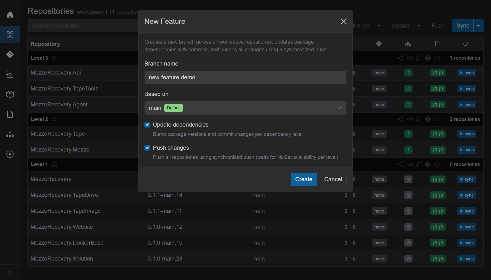
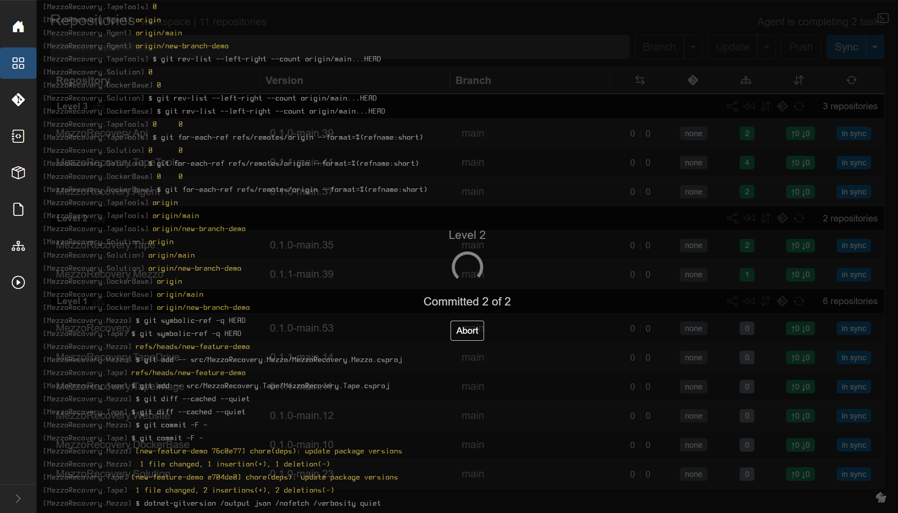
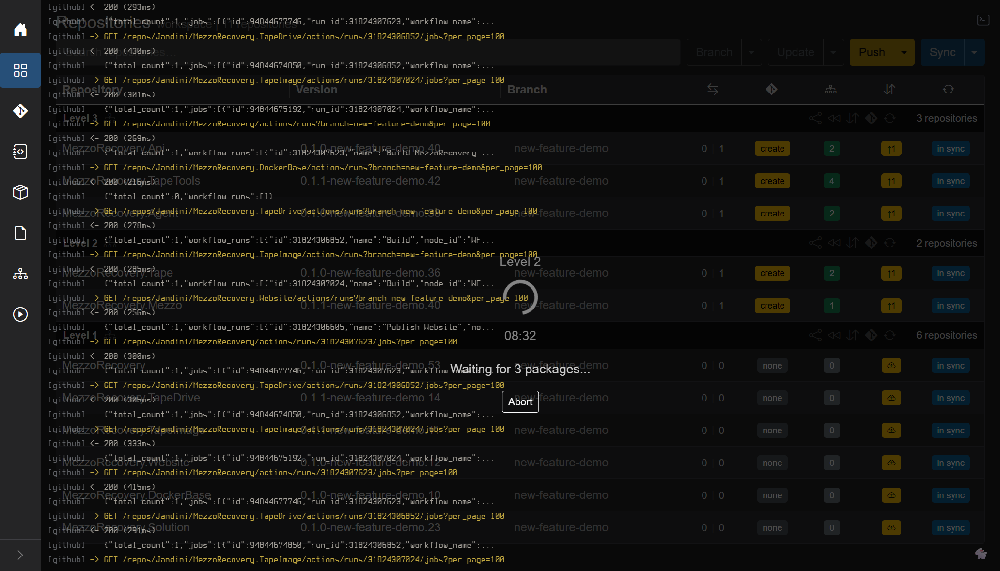
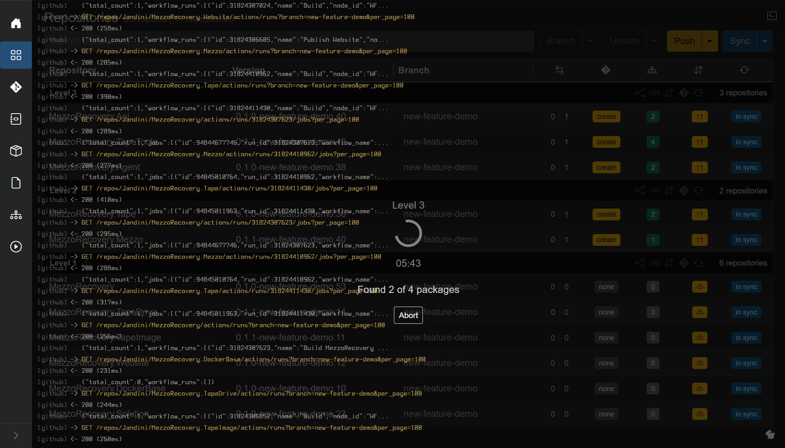

New Feature

Route: Repositories, header **Branch** caret, **New Feature**.

One wizard. One job. It is **New Branch + Update Only + synchronized Push Only** without opening those three flows yourself. Use it when you want a feature branch on every workspace repo, `.csproj` versions bumped to that branch, and everything pushed, in order.

It is **not** the [New Branch](new-branch.md) / [Switch Branch](switch-branch.md) dialog. That dialog only creates or checks out a branch. New Feature always creates (or checks out an existing name), then optionally updates and pushes.

On MezzoRecovery this run started from a clean **main** (after [Switch Branch](switch-branch.md) and a full **Sync**).

## Open the wizard

The **Branch** caret on Repositories:

- **New Feature** - this wizard.
- **New Branch** / **Switch Branch** - [new-branch.md](new-branch.md) / [switch-branch.md](switch-branch.md).
- **Create PRs...** / **Sync To Default** - not this wizard. Sync To Default is [sync-to-default.md](sync-to-default.md).

## The dialog

Title: **New Feature**. Escape or the X / **Cancel** closes it. **Create** stays disabled until **Branch name** is non-empty. The name field is focused when the dialog opens. Enter submits like **Create**.

The subtitle states the default path: *Creates a new branch across all workspace repositories, updates package dependencies with commits, and pushes all changes using a synchronized push.*

- **Branch name** - required. Placeholder `e.g. feature/my-feature`.
- **Based on** - which commit the new branch starts from. Default is each repo's default branch (`main` here) with a green **Default** badge. The list also has every branch name that exists in **all** repos (same idea as New Branch).
- **Skip repos on tags** - footer checkbox, only when at least one repo is on a tag. Not shown here.
- **Update dependencies** (on by default) - bump package versions in `.csproj` (and configured version files) and commit per dependency level. Same work as **Update Only**.
- **Push changes** (on by default) - after update, push every repo that needs it using **synchronized push**: wait for each level's nupkgs on the NuGet connector feed before pushing the next level. Same wait as [Push Only](repositories.md#push-only-and-synchronized-push). Unchecked **Update dependencies** turns this off and disables the checkbox: GrayMoon will not push a new branch whose consumers still pin `main` versions.

This dialog does **not** open the separate **Push** / synchronized-push confirmation. When **Push changes** is checked, synchronized push is implied.

If the name already exists in one or more repos, a warning: **Proceed** (check out the existing branch there, then continue update/push) or **Cancel**.

Filled for this run (`new-feature-demo`, based on default `main`, both checkboxes on):

## What Create runs

**Create** closes the dialog and starts one workspace job (Abort is available the whole time). Three phases:

1. **Creating branches...** then **Created N of M**. `git checkout -b` from the chosen base on every repo (skip tagged repos if that box is on). Same as New Branch.
2. **Updating dependencies...** then per-level **Committed N of M** if **Update dependencies** is on. Same as Update Only: rewrite `.csproj`, commit (`chore(deps): update package versions` when the message is left empty).
3. **Preparing push...** then level-by-level push if **Push changes** is on. After each level, wait until required packages appear on the mapped NuGet feed. Timeout is **3 minutes per package** at that level. If CI does not publish in that window, **GrayMoon WILL STOP**. It does not drive CI; it only polls the feed.

Overlay while Level 2 deps were committing (**Committed 2 of 2**), live git log in the background:

After Level 1 was pushed, waiting on those nupkgs before Level 2 (**Waiting for 3 packages...**, countdown from about nine minutes = 3 packages x 3 minutes):

Later, before Level 3: **Found 2 of 4 packages**. GitHub Actions lines in the terminal are status only. The gate is still "is this nupkg on the NuGet connector?", not a green workflow check.

## When it finishes

On MezzoRecovery the job completed without hitting the timeout. Every row is on `new-feature-demo`. GitVersion strings include the branch. Dep badges on Level 2 / 3 are **green counts** (packages already match). Divergence on updated repos is `0 | 1` (the deps commit is ahead of `main`). Commits badges are green `↑0 ↓0` (upstream exists; the synchronized push already ran). Header **Push** is outline. Yellow **create** is the PR badge (ahead of default, no open PR). Level 1 stays `0 | 0` / **none** (nothing to rewrite there, branch still pushed).

That finished grid is what **Push Updated** looks like after a successful combined run, except New Feature also created the branch first.
