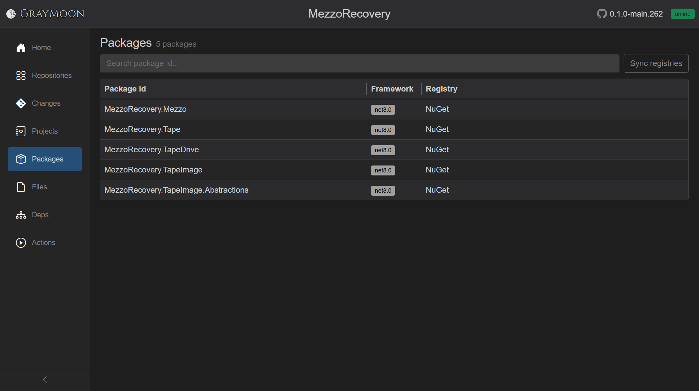

# Workspace Packages

Route: `/workspaces/{id}/packages`

NuGet **package projects** in the workspace: `.csproj` files that produce a package id (typically `IsPackable` / a `<PackageId>`). This is not the Repositories grid and not every project - only the libraries you publish so other workspace repos can `<PackageReference>` them.

GrayMoon's own workspace has no packable projects, so the page is empty there. **MezzoRecovery** (`/workspaces/2`) has five:

| Package Id | Framework | Registry |
| --- | --- | --- |
| MezzoRecovery.Mezzo | net8.0 | NuGet |
| MezzoRecovery.Tape | net8.0 | NuGet |
| MezzoRecovery.TapeDrive | net8.0 | NuGet |
| MezzoRecovery.TapeImage | net8.0 | NuGet |
| MezzoRecovery.TapeImage.Abstractions | net8.0 | NuGet |

These are the Level 1 / Level 2 libraries on the [dependency graph](dependencies.md). Services (`MezzoRecovery.Api`) and tools (`MezzoRecovery.TapeTools`, Agent) consume them; they do not appear on this page because they are not packable.

**Registry** is the first active NuGet connector that currently contains that package id (any version). `-` means no connector matched yet - run **Sync registries**. Matching is by id only, not by a specific version. After a synchronized push, GrayMoon re-checks so downstream repos restore the new version from the right feed.

## Header

- Title: **Packages**
- Subtitle: `N packages` or `N packages found` (or `0 packages` / `N package` when singular)
- [Filter search](../shared.md#filter-search-shared) - "Search package id...". Disabled while loading or when the list is empty.
- **Sync registries** - refreshes package metadata against NuGet connectors. Disabled when there are no packages. Overlay: "Syncing registries..."

Empty: "No NuGet packages in this workspace. Sync repositories to discover package projects."

No search hits: "No packages match your search."

First open uses the [loading overlay](../shared.md#loading-overlay) ("Loading packages...").

## Search fields

Plain terms match **package id**, **framework**, and **matched connector name**.

Field prefixes:

- `registry:` - connector name
- `framework:` - TFM

## Grid columns

| Column | What it shows |
| --- | --- |
| Package Id | Package id, or `-` |
| Framework | TFM badge, or `-` |
| Registry | Matched connector name, or `-` |
